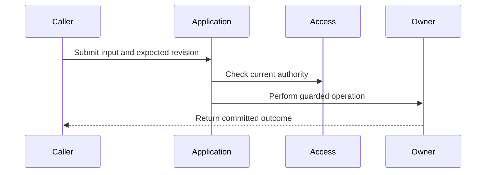

<!-- Use concrete behavior, not a list of files to create. Remove irrelevant optional sections. Epics are child maps; qualification tickets describe evidence and failure injection instead of pretending to implement behavior. -->

> **Parent:** #<parent>
>
> **Primary domain:** <owner>
>
> **Collaborating domains:** <only actual collaborators>
>
> **Blocked by:** <direct prerequisites; match native GitHub dependencies>
>
> **Architecture baseline:** `<real commit SHA>`
>
> **Status:** <Ready for implementation / Blocked by prerequisites / Design required>
>
> **Type:** <Implementation / Qualification / Specification>

## Outcome

<The observable capability delivered by this ticket.>

## Why this exists

<Explain the user problem with a small example. Define terms locally.>

## Starting point

<What exists today, what blockers will deliver, and where this ticket begins. Do not represent planned dependencies as implemented.>

## Scope

- <One coherent capability.>

## Out of scope

- <Adjacent capabilities and their owning issues.>

## Domain rules and invariants

- **MUST:** <Required behavior.>
- **MUST NOT:** <Forbidden shortcut.>

## Ownership and boundaries

| Concern   | Owner          | Responsibility |
| --------- | -------------- | -------------- |
| <Concern> | <Domain/layer> | <Boundary>     |

## Workflow

<!-- Required for cross-domain, asynchronous, provider, authorization, retry or concurrency-sensitive work. Replace this example with the actual workflow. -->

1. <Explain the real happy path in execution order.>

## State and data changes

| Record / state | Before | After | Transaction, revision and retention rules |
| --- | --- | --- | --- |
| <Record> | <Before> | <After> | <Rules> |

## Application and API contract

**Input:** <Application-owned inputs, identity, scope and expected revisions.>

**Success:** <Observable result, including partial/admitted versus completed meaning.>

**Expected failures:** <Conditions and typed outcomes. Unknown wire fields or permission identifiers belong in an explicit specification prerequisite, not invented here.>

## Failure, retry and concurrency behavior

| Situation | Required outcome |
| --- | --- |
| <Lost acknowledgment, stale review, revocation or other relevant failure> | <Exact safe outcome> |

## Security and trust boundaries

<Trusted identity, caller-controlled inputs, current authority checks, permitted egress and excluded secrets/content.>

## Resource and performance bounds

<Bound input, concurrency, deadlines, retries and storage as relevant. Cite selected limits; mark unselected values as implementation/qualification choices.>

## Implementation tasks

- [ ] Domain/application: <rules and orchestration>.
- [ ] Persistence/adapters: <state and boundary conversions>.
- [ ] Worker/transport: <dispatch and outcome translation, if relevant>.
- [ ] Contracts/documentation: <specific changes>.

## Acceptance scenarios

### <Success>

**Given** <state>, **when** <action>, **then** <observable result>.

### <Failure or race>

**Given** <state>, **when** <failure/interleaving>, **then** <observable safe outcome>.

## Test plan

- **Unit:** <named decisions>.
- **Integration:** <named database/provider/race boundaries>.
- **End-to-end / qualification:** <journey and retained evidence, or owning qualification issue>.

## Definition of done

Follow `docs/development/definition-of-done.md` and demonstrate this ticket's acceptance scenarios. Record actual checks and unresolved gates; do not mark unexecuted qualification complete.

## Implementation freedom

<Internal types and small local refactors may follow current conventions. Invariants, ownership and scope are not optional.>

## References

1. <Owning guide and section.>
2. <Core ADR.>
3. <Relevant records.>

## Architecture freshness

Prepared against the real SHA above. Identify any dated uncommitted architecture overlay explicitly; a path in that overlay is not claimed to exist at the SHA. If current accepted architecture conflicts, reconcile the ticket before implementation continues.
