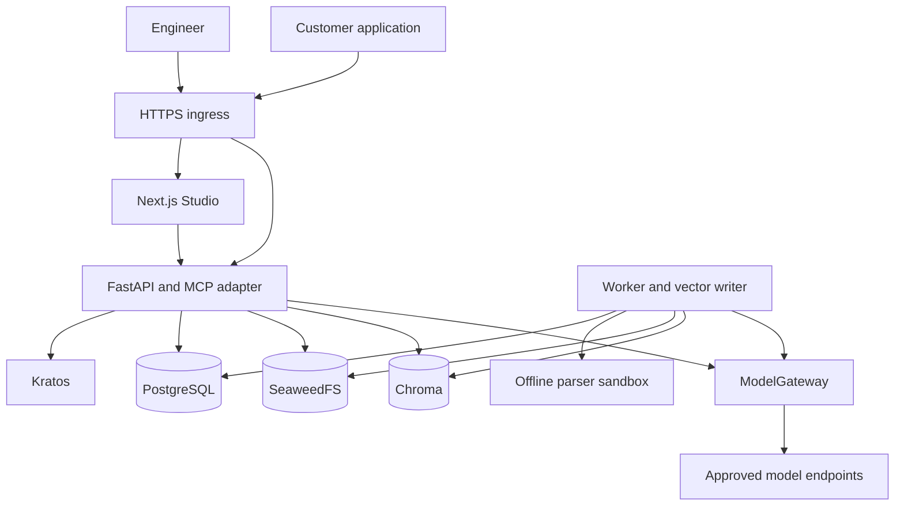

# Inframeld v1: a product and engineering guide

**Updated: 19 September 2026**

Inframeld helps developers build AI applications that answer questions using their own documents. It also helps them understand where answers came from, test changes, and release new versions without immediately changing what customers receive.

This guide describes the product we are building, not a list of features that have already been implemented or performance-tested. It starts with the user experience, then explains the data model, architecture, and engineering rules. Appendix A explains the accepted setup and credential boundaries in more detail; exact API shapes remain implementation choices.

## Contents

- [Understand the product](#1-what-inframeld-is-for): the problem, core concepts, and first-use experience.
- [Follow the lifecycle](#4-from-an-upload-to-a-ready-pipeline): upload, build, query, evaluate, release, and collect feedback.
- [Understand the application](#9-users-integrations-and-permissions): access, interfaces, runtime components, and code structure.
- [Understand reliability and storage](#13-background-jobs-retries-and-conflicts): jobs, vector reuse, failures, and deletion.
- [Build and operate v1](#15-capacity-backups-and-upgrades): operating targets, scope, implementation order, and further reading.

## 1. What Inframeld is for

### The problem

Imagine a company with an AI application called **Support Assistant**. Customers ask it how to install a product, whether they qualify for a refund, and how to troubleshoot problems.

The application needs access to the company's knowledge. That knowledge changes: a refund policy is updated, a new product is released, or troubleshooting instructions improve. Its developers also change prompts, search settings, and models.

The company needs more than a place to upload files. It needs to answer questions such as:

- Which documents and settings produced this answer?
- Does a proposed change improve our test cases?
- Can we try it with a small group before releasing it to everyone?
- Can we return to the previous version when something goes wrong?

Inframeld manages that lifecycle. The customer application connects to a stable endpoint. Engineers update the knowledge and answer-generation behavior behind that endpoint without deploying a new version of the customer application for every change.

### How answers use documents

Inframeld uses **retrieval-augmented generation**, usually shortened to **RAG**. The basic process is:

```text
Question
   ↓
Find relevant excerpts from the selected documents
   ↓
Give those excerpts, the question, and instructions to a language model
   ↓
Return an answer with citations
```

The selected body of documents is the **corpus**. An excerpt prepared for search is a **chunk**.

An **embedding model** turns text into numerical vectors that can be compared during search. A **generation model** writes the answer using the retrieved evidence. These are separate roles, even when the same provider connection supports both.

Later, an optional **judge model** can help evaluate answers. It is not needed to upload documents or ask the first question.

RAG does not guarantee that an answer is true. A document can be wrong, search can miss an important passage, and a model can make an unsupported inference. Inframeld makes the relevant sources, configuration, and test results inspectable so engineers can investigate those problems.

### Who uses Inframeld?

Throughout this guide, **Mira** is the engineer maintaining Support Assistant's knowledge and pipelines.

Mira works in **Studio**, Inframeld's web interface. Support Assistant's backend calls Inframeld through its HTTP API or first-party MCP tools. Support Assistant's customers normally use Support Assistant itself; they do not need an Inframeld account.

```text
Mira → Studio → Inframeld

Customer → Support Assistant → Inframeld
```

Both paths use the same underlying product. The simple upload-and-ask experience is not a separate demo system that must later be replaced.

### The shape of v1

V1 is an **Apache-2.0 open-source product** running on one server through **Docker Compose**.

We are building a modular backend, one background worker, and a small set of supporting services. We are not building a distributed platform with Kafka, a separate queue broker, a workflow engine, Kubernetes, or a high-availability cluster.

The goal is a system one developer can understand while still providing durable work, explicit permissions, bounded resource use, and a backup-and-restore process. One server remains a single point of failure.

## 2. The concepts you need first

The data model separates things that change independently. That separation lets us explain an answer and keep an older version available while preparing a new one.

### Organizations and projects

An **Organization** is an internal ownership boundary. A **Project** is a workspace containing knowledge, pipelines, and access settings.

These boundaries leave room for future enterprise features. They do not mean that v1 needs a full multi-organization SaaS administration product.

### Documents and their versions

A **Document** identifies a logical source, such as the Refund Policy.

A **DocumentVersion** identifies one exact version of that source. Suppose version B1 says customers have 30 days to request a refund, while B2 says 14 days. B1 and B2 belong to the same Document, but their contents must remain distinguishable.

A **Collection** names a corpus, such as Support Knowledge. A **CollectionRevision** records the exact document versions included in one snapshot of that corpus.

For example:

| Source          | Collection revision R1 | Collection revision R2 |
| --------------- | ---------------------- | ---------------------- |
| Installation    | A1                     | A1                     |
| Refund Policy   | B1: 30 days            | B2: 14 days            |
| Troubleshooting | C1                     | C1                     |

R2 changes the refund policy without changing the other two sources. R1 still refers to B1. It does not start using B2 just because B2 is newer.

### Processing, embeddings, and searchable data

A **ProcessingProfile** records how files are parsed and split into chunks. Different settings can produce different chunks from the same document.

An **EmbeddingProfile** records how chunks are represented for vector search: the model and connection revision, vector dimensions, normalization, and distance metric. These settings define the numerical space in which vectors can be compared. Incompatible profiles cannot be mixed in one search.

An **IndexMaterialization** is the prepared and verified searchable data for an exact CollectionRevision under particular processing and embedding profiles.

The distinction is important: a CollectionRevision can exist before its searchable data is ready.

### Pipelines and deployments

A **Pipeline** is the named RAG configuration Mira works on. It describes which knowledge to use and how to retrieve evidence and generate answers.

A **PipelineVersion** freezes that configuration and binds it to complete, compatible, ready searchable data. It includes choices such as the prompt, retrieval settings, reranker, and generation model.

A **Deployment** is a stable serving target, such as `support`. It selects which PipelineVersion should handle customer traffic. It can also hold a candidate version for a canary release and a previous version for rollback.

Each Deployment has a **publication mode**: Automatic updates or Manual releases. This decides how a ready version becomes current. It belongs to the Deployment, not to the immutable PipelineVersion: two deployments can use the same pipeline while following different release choices.

> **A ready version is not necessarily a serving version.** Building prepares a PipelineVersion. Releasing changes the Deployment that routes traffic to it.

Suppose P12 uses collection revision R1 and prompt Q1. P13 might use R2 and prompt Q2. Alternatively, P13 might change only the prompt and reuse exactly the same searchable data as P12.

An **AnswerReceipt** records the identity and bounded provenance of one served response. This allows later feedback to refer to the version that actually produced the answer, even after the Deployment changes.

### What “immutable” means

An immutable version keeps the same meaning once recorded or published. We do not edit B1 to contain B2's text or change P12 to use P13's prompt.

Immutability does not mean data must exist forever. Retention, explicit erasure, corruption, or storage loss can make an old version unavailable. It also does not freeze permissions: current access rules continue to protect historical content.

## 3. The first-use experience

Mira should be able to configure models, upload documents, and ask a question without first learning the entire data model.

The intended journey is:

```text
Set up an account
   ↓
Save a model connection and credential
   ↓
Select and validate embedding and generation models
   ↓
Upload documents and follow preparation progress
   ↓
Ask a question and receive an answer with citations
```

The application handles the necessary starter resources behind the scenes. Those are ordinary Inframeld resources, not temporary demo objects.

Mira supplies a provider connection and key, then chooses the embedding and generation models. When both roles use the same approved connection, she enters the key once. The application checks each role separately: the embedding model must produce valid vectors with the expected dimensions, and the generation model must support answer generation.

An explicitly configured keyless local endpoint is allowed. A missing key for a provider that requires one is an error. The application never borrows another user's credentials or silently changes providers.

While documents are being prepared, Studio shows progress. Before the first version is ready, asking a question should return a clear not-ready outcome rather than a fabricated demonstration answer.

The default serving path starts in **Automatic updates**. Completing a bounded upload batch authorizes the normal build and publication of its ready result. Mira does not need a separate Prepare and ask action, a benchmark, or a Release screen before asking her first question. Studio explains that uploaded changes will become available automatically after preparation.

The worker freezes the selected documents and configuration, builds a complete version, and separately requests publication. The first successful publication creates a real Deployment; until then the logical default route reports not-ready. Provisioning an empty Collection or Pipeline never fabricates a ready version.

### What happens after the first answer?

Once P1 is serving, replacing a document creates a new DocumentVersion. In Automatic updates, Inframeld prepares P2 while P1 continues using its original corpus. When P2 is completely ready and its publication authorization is still current, the endpoint advances to P2.

Studio should make this obvious, for example:

> Automatic updates · P1 is serving. Your latest upload is being prepared.

A failed update leaves the healthy current version serving and shows which changes are unavailable. Inframeld does not quietly publish only the successful files from a failed batch. After a successful publication, new questions use P2; an already-running question remains attributable to P1.

Saving draft pipeline settings does not apply them. In Automatic updates, **Save and apply** deliberately selects a configuration and requests its build and publication. This distinction matters for an embedding-model change, which may require embedding the whole corpus again. Later uploads use the configuration selected for that deployment, not somebody's unfinished settings form.

When Mira wants to review changes before they reach consumers, she switches the deployment to **Manual releases**. P2 continues serving. Subsequent uploads remain unpublished until she builds and releases a version through the governed workflow. She can switch back later; section 7 explains how pending work is handled safely.

The default starts automatic to make this experience straightforward. A deployment created explicitly starts manual, with an **Automatic updates** option at creation. Choosing that option authorizes the same behavior as the default; it does not create a different kind of pipeline. A Pipeline without a Deployment is still just configuration and versions, with no live traffic to update.

An application may consume an automatic endpoint, but its answers can change after authorized uploads. The URL stays stable; the selected version does not stay pinned. Studio and the API expose the mode so this is a deliberate choice.

Changing a provider key is different. It is a live credential operation, not a new pipeline release. A bad or revoked replacement key can affect calls that use that connection.

### The first-answer target

For a small workload on an already prepared installation, two minutes to a useful first answer is an aspiration; around ten minutes is also acceptable. The goal is a simple path to value, not a hard timing gate or a claim of measured performance.

Image downloads, initial installation, and private-gateway setup are real costs. They must be reported separately rather than hidden to make the first-use journey appear faster. Section 15 defines the planned test scenario.

## 4. From an upload to a ready pipeline

### Step 1: accept the source

Mira uploads a supported PDF, Markdown, or text file.

The API streams the file into private temporary storage with size limits. It checks the format and size, assigns storage identities, and records the upload through a durable application command.

We call this **admission**: the server has accepted and recorded an operation, so it can track the work even if Studio closes.

Filenames are display labels, not filesystem paths. The provisional per-file limit is **25 MiB**. Additional limits apply to parsing time and output size because a small compressed input can still expand into excessive work.

The Knowledge module owns the Document and its DocumentVersions. The application calculates a content hash. Seeing identical content again can reuse an existing version; changed content creates a new one.

Original bytes are stored in SeaweedFS through the application's `ArtifactStore` interface. PostgreSQL stores the authoritative identity and reference. An object appearing in storage does not, by itself, become accepted knowledge.

### Step 2: parse the document and create chunks

The Indexing module coordinates parsing and chunking under the selected ProcessingProfile.

A **ProcessingGeneration** is the reusable parsed and chunked result for a DocumentVersion and its processing inputs. Each chunk has an identity and a source span that identifies where it came from. Those source spans support citations back to the correct document version and location.

The initial parser is **Docling**. Its output is translated into Inframeld-owned schemas. Domain code does not store Docling's internal objects as its own data model.

V1 starts with a tested processing preset rather than a large settings editor.

### Why parsing runs separately

Uploaded documents are untrusted input. Parsing therefore runs in a separate offline container, not inside the privileged worker process.

A trusted supervisor starts a fresh isolated child process for each attempt. The child can access only its input, read-only parser and model assets, and limited scratch space. It has no network, provider credentials, application storage access, or previous document data.

The worker validates the returned content and source identities before storing the results. A timeout terminates the attempt. If a host cannot enforce the required isolation, processing fails rather than falling back to an unsafe execution path.

### Step 3: choose the exact corpus

The build must use exact DocumentVersions, not “whatever is newest” when the worker eventually runs.

Mira can choose those versions in the collection editor. The first-use working design makes this choice from one fixed upload batch.

PostgreSQL records the CollectionRevision's complete membership. A separate immutable manifest can also record that membership for verification.

A newly uploaded document does not silently enter a live pipeline. Accepting the source, choosing a corpus revision, preparing its search data, and releasing a pipeline are separate operations.

### Step 4: freeze and run the build

A pipeline configuration describes a bounded RAG path: corpus bindings, one processing profile, one embedding profile, retrieval limits, reranking, a prompt, and generation-model settings.

V1 does not support arbitrary pipeline graphs or user-supplied Python execution.

When Mira selects **Build candidate**, the server freezes the request and records a durable job. Later edits in Studio cannot change that job's inputs. The interface may reserve a name such as P13 immediately, but a pending build is not a ready PipelineVersion.

The worker reuses compatible existing results and creates only what is missing:

| Change                                                                  | Expected work                                                           |
| ----------------------------------------------------------------------- | ----------------------------------------------------------------------- |
| Change the prompt or retrieval `top-k`, the number of results requested | Usually reuse the existing searchable data.                             |
| Replace the refund document B1 with B2                                  | Process and embed B2; reuse compatible results for unchanged documents. |
| Change the embedding model or profile                                   | Potentially embed the entire selected corpus again.                     |

The interface must show these differences. “Incremental build” must not imply that every type of change is cheap.

### Step 5: verify readiness

The IndexMaterialization records which vector generations represent the corpus and where their records are stored. It becomes ready only after the required records, identities, and compatibility checks pass.

The PipelineVersion then receives its complete ready bindings. Partial success does not produce a partially usable pipeline.

A successful build does **not** attach the version to a Deployment's candidate slot or change live traffic. That requires a separate authorized publication command. In Automatic updates, a small application service calls the ordinary build and then requests publication if the update is still eligible. In Manual releases, an engineer makes the release decision. The build itself behaves the same way in both modes.

### Importing documents from S3

V1 also includes a bounded, manually started, read-only S3 source sync. S3 means the object-storage API; Inframeld does not have to run on AWS.

An operator approves a bucket and prefix and supplies a least-privilege credential. The connector lists that scope, records checkpoints, and sends changed files through the same admission path as direct uploads.

The connector plus normalized bucket and key identify a logical source. An object ETag is not assumed to be a content hash. When provider metadata is insufficient, the downloaded bytes establish content identity.

Unchanged content can reuse an existing DocumentVersion. If a source object disappears, that can inform a new CollectionRevision; it does not rewrite a historical revision already used by a deployment.

Source permissions are not automatically treated as Inframeld permissions. The working v1 access design assigns an explicit Inframeld group allowlist to imported documents and does not synchronize source ACLs.

## 5. How a question becomes an answer

Support Assistant's backend sends a question to a stable deployment route using its scoped integration credential. It also supplies an idempotency key and a stable affinity key. Section 7 explains affinity routing; Section 13 explains idempotency.

The request cannot choose an arbitrary provider URL, impersonate a human user, select a physical shard, or replace the Deployment's version-selection rules.

### Select a version and protect the request

The server authenticates the caller, checks permission to query, and selects a ready PipelineVersion from the Deployment.

In a short PostgreSQL transaction, it also records a time-limited **query pin**. A pin prevents routine cleanup from removing data the admitted query needs. This selection stays fixed for the request: a promotion halfway through does not switch the answer to another version.

A pin does not override revoked permissions or make damaged data usable. It has an enforced deadline, and results cannot be returned after its protection expires.

The request also records a dependency-health counter. Corruption, loss, or invalidation changes that counter; inserting an unrelated candidate does not. The application checks it after retrieval, before sending evidence to the model, and before releasing the result. A changed counter causes the result to be discarded.

### Retrieve permitted evidence

The application resolves the exact document and vector generations included in the selected version, then intersects them with the caller's current document permissions.

It embeds the question through ModelGateway and searches only that permitted scope.

The configured local cross-encoder reranker can reorder a bounded set of search results. The explicit `none` setting skips this step. A reranker cannot invent chunk identities or expand access to more documents.

The final evidence is bounded in size and sent with the question and prompt to the configured generation model through ModelGateway. Missing credentials or an unavailable configured reranker produce an error, not a silent change of provider or pipeline settings.

### Return an honest result

The response distinguishes three outcomes: an answer, explicit insufficient evidence, and a typed execution failure that clients can handle programmatically.

Citations must refer to actual permitted retrieved content. A source ID invented by the model is invalid. Retrieved source text is data, not permission to change system instructions or execute tools.

A citation establishes source identity. It does not prove that every sentence in the answer follows from that source.

### Check access again before disclosure

Permissions can change while a request waits for a model or storage service. The application therefore checks current access again after waits and immediately before approving content dispatch or returning protected results.

A revocation committed before that check blocks the send. A revocation committed just after the check can race with a network send that has already been approved. The database check and the network transfer are not one atomic operation.

Later checks stop further disclosure, but the system cannot recall content already sent to a provider or caller.

### Record what actually served

A successful response includes an `answerId`, authorized citations, and safe metadata identifying the selected version.

The AnswerReceipt stores bounded provenance and the outcome. It includes the identities of **all** sources used in the final generation context, even when the model does not cite every source. Those identities support later access checks and feedback attribution.

The receipt does **not** store the full production question, answer, or retrieved context. Support Assistant must retain the successful answer itself if it needs to display it later.

Evaluation runs are different: they retain bounded answers and evidence so engineers can inspect comparisons.

## 6. Testing changes with evaluations

An **evaluation** runs a pipeline against recorded test questions and collects evidence about its behavior. It helps Mira compare versions before changing customer traffic.

### Test cases and frozen benchmarks

Mira maintains test cases on a pipeline in Studio. Each case has a stable identity and a question. It can also include expected sources, an expectation that the system should abstain, and a reference answer or notes for human review.

One benchmark per pipeline is enough initially.

When Mira requests **Compare versions** for P12 and ready P13, the comparison freezes two things:

| Snapshot              | What it records                                                                                         |
| --------------------- | ------------------------------------------------------------------------------------------------------- |
| **BenchmarkRevision** | The exact ordered test cases and their contents, not just IDs pointing to editable questions.           |
| **EvaluatorRevision** | The evaluator library and prompt, metric definitions, model connection and settings, and result schema. |

The comparison references two EvaluationRuns. The worker runs both exact pipeline versions through the normal retrieval, access-control, generation, and citation paths, then scores the applicable results.

Initially, both the baseline and candidate are run fresh. Reusing a cached historical baseline is not required.

The runs record their effective access scope. A test run with Mira's broad permissions does not demonstrate what a more restricted customer integration will see.

### Why snapshots matter

Suppose Mira changes a test question after a comparison. The old run still contains the original question. History can show both versions, but it must not describe a result from changed input as a regression on the same test.

Changing the judge or rubric also changes the comparison conditions. To compare P12 and P13 fairly, rerun both under the same evaluator revision.

A deliberate corpus change is part of the experiment. It should be visible, not mistaken for unexplained drift.

### What the evaluator measures

The initial evaluation library is **OpenEvals**. The baseline judge model is **GPT-5.6 Luna**, configurable through ModelGateway so customers can use permitted private or enterprise endpoints. Its suitability and integration still need testing.

The initial judgment is **groundedness**: whether an answer is supported by the final context supplied to the generation model. OpenEvals returns a boolean verdict and an explanation. Its rubric allows ordinary basic facts and calculation; it is not a proof of every sentence or a percentage of individually verified claims.

Inframeld also calculates separate retrieval and citation signals: whether expected sources appear in the final evidence, whether citations identify valid bound evidence, and how many executions answered, abstained, or failed.

These signals are not combined into a single “quality score.” They describe different things.

### What Inframeld owns

OpenEvals supplies evaluator behavior. Inframeld owns test cases, snapshots, durable execution, permissions, stored evidence, comparisons, and history.

The OpenEvals adapter calls an in-process ModelGateway interface. It does not receive provider credentials or independently choose a model. Gateway policy also applies to nested calls, repairs, and retries. The adapter validates result types and completion state.

This direct-client integration needs real integration tests. Implementing an interface alone does not demonstrate compatibility. LangSmith tracing and export are disabled, with tests checking for unintended network traffic.

No hosted evaluation account or additional evaluation service is required. LangSmith, Langfuse, exporters, and deeper diagnosis or remediation are outside v1.

### Reading the results

Studio shows baseline and candidate answers alongside their final evidence, citations, judge verdicts and explanations, source-hit results, latency, usage, and execution status. Engineers can inspect both improvements and regressions, with history organized by pipeline version and stable test case.

For example:

> 18 supported answers out of 20 successfully judged answers.

This describes those observations under that evaluator's rubric. It does not mean that 90% of every factual claim is true or that the candidate has a 90% probability of being correct.

Results must also show eligible, failed, skipped, and paired-case counts. A malformed judge response is a judge failure, not a negative quality verdict. An explicit pipeline abstention is not applicable for groundedness, not an automatic perfect score. Failed candidate cases cannot disappear from the comparison to make the candidate look better.

Evaluation history retains bounded answers, the exact final context or reconstructable immutable evidence, selected identities, configuration, judge explanations, errors, and usage. Current permissions still apply when someone views that history. If evidence has been erased or expired, the interface says it is unavailable.

During implementation, test the judge against representative human-labelled supported, unsupported, ambiguous, and adversarial cases. Repeat borderline examples and validate structured outputs. Model price or recency does not establish evaluator quality.

## 7. Releasing changes without immediately affecting everyone

A Deployment controls customer traffic. It contains a current version, an optional candidate, a designated previous version, rollout settings, and a revision number for detecting concurrent edits.

The first Deployment starts with one ready version and an authorized release decision. It has no previous version, no baseline cohort, and no rollback target. A benchmark or judge is not required for that initial release.

### Choosing how updates reach users

Automatic updates and Manual releases are reversible settings on the same Deployment. Switching modes preserves its endpoint, current version, history, permissions and answer receipts. It does not copy documents or create another retrieval system.

| Action | What happens to serving traffic? | What happens to pending work? |
| --- | --- | --- |
| Switch to Manual releases | The version current when the switch commits keeps serving. | Outstanding automatic updates lose publication authority. Useful builds may finish, but cannot change traffic. |
| Enable automatic updates and apply pending changes | The current version serves until the newly authorized update is ready. | The action freezes the displayed corpus and selected configuration into a fresh request. It does not revive old jobs. |

Enabling automation shows what will be applied, including unpublished document changes and the selected pipeline configuration. Start with the configuration currently serving; selecting another saved configuration is deliberate. Unselected draft settings stay drafts. If those inputs are incomplete, the action reports what needs attention rather than starting an invalid update. A failed build leaves automation selected and the current version unchanged; safe retry and recovery still follow the normal job rules.

An attached candidate, even at 0%, prevents enabling Automatic updates. Mira first promotes or rejects it. Attaching a candidate, starting a canary, promoting, rejecting and rolling back belong to Manual releases. Read-only history and explicitly requested comparisons are available in either mode. Comparing versions does not pause automatic updates; switch to manual first when the endpoint needs to remain fixed during review.

Automatic publication records the former current version as the one-step previous target. Mira can switch to manual and roll back if that target remains available. Rollback leaves the mode manual. If she later enables automation, the screen makes clear that applying the selected pending changes can replace the version she restored. Neither a rollback nor positive feedback re-enables automation by itself.

### The governed update workflow

With the deployment in Manual releases and P12 serving, Mira can prepare P13 without disturbing it:

```text
Edit knowledge or pipeline settings
   ↓
Build P13 and inspect the result
   ↓
Compare P13 with P12 using a frozen benchmark
   ↓
Attach P13 and explicitly start a canary
   ↓
Review evaluation results and production feedback
   ↓
Promote P13 or reject it
```

Each step is explicit. A build does not release a version. An evaluation score or a collection of positive ratings does not authorize promotion or rollback.

Automatic updates uses the same frozen builds and readiness checks, with advance authorization from the update action instead of a later manual release. It does not run evaluations automatically or treat a score as release permission. Appendix A explains the shared route and background work.

### What a canary does

A **canary release** sends a limited share of traffic identities to a candidate while the rest continue using the current version.

Mira first attaches ready P13 with a 0% allocation. She can then explicitly change that allocation to 10%.

The application uses a deterministic hash to assign each affinity identity to one of **10,000 buckets**. The hash includes the deployment, stable application principal, affinity value, and rollout identity. It does not include the percentage.

Increasing the percentage therefore includes more buckets without randomly reassigning the previous cohort. Selecting a different candidate starts a new rollout.

### Affinity is routing, not identity verification

Support Assistant supplies a stable opaque user or session key so related requests stay in the same cohort. This is the **affinity key**.

Ten percent means approximately 10% of affinity identities, not exactly 10% of requests. A very active user can generate a disproportionate share of traffic.

The affinity key does not prove who an end user is and does not grant document access. Rotating Support Assistant's credential preserves its application principal and therefore does not, by itself, change cohort membership.

Human Studio queries can use the verified human principal. If an application omits required affinity while a canary is enabled, the request fails rather than silently assigning everyone using its shared credential to one cohort.

### Promotion, rejection, and rollback

| Action                        | Before                                   | After                                                  |
| ----------------------------- | ---------------------------------------- | ------------------------------------------------------ |
| Reject the attached candidate | Current P12; candidate P13; previous P11 | Current P12; no candidate; previous P11 unchanged      |
| Promote the candidate         | Current P12; candidate P13               | Current P13; no candidate; previous P12                |
| Roll back that promotion      | Current P13; previous P12; no candidate  | Current P12; the one-step previous pointer is consumed |

A built version that was never attached can simply remain unreleased. It does not need a separate approval state machine.

Rollback requires an available, compatible previous version and no active candidate. Mira must explicitly abort an active candidate first. If the previous version's data has been erased or is unavailable, rollback fails without changing the current version.

Rollback is not an endless toggle between two versions.

### Preventing conflicting releases

Each release action checks the actor's permissions, dependency availability, an idempotency key, and the **expected deployment revision**.

Suppose Mira and Sam both load revision 42. Mira promotes P13, creating revision 43. Sam's later update still expects 42, so it receives a conflict.

Studio reloads the state and asks Sam to make a new deliberate decision. It must not silently replace 42 with 43 and retry an action that could overwrite Mira's change.

Queries already admitted can finish on their original version, subject to current permissions and their query deadlines. New queries use the updated routing state.

#### Switching off and on does not revive old permission

The worker cannot simply ask whether the mode currently says Automatic updates. Suppose P13 starts under control revision 10. Mira switches to manual, producing revision 11, then enables automation again at revision 12. P13 still carries revision 10. Even though the setting is automatic again, P13 cannot publish under its old authorization.

The new enable action creates a fresh update request. Its build can reuse compatible ready artifacts from P13, but publication belongs to that new request and its frozen inputs. A **control revision** is the increasing number that identifies a particular choice of mode and automatic-update binding; it is separate from a document version or a model's version. The final publication checks it together with the requested update and current deployment state in one short PostgreSQL transaction.

If switching to manual wins that transaction race, the old update cannot publish. If publication wins first and changes the expected deployment revision, the switch returns a conflict. Mira reloads the actual state and requests the switch again; after it succeeds, the version then current stays in place. The client does not silently retry against a new revision, and a mode switch never undoes a publication that already committed.

#### Overlapping uploads keep a clear order

Inframeld runs at most one automatic update job at a time per deployment and records the newest authorized pending request. Each request freezes a complete corpus selection, including unchanged documents; it is not merely a list of the newly uploaded files.

If Mira uploads B2 and then C2 while the first update is building, the newer request names the corpus containing both changes. The older build may finish, but cannot publish once that newer request has been admitted. The worker then prepares the newer request, reusing compatible work. If it fails, the current serving version stays in place; the system does not fall back to publishing an older superseded update.

This ordering uses the existing PostgreSQL jobs and revision checks. It does not require parallel publication, a workflow designer, or restarting Chroma. Failed or partly uploaded batches never become eligible updates. Continuous uploads can postpone publication, so Studio shows the newest requested update separately from the version currently serving.

These operations release pipeline versions. They do not roll back database schemas or container images.

## 8. Learning from production answer feedback

Offline evaluations use controlled test cases. Production feedback records what users choose to say about answers they receive. Both are useful, but they are different kinds of evidence.

### Submitting a rating

Support Assistant displays an answer with identity A77. A customer gives it a negative rating and comments:

> The answer used the old refund period.

Support Assistant's authenticated backend verifies that customer's access to the answer, then submits the answer ID, rating, and comment to Inframeld using its integration credential. The browser never receives that credential.

Inframeld verifies the submitting application. It does not treat a supplied customer name as verified human identity.

The feedback endpoints are:

```text
PUT /v1/projects/{projectId}/answers/{answerId}/feedback
GET /v1/projects/{projectId}/answers/{answerId}/feedback
```

Writing feedback requires a dedicated feedback-write grant, an idempotency key, and the expected feedback revision.

One answer has one current positive or negative rating under its originating principal. An explicit new command can correct that rating; retrying the same command does not add another vote.

GET returns that originating principal's current feedback and revision, allowing recovery after a conflict or lost response. It does not grant access to everyone else's project feedback.

Comments are plain text, limited to **2,000 Unicode code points**. Feedback does not add the original answer body to the receipt.

### Feedback stays attached to the original answer

Suppose A77 was served by P13 during rollout C4 at deployment revision 42. Mira rejects P13 five minutes later. Feedback submitted twenty minutes later still belongs to **P13 / C4 / 42**, not the now-current P12.

Promotion and rollback follow the same rule. A routing change does not invalidate a retained, currently accessible receipt.

When the receipt expires or is deleted, it stops accepting feedback, and the associated comment is removed under the retention rules. Feedback does not keep vector data alive indefinitely.

### Reading the feedback in Studio

Studio groups feedback by actual pipeline version and canary cohort, with a time range and links to separate offline comparisons.

The cohort window uses the answer's creation time. The feedback submission time is shown separately.

Positive and negative counts represent currently rated answers, not the number of HTTP submissions. **Coverage** is the number of rated answers divided by eligible completed response receipts in the same visible scope and time window.

For example, P13 might have 100 completed receipts, eight rated answers, and six negative ratings. That is 8% coverage and a negative majority among people who submitted feedback. It is not proof that 75% of all answers were bad.

Missing feedback is not negative feedback. A receipt also does not prove that a human viewed the answer. Missing history makes coverage partial or unavailable rather than precisely known.

Permissions apply to both comments and counts because a comment may quote protected evidence. Feedback never automatically promotes or rolls back a version, and v1 does not claim to verify individual voters or retain a hidden permanent production-answer log.

## 9. Users, integrations, and permissions

### Human sign-in

**Kratos** handles human identities and sessions. Inframeld provides the account screens, validates the Kratos session, and maps the verified identity to a stable local **principal**: the identity used for application permissions.

Authentication establishes who is calling. Inframeld's Access module decides what that caller may do.

OSS includes deployment-level external **OpenID Connect**, or **OIDC**, sign-in. An operator can configure a company identity provider. Kratos acts as a client of that provider and establishes its own session after sign-in.

This does not make Inframeld an OAuth authorization server. Hydra, token exchange, and organization-managed federation administration are not v1 components. The same Kratos identity stack can support a future enterprise cloud edition without requiring a different OSS stack.

Browser flows use secure HTTP-only cookies and the supported CSRF protections. Kratos's administrative API stays private. An upstream email address or group claim does not automatically merge accounts or grant application privileges.

### Customer-application credentials

Customer applications use high-entropy opaque credentials mapped to stable application principals. Credentials expire, can be revoked, and have explicit project and action limits.

Inframeld stores only a hash and safe metadata. Plaintext is shown once at creation.

Query, build, evaluate, deploy, and feedback-write are separate grants. Giving an application permission to submit feedback does not grant unrelated capabilities.

Rotating a credential changes the secret, not the application's principal, canary identity, or ownership of idempotent operations.

### Document access

V1 uses **group allowlists**. A caller needs the relevant project and action permissions as well as access through the document's allowed groups.

PostgreSQL owns group membership and document policy. The policy belongs to the stable Document and protects its historical DocumentVersions too.

The same rules apply to retrieval, downloads, citations, evaluation evidence, receipts, and feedback. V1 does not need a general-purpose ACL language or an external permissions engine.

Consider an integration called SupportBot. It can read SupportKnowledge but not HRPrivate. Alice and Bob both use SupportBot, so requests under that integration have the same authority.

If SupportBot is granted HRPrivate, any request under its authority can potentially retrieve that knowledge. Hiding a button in the browser does not enforce different employee permissions.

### Application authority is not delegated-user authority

The access model distinguishes a verified **actor**, which makes the request, from a possible verified **delegated subject**, on whose behalf it acts.

V1 integrations have only the application actor. They cannot gain rights by claiming to be an end user; claimed subjects are rejected.

Future verified delegation could intersect the application's maximum authority with the user's rights. Keeping the concepts separate now supports that later addition without implementing token issuance or delegation in v1.

## 10. Studio, HTTP, MCP, and generated SDKs

### One backend contract

The FastAPI backend defines the public API through its routes, Pydantic request and response models, and reusable typed errors.

The application generates an **OpenAPI 3.1.x** specification using the native schema emitted by the selected FastAPI version. That generated artifact is committed, reviewed alongside API changes, and checked for drift.

We do not keep a separate OpenAPI 3.0.3 requirement or relabel a schema to pretend its semantics changed.

Wire fields use lower camel case, identifiers are opaque, and list endpoints use bounded opaque cursors. The contract describes background jobs, typed failures, concurrency checks, and the distinction between an original answer and a safe retry response.

Backend contract tests cover nullable and union models, constraints, uploads, errors, asynchronous jobs, and safe replay behavior.

### Studio uses the official TypeScript SDK

A **software development kit**, or **SDK**, provides typed API operations and transport behavior for a programming language.

The intended generation chain is:

```text
FastAPI routes and models
   ↓
Native OpenAPI 3.1.x specification
   ↓
External SDK Kit
   ↓
Official client SDKs
   ↓
Studio uses the generated TypeScript SDK
```

Studio's primary Inframeld backend client is the official generated TypeScript SDK. Browser requests use the current user's session and CSRF protection. Server-side requests preserve that user's context. Neither path borrows an administrator integration credential to bypass permissions.

Kratos account flows use Kratos's own supported contract. Next.js rendering and caching do not create a second business API client.

SDK Kit is a separate project outside this repository. Its intended targets are Python, Java, TypeScript, and Rust; their compatibility still needs to be demonstrated.

**Backend work starts first. Studio implementation waits until SDK Kit's extraction and TypeScript compatibility are resolved.** We do not work around that dependency by building a handwritten Studio client or repeating the generator comparison in this repository.

### MCP exposes a small set of tools

**MCP**, the **Model Context Protocol**, lets a client discover and invoke typed tools.

Inframeld's first-party MCP support is a thin adapter over the same application use cases as HTTP. It is not a second RAG implementation and does not expose the entire administration API to agents.

The design specifies protocol version **2026-07-28** and the official Python SDK **2.2.0**. The adapter runs at `/mcp/` inside the API service and exposes two tools:

| Tool                 | Purpose                                                                                |
| -------------------- | -------------------------------------------------------------------------------------- |
| `query_deployment`   | Query a stable deployment through the existing permission and version-selection rules. |
| `get_answer_receipt` | Read safe completion metadata without regenerating or replaying a lost full answer.    |

Results are bounded structured JSON. The original answer includes authorized citations, so a separate document-browsing or resource server is not required initially.

MCP does not expose source buckets, raw Chroma filters, provider secrets, or release-administration tools. Application data types remain independent of MCP SDK classes.

### The supported MCP client profile

V1 supports trusted installed or server applications that can attach the existing scoped bearer credential to **every request**.

The client host stores that credential outside tool arguments. It also supplies and preserves the business idempotency key rather than asking the model to invent a new key on every retry.

An MCP transport request ID is not an application idempotency key. HTTP and MCP must report the same answer identity, selected version, and safe retry outcome. A receipt-only result is explicitly not a full answer.

Origin and host checks, body limits, and current permissions still apply. A model invocation does not permit impersonation or bypass document filtering.

This profile does not implement MCP's complete OAuth authorization and discovery flow. Kratos's human session API is not an OAuth issuer for MCP. Clients that require interactive OAuth discovery cannot be assumed to connect unchanged.

Hydra, universal OAuth discovery, and verified end-user delegation remain outside v1. The exact protocol integration still needs interoperability and security tests.

## 11. The running system

### Components and responsibilities

The API and worker share one Python domain and application codebase and one backend image. They run with different entry commands.

| Component                         | Responsibility                                                                                   |
| --------------------------------- | ------------------------------------------------------------------------------------------------ |
| **HTTPS ingress**                 | The public entry point for the production deployment.                                            |
| **Next.js Studio**                | The human interface for setup, knowledge, pipelines, evaluations, and releases.                  |
| **FastAPI and MCP adapter**       | Authenticate requests, validate transport inputs, and call application use cases.                |
| **Worker**                        | Poll PostgreSQL for durable jobs and perform background work. One worker is supported initially. |
| **Parser supervisor and sandbox** | Process untrusted documents in isolated, offline attempts.                                       |
| **PostgreSQL**                    | Own authoritative application state.                                                             |
| **SeaweedFS**                     | Store files and larger artifacts through an S3-compatible API.                                   |
| **Chroma**                        | Store derived vectors and perform filtered similarity search.                                    |
| **Kratos**                        | Manage human identities and sessions.                                                            |
| **ModelGateway**                  | Control every outbound model call through an embedded LiteLLM adapter.                           |



The vector writer is a component inside the worker, not another service. Automatic updates also compose existing build and publication use cases through durable jobs; they do not require a new runtime service.

### PostgreSQL is the source of truth

PostgreSQL owns identities, collection membership, permissions, immutable configuration references, jobs, deployment pointers, result metadata, and deletion state.

SeaweedFS stores original files, processed artifacts, manifests, bounded evaluation evidence, and temporary exact payloads used for safe retries.

Chroma stores numerical search records derived from the source content.

A storage adapter cannot independently admit knowledge, grant access, mark application state ready, or promote a release. Those decisions belong to the application and its authoritative PostgreSQL state.

SeaweedFS runs its required master, volume, filer, and S3 roles on the same host. Its durable data and filer metadata both matter. Using SeaweedFS here does not turn v1 into a distributed-storage project, and its private credentials are not customer document-access credentials.

### All model calls go through ModelGateway

ModelGateway is the single boundary for document embeddings, question embeddings, answer generation, and evaluation judge calls.

The initial embedded **LiteLLM** adapter connects to approved OpenAI, Ollama, and OpenAI-compatible endpoints. Enterprise and private gateways, including custom certificate authorities, are part of the OSS design.

Inframeld owns model connection revisions, budgets, call attribution, and retry rules. A library must not create a competing provider configuration behind that boundary.

Operators approve endpoint origins and destinations. Project users select approved connections rather than entering an arbitrary URL for each request. TLS, redirect checks, DNS validation, and network egress rules protect outbound calls while allowing explicitly approved private networks.

“OpenAI-compatible” is not a guarantee that an endpoint implements every schema or model option. The capabilities used by Inframeld need integration tests.

### Saving provider credentials

Users must be able to save model-provider keys through the application API and use them after a restart.

These are **outbound credentials**: Inframeld needs the original secret to call another service. They cannot be stored only as hashes.

That differs from an **incoming integration credential**, where Inframeld only needs to verify a value presented by a caller and can store a hash. Human passwords and sessions remain Kratos's responsibility.

Model configurations hold credential references, not plaintext. Credentials must not appear in jobs, snapshots, evaluation evidence, receipts, or logs. The server returns safe metadata rather than revealing a saved key.

The PostgreSQL/PyNaCl storage boundary is accepted; suggested credential endpoint shapes remain implementation details described in Appendix A. The requirement for persistent application-entered credentials is not optional.

### Public and private boundaries

Only HTTPS ingress is public in the production profile. Databases, vector storage, object storage, and identity administration remain private.

Studio has no database credentials or artifact-volume credentials. The parser cannot resolve provider keys. Local trials keep authentication, permissions, and parser isolation rather than bypassing them for convenience.

## 12. How the code is organized

The application uses Domain-Driven Design, Clean Architecture, and lightweight CQRS to keep behavior understandable. These are boundaries for real responsibilities, not a reason to create a class or service for every noun.

### Domain modules

**Domain-Driven Design** means organizing business behavior around the concepts and rules it owns.

| Module         | Owns                                                                                                     | Does not own                                            |
| -------------- | -------------------------------------------------------------------------------------------------------- | ------------------------------------------------------- |
| **Knowledge**  | Documents and versions, collection membership and revisions, source observations                         | Vector readiness or deployment pointers                 |
| **Indexing**   | Processing and embedding profiles, generations, layouts, materializations, and storage-mutation recovery | Human sign-in or release approval                       |
| **Pipelines**  | Immutable RAG configuration and bindings, query orchestration, receipts, and feedback                    | Offline scoring definitions or canary cohort policy     |
| **Evaluation** | Cases, benchmark and evaluator revisions, runs, comparisons, and bounded evidence                        | Automatic deployment changes                            |
| **Releases**   | Deployment pointers, rollout cohorts, and valid release transitions                                      | Another query engine or mutable pipeline content        |
| **Access**     | Verified principals, grants, and document-access decisions                                               | Provider credentials or third-party library data models |

These are six modules in one backend, not six microservices.

Application use cases coordinate work through the modules' public boundaries. Jobs, idempotency, and audit are supporting capabilities. A Studio read view may combine records owned by several modules; that does not create another authoritative service.

### Dependencies point toward application rules

**Clean Architecture** keeps business rules independent of the libraries and services used to implement them.

```text
HTTP handlers, MCP tools, and worker entry points
                         ↓
             Application use cases
                         ↓
        Domain values, policies, and rules

External adapters implement application-owned interfaces:
PostgreSQL, Chroma, S3, Kratos, Docling, LiteLLM, OpenEvals
```

An application-owned interface is often called a **port**. For example, application code can ask `ArtifactStore` to store an artifact without depending directly on SeaweedFS classes.

Domain code must not import FastAPI, ORM, Chroma, identity-SDK, or evaluator-SDK types. The adapters are connected to application interfaces when the process starts.

Transport validation checks the shape of a request. Domain rules check its meaning, such as whether the requested rollback is allowed.

### Keep commands and reads simple

**CQRS** means **Command Query Responsibility Segregation**. Here it means that a command changes application state, while a read query returns a useful view. It does not require separate databases or event sourcing.

Command use cases own short SQL transactions. External calls happen outside those transactions. Read use cases can return authorized SQL projections directly instead of rebuilding a complete set of command-side objects.

Database unique constraints and conditional updates protect concurrent changes. A Python check followed by an unconditional write is not sufficient when another operation can change the same state between those steps.

### Use objects where they protect real rules

A rich domain object is useful when it owns an invariant. A simple immutable value is often enough for recorded evidence.

An **aggregate** is a consistency boundary with a root that controls changes. It is not an instruction to load every related row into memory. A Collection with a million members should use bounded streams and SQL set operations while a small root controls publication.

Do not add a generic repository, command bus, or factory hierarchy for every concept. Use architectural import tests and behavior tests to protect boundaries. The number of classes or patterns is not a measure of clean design.

## 13. Background jobs, retries, and conflicts

### Durable jobs survive a closed browser

A durable job has a stable identity and a recorded state such as queued, running, succeeded, failed, cancelled, or recovery-required.

The worker claims a bounded unit of work in a short transaction, commits, performs the work, and then records progress only if it still owns the current attempt.

Ownership is protected by an **attempt fence**: an increasing token checked when an attempt writes authoritative completion state. If a newer attempt takes ownership, the old token can no longer mark the job complete.

Closing Studio does not cancel accepted work. The job remains visible, and safe retries use its recorded inputs.

An attempt fence protects PostgreSQL state. It does not cancel a request already sent to an external provider or storage service.

### Not every failed request is safe to repeat

Suppose an answer-generation request reaches a provider, but the connection drops before the response arrives. Inframeld may not know whether the provider completed and charged for the call.

Automatically submitting it again can cause a duplicate charge. The application records the uncertain outcome and requires an explicit authorized recovery decision rather than hiding another call inside framework retries.

Immutable vector writes have a different recovery path because their exact IDs and numerical payload are captured in advance. Section 14 explains why those writes can be retried without asking the embedding provider to generate new vectors.

### Idempotency keys identify repeated actions

An **idempotency key** identifies one intended API action across retries. It is scoped to the stable verified principal, project, route, and HTTP method.

| Request                                         | Behavior                                                    |
| ----------------------------------------------- | ----------------------------------------------------------- |
| Same key and same request                       | Return the documented safe outcome for the original action. |
| Same key and different content                  | Return a conflict.                                          |
| Retry an asynchronous build                     | Return the same recorded job, even if it has completed.     |
| Retry a synchronous operation still in progress | Report its status rather than start another operation.      |

Authentication and current permissions are checked again before returning a retry result. Knowing an old key does not restore revoked access.

Completed deduplication history is kept for at least **24 hours**, and records remain available through active work. The exact expiry is documented. Duplicate detection is not promised forever.

### Expected revisions solve a different problem

Idempotency prevents the same action from being accidentally repeated. An **expected revision** prevents one genuinely different action from overwriting another concurrent action.

Release changes and feedback edits need both mechanisms. A client cannot resolve a revision conflict by silently changing its expected revision and repeating an outdated decision.

### Some successful responses cannot be replayed in full

Integration secrets and production answers are deliberately not retained for full-response replay.

| Lost response                        | Safe retry behavior                                                                                                      |
| ------------------------------------ | ------------------------------------------------------------------------------------------------------------------------ |
| Newly created integration credential | Return its existing ID with `secretAvailable: false`. Revoke and reissue if the plaintext secret was lost.               |
| Completed production answer          | Return safe receipt metadata with `responseAvailable: false`, not the full answer and not a newly generated replacement. |

A completed answer retry lets the caller inspect the recorded outcome. An uncertain operation reports its uncertainty. A consciously new question uses a new key and can incur a new charge.

The working default-route design also performs deduplication before resolving the alias again. This prevents a retry after a promotion or default-route change from accidentally paying for a new answer against another version. HTTP and MCP share that behavior.

### Product releases are not repository CI

When the architecture uses “CI/CD” for Inframeld, it refers to the knowledge-and-pipeline lifecycle: build, compare, canary, release, and rollback.

Repository code generation, tests, Git branches, and external CI runners are separate development concerns. V1 does not require external runners to execute its product workflow.

## 14. How vector storage works

This section explains the storage details behind incremental builds, exact corpus selection, and safe recovery. They matter most when working on Indexing or the query path.

### Logical meaning and physical records are different

An embedding model turns chunk text into a numerical vector. Search compares the question's vector with chunk vectors to find likely relevant evidence.

All document and question embedding calls go through ModelGateway. Chroma does not independently choose an embedding provider.

Three concepts keep these records understandable:

| Concept              | Meaning                                                                                                            |
| -------------------- | ------------------------------------------------------------------------------------------------------------------ |
| **EmbeddingProfile** | The model, connection revision, dimensions, normalization, and distance metric defining a compatible vector space. |
| **Vectorization**    | The semantic combination of processing and embedding inputs.                                                       |
| **VectorGeneration** | One physical numerical execution of those inputs, with its own immutable records.                                  |

The last distinction matters because a provider's model alias can change or produce different numbers. Repeating the same semantic request is not permission to overwrite the previous physical execution.

A ready, compatible VectorGeneration can be reused. A genuinely new numerical execution receives a new generation identity, which is included in its physical chunk IDs.

Before writing to Chroma, the worker freezes each bounded write payload. Shared vector records do not carry mutable arrays of logical revision IDs or permission groups.

### Inframeld Collections are not Chroma collections

An Inframeld Collection is a logical corpus maintained by an engineer. A Chroma collection is a physical container for search records. They are not one-to-one.

A **VectorIndex** is Inframeld's index namespace for an organization, project, and embedding profile. Its saved **layout** records physical placement.

A **shard** is one part of that index, backed by a physical Chroma collection. A deterministic placement rule uses the physical record identity and saved layout to decide where each record belongs.

Chunks from the same document can occupy different shards. Their generation identities still let the application select them together.

V1 supports bounded paths for both one and multiple shards, but all shards initially live on the same server. Two shards do not provide high availability or distribute the system's memory needs across machines.

Public domain identities do not depend on Chroma collection names. A layout change is an explicit migration, not a change to a modulo calculation that assumes existing records will move themselves.

### Example: change one document and retain both versions

Suppose Installation, Refund Policy, and Troubleshooting each produce two chunks. Their vector generations are GA, GB1, and GC.

For this example, A and C happen to be in shard S0 and B in shard S1. This is an illustration, not a separate placement algorithm.

Before the change:

| Store      | State                                                                                                         |
| ---------- | ------------------------------------------------------------------------------------------------------------- |
| PostgreSQL | R1 contains A1, B1, and C1. Its ready materialization selects GA, GB1, and GC. P12 uses that materialization. |
| Chroma S0  | GA's two records and GC's two records.                                                                        |
| Chroma S1  | GB1's two records.                                                                                            |
| SeaweedFS  | Source versions, processing artifacts, manifests, and any retry payloads still needed.                        |

Mira replaces the refund policy with B2 and builds P13. The worker processes B2, reuses GA and GC, obtains the new embeddings, and freezes them as generation GB2. It inserts GB2's two records into S1 while keeping GB1 because R1 still needs it.

PostgreSQL records R2 as A1, B2, and C1, with generations GA, GB2, and GC. Once the complete materialization is verified, P13 becomes ready. P12 continues serving until a release changes routing.

There are now **eight Chroma records**, not twelve. A and C are shared; the two versions of B have separate records.

Copying the entire corpus for each revision would have created six records per revision. Adding a revision ID to every unchanged vector's metadata would have rewritten A and C. This design does neither.

### Queries select membership on the server

P12 resolves to GA, GB1, and GC. P13 resolves to GA, GB2, and GC.

The application then applies the caller's current document permissions. A caller without access to B can search only GA and GC under either pipeline version.

The vector adapter groups permitted generation IDs by shard and creates the filters itself. In the full-access P13 example, it searches S0 for GA or GC and S1 for GB2, inside the correct organization, project, and embedding-profile namespace.

GB1 cannot appear in P13's results merely because it is numerically similar to the question. Clients cannot supply authoritative generation IDs, permission groups, or raw Chroma filters.

The query is embedded once for the selected profile. The application searches all required shards with bounded parallelism, merges comparable distances, handles ties consistently, and removes duplicates. Returned identities are checked again against the admitted scope.

A required shard failure fails the operation. Returning an answer from only half the required corpus would misrepresent what was searched.

An empty permitted scope produces no evidence without making an unfiltered Chroma request.

**Permission and generation filters apply before candidate retrieval.** Searching the entire index for a global top-k and discarding forbidden results afterwards is not equivalent: useful permitted results may never enter the candidate set, and unauthorized content can reach downstream processing.

### What reuse does not make free

This design avoids rewriting unchanged vectors' revision-membership metadata. It does not eliminate other corpus-sized work.

A complete logical membership snapshot may still copy or read work proportional to the number of documents: **O(documents)**.

Conservative materialization verification reads required record IDs, metadata, and placement in proportion to the number of chunks: **O(chunks)**. New numerical records are checked against their actual frozen values. Previously verified numerical evidence can be reused, but a stored hash alone does not prove that the stored vector coordinates match.

An uncached query still resolves corpus membership and current permissions, builds and serializes allowed-generation filters, and executes filtered approximate search. One generation ID per document is smaller than a list of every chunk ID, but the filter can still be large.

Retained revisions preserve superseded generations. New profiles and failed attempts can add more storage. Cleanup requires reference checks and actual backend space reclamation.

Permission-sensitive caches cannot rely only on the immutable revision ID. The corpus can remain unchanged while a user's access is revoked.

Filter count and byte size, shard fan-out, deadlines, and memory all need limits. An unsupported scope must be rejected rather than dropping permission restrictions or introducing unbounded filter splitting.

The representation still needs realistic performance and correctness testing. If it cannot support the target workload, narrow the supported workload or reconsider the representation or backend. Do not add a search engine, distributed coordinator, or elaborate compaction layer just to rescue an unsuitable MVP choice.

### Recovering an uncertain Chroma write

One vector-writer component inside the worker owns mutations. A process-lifetime local lock prevents a second writer, while PostgreSQL attempt fences prevent stale attempts from publishing authoritative readiness.

Suppose GB2's two-record insert reaches Chroma, but the response is lost. The worker cannot tell whether zero, one, or both records were inserted.

The safe retry uses **the same IDs and the same captured numerical payload**. It does not call the embedding provider again. After checking the records, the worker conditionally marks the materialization ready using its current attempt token.

Chroma's duplicate-add and visibility behavior must pass adapter tests for this protocol. The design alone does not demonstrate that those tests have passed.

If the captured payload is missing or an existing record has different values, this is not an ordinary retry. The worker records a visible recovery failure. It must not invent replacement values under the old identities. A new numerical execution requires new identities.

P12 can continue serving while a failed P13 build remains unready. Persistent backend loss or corruption in published data can still require operator action or restore. Routine immutable-write recovery should not require restarting Chroma, but that does not remove every possible maintenance intervention.

### Revoking access is not the same as erasing bytes

**Garbage collection** removes derived data that nothing still needs.

Before retiring a generation, the application checks for retained materializations, active releases, builds, and bounded in-flight queries that reference it. Query admission and retirement share a PostgreSQL transaction-and-locking rule, called the **retention gate**. This prevents a new reader from appearing between the reference check and retirement.

When ordinary retirement is safe, the application atomically disables reuse and records a permanent **tombstone** for the physical identity. It then deletes the bytes. The tombstone prevents later selection, reuse, or publication of that identity.

Promoting another revision is not enough reason to tombstone a generation that a retained version still needs.

Explicit security erasure is different from ordinary cleanup. It can first invalidate serving versions that depend on the data rather than wait for normal release-retention rules.

An unresolved old insert can arrive after deletion and recreate unreachable Chroma records. A delayed object-store upload can do the same. Authoritative membership and tombstones still prevent access, but one empty read cannot prove the pending write will never complete.

Therefore:

> **Access revoked; physical cleanup pending** means new application access is blocked, but some bytes may still exist.

It does not mean secure erasure is complete, an already-dispatched provider call was cancelled, or backups have been rewritten.

Automatic cleanup retries are the normal path. Exceptional unresolved writes may require a backend guarantee that outstanding writes have completed, maintenance, or operator/provider assistance before final physical cleanup can be established.

## 15. Capacity, backups, and upgrades

The figures in this section are planning and test targets, not measured minimum requirements or production guarantees.

### Small local trial

The proposed trial workload is **100–200 small text-native documents**, around **1,000–2,000 chunks**, one embedding profile, one active query, and one parser job.

The planning machine is a 16 GiB laptop with roughly four CPUs and 8 GiB of memory assigned to Docker, plus 50 GiB of free disk. Models run remotely or through the customer's gateway.

OCR, large tables, local language models, and concurrent evaluations can require substantially more resources.

### Larger validation workload

The provisional larger target is:

| Dimension           | Target                            |
| ------------------- | --------------------------------- |
| Documents           | 25,000, averaging 20 chunks each  |
| Current vectors     | 500,000                           |
| Embedding profile   | One profile with 1,536 dimensions |
| Retained revisions  | Three                             |
| Daily source change | 1%                                |
| Shards              | Two                               |
| Concurrent queries  | Five                              |
| Machine             | 16 vCPU, 64 GiB RAM, local NVMe   |

Memory budgeting must include Chroma, PostgreSQL, the parser, SeaweedFS, API, worker, Studio, Kratos, and the operating system. Raw vector coordinates are only part of total resource use.

Tests should measure complete one-document and 1%-change lifecycles while queries continue serving. That includes membership work, verification, and cleanup, not just embedding and insertion.

Initial targets include zero unchanged-vector membership writes, correct corpus and permission scope, correct citation identities, filtered retrieval around one second at the 95th percentile with five concurrent queries, and measured recall against an exact-search baseline. Recall checks whether approximate search finds the relevant results identified by that baseline.

These tests do not block writing the first backend slice. They do block unsupported production claims.

Million-document support has not been demonstrated. Recorded layouts, bounded operations, and adapter boundaries avoid some obvious dead ends, but future scale may still require a deliberate backend or data migration. Chroma Cloud is a possible future enterprise adapter, not the only assumed scaling path.

### Measuring the first-answer experience

The first-answer test begins with installed images and pinned parser assets, but **empty application state**.

Launch, startup and migrations, secure account setup, model and key entry, and role validation all count. The test uses two real UTF-8 text or Markdown files, each at most 25 KiB, with roughly 10 chunks combined and a hard cap of 20.

Use the small trial machine, one user, one parser job, an available pre-approved remote endpoint, and credentials ready to enter. OCR, local model or reranker downloads, benchmark creation, and judge setup are not part of this path.

Record startup, account/default setup, model entry/probes, upload, parsing, embedding, verification, automatic first publication and answer generation separately. No stage has a mandatory second budget before measurement. Two minutes is aspirational and around ten minutes is acceptable; the complete journey includes human interaction and has no hard 120-second gate.

Try several clean-state journeys. Each should produce a correct answer specific to the test documents using real retrieval, citations, and an answer identity. Report every phase and the confusing or slow steps, not only the fastest run.

Also test duplicate requests, failed upload batches, and a later failed update while the healthy current version remains unchanged.

Installation-to-answer timing must include cold downloads, protected-file preparation, and unfamiliar private-gateway or certificate setup. A restart with an already configured account is a different, easier scenario.

Backend tests can validate the real behavior and server timing first. Testing the complete human journey waits for Studio and the generated TypeScript SDK. Canned answers and silent ungrounded fallbacks do not satisfy the target.

### Backups use a matching stopped-state copy

The initial backup design is a coordinated daily backup for a protected dataset of up to 100 GiB.

Stop admitting new work, drain or safely stop existing work, and cleanly stop PostgreSQL, Chroma, and SeaweedFS before copying their directories. Stopping application writers alone is insufficient because storage services may still perform background writes.

The backup must capture one matching set: application and Kratos PostgreSQL data, Chroma data, complete SeaweedFS data **and metadata**, and the matching configuration and key material.

Create an immutable local copy, resume service, then transfer an encrypted and verified copy off-host.

At assumed effective copy rates of 200 MiB/s locally and 50 MiB/s remotely, raw copying of 100 GiB takes approximately 8.5 and 34 minutes respectively. The provisional operational targets are up to 20 minutes of planned daily downtime, verified off-host completion within an hour, a newest usable backup around 25 hours old, and restoration within four hours.

The restoration clock starts when an operator begins with a suitable host and keys ready. Missed backups, host procurement, and external-service failures can break these assumptions. None of these times has been demonstrated.

### Restores and runtime upgrades

Restore a matching backup set rather than mixing dates from different components. Preserve retained release and deletion state. Before reopening affected data, reconcile later restrictive changes so a restore does not silently reopen access that had been removed.

Application runtime upgrades use controlled maintenance and database migrations. A pipeline rollback is not a database-schema rollback.

Backup and restore remain in v1. Product-level index reconstruction, permanent numerical archives, high availability, and additional recovery infrastructure do not. Timed operational validation is required before making production claims.

## 16. What belongs in v1, and where development starts

### Runtime scope

V1 includes the complete path from a secure installation to a cited answer, then controlled iteration on that answer-producing system.

| Area                          | Included behavior                                                                                                                                                                |
| ----------------------------- | -------------------------------------------------------------------------------------------------------------------------------------------------------------------------------- |
| **Deployment and operations** | One supported Linux server using Compose, authenticated interfaces, private stores, bounded work, backups, and controlled upgrades.                                              |
| **First use**                 | Minimum account and model setup, saved provider keys, private ordinary starter resources with Automatic updates selected, preparation progress, and a normal cited answer. |
| **Knowledge**                 | Bounded PDF, Markdown, and text uploads; manual read-only S3 sync; immutable source versions; explicit corpus revisions.                                                         |
| **Indexing**                  | Sandboxed Docling processing, explicit profiles, reusable generations, recorded shard layouts, and verified materializations.                                                    |
| **Pipelines**                 | Frozen builds, immutable ready bindings, bounded retrieval and reranking, generation with authorized evidence, and stable deployment routes.                                     |
| **Access and models**         | Kratos local and deployment-level OIDC sign-in, scoped expiring application credentials, group allowlists, persistent model keys, and approved public or private model gateways. |
| **Evaluation**                | Test cases, frozen benchmark and evaluator revisions, fresh baseline/candidate runs, OpenEvals groundedness, source and citation signals, and inspectable history.               |
| **Releases**                  | Reversible Automatic updates / Manual releases per deployment; new deployments default manual with an explicit automatic option. Manual canaries, promotion, rejection and rollback retain affinity, conflict checks and history. |
| **Feedback**                  | Production ratings and comments attached to the actual answer, version, and cohort, whether or not a canary is running.                                                          |
| **Clients**                   | Studio using the generated TypeScript SDK, the public HTTP API, and the constrained first-party MCP adapter.                                                                     |
| **Reliability**               | PostgreSQL-backed jobs, visible progress, bounded safe retries, explicit uncertain outcomes, idempotency, and permission-aware deletion.                                         |

### Deliberately outside v1

V1 does not include Kubernetes or high availability; automatic evaluation- or feedback-driven promotion and rollback; workflow designers; arbitrary pipeline graphs, plugins, or executable hooks; or GitHub integrations, external runners, webhooks, and detached callbacks.

It also excludes general ACL engines, verified end-user delegation, Hydra, organization-managed federation or SCIM, LangSmith and Langfuse integrations, exporters, custom evaluator catalogs, and deeper automated diagnosis or remediation.

Product-level index reconstruction, billing, token resale, and an enterprise-cloud control plane are also deferred. Automatic publication is limited to the selected deployment's authorized updates; schedules, custom release rules and automatic canary management are outside v1.

Some boundaries exist now to make known later work possible: application-owned storage, model, evaluator, and processing interfaces; recorded vector layouts and version identities; the actor/subject distinction; versioned evaluation evidence; and internal `PipelineHook` and `WebhookDispatcher` contracts.

An interface is not a requirement to implement an unused service or invent every future payload. We do not need a generic diagnostic or export framework before those features exist.

A future `/ee` area can add separately licensed enterprise functionality. The Apache-2.0 core, custom endpoints, and build/test/release lifecycle must remain independently usable.

### Start with an end-to-end backend slice

Backend implementation begins with domain and application behavior plus authenticated API integration tests against the native OpenAPI 3.1.x contract.

The first useful slice connects saved model roles and credentials, bounded source admission, document processing, a ready materialization, and a normal query that returns real evidence.

Settle concrete contract details when implementing their slices. Apply the accepted automatic-update and manual-release behavior, evaluations, feedback and MCP use cases over the same domain modules.

Test real parser, model, vector-store, and idempotency boundaries as each slice is built. A mocked happy path is not evidence that the external adapters work together.

Studio waits for the external SDK Kit dependency and a generated TypeScript client that handles the actual backend contract. Backend work does not wait for it. SDK Kit extraction and development belong to that external project, not this repository.

### Repository guidance and AI assistance

Repository-specific AI skills provide development context derived from this guide and the architecture decision records. They preserve read-only AI assistance; they do not independently authorize changes to application code.

The repository-skills plan describes six installed skills under `.agents/skills/`. Root `AGENTS.md` directs the assistant to load relevant domain guidance and owning ADRs before answering, with read-only assistance as the default. It is development tooling, not a runtime router or agent framework. SDK Kit is also a development dependency, not a runtime product component.

Architecture decision records, or **ADRs**, contain deeper reasoning, invariants, and test details. They support this guide rather than defining a separate application. Historical reviews remain useful evidence, but they are not instructions to repeat the same review or scoring exercise.

## Appendix A. Accepted onboarding and credential design

Private starter resources/access defaults, reversible publication modes, and PostgreSQL/PyNaCl credential storage are accepted in ADR-0019 and ADR-0020. Exact endpoint/selector shapes remain implementation details, not new product approval gates.

The designs below explain those decisions; their implementation and usability still require qualification. Persistent application-entered keys, native OpenAPI 3.1.x, answer feedback, and the constrained MCP client profile are already part of v1; they do not need to be reopened alongside these details.

### A1. Private starter resources

The accepted setup uses one installation organization, with a creator-private starter project and project-local group for an admitted human user.

The first administrator is established through an operator-controlled claim. The first arbitrary person to sign up on an internet-facing installation must not become its administrator.

The application creates an ordinary empty Collection, a conservative processing preset, and a named Pipeline with incomplete draft settings. It records their stable IDs as the project's defaults.

Starter uploads automatically receive a real, nonempty allowlist for the private group. A user does not need to open a permissions editor before uploading, and other users receive no access merely because these resources are defaults.

Creating these records does not fabricate a valid model connection, an EmbeddingProfile, a ready PipelineVersion, or a Deployment. Those require real setup and successful preparation. The default binding records Automatic updates before that Deployment exists. First publication transfers the selected mode and control revision into the Deployment atomically, so they never become two independent settings.

Default setup is idempotent: retries and restarts do not create duplicates. Bindings use stable IDs, not display names. Renaming a resource therefore does not break the binding, and restarting does not restore old names or recreate deliberately deleted defaults.

Replacing or repairing a default uses normal authorization and expected-revision checks. Deleting a required resource can leave the default route unavailable; the application must not resurrect deleted data to make it work again.

The associated connector access design assigns an explicit Inframeld group allowlist to admitted documents without propagating source-system ACLs.

### A2. Automatic preparation and the default route

Completing an upload batch in Automatic updates requests preparation and publication together. The user sees that consequence on the upload action; there is no separate first-use command. The batch is a fixed set, so later uploads cannot silently extend a running build.

The worker admits the exact DocumentVersions, runs the normal frozen build, verifies the complete materialization, and publishes the ready pipeline bindings. A separate release operation then checks whether this update may still change traffic. On first success it creates the Deployment with one ready current version and no candidate or previous target. Later successes replace current and retain its former version as previous.

A partial batch or failed build cannot publish a smaller corpus without an explicit revised selection. Upload, build and publication have distinct progress and outcomes even though the beginner experiences them as one action. The durable operation records its child work, so a restart resumes the known outcome instead of blindly repeating the entire sequence.

#### Authorization remains explicit

The starter project's creator has the source, configuration, build and deploy permissions needed for this combined action. Automatic mode does not grant those rights to another user. A source-only operation can admit unpublished changes, but applying an automatic update requires the target's build and deploy authority too. The worker retains the initiating principal and rechecks current permissions before publication.

Saving a document does not fan out publication to every deployment that happens to use it. An update identifies its authorized targets and selected inputs. A manually started S3 sync can use the same apply behavior once a complete selected revision is available; individual sync pages cannot trigger partial releases. Query-only application credentials never acquire release authority.

Explicit erasure and permission revocation still take effect through the existing security rules. Keeping an older version available during an ordinary update is not permission to keep serving erased or forbidden content.

#### One route in either mode

The proposed project-default query route is:

```text
/v1/projects/{projectId}/deployments/default/query
```

This logical route can exist before an actual Deployment does. It checks authorization and returns a typed not-ready result with useful progress until preparation succeeds. Afterwards, the same resolver reaches the real Deployment and ordinary query path.

HTTP, MCP, and generated SDKs use the same resolution behavior. Responses identify the actual PipelineVersion and deployment revision, not an invented “default version.” The matching MCP selector uses `deploymentId: "default"` together with `projectId`; it does not add another tool.

Switching modes does not change this route or require re-uploading knowledge. Before first publication, the mode lives in the default binding; switching to manual there also prevents a pending first automatic publication. An engineer can finish setup with an explicit initial release, or enable automation again with a fresh selected update.

After a Deployment exists, the binding resolves to that Deployment's own mode. Rebinding the alias to an existing manual deployment does not turn it automatic. Deleting a default cancels its pending publication; restarting or completing an old job never recreates deliberately removed resources. Repair is an explicit authorized choice of target and mode.

The control-revision and overlapping-upload examples in section 7 apply to both first and later publication. Automatic → manual → automatic is a new authorization sequence, not permission for an old job to resume publication. [ADR-0019](adr/ADR-0019-default-onboarding-and-first-publication.md) records the detailed transaction boundaries and qualification cases.

Default-route retries are deduplicated using the originally requested alias, project, and principal before resolving a new target. The original operation retains its actual selected Deployment and PipelineVersion. Rebinding the alias or promoting a version cannot turn a retry into a new paid query.

### A3. Encrypted persistent provider credentials

The accepted adapter stores encrypted provider credentials in PostgreSQL using maintained **PyNaCl authenticated encryption**, with a separate persistent deployment key. It does not add a vault service or vault administration UI.

Each project-owned model connection has one credential slot. An authorized PUT creates or replaces its value, GET returns metadata only, and DELETE makes it unavailable.

Model settings contain a stable credential reference, never plaintext. Embedding and generation can share it when they use the same approved origin. Changing the origin requires a new connection rather than silently forwarding an old secret somewhere else.

A replacement credential starts unvalidated. It does not inherit the previous credential's successful role checks or rewrite pipeline lineage.

#### Encryption and key handling

The API uses a maintained authenticated-encryption operation with a fresh library-generated nonce. A nonce is a per-encryption value supplied by the library. The encrypted value is bound to its project, connection, and credential revision so moving it to another record fails verification.

The ciphertext and safe idempotency result commit together in PostgreSQL.

A separately generated **32-byte deployment key** lives in a persistent protected file mounted only into the API and worker. It is not stored in the database, image, or browser. A restart reuses it and must never silently generate a replacement.

Secret files still provide this root key and infrastructure secrets. They do not replace the application's runtime storage for user-entered model keys.

The API and worker decrypt a saved credential briefly for an admitted call to the approved endpoint. Parser and web containers cannot resolve it. Responses, snapshots, evidence, receipts, and logs never return its saved value.

A missing or incorrect root key, revoked credential, or invalid ciphertext produces a visible failure without provider fallback. Deleting a credential cannot recall a call already dispatched.

The credential ADR compares this design with OpenBao and other maintained encryption-library options. The storage selection and persistent application API requirement are accepted; implementation tests remain necessary.

## Appendix B. Deeper technical references

Use these records when implementing the corresponding area. They contain detailed invariants, failure scenarios, and validation requirements that complement this guide.

| Area                                                                       | Reference                                                                                                                                                |
| -------------------------------------------------------------------------- | -------------------------------------------------------------------------------------------------------------------------------------------------------- |
| Decision index                                                             | [Architecture decision records](adr/README.md)                                                                                                           |
| Backend module and dependency boundaries                                   | [ADR-0001: Modular application structure](adr/ADR-0001-modular-application-structure.md)                                                                 |
| Shared vectors, filtering, mutation recovery, deletion, and capacity tests | [ADR-0004: PostgreSQL source of truth and shared Chroma](adr/ADR-0004-postgresql-source-of-truth-and-shared-chroma.md)                                   |
| Identity, tenancy, and permission boundaries                               | [ADR-0005: API-enforced tenancy and authorization](adr/ADR-0005-api-enforced-tenancy-and-authorization.md)                                               |
| Jobs, idempotency, and uncertain outcomes                                  | [ADR-0007: Durable jobs, idempotency, and recovery](adr/ADR-0007-durable-jobs-idempotency-and-recovery.md)                                               |
| Evaluation snapshots and result semantics                                  | [ADR-0008: Deterministic evaluation and release decisions](adr/ADR-0008-deterministic-evaluation-and-release-decisions.md)                               |
| Canary routing and release transitions                                     | [ADR-0009: Sticky logical canary deployments](adr/ADR-0009-sticky-logical-canary-deployments.md)                                                         |
| Parser isolation                                                           | [ADR-0010: Secure document-ingestion boundary](adr/ADR-0010-secure-document-ingestion-boundary.md)                                                       |
| Single-server deployment                                                   | [ADR-0011: Deployment profile](adr/ADR-0011-hosted-vercel-and-aws-deployment-profile.md)                                                                 |
| Runtime schema upgrades                                                    | [ADR-0012: Backward-compatible database migrations](adr/ADR-0012-backward-compatible-database-migrations.md)                                             |
| Operational visibility, backup, and restore                                | [ADR-0013: Observability and recovery](adr/ADR-0013-minimal-hosted-observability-and-recovery.md)                                                        |
| Ready index and pipeline bindings                                          | [ADR-0015: Profile-specific index materializations and pipeline bindings](adr/ADR-0015-profile-specific-index-materializations-and-pipeline-bindings.md) |
| Production ratings and comments                                            | [ADR-0017: Answer feedback](adr/ADR-0017-answer-feedback.md)                                                                                             |
| MCP tools and supported client behavior                                    | [ADR-0018: First-party MCP adapter](adr/ADR-0018-first-party-mcp-adapter.md)                                                                             |
| Accepted starter resources and reversible publication modes                 | [ADR-0019: Default onboarding and reversible publication modes](adr/ADR-0019-default-onboarding-and-first-publication.md)                                  |
| Accepted provider-credential persistence design                             | [ADR-0020: Persistent outbound credentials](adr/ADR-0020-persistent-outbound-credentials.md)                                                             |
| Existing external SDK dependency inspection                                | [SDK Kit feasibility review](reviews/sdk-kit-feasibility.md)                                                                                             |
| Read-only AI development context and six installed skills                            | [Repository-skills plan](development/repository-skills-plan.md)                                                                                          |
| Historical architecture assessment                                         | [Previous closing review](reviews/v1-architecture-review.md)                                                                                             |

Some ADR filenames refer to earlier deployment terminology. Their paths are retained for link stability; this guide describes the single-server v1 design.
