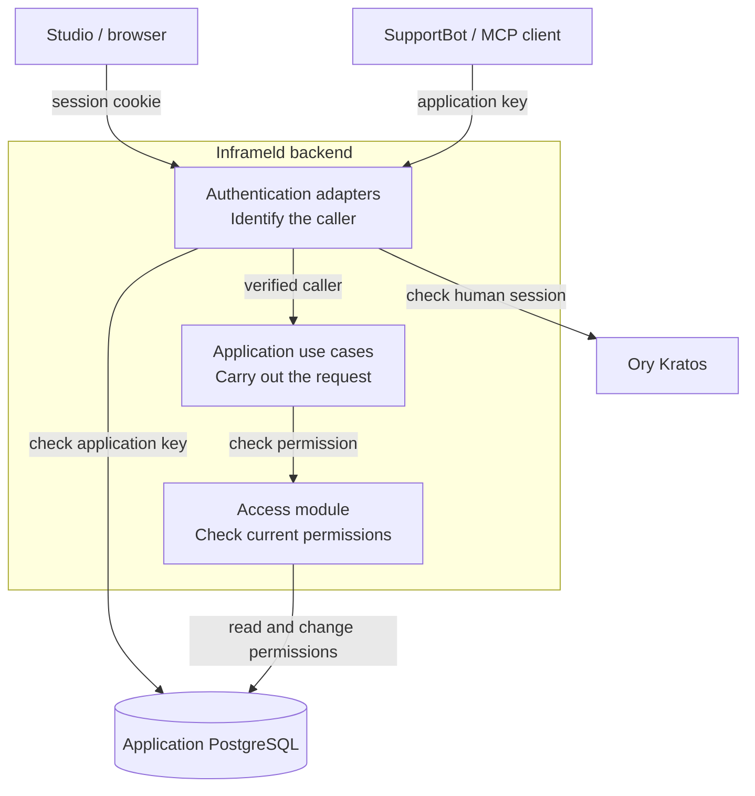
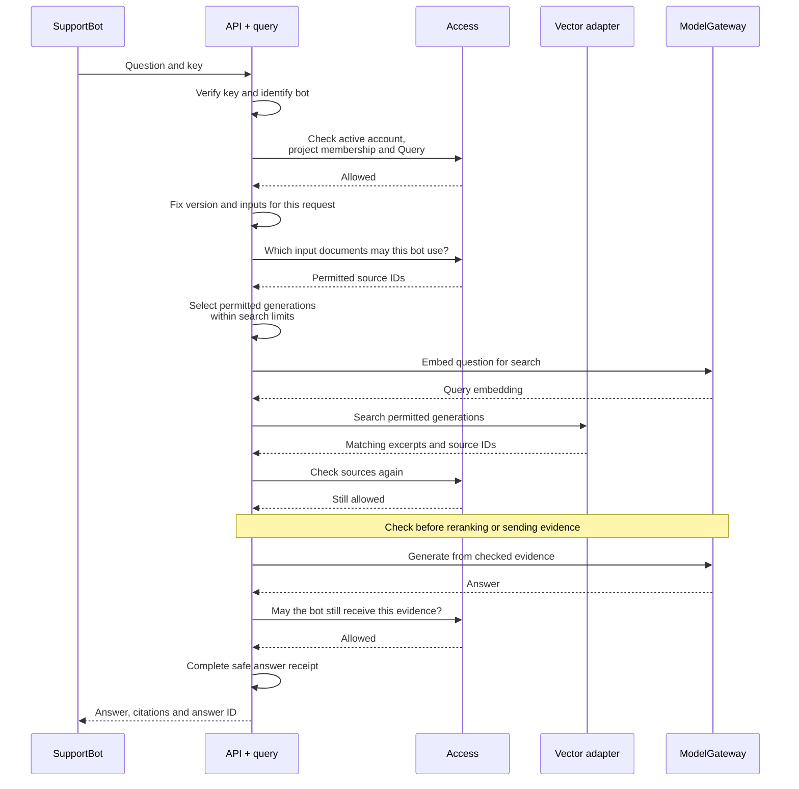
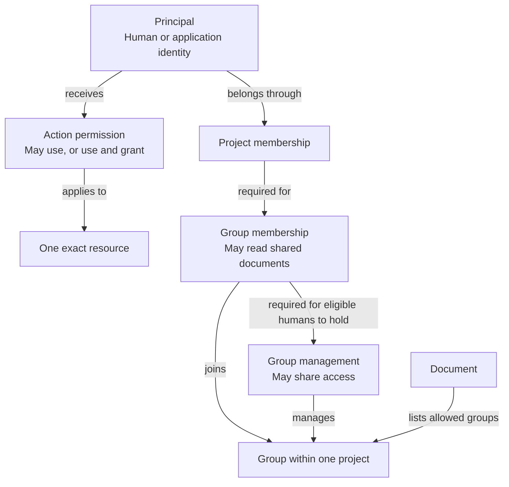
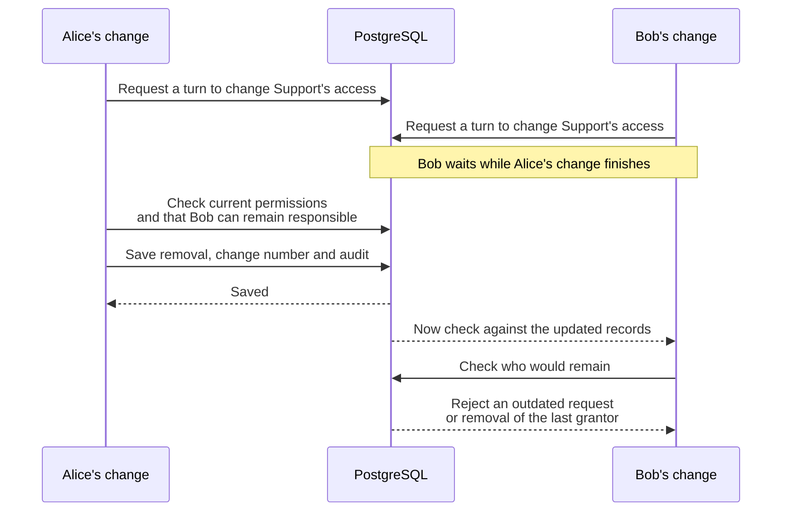

# Access control: who can do what, and why

Inframeld lets teams upload documents and build pipelines that answer questions from them. Retrieving document excerpts to help a model answer is called retrieval-augmented generation (RAG). Access control decides who may use a pipeline, which documents it may use for that caller, and who may change these permissions.

This guide follows Alice and SupportBot through those decisions. Start with sections 1–3 for the basic model, then use the examples in sections 4–8 for sharing, application keys, releases, and recovery. Section 9 explains how the database keeps access changes consistent. Exact record definitions live in the [Access data model](data-model.md#access).

> **Design status:** This is the accepted v1 design, including the member-plus-manager rule in [ADR-0049](../adr/ADR-0049-require-group-managers-to-be-ordinary-members.md). It does not claim that the endpoints, migrations, integrations, or security tests are complete. Permission names describe the intended actions. Some API names and workflow details still need to be specified.

## Contents

| Reader's question | Start here |
| --- | --- |
| What does someone need to use a document? | [1. Three separate checks](#the-model) |
| What do Kratos and Inframeld each do? | [2. Signing in and checking permissions](#architecture) |
| How is a question answered safely? | [3. Follow a query](#query-flow) |
| How can people share access? | [4. Membership, permissions, and visibility](#sharing) |
| Who can upload, change, or delete documents? | [5. Document operations](#documents) |
| How do application accounts and keys work? | [6. SupportBot's lifecycle](#applications) |
| Who may build and publish a version? | [7. Pipelines and releases](#releases) |
| What happens when someone leaves or an account is compromised? | [8. Administration and recovery](#recovery) |
| What if two people change access at the same time? | [9. Storing access and handling simultaneous changes](#persistence) |
| What should a maintainer check? | [10. Maintainer checks](#maintainer-checks) |
| Where are the permission list, decisions, and open questions? | [11. Decision and reference map](#decision-map) |

## 1. Three separate checks

Alice works in **Support**, a project containing documents, pipelines, and access settings. The project has two **access groups**, `SupportKnowledge` and `HRPrivate`. Each group identifies people or applications who may read documents shared with it. It does not bundle permissions such as uploading or publishing.

Each document lists the groups allowed to read it. This list is its **group allowlist**. Membership in any listed group supplies document access, provided the caller still belongs to the project and is allowed to act.

The **Support Pipeline** describes how to find document excerpts and turn them into an answer. A **PipelineVersion** saves a fixed configuration and its prepared inputs. **Test** and **Production** are **Deployments**, the stable endpoints that select which version answers a request. Building a version and making it live are separate actions.

**SupportBot** is an application calling Production. It has its own account, even when Alice creates it or asks a question through it. A **principal** is Inframeld's stable identity for a human or an application. Alice and SupportBot therefore have different principal IDs.

### Alice and SupportBot can query, but Bob cannot

Assume authorized people have set up these permissions:

| Principal | Member of Support | Action permissions | Document-group membership |
| --- | --- | --- | --- |
| Alice, a human | Yes | Query on Production, Build on Support Pipeline | SupportKnowledge |
| SupportBot, an application | Yes | Query on Production | SupportKnowledge |
| Bob, a human | Yes | None yet | None yet |
| Carol, a human | Yes | Manage releases on Production | None yet |

After checking who is calling, Inframeld asks three separate questions:

1. **Do they currently belong to this project?** Being a member gets Bob into Support, but does not give him every permission there.
2. **May they perform this action on this resource?** SupportBot needs `Query` on Production. Permission to query Test would not cover Production.
3. **May they use these documents?** Their current group memberships determine which document excerpts may contribute to the answer.

The account must also be active, its session or key must be valid, and the operation's other requirements must hold. For example, the selected pipeline version must be ready to serve.

Alice and SupportBot can query Production using documents shared with SupportKnowledge. Bob cannot query it just because he belongs to Support. Carol can manage releases on Production without automatically gaining document access. Release operations that need protected inputs still check access to those inputs.

These permissions can change separately. Removing SupportBot's Query permission stops it querying Production, even if its key is valid. Removing its SupportKnowledge membership removes that document access, even if Query remains. Replacing a key changes neither permission.

> **Signing in proves who is calling. It does not grant project membership, action permissions, or document access.**

 

## 2. Signing in and checking permissions

Humans sign in through **Ory Kratos**, which manages their sign-in methods and sessions. Applications use keys issued by Inframeld. Both paths identify a local principal, after which Inframeld checks permissions in the same way.

The diagram shows which components call each other. The boxes inside the backend are parts of one application, not separate deployed services. Background workers use the same permission rules.

**Kratos answers “who is this person?”** Inframeld decides whether that person may join the installation, belongs to a project, is suspended, or may perform an action. Kratos's administrative API stays private. Its database and database role are separate from Inframeld's application tables.

**Access owns the permission rules.** An application use case, such as answering a question, asks Access for permission as it carries out the work. An adapter translates between application concepts and an external system. For example, the Kratos adapter checks a session, and the vector adapter turns the permitted document selection into search filters. HTTP endpoints, MCP tools, and workers use the same Access rules. Indexing, pipeline configuration, and model-provider integration keep their own responsibilities.

The verified caller and the project or resources involved travel together in an application-owned **access context**. It is not a raw Kratos response, database object, or permission list supplied by a client. V1 integrations act as their application account. Acting on behalf of a separately verified person is a future feature.

 

### Alice signs in through her company

Alice completes Kratos's browser login flow. Kratos creates a secure, HTTP-only session cookie, which browser JavaScript cannot read. The backend checks it through `/sessions/whoami`, finds Alice's local principal, and checks her current Inframeld permissions.

Studio provides the account screens. It displays the fields and errors supplied by Kratos and follows its cross-site request forgery (CSRF) protection. Kratos verifies passwords. This design does not need Auth.js or another service issuing browser tokens. Do not store bearer tokens in local storage or turn native-app session tokens into browser cookies.

**Optional company sign-in is included in OSS v1.** The operator configures an OpenID Connect (OIDC) provider for the installation, including its client, redirect URI, and protected secret. Kratos signs Alice in through that provider and creates its own session. A local installation still requires authentication, but does not require a company provider or cloud identity account.

Alice can connect more than one sign-in method to the same account. Suppose she already uses a password and later selects company sign-in with the same email address. She must first prove access to her existing account using an attached method, such as that password. Matching email addresses alone do not authorize linking. Once linked, either method identifies the same Alice and uses her existing Inframeld permissions. She does not repeat the linking step on each login or gain a second local account.

Kratos maintains these links. Inframeld identifies its verified Kratos identity by **authority + subject**, meaning the identity source and the account ID within it. Email is not the identity key. Company login does not make Alice an administrator, and a token from her company is not automatically an Inframeld API credential. Importing company group memberships would need a separately designed policy.

**Ory Hydra is not needed for this sign-in flow.** It addresses a different task, issuing OAuth/OIDC tokens. Issuing tokens, obtaining consent, exchanging tokens, and verified user delegation are deferred. Any future token would still lead to the same Inframeld permission checks.

If a session is invalid, expired, or cannot be verified, Inframeld denies the request. It does not continue when Kratos is unavailable. Logout, account recovery, disabled identities, multi-factor authentication (MFA), secure first-administrator setup, and email configuration still need deployment integration and testing.

### Why keep permission checks in Access and PostgreSQL?

V1 has a fixed set of actions, direct permission assignments, and document groups. It does not need nested groups, custom roles, or rules that inherit through arbitrary relationships. PostgreSQL lets an access change and its related records succeed or fail together. Inframeld must still decide such things as whether a manager may leave or whether Alice may create a key for a powerful application.

OpenFGA could express these permissions, but would add a service and work to keep its state consistent with the application. PyCasbin would avoid that service, but still add a policy model, database integration, and synchronization between processes. Neither offered a demonstrated simplification for this design.

We therefore own the evaluator and its security tests. PostgreSQL does not supply the permission rules or prove that they will meet a particular workload. Reconsider an engine if the product needs deep inheritance, separate applications sharing permission rules, or measured performance improvements. More users or action names alone are not a reason to add one, and v1 needs no speculative engine adapter.

The rationale is recorded in [human authentication](../adr/ADR-0012-use-kratos-for-human-authentication.md) and [application-owned authorization](../adr/ADR-0013-keep-authorization-in-access-and-postgresql.md).

  

## 3. Follow a query

SupportBot asks Production, “How do customers request a refund?” Inframeld first checks the bot's identity, project membership, and Query permission. It then needs to keep unauthorized documents out of both the answer and the work that produces it.

A pipeline version names exact document versions and their prepared indexes. A **generation** identifies prepared search data for those inputs. Inframeld selects only the generations whose documents SupportBot may currently use and which have not been deleted. The vector adapter searches within that selection.

The sequence below shows a successful request. A failed permission check stops the affected step. “API + query” combines authentication and query handling for readability. Authentication adapters still verify the key.

Client-supplied group names or search filters never establish permission. The backend checks the sources returned by search before sending their contents to a model, evaluator, caller, or **reranker**, which reorders matching excerpts. Reordering documents is still use of their contents and needs permission.

If no generations are permitted, there is no evidence to search. The backend must not fall back to searching everything. Search also has combined limits on generation count, filter size and conditions, storage partitions called **shards**, and time. Exceeding a limit produces an explicit failure, rather than wider access or an unlimited series of smaller searches. If a required shard fails, the query is unavailable. The [indexing guide](indexing.md) defines those limits. Correct access filtering does not guarantee that approximate search finds every relevant excerpt or that models return identical answers.

### SupportBot loses access while an answer is being generated

Suppose a manager removes SupportBot from SupportKnowledge after search finishes. The earlier permission check does not entitle the bot to receive the answer. Inframeld checks again before later uses of the evidence and before returning the response.

The same rule applies to old content. A Document's **current** access policy protects all its versions, including old downloads, citations, evaluation evidence, and answer receipts. A saved collection revision does not preserve past permissions. Vector records therefore do not contain a mutable list of permission groups that needs rewriting whenever access changes.

The execution records who acted and the access revision (change number) it observed, to help explain its history. This never authorizes a later read. There is still a gap between checking permission and sending data over the network. Revocation cannot recall content already sent, but rechecks protect subsequent uses. The database must not remain locked while waiting for a model call.

### Receipts, feedback, and MCP follow the same rules

An **AnswerReceipt** records the execution, the principal who requested it, the selected version, and the sources sent to the model for the final answer. This includes sources the answer did not cite. They may still have influenced it. Operation records, receipts, and feedback must not expose those sources to someone who has since lost access.

The separate `feedback:write` permission lets an integration submit and read its own current feedback for eligible answers while it retains access to the evidence. Query permission does not automatically include it. Studio readers need both feedback-read authority and current evidence access. Replacing SupportBot's key preserves its identity and feedback ownership. Another application does not inherit that ownership.

The **Model Context Protocol (MCP)** provides another way to call the same application operations. V1 supports preconfigured clients that send an existing application key in authentication headers. It does not add delegated human identities, OAuth token issuance, or tools for administering keys. Even looking up a default Deployment requires project membership and Query permission before setup information is revealed.

See [answer feedback](answer-feedback.md), [MCP](mcp.md), and [lost-response recovery](jobs-and-idempotency.md#answers) for their full contracts.

 

## 4. Membership, permissions, and visibility

Being responsible for a project does not mean being trusted with every document or action. Inframeld assigns specific responsibilities instead of providing an unrestricted in-app administrator role.

### Alice brings Bob into Support

Bob has already been admitted to the installation. Alice uses `Manage project members` on Support to add him to the project. Bob can now see that project, but he still needs separate permissions to use its documents and Deployments.

Alice's permission covers membership in Support. It does not let her admit a new person to the installation, manage another project, or create application accounts. Those are separate actions. Removing Bob later clears his project access and follows the [handover rules](#recovery).

### Using a permission and sharing it are different responsibilities

A **grant** is an assignment of one action to one recipient on one exact resource. It has two possible levels:

| Level | What the recipient may do |
| --- | --- |
| **Can use** | Perform the action on that resource. This is the default when sharing a permission. |
| **Can use and grant** | Perform the action, give it to others, or reduce or remove someone else's assignment of that same action on that resource. |

If Alice has `can use and grant` for Query on Production, she can let Bob query Production. Letting Bob pass that permission to others is a separate, explicit choice. Query on Production gives neither person permission to query Test.

The original person who assigned a permission does not own it forever. If Carol can grant Manage releases on Production, she can remove or downgrade Bob's assignment there even if Alice gave it to him. Carol still cannot change his other permissions without the relevant grant authority.

Applications receive **can use** only, for actions allowed to applications. Permission changes, manager appointments, user admission, and administration of incoming application accounts and keys require authorized humans.

### Every group manager is also a member

Membership supplies document access. Management adds the ability to add or remove eligible group members and appoint other managers. **Every manager must be an ordinary member of that same group.** An ordinary member cannot share access just because they can read.

For example, Alice is a member and manager of `SupportKnowledge`. She can read documents shared with it and add Bob as a member. Bob receives the same document access, but cannot add Carol. Either person still needs Query on Production to use those documents through Production. Alice cannot add anyone to `HRPrivate` unless she is also a member and manager there.

Managers are peers, with no owner above them. A current eligible manager may appoint another admitted human member of the project. Applications cannot be managers. Appointment gives the person both membership and management, keeping an existing membership if they already have one. The UI must explain that this includes access to **current and future documents shared with the group**.

| Change | What happens |
| --- | --- |
| Create a group | Its creator becomes its first member and manager. |
| Appoint a manager | Membership and management are saved together. |
| Remove management only | The person remains a member and keeps document access through the group. |
| Remove membership | Management is removed too. Rejoining later does not restore it. |

The backend saves these related changes together with their change number and audit record, as explained in [section 9](#persistence). A manager flag never substitutes for a missing membership when checking document access.

The last manager must appoint a replacement before deliberately leaving. Other changes must also preserve the required active managers and people who can grant permissions. [Emergency suspension](#recovery) is different because a compromised account must be blocked immediately.

Removing membership ends access through that group, but another allowed group may still provide access to the same document. Query, Build, Add documents, Update documents, and Delete documents remain separate permissions.

Creating a group requires the separate human project permission **Create access groups**. Creating `SupportTeam` gives Alice membership and management of that new group. It gives her no control over HRPrivate and moves no HR documents into SupportTeam.

[ADR-0049](../adr/ADR-0049-require-group-managers-to-be-ordinary-members.md) replaces the earlier rule that allowed managers without membership. The [data model](data-model.md#group-manager-membership-constraint) defines how the records enforce the current rule.

 

### Bob guesses Production's ID

Assume Bob now has an action permission on Test, but none on Production. His list shows Test and omits Production. Asking directly for Production's ID returns the same safe **404** as a missing resource. Trying to publish to visible Test without Manage releases returns **403**. Both use the established [RFC 9457 error contract](error-handling.md).

The following table shows what someone may see while their account, membership, and permissions remain valid:

| Information | Who may see it |
| --- | --- |
| Project name and ID | Current project members. Installation permissions alone do not reveal every project. |
| Pipeline or Deployment name, ID, and basic availability | Someone with any effective action on that resource, at either grant level. |
| Resource configuration | Someone with View configuration or Edit configuration on that resource. |
| Group name and ID | Its members, managers, or people and applications with an action on it. Only managers may see who its members and managers are. |
| Application name and ID | A human with an administration action on it, or someone authorized to grant a permission who is choosing an eligible recipient. |
| Assigned actions and their grant levels | A human who may grant that exact action on that target. Humans may also inspect their own permissions. |
| Eligible recipients of a grant | Authorized project grantors see a limited directory containing stable ID, display name, and human/application kind. |
| Safe application-key metadata | A human with Issue or Revoke permission on that application. Delete alone is insufficient. |

These views do not expose document contents, unrelated grants, linked private resources, or saved secrets. Seeing a Deployment does not reveal its Pipeline. The recipient directory covers neither the whole installation nor a complete list of who has access to everything.

**Edit configuration includes viewing that configuration.** Removing View alone cannot hide it while Edit remains. Removing Edit leaves read-only access only if View remains. Giving someone Edit also gives them its included viewing ability, but managing a separate View assignment still requires authority to grant View. This is a fixed rule, not a configurable hierarchy of roles.

 

## 5. Document operations

Reading a document, changing its contents, and deciding who may read it are separate responsibilities. A document shared with several groups needs protection for all those groups.

### Bob uploads a handbook without reading the existing library

Bob has Add documents on SupportKnowledge. That lets him upload a new handbook for that group even if he is not a member and cannot read its documents. Sharing the new upload with HRPrivate as well requires Add documents on HRPrivate too.

| Operation | Required permission | Result |
| --- | --- | --- |
| **Add documents** | Add on every group selected for the new document. | Creates a Document with that initial audience. |
| **Update documents** | Update on every group in the document's current saved allowlist. | Replaces its contents without changing its identity or audience. Changed content creates a new immutable DocumentVersion. |
| **Delete documents** | Delete on every group in the document's current saved allowlist. | Deletes the Document across all its versions. |

A group manager can grant these actions without making the recipient another manager. Applications may receive use-only permission. None of Add, Update, or Delete includes the others, document reading, audience changes, group management, Build, or Manage releases.

Every document must allow at least one group, and all its groups must belong to its project. An empty saved allowlist denies access. Before saving a change, the backend checks current project membership, account status, credential restrictions, and the required permissions against the **saved** policy. Bob cannot supply an old or smaller group list to avoid those checks.

An upload default, a matching filename, or duplicate content does not grant permission to replace an existing document. Unchanged content follows the existing retry rules instead of creating duplicate versions.

### Alice wants to share an HR handbook with Support

The handbook currently allows HRPrivate. Alice manages SupportKnowledge but not HRPrivate. She cannot add SupportKnowledge to its audience just because she manages the destination group.

Changing the audience requires **one authorized human who manages every group in the current or proposed allowlist**. This includes groups being added, removed, or retained. Changing `HRPrivate + SupportKnowledge` to only `SupportKnowledge` still requires management of both groups. Otherwise Alice could bypass HR's protection by removing HRPrivate first.

Reading or updating the document is not enough. V1 uses one person trusted to manage all affected groups, without adding document owners or a multi-person approval process. The backend checks the saved audience and current manager assignments when saving the change. The resulting policy applies to every version of the Document.

### Alice changes the default audience for uploads

Changing upload defaults requires both Manage upload defaults on the project and management of every group in the old or new defaults. The new default must contain at least one group, all from the same project.

Changing the default from HRPrivate to SupportKnowledge affects future uploads, not existing documents. Each upload still needs Add documents on every selected group. If that fails, the backend must report the failure rather than silently choose a different audience.

Starter uploads use the private group saved in the project's defaults. Future source connectors also select Inframeld groups explicitly. They do not automatically copy the source system's permissions. Who may configure each kind of source still needs a separate decision.

### Deleting a document and deleting a group do different things

Deleting a Document first blocks access and marks affected serving state as unusable. Physical cleanup can then continue in resumable steps. A Deployment or historical result that depended on it may become unavailable. Immutable versions and retention pins, which normally keep referenced data, do not override explicit erasure. Deletion does not promise immediate removal of every stored byte.

Removing a group from a document's allowlist only changes its audience. Leaving a document out of a future CollectionRevision only changes that future selection. Neither action deletes the Document. The [retention and deletion guide](retention-and-deletion.md) explains cleanup.

A manager may delete an **unused access group**. No Document, active upload or source configuration, or upload default may still refer to it. Those references must first be changed through their usual authorized workflows. Deleting the unused group removes its memberships, managers, and action grants. It neither deletes documents nor changes their audiences, and needs no replacement manager because the group itself is going away.

  

## 6. SupportBot's lifecycle

SupportBot's account holds its permissions. Its key proves that a request comes from that account. Keeping these separate means replacing a key does not create a new identity or a new set of permissions.

### Alice creates SupportBot

With Create application accounts on Support, Alice can create SupportBot in that project. It starts with no action permissions, document access, or key. It does not copy Alice's access.

Alice receives explicit **can use and grant** assignments for Issue application keys, Revoke application keys, and Delete application account on SupportBot. These belong to Alice, not the bot. They can be transferred or removed like other grants and give her no authority over other applications.

Authorized people then give SupportBot the actions and group memberships it needs. An application belongs to one project and cannot move between projects under this design. Humans may belong to several projects.

### Alice creates a key after SupportBot gains HR access

Someone holding a valid SupportBot key can use SupportBot's full current permissions, subject to the key's intended use and restrictions. Creating one therefore requires an authorized human who passes **both** checks:

1. They have Issue application keys on SupportBot.
2. They may grant every permission SupportBot currently holds, on each exact resource, and manage every document group it belongs to.

Being able to use those actions or read those documents is insufficient. Suppose Alice can issue SupportBot keys but cannot grant HRPrivate access. Once another authorized person adds SupportBot to HRPrivate, Alice can no longer create or replace its keys. Someone who passes both checks must do that.

Creating a key does not change the application's permissions. The backend checks the issuer and the application again when saving the key, alongside any competing permission changes. Yesterday's approval cannot authorize a replacement today.

### Existing keys follow the account's current permissions

Adding SupportBot to HRPrivate gives **every existing valid SupportBot key** that access. This includes a key still held by an earlier issuer who could not personally grant HR access. Removing a permission removes it for all the account's keys.

Keys do not keep a snapshot of old permissions or inherit their creator's personal permissions. V1 deliberately has one permission set per application. Use separate accounts, such as SupportBot and HRBot, when different users or integrations need different access. Multiple keys support replacement and individual revocation, not different permission sets.

### Alice and Bob both use the bot

When either person uses the customer application, Inframeld sees SupportBot. Sending `userId: Alice`, a group name, or an MCP argument cannot turn its request into Alice's request. Unsupported claims to act for another user are rejected.

A **canary-affinity key** keeps related requests on the same release version during a trial rollout. It helps route a request, but proves nothing about the human using the bot. Choose bot permissions that are safe for everyone who can invoke the integration. Hiding a button in its UI does not enforce each employee's personal Inframeld access.

Future user delegation would require a verified identity and a credential tied to the correct application and API. Checks would include who issued it, its intended recipient, expiry, token type, and scope. The request could use only permissions held by **both** the application and the user. An arbitrary signed token, another client's ID token, or a forwarded human session would not suffice. The protocol and revocation behavior remain undecided.

### A key leaks or needs replacement

Incoming keys are opaque secrets, meaning the key itself contains no readable permission claims. They must be generated with enough randomness to resist guessing. Inframeld stores only a cryptographic hash or verifier and safe metadata, never the plaintext key. The secret is shown once. If the creation response is lost, retrying cannot retrieve it. See [credential retry outcomes](jobs-and-idempotency.md#secrets).

A key is accepted only while unexpired and unrevoked, for its intended installation, audience, and supported adapter. Here, **audience** means the service or API the credential is intended for. The account must also retain the necessary current permissions.

A human with Issue or Revoke permission may see safe key IDs, prefixes, creation and expiry dates, and status. They may not see secrets or hashes. Viewing this metadata does not require the extra authority to grant all the application's permissions. Creating a key does.

An application may have **at most two usable keys** across supported audiences. Unexpired, non-revoked keys count toward this limit. Retained records of expired or revoked keys do not. Normal replacement has three steps:

1. Issue a second key.
2. Update and test the integration with it.
3. Explicitly revoke the old key.

Different authorized people may perform these steps. There is no separate Rotate permission, automatic revocation of the old key, or silent removal of a key to free a slot. Exact lifetime limits remain undecided.

**Revoke application keys is independent of Issue.** Bob can revoke a leaked HRBot key without reading HR documents or being able to grant HRBot's permissions. He may revoke the last usable key immediately. That blocks authentication through the key without deleting the account, its grants, or its human administrators. Neither Issue nor Revoke includes the other.

Replacing a key preserves the principal, its canary routing identity, and ownership of requests tracked for safe retries. Revoking a key cannot recall work already sent elsewhere.

### Retiring SupportBot does not delete its work

Delete application account is a separate human permission on that application. It permanently retires SupportBot, revokes every key, and removes its project membership, group memberships, action permissions, and the human administration grants over it. Key creation and permission changes must not race with deletion and leave the account usable. No replacement key administrator is needed for an account being deleted.

Documents, pipelines, and Deployments created by SupportBot belong to the project and remain. Deleting the account gives Alice no additional permission to read or erase them. Historical attribution follows the usual retention and erasure rules. Creating another account named SupportBot cannot reactivate the old identity or its keys.

### Provider keys are different

Inframeld only needs to **verify** an incoming SupportBot key, so it stores a hash. It needs to **send** an outbound provider key when calling a model service, so that key must be recoverable. Provider keys are encrypted in PostgreSQL using PyNaCl and a separate root key.

ModelGateway obtains the appropriate provider secret only when needed. Plaintext must stay out of Studio reads, jobs, snapshots, logs, receipts, evidence, and document-parser environments. A missing required credential causes failure, not a silent fallback. [Model connections](model-connections.md) owns provider-key management, endpoint changes, and validation for each model role.

  

## 7. Pipelines and releases

Building prepares a version. Publishing makes it serve requests. Querying uses it. Permission for one of these actions does not grant the others, and a version being ready does not authorize anyone to publish it.

### Support CI builds a version and Carol publishes it

An authorized automation account can build and evaluate versions without being allowed to publish them. It uses its own principal, not a developer's session. Those permissions give it neither membership-administration authority nor access to provider secrets. The API workflow does not require GitHub or an external CI runner.

Carol's Manage releases on Production covers publishing, rollback, candidate and canary control, publication-mode changes, and selecting inputs for automatic updates. V1 keeps these together as one permission on **that Deployment**. It does not split them into publish-only, rollback-only, or canary-only grants.

Manage releases does not include Build on the Pipeline, Delete on Production, or document access. Operations using protected inputs still need permission to use them. Deployment Edit configuration changes non-serving details such as its name and description. Changing the version that serves or its rollout behavior requires Manage releases. Editing a Pipeline draft is separate again.

Release commands check that a version is ready and that the Deployment has not changed since the request was prepared. They also use an idempotency key to recognize repeated requests. Automation follows the same rules as humans. Its audit record identifies the application principal and credential rather than attributing the work to a fictional human.

### Alice creates the first Deployment

Create Pipeline and Create Deployment are separate project permissions. When an authorized human creates either resource, they receive explicit initial **can use and grant** assignments on the new resource. These permissions do not cover existing resources or every resource created later. Renaming a resource does not change its permission identity.

Creating a Deployment includes choosing its initial PipelineVersion. That version must be ready, belong to the same project, and satisfy the Deployment's input/output contract. The backend saves the Deployment, its initial version, and the creator's initial permissions together, including Manage releases. There is no empty placeholder Deployment or separate first-release permission.

Alice can subsequently manage releases on Deployment A through that grant. She cannot publish to Deployment B without permission there. Her creator grants can be transferred or removed and do not give her additional document or model-connection access.

For the **first automatic publication**, no default Deployment exists yet. The initiating human therefore needs Create Deployment, plus Build on the selected Pipeline, permission to make the underlying change, and access to its inputs. The worker checks those permissions again before sending work and before publishing.

Creation saves the Deployment, initial version, creator grants, and project's default-route reference together. Automatic-publication settings move from the default setup record to the Deployment in that same change. The [onboarding](onboarding.md#updates) and [publication](pipelines-and-releases.md#modes) checks still protect readiness, expected state, mode, control revision, request identity, and resource lifecycle. These checks prevent outdated work from publishing after the setup changes.

If another request creates the Deployment first, Alice's request to **create** one cannot silently become a request to **update** it.

### Automatic updates still need permission

The default serving route starts in Automatic updates. Other Deployments start in Manual releases unless automatic mode is explicitly selected at creation.

For an existing Deployment, automatically applying a source or configuration change requires permission to make that change, Build on the selected Pipeline, and Manage releases on **every selected target Deployment**. Sharing a collection between Deployments does not share release authority.

Changing publication mode requires Manage releases. Enabling automatic updates and applying their selected inputs also requires Build and valid inputs. Switching to manual cancels pending publication authority. Switching back does not revive it. Workers must still check the initiating caller's current permissions. The [pipelines and releases guide](pipelines-and-releases.md#modes) explains the full lifecycle.

 

## 8. Administration and recovery

People must be able to leave without making a project impossible to manage. A compromised account, however, must be blocked immediately even if it is the last account able to administer something.

### Start privately

V1 has one installation organization. Each admitted human receives a private starter project and a private group without manually setting up either. The group has its creator as both member and manager. Starter uploads use that saved private audience. Other humans and applications receive no automatic access.

The first administrator is established through a **one-time claim controlled by the server operator**. Being the first arbitrary person to sign up publicly never makes someone an administrator. Setup assigns four separate can-use-and-grant permissions:

| Permission | What it allows |
| --- | --- |
| Admit users | Invite or approve people into the installation. It does not add them to existing projects, make them administrators, or bypass a suspension. |
| Suspend users | Block any human in the installation, without needing control over that person's individual permissions. |
| Restore users | Deliberately lift a suspension after identity verification and security review. |
| Create projects | Create additional projects. Automatic starter setup neither requires nor grants this permission. |

None of the user-administration permissions includes another or allows taking over someone's sign-in identity. The initial administrator's grants can be transferred or removed under the same handover rules as other grants. They are not permanent special privileges.

An additional project's creator receives membership and explicit can-use-and-grant assignments for the seven project actions in the [permission reference](#decision-map). Each action's extra checks still apply. These grants cover neither existing projects nor future unnamed actions.

Setup uses stable IDs and uniqueness checks so a retry does not create duplicate defaults. It must not recreate defaults that someone deliberately deleted.

### Alice leaves after granting Bob access

Bob keeps the permissions Alice gave him. The record of who granted them explains history, but does not make his access depend on Alice remaining. Removing Alice from Support clears **her** project grants, group memberships, and manager assignments. Adding her back later does not restore them.

For a resource that remains in use, ordinary departure, removal, or reduction of authority must leave an active eligible human able to grant each affected action. For example, if only Alice can grant Manage releases on Production, she must pass that authority to a replacement first. The replacement does not need every Production permission.

A person granting project or resource permissions must remain a project member. A person granting installation permissions must remain an admitted human. A group's last manager must appoint a replacement who is both a member and manager. Applications and suspended accounts do not count as replacements.

Two simultaneous departures must not each rely on the other person staying. [Section 9](#persistence) explains how the backend prevents that.

### Alice is compromised while she is the last manager

Suspend Alice immediately, even if that leaves no active group manager or person able to grant an action. Suspension preserves her memberships, manager assignments, and action permissions but blocks their use, including reading and administration. Other authorized people keep their access, although some administrative work may now be impossible.

Prefer recovering Alice's **existing legitimate account**, keeping the same local principal. Verify her identity, replace compromised sign-in methods, invalidate old sessions, and review suspicious permission and key changes. An authorized person must then deliberately lift the suspension. A password reset alone does not do this, and permissions explicitly removed during the incident stay removed.

Kratos handles recovery of the sign-in identity. Access decides whether the recovered account may act. This integration still needs implementation and testing.

### The server operator can recover a stranded responsibility

An **in-app administrator** has only their assigned permissions. There is no unrestricted UI superadministrator or special ability to read documents.

The **server operator** controls the host, Compose setup, databases, storage, secrets, and backups. Application permissions cannot hide plaintext from someone with that level of infrastructure access. The same person may also use the application, but their ordinary session still follows its assigned permissions.

Prefer help from an already authorized peer or recovery of the legitimate account. If neither is possible, privileged operator maintenance may appoint a verified replacement for the exact responsibility that has no remaining administrator:

| Missing responsibility | What recovery assigns |
| --- | --- |
| A group's manager | Membership and management of that group, saved together. This includes its document access, but no unrelated group's access. |
| Someone who can grant a particular action | Can use and grant for that action on that exact resource. No wider permissions are added. |

The compromised account stays blocked. Recovery records the operator, reason, changed permissions, and the access change number together with the change. It does not give the operator ordinary document-reading permissions or let an in-app administrator take over private groups.

The audit record helps explain what the operator did. It cannot prevent misuse by a trusted host operator. The exact maintenance command, identity checks, and handling of simultaneous changes remain to be implemented and tested.

### A project is retired while it contains private data

Delete project is a separate human permission, initially assigned to its creator. It permits erasing **all project-owned contents, including documents the person cannot read**. The person does not need every resource's Delete permission or management of every group. This permission allows deletion, not reading or sharing those contents.

Before accepting deletion, the backend checks the person's current status, project membership, and Delete project permission on that project. It then blocks affected access and new work, including adding members or content, creating keys, and publishing versions. The project's applications are stopped and their keys revoked before resumable cleanup. Data outside the project remains untouched.

Resources being deleted need no replacement manager or grantor. History still follows retention and erasure rules, and deletion status must not expose private contents or promise immediate physical erasure. Deleting an individual resource in a project that remains active still follows that resource's narrower rules.

  

## 9. Storing access and handling simultaneous changes

The database keeps identity, membership, permissions, and history separate because they change for different reasons. Replacing a key should not recreate permissions. Rejoining a project should not restore removed access. An old audit entry should never authorize a new request.

### Separate records explain separate responsibilities

The arrows below show relationships between records, not calls between services. The diagram groups similar concepts for readability. It does not propose one generic grants table or a generic resource registry.

The `application_accounts` record extends a principal with its one owning project. It shares the principal ID and the same permission model. Creation saves the principal, account, project membership, creator grants, and audit together.

Every manager record needs a membership in that same group and project. Appointment, demotion, and removal preserve this relationship. The [14-table Access foundation](data-model.md#proposed-access-foundation-table-map) defines the constraints. The identity model, application extension, grant layout, and change protocol are accepted. Remaining physical details are proposals, not an implemented schema.

### One current assignment per permission

There is one current grant per **recipient + action + exact target**. Its `can_grant` field is `false` for use-only, not an explicit denial, or `true` for use-and-grant. Applications cannot hold `true`. Another authorized person changes this same assignment rather than creating a duplicate.

Code defines the supported actions, targets, eligible recipient types, and fixed rules such as Edit including View. Unknown actions are denied. Included View access needs no extra grant row or configurable role language.

Grant tables are divided by target type, not by action: organization, project, group, application, and later real Pipelines and Deployments. Database relationships check the target and project, rather than trusting an unchecked `resource_type + resource_id` pair. Later domain tables arrive with their features, not as placeholders.

For example, these are three different relationships:

| Relationship | What it means |
| --- | --- |
| Alice may issue SupportBot keys. | Alice has an administration grant over the application. |
| SupportBot may query Production. | The bot has an action grant on a Deployment. |
| SupportBot belongs to SupportKnowledge. | The bot has group membership for document access. |

### Keep current access separate from history

Revoking a grant deletes its current row. Downgrading changes its level. Giving it back later creates a fresh assignment, rather than reviving an inactive row or reading permission from history. Suspension is different because the assignments remain while account status prevents their use.

Each change and its audit event are saved in the **same transaction**, meaning either both succeed or neither does. Audit records who changed what, using limited, safe before-and-after values. They exclude secrets, key verifiers, sessions, document text, and whole permission snapshots. Operator and initial-setup events identify their real actor rather than inventing a human account. Audit history has its own access and erasure rules.

Database constraints reject duplicate and cross-project records. A Support grant cannot name a Finance Deployment, and SupportBot cannot join another project. They also block deletion of a parent record while live relationships depend on it. Application logic checks who may make the change, arranges required handover, and removes dependencies deliberately. Automatic deletion of related database rows cannot replace those steps.

### Alice and Bob both try to leave

Suppose Alice and Bob are the only people who can grant Manage releases on Production. If their removal requests run independently, each could see the other still present and both could leave. Support would then have nobody able to grant that permission.

The backend prevents this by making access changes within a project **take turns**. It checks the current state when each change gets its turn, not only when the request first arrives.

A **revision** is the change number for an organization or project. Where a request must include its expected revision, the backend compares that number with the current one before saving. An old form cannot overwrite newer decisions, even if a permission was removed and regranted with the same recipient, action, and target. A revision detects outdated requests. It is not a saved permission set that can authorize future work. Retries follow the [idempotency and conflict rules](jobs-and-idempotency.md#revisions), not an unconditional overwrite.

This protection applies whenever access or its dependencies change: initial setup, permissions, member removal, recovery, key creation or revocation, group references, and deletion. For example, two people creating keys at once must not exceed the two-key limit. The backend checks the issuer's full current authority and counts usable keys in the same turn. Likewise, a group cannot be deleted while another change adds a reference to it.

### How the database gives each change its turn

A database **lock** makes conflicting changes wait. The accepted design calls for this order:

| Change | Locks to take |
| --- | --- |
| Project access change | First a shared lock on the organization row, then an exclusive lock on the project row. Shared organization locks allow different projects to change at once. The exclusive project lock makes changes in that project take turns. |
| Installation permission or account-status change | An exclusive organization-row lock. This makes a suspension and affected project administration wait for each other. |
| Change involving multiple projects | Take the organization lock first, then project locks in stable ID order. Limit waiting time and handle transaction failures. |

While holding the required locks, the backend checks current permissions and whether the accounts and resources still allow the change. It checks the expected revision where required, applies the change, increments the revision, and saves the audit event in one short transaction. Every path listed above must follow compatible locking rules, including recovery and deletion.

Ordinary permission reads do not take these exclusive administration locks. **Never keep an access-change transaction open while waiting for an upload, a user, Kratos, or a model call.** Checks before sending work or returning protected content still happen where needed, outside this transaction.

Finer locks for individual resources and serializable transactions, an alternative way to coordinate database work, were considered and deferred. Start with queries limited to the relevant project, useful existing primary and unique indexes, and document checks performed in batches. Measure query plans and waiting between changes before adding caches or finer locks. The design alone promises no particular capacity. [ADR-0022](../adr/ADR-0022-coordinate-access-writes-by-project-with-scope-revisions.md) records the choice.

 

## 10. Maintainer checks

For each feature, identify the caller, exact resource, required permission, and documents involved. Check current access when saving changes, sending protected content, and returning it. Every adapter must use Access. A login check or hidden Studio button is insufficient.

These are acceptance cases to verify, not a claim that the tests already pass:

| Try this | Expected result |
| --- | --- |
| Use a valid session or key without the required permission. | The operation is denied. Identity alone is insufficient. |
| Supply another user, group, issuer, delegated subject, project, or resource. | The caller cannot gain access by making the claim. Unsupported delegation and cross-project relationships are rejected. |
| Compare HTTP, supported MCP, and queued work. | They apply the same action and document rules. A queued job still needs current permission when it runs. |
| Revoke access after search but before sending or returning evidence. | Later protected use is denied. This includes historical evidence and sources the answer did not cite. |
| Remove and readmit a member, or replace a key. | Readmission does not restore removed grants. Key replacement preserves the application's identity and current permissions. |
| Appoint a manager through normal administration, creation, or recovery. | Membership and management are saved together with the revision and audit. A manager without membership is invalid. |
| Compare a member with a manager. | Both read through ordinary membership. Only an eligible manager may change membership or appoint peers. Query and other action checks remain separate. |
| Remove management, then remove membership. | Demotion keeps reading access. Removing membership removes management too, and rejoining does not restore it. Another allowed group may still supply document access. |
| Suspend the only manager, then recover the group. | Reading and administration stop immediately. Recovery gives both assignments to an eligible replacement and keeps the compromised account blocked. |
| Remove a manager's membership while they try to add someone. | The backend checks their current membership and management during the project change. A request cannot use authority they have lost. |
| Run simultaneous departures, group deletion, key creation, or first publication. | They cannot bypass handover, leave a reference to a deleted group, create a third usable key, or publish an unintended release. |
| Inspect lists, configuration, and 404/403 responses. | Hidden resources and protected fields do not leak through metadata. |
| Lose a key-creation response or revoke the last key. | The secret cannot be retrieved by retrying. Emergency revocation does not require a replacement. |
| Exercise login, logout, recovery, MFA, CSRF, disabled identities, and provider or session-check outages. | Unverifiable identity is denied. Restoring an account follows the deliberate recovery process. |
| Delete a Document, application, or project. | Each operation respects its own limits, cleanup, and handover rules. |

Test behavior and database integrity against the supported deployment. Code-layout checks, library selection, and accepted ADRs are not evidence that security behavior or integrations work.

## 11. Decision and reference map

This guide explains current access behavior. The data model owns exact records and constraints. ADRs explain why the design was chosen and which alternatives were considered.

### Permission scopes at a glance

A permission's **scope** is the exact installation, project, group, or resource it covers. Each action below can be granted separately. Human-only restrictions and the extra checks in this guide still apply. This is the agreed core, not a complete catalogue of every future operation.

| Target | Named actions or authority |
| --- | --- |
| Installation organization | Admit users, Suspend users, Restore users, Create projects. |
| Project | Manage project members, Create access groups, Create application accounts, Create Pipeline, Create Deployment, Manage upload defaults, Delete project. |
| Individual Pipeline | Build, View configuration, Edit configuration, Delete. |
| Individual Deployment | Query, Manage releases, View configuration, Edit configuration, Delete. |
| Access group | Add documents, Update documents, Delete documents. Manager assignment is separate from these grants. |
| Individual application account | Issue application keys, Revoke application keys, Delete application account. |

Evaluation and feedback retain their own workflow contracts. This table does not settle their remaining permission targets or API identifiers. Basic visibility follows [section 4](#sharing), rather than a universal View permission.

### Decisions behind the design

| Topic | Owning decisions |
| --- | --- |
| Public documentation and protected operations | [ADR-0007](../adr/ADR-0007-keep-api-documentation-public-and-product-operations-protected.md). Public API documentation does not grant permission to use product operations. |
| Human authentication and application-owned policy | [ADR-0012](../adr/ADR-0012-use-kratos-for-human-authentication.md), [ADR-0013](../adr/ADR-0013-keep-authorization-in-access-and-postgresql.md). |
| Bounded grants, document audiences, and manager membership | [ADR-0014](../adr/ADR-0014-bound-permission-delegation-by-action-and-exact-target.md), [ADR-0015](../adr/ADR-0015-keep-document-group-access-separate-from-operational-permissions.md), [ADR-0049](../adr/ADR-0049-require-group-managers-to-be-ordinary-members.md). |
| Shared principals and application credentials | [ADR-0016](../adr/ADR-0016-use-stable-shared-principals-with-an-application-account-extension.md), [ADR-0017](../adr/ADR-0017-let-valid-application-keys-use-current-account-permissions.md), [ADR-0018](../adr/ADR-0018-use-opaque-expiring-and-revocable-application-credentials.md). |
| Recovery, relational grants, audit, and simultaneous changes | [ADR-0019](../adr/ADR-0019-permit-emergency-suspension-with-scoped-operator-recovery.md), [ADR-0020](../adr/ADR-0020-store-current-grants-in-target-specific-relational-tables.md), [ADR-0021](../adr/ADR-0021-separate-current-grants-from-transactional-audit-history.md), [ADR-0022](../adr/ADR-0022-coordinate-access-writes-by-project-with-scope-revisions.md). |
| Readiness, starter setup, and publication | [ADR-0033](../adr/ADR-0033-separate-build-readiness-from-release-authority.md), [ADR-0046](../adr/ADR-0046-provision-creator-private-defaults-through-ordinary-resources.md), [ADR-0047](../adr/ADR-0047-support-reversible-publication-modes-per-deployment.md). |
| Supported MCP clients | [ADR-0045](../adr/ADR-0045-support-preconfigured-mcp-clients-with-application-credentials.md). |

### What remains outside this design

**Deferred features:** verified user delegation, Hydra deployment, different permissions per key, nested groups, custom roles, general policy languages, and permissions for individual document chunks. Keycloak and ZITADEL are not alternative deployment profiles under the Kratos decision.

Future enterprise options could include federation, separate identity providers per organization, SAML/SCIM integration, managed operation, and governance features. These are possibilities, not shipped capabilities or reasons to restrict basic secure OSS operation. Enterprise deployments could use the same identity technology, but migration would still need its own validation. User delegation is deferred by sequencing, not declared permanently enterprise-only.

**Still to specify or test:**

- Remaining action names, exact configuration fields, treatment of links to private resources, and views of history and other resources.
- Remaining source, collection, contributor, project, group, and application administration details.
- Credential lifetimes and the precise ways credentials are verified and tied to their intended installation and audience.
- User admission, identity verification, handover, and recovery workflows.
- Remaining physical schema details and representative tests of simultaneous changes, permitted retrieval, and deployment integration.

An undecided detail never implies unrestricted administrator access or a permission covering every resource.

For database work, start with [Access records](data-model.md#access). [Application structure](application-structure.md) explains code ownership, and [API contracts](api-contracts.md) covers HTTP behavior and adapters. [Deployment](deployment.md) explains infrastructure boundaries, [model connections](model-connections.md) covers outbound secrets and destinations, and [retention](retention-and-deletion.md) covers cleanup and history. The [ADR index](../adr/README.md) preserves rationale and historical evidence.

The shared Access foundation defines the permission rules, application contracts, and database constraints used by the surrounding workflows. Human sessions integrate through Kratos. Private defaults belong to onboarding. Grant changes and handovers use Access administration. Knowledge applies document-access checks when it builds a permitted corpus, and the incoming-credential workflow manages application keys. Each domain adds its own real resource tables and grants. Describing these workflows here does not mean they are all implemented.
