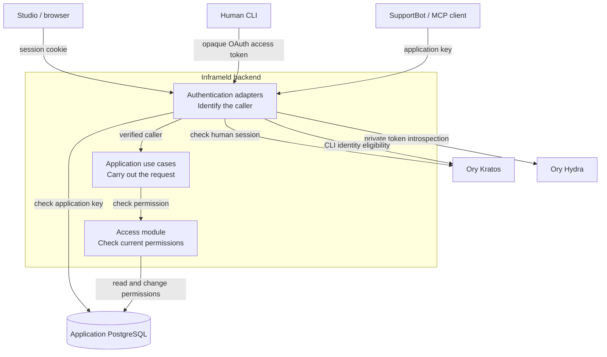
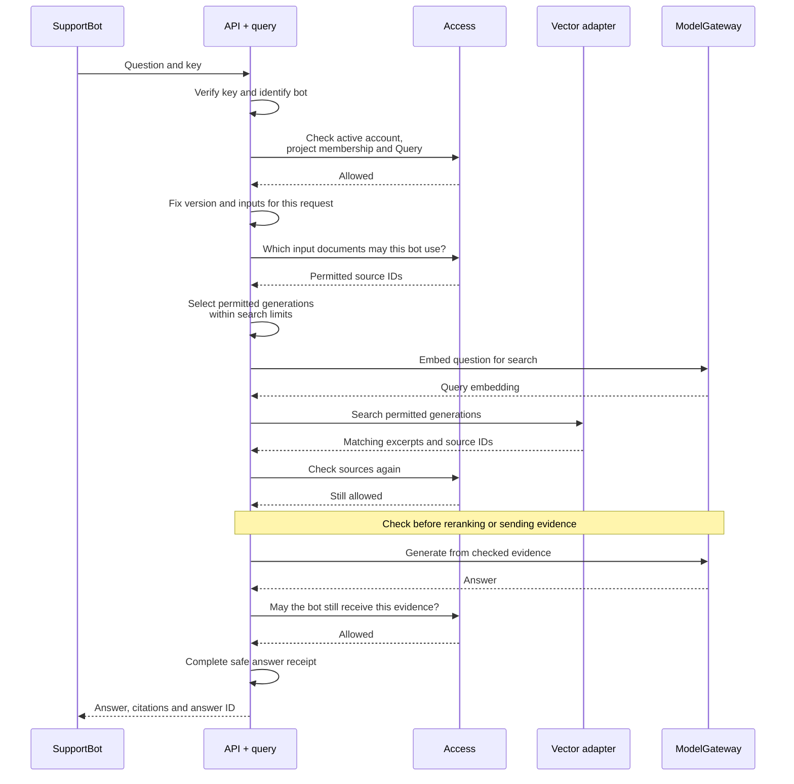
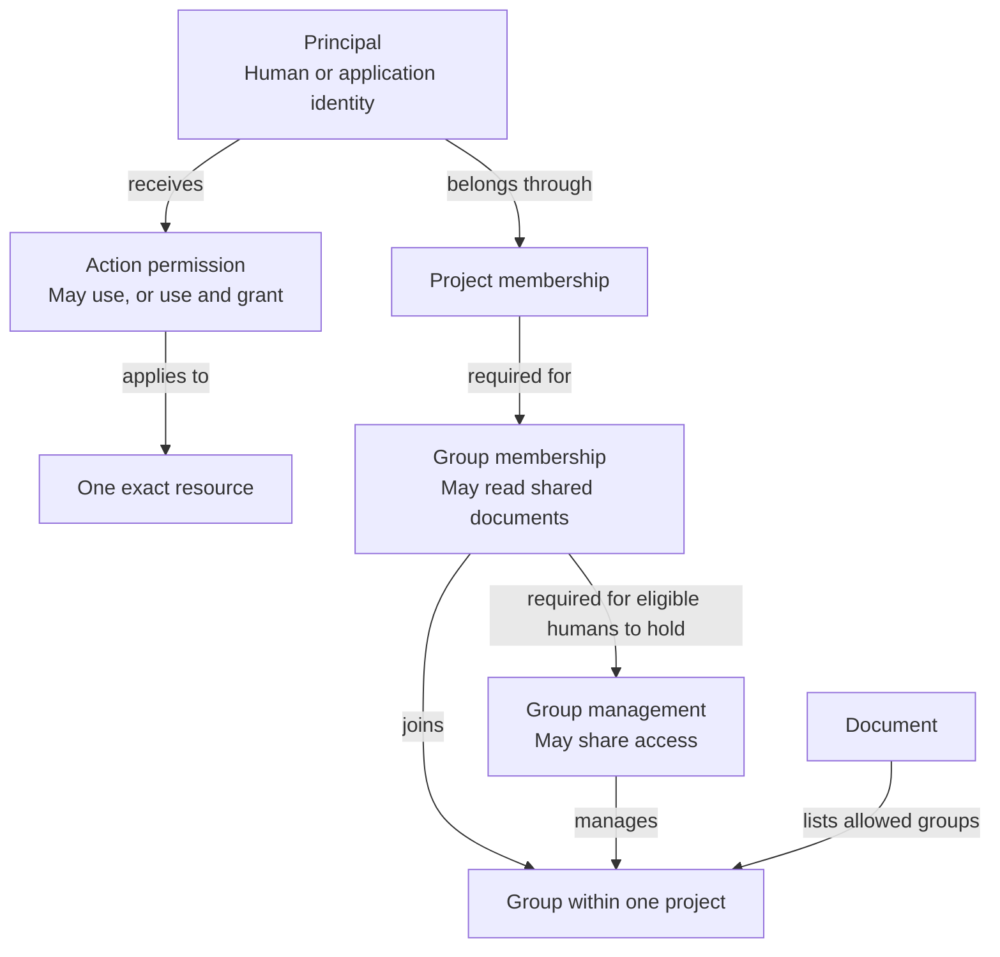
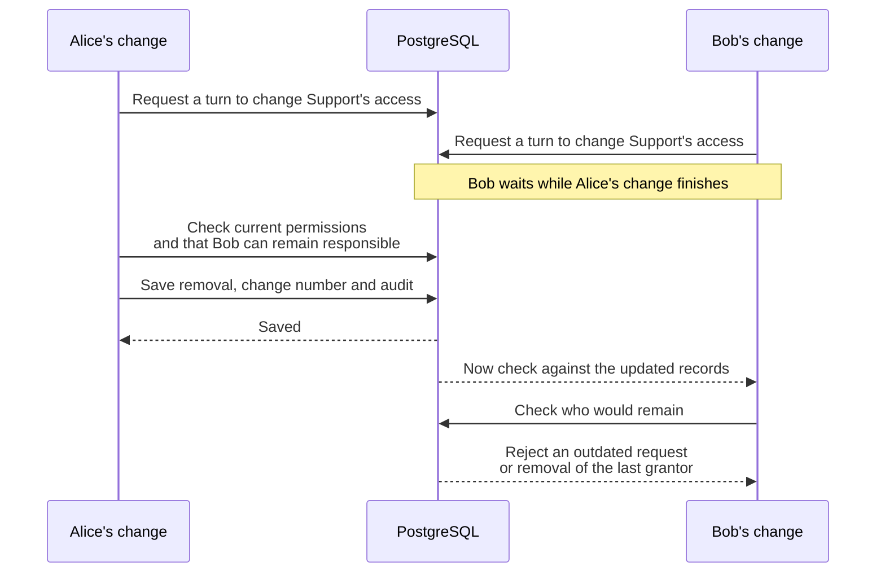

# Access control: who can do what, and why

Inframeld lets teams upload documents and build pipelines that answer questions from them. Retrieving document excerpts to help a model answer is called retrieval-augmented generation (RAG). Access control decides who may use a pipeline, which documents it may use for that caller, and who may change these permissions.

This guide follows Alice and SupportBot through those decisions. Start with sections 1–3 for the basic model, then use the examples in sections 4–8 for sharing, application keys, releases, and recovery. Section 9 explains how the database keeps access changes consistent. Exact record definitions live in the [Access data model](data-model.md#access).

> **Design status:** This is the accepted v1 design, including the member-plus-manager rule in [ADR-0049](../adr/ADR-0049-require-group-managers-to-be-ordinary-members.md). The initial migration creates the 14-table Access foundation. PostgreSQL integration tests confirm those tables and selected constraints, including manager membership, human-only assignments, and cross-project references. They do not verify every constraint or prove that endpoints, identity integrations, and Access workflows are complete. Permission names describe intended actions, and some API names and workflow details still need specification.

**Contract decisions accepted on 2026-10-04:** the credential dispatch, application-key format and lifetimes, capability mappings, initial project grants, recovery block, maintenance boundary and deletion-status rules below record the reviewed decisions for [#116](https://github.com/matejpalenik/inframeld/issues/116). They are accepted design, not implementation evidence or a claim that the whole specification is complete. [The remaining contract work](#access-contract-review) stays explicit.

## Contents

| Reader's question | Start here |
| --- | --- |
| What does someone need to use a document? | [1. Three separate checks](#the-model) |
| What do Kratos, Hydra and Inframeld each do? | [2. Signing in and checking permissions](#architecture) |
| How does a human sign into the CLI? | [Human CLI authentication](#human-cli-authentication) |
| Which credential does an HTTP request use? | [Credential dispatch and session checks](#credential-dispatch) |
| Which human-session components exist now? | [Implemented authentication boundary](#implemented-human-authentication) |
| How is a question answered safely? | [3. Follow a query](#query-flow) |
| How can people share access? | [4. Membership, permissions, and visibility](#sharing) |
| Who can upload, change, or delete documents? | [5. Document operations](#documents) |
| How do application accounts and keys work? | [6. SupportBot's lifecycle](#applications) |
| What is the complete application-key format? | [Key verification and lifetime](#application-key-contract) |
| Which workflows can an application automate? | [Application workflows](#cli-automation-authority) |
| Who can inspect or change tracing? | [Trace permissions](#trace-authority) |
| Who may build and publish a version? | [7. Pipelines and releases](#releases) |
| What happens when someone leaves or an account is compromised? | [8. Administration and recovery](#recovery) |
| When does password recovery restore product access? | [Recovery cleanup](#identity-recovery-cleanup) |
| What if two people change access at the same time? | [9. Storing access and handling simultaneous changes](#persistence) |
| What should a maintainer check? | [10. Maintainer checks](#maintainer-checks) |
| Where are the permission list, decisions, and open questions? | [11. Decision and reference map](#decision-map) |
| Which exact capability mappings have been accepted? | [Reviewed capability catalogue](#reviewed-capability-catalogue) |
| What remains before #116 can close? | [Contract review and open work](#access-contract-review) |

## 1. Three separate checks

Alice works in **Support**, a project containing documents, pipelines, and access settings. The project has two **access groups**, `SupportKnowledge` and `HRPrivate`. Each group identifies people or applications who may read documents shared with it. It does not bundle permissions such as uploading or publishing.

Each document lists the groups allowed to read it. This list is its **group allowlist**. Membership in any listed group supplies document access, provided the caller still belongs to the project and is allowed to act.

The **Support Pipeline** describes how to find document excerpts and turn them into an answer. A **PipelineVersion** saves a fixed configuration and its prepared inputs. **Test** and **Production** are **Deployments**, the stable endpoints that select which version answers a request. Building a version and making it live are separate actions.

**SupportBot** is an application calling Production. It has its own account, even when Alice creates it or asks a question through it. A **principal** is Inframeld's stable identity for a human or an application. Alice and SupportBot therefore have different principal IDs.

### Alice and SupportBot can query, but Bob cannot

Assume authorized people have set up these permissions:

| Principal | Member of Support | Action permissions | Document-group membership |
| --- | --- | --- | --- |
| Alice, a human | Yes | Query on Production, Build on Support Pipeline | SupportKnowledge |
| SupportBot, an application | Yes | Query on Production | SupportKnowledge |
| Bob, a human | Yes | None yet | None yet |
| Carol, a human | Yes | Manage releases on Production | None yet |

After checking who is calling, Inframeld asks three separate questions:

1. **Do they currently belong to this project?** Being a member gets Bob into Support, but does not give him every permission there.
2. **May they perform this action on this resource?** SupportBot needs `Query` on Production. Permission to query Test would not cover Production.
3. **May they use these documents?** Their current group memberships determine which document excerpts may contribute to the answer.

The account must also be active, its session or key must be valid, and the operation's other requirements must hold. For example, the selected pipeline version must be ready to serve.

Alice and SupportBot can query Production using documents shared with SupportKnowledge. Bob cannot query it just because he belongs to Support. Carol can manage releases on Production without automatically gaining document access. Release operations that need protected inputs still check access to those inputs.

These permissions can change separately. Removing SupportBot's Query permission stops it querying Production, even if its key is valid. Removing its SupportKnowledge membership removes that document access, even if Query remains. Replacing a key changes neither permission.

> **Signing in proves who is calling. It does not grant project membership, action permissions, or document access.**

 

## 2. Signing in and checking permissions

Humans sign in through **Ory Kratos**, which manages their identity, sign-in methods and browser sessions. **Ory Hydra** provides the accepted first-party human CLI OAuth/OIDC flow and token lifecycle under [ADR-0053](../adr/ADR-0053-use-kratos-and-hydra-for-human-cli-authentication.md). Applications use keys issued by Inframeld, not the human's cookies or CLI tokens. All paths resolve a local principal before the same current Inframeld permission checks.

The diagram shows which components call each other. The boxes inside the backend are parts of one application, not separate deployed services. Background workers use the same permission rules.

```mermaid
flowchart TB
    Studio["Studio / browser"]
    CLI["Human CLI"]
    Bot["SupportBot / MCP client"]

    subgraph Backend["Inframeld backend"]
        Verify["Authentication adapters<br/>Identify the caller"]
        UseCases["Application use cases<br/>Carry out the request"]
        Access["Access module<br/>Check current permissions"]
        Verify -->|"verified caller"| UseCases
        UseCases -->|"check permission"| Access
    end

    Studio -->|"session cookie"| Verify
    CLI -->|"opaque OAuth access token"| Verify
    Bot -->|"application key"| Verify
    Verify -->|"check human session"| Kratos["Ory Kratos"]
    Verify -->|"private token introspection"| Hydra["Ory Hydra"]
    Verify -->|"CLI identity eligibility"| Kratos
    Verify -->|"check application key"| DB[("Application PostgreSQL")]
    Access -->|"read and change permissions"| DB
```

**Kratos answers “who is this person?” Hydra issues the CLI's protocol credentials.** Inframeld decides whether that person may join the installation, belongs to a project, is suspended, or may perform an action. Both products' administrative APIs stay private. Kratos, Hydra and Inframeld use separate databases/roles even when sharing one PostgreSQL server. The diagram shows the accepted request paths, not proof that every adapter exists.

**Access owns the permission rules.** An application use case, such as answering a question, asks Access for permission as it carries out the work. An adapter translates between application concepts and an external system. For example, the Kratos adapter checks a session, and the vector adapter turns the permitted document selection into search filters. HTTP endpoints, MCP tools, and workers use the same Access rules. Indexing, pipeline configuration, and model-provider integration keep their own responsibilities.

The verified caller travels in an application-owned **access context**. The current implementation retains only `PrincipalId`; typed operation inputs separately identify the project or resource. It is not a raw Kratos response, database object, or permission list supplied by a client. V1 integrations act as their application account. Acting on behalf of a separately verified person is a future feature.

 

### Alice signs in through her company

Alice completes Kratos's browser login flow. Kratos creates a secure, HTTP-only session cookie, which browser JavaScript cannot read. The backend checks it through `/sessions/whoami`, finds Alice's local principal, and checks her current Inframeld permissions.

A small account UI supplies the browser login/recovery screens and Ory's documented login/consent integration for CLI login. It displays the fields and errors supplied by Kratos and follows its cross-site request forgery (CSRF) protection. It does not require the full Studio to exist. Kratos verifies passwords. Browser product requests keep their session cookies; adding Hydra for CLI login does not introduce Auth.js, bearer tokens in browser local storage or a native-token-to-cookie bridge.

**Optional company sign-in is included in OSS v1.** The operator configures an OpenID Connect (OIDC) provider for the installation, including its client, redirect URI, and protected secret. Kratos signs Alice in through that provider and creates its own session. A local installation still requires authentication, but does not require a company provider or cloud identity account.

Alice can connect more than one sign-in method to the same account. Suppose she already uses a password and later selects company sign-in with the same email address. She must first prove access to her existing account using an attached method, such as that password. Matching email addresses alone do not authorize linking. Once linked, either method identifies the same Alice and uses her existing Inframeld permissions. She does not repeat the linking step on each login or gain a second local account.

Kratos maintains these links. Inframeld identifies its verified Kratos identity by **authority + subject**, meaning the identity source and the account ID within it. Email is not the identity key. Company login does not make Alice an administrator, and a token from her company is not automatically an Inframeld API credential. Importing company group memberships would need a separately designed policy.

Kratos's browser-session flow does not itself require Hydra. **Hydra is nevertheless selected for human CLI login**, not deferred installation-wide. General third-party OAuth onboarding, arbitrary token exchange and verified user delegation remain outside this scope. The distinct accepted CLI flow follows below.

If a session is invalid, expired, or cannot be verified, Inframeld denies the request. It does not continue when Kratos is unavailable. Browser logout rejection and disabled/expired session handling have backend coverage described below.

The required standalone account UI still needs integration and testing for logout, recovery completion, password settings and configured multi-factor authentication (MFA) challenges. These are [account-UI work](https://github.com/matejpalenik/inframeld/issues/82), not deferred Studio features. Supporting a configured challenge does not make MFA mandatory or select a new factor. Secure first-administrator setup and email delivery also need their deployment integration and tests. [Hydra integration](https://github.com/matejpalenik/inframeld/issues/117) owns backend verification and recovery cleanup; displaying a completed form does not prove admission or cleanup succeeded.

### Alice signs into the CLI with the same human identity

Alice runs an explicit `login` or the guided setup login step. The system browser shows the installation and human account she is approving. Hydra delegates login to the Ory account UI integrated with Kratos. The CLI receives protocol credentials, not Alice's password or browser cookie. Access then resolves the same local human principal used by browser requests.

This is **accepted design, not the implemented cookie adapter described below**. The [client registration](#cli-client-registration), [login transaction](#cli-login-transaction), [credential lifecycle](#cli-credential-lifecycle) and [qualification requirements](#cli-authentication-qualification) below specify the delivery profile. Terminal examples illustrate the experience; they do not establish unpublished HTTP schemas.

| Caller | Credential and verifier | What it does not grant |
| --- | --- | --- |
| Human browser | Kratos session cookie, verified through Kratos; preserve CSRF on cookie-authenticated writes. | CLI tokens, application-key issuance or product permissions by sign-in alone. |
| Human CLI | Opaque Hydra access token, verified privately; current Kratos identity eligibility and local human state. | Application identity, third-party delegation or authority derived from OAuth scopes. |
| Application HTTP/MCP client | Inframeld-issued opaque application key, verified against its stored verifier and restrictions. | Human-only administration or acceptance on an unapproved audience/adapter. |

Follow the CLI request in execution order:

1. Resolve the trusted installation/issuer and official public client. Use maintained OAuth/OIDC libraries for Authorization Code with S256 PKCE, fresh state/nonce and complete response/issuer validation. No embedded client secret or implicit/password grant. A temporary callback binds to literal `127.0.0.1` and an ephemeral port, never the LAN. Headless device authorization needs its separate qualified release path.
2. Use Ory's documented login/consent integration with Kratos, showing the verified account and requested installation access. Bind the returned credentials to that exact target configuration and human. Login does not silently select a different account, target or project. Operator bootstrap and product admission remain separate checks.
3. On each API request, privately introspect the opaque access token against configured Hydra. Require active/unexpired access-token semantics, the canonical API audience, official CLI client and required API scope. Reject ID/refresh tokens and caller-supplied verification destinations. An active result alone is insufficient.
4. Check the corresponding Kratos identity is currently eligible. Resolve the trusted stable Kratos identity ID to the existing authority/subject link, then the admitted active human principal. Do not create a second person from Hydra's issuer, merge by email or add grants. No positive introspection/eligibility cache is selected for v1.
5. Return the existing principal-only access context and run the operation's current project/action/document checks. External identity calls precede the short application lookup transaction; never hold a transaction while waiting for Hydra or Kratos. Verification failure/unavailability denies execution without falling back to another identity.

Reject competing credential mechanisms instead of trying cookies, OAuth tokens and application keys until one succeeds. The [accepted HTTP dispatch contract](#credential-dispatch) is a prerequisite to implementing bearer support. No application credential becomes a human token merely because both travel in an Authorization header. No human CLI token automatically becomes an MCP credential.

Inframeld application keys reserve the `ifm_app_` prefix; Ory token formats remain unchanged. [Application-key recognition](#application-key-prefix), [complete syntax and verification](#application-key-contract), and [authentication errors](error-handling.md#authentication-contract) record the accepted choices. Adapter implementation and runtime qualification remain open.

### Select one credential before verification

Alice's human CLI and SupportBot both send `Authorization: Bearer <credential>`. The backend chooses one verifier from the request's credential family, then verifies the complete credential. It never tries another family after a failure. Browser callers retain their Kratos cookie rather than converting it to a bearer token.

| Request input | Sole verification path | Required outcome |
| --- | --- | --- |
| Kratos session cookie only | Existing Kratos session verifier, then current local human admission/state | Preserve browser behavior and cookie-write CSRF. |
| One Bearer value starting with `ifm_app_` | Inframeld application-key verifier only | Check the complete key, restrictions and current account/project state. A fabricated prefix supplies no identity. |
| One other Bearer value | Private Hydra access-token introspection, current Kratos identity eligibility, then current local human admission/state | Check trusted issuer/client/API audience/scope and token kind. A non-prefixed value is not automatically valid. |
| Kratos session cookie together with Authorization | No verifier | Reject competing mechanisms before provider I/O, even if they might identify the same human. Unrelated cookies do not compete. |
| Repeated Authorization headers or malformed authentication-header syntax | No verifier | Reject the request rather than choosing a header or combining values. |
| No supported credential | No verifier | Return the generic missing-authentication outcome. |

Credentials travel in the supported cookie or Authorization header, not URL parameters or request bodies. Apply the standard case-insensitive authentication-scheme parsing for Bearer. Invalid or unsupported credentials, malformed requests and provider uncertainty follow the [authentication error table](error-handling.md#authentication-contract). Invalid application-key content stays on the application path and never reaches Hydra.

Every human bearer request repeats private introspection, current Kratos eligibility and the short local lookup. There is no positive authentication cache across requests. Cookie verification remains current too. Neither an earlier successful request nor `AccessContextDTO` freezes status or permissions. The context remains principal-only, including when a [recovery cleanup block](#identity-recovery-cleanup) makes a verified human temporarily ineligible for product access.

Cookie-authenticated writes retain the existing CSRF marker and trusted Origin check. Bearer-authenticated writes use their bearer path without requiring a browser Origin or invoking cookie-only CSRF. Protected operations still check current principal-kind eligibility, membership, exact-target action and source access. External verification precedes independent short authentication reads, without a database transaction held across provider waits.

| Accepted operation contract | Allowed credential | Successful response |
| --- | --- | --- |
| Existing `GET /v1/session`, operation ID `getCurrentSession` | Kratos cookie or verified human Hydra bearer | Preserve the existing `principalId` field. |
| New `GET /v1/application-session`, operation ID `getCurrentApplicationSession` | Valid Inframeld application key for the HTTP audience/adapter | Only `principalId` and the account's bound `projectId`. |

The human-session operation does not accept application keys. A key there is an unsupported credential family and returns 401. The separate application check verifies expiry, revocation, installation/audience bindings, active application state and an active bound project. It makes no model call and returns no permission snapshot or assurance that a later operation will be authorized. A timeout remains unconfirmed. Neither bearer support nor the application-check endpoint is implemented by this documentation change. [API contracts](api-contracts.md#session-contracts) owns their transport handoff.

The CLI stores tokens in the qualified OS credential store with target/account isolation. Refresh rotates tokens under a per-target/account lock and replaces the stored pair coherently. A lost refresh response requires explicit login unless qualified standard behavior proves recovery is safe; it does not permit blind replay or disabled rotation. Ordinary product commands do not open a browser unexpectedly. The credential lifecycle below defines the deployment-configurable defaults, including the seven-day rolling refresh window and no separately selected absolute session-age cap.

Logout revokes the selected CLI credentials and removes that local account entry's credentials, not every browser session or application key. If revocation cannot be confirmed, report a nonzero partial outcome. Recovery/suspension must explicitly coordinate current Inframeld state, Kratos sessions and Hydra grants; neither product is assumed to revoke the other's credentials. Keep compromised access blocked while cleanup is unconfirmed. The lifecycle and qualification sections below specify ordering and required evidence.

Ory supplies the [login/consent APIs](https://www.ory.com/docs/oauth2-oidc/custom-login-consent/flow), [private introspection](https://www.ory.com/docs/hydra/guides/oauth2-token-introspection) and [refresh mechanism](https://www.ory.com/docs/oauth2-oidc/refresh-token-grant). Identity mapping, product admission, bootstrap and cross-product cleanup are explicit Inframeld integration responsibilities, not guarantees provided by choosing the libraries.

On 2026-09-29, repository inspection found the cookie/CSRF dependency and Kratos services in `compose.dev.yaml` and `compose.test.yaml`, not a Hydra service or human OAuth bearer adapter. This is a source-state observation, not a check of any deployed installation. Runtime tests for pinned releases, subject mapping, token-kind confusion, disabled identities, refresh races, recovery, private administration and managed-local transport remain required before release.

### Register one first-party public client

Alice signs into local and dev with the same CLI executable. Each installation independently provisions `inframeld-cli` through Hydra's private administration interface. An ordinary user neither registers a client nor receives an administrator credential. A **public client** cannot keep a shared secret inside its executable; public does not mean that its users receive public access to data.

| Setting | Accepted contract |
| --- | --- |
| Client authentication | `token_endpoint_auth_method=none`; no embedded client secret |
| Desktop grants and response | `authorization_code`, `refresh_token`; response type `code`, not implicit/hybrid token delivery |
| PKCE | S256 required by server policy and used by the CLI; reject missing, plain or incorrect proof |
| Scopes | `openid`, `offline_access`, `inframeld:api` |
| API audience | Installation's explicitly configured canonical API URL, matched exactly |
| Subject | Actual stable Kratos identity ID through the trusted integration; no pairwise remapping for this first-party client |
| Access token | Opaque; intended only for this installation's API |
| Desktop callback | `http://127.0.0.1:<ephemeral-port>/oauth/callback`; fixed host/path with standard ephemeral-port variation only |
| Consent | Show account, installation and requested access; recognizing the client ID alone never skips approval |
| Device grant | Enable only after qualification of the selected OSS release |
| Excluded grants | Password, client credentials, arbitrary token exchange and delegated-user grants |

An **issuer** identifies the trusted Hydra installation; an **audience** identifies the API a token is for. Neither is a project selector. `offline_access` permits refresh, not unattended administration. Do not put current project or document grants into tokens. ID tokens describe authentication to the CLI, refresh tokens go only to Hydra, and only access tokens go to the business API.

Target registration obtains the expected issuer/client/audience through validated one-server-URL discovery. Do not infer an issuer from the API hostname or replace it from an authentication error. Standard discovery must return exactly the expected issuer. Do not send existing credentials during discovery or forward credentials across origin-changing redirects.

Credential binding includes immutable target identity, API URL, issuer, client, audience, managed-installation identity where applicable, and verified human identity. Renaming a target label preserves that binding. Changing a bound endpoint/issuer/client/audience/installation invalidates every affected saved login and requires fresh login. Equal URLs, email addresses or aliases do not authorize sharing credentials between targets. Only the separately verified managed-local runtime gets the [bounded HTTP exception](deployment.md#managed-local-http); manually registered HTTP targets do not.

### Complete login before replacing credentials

For example, Alice already has a saved dev login when a new attempt fails after Hydra issues tokens. The failure must not destroy the old login or leave the new tokens silently stored. Treat login as a coordinated protocol and local-storage operation, not as a single successful browser redirect.

1. Freeze target configuration and account intent. Check the credential store before opening the browser where possible. A valid existing login may be reused. Login does not select a different target, account or project.
2. A maintained OAuth/OIDC library generates fresh PKCE material, state and nonce. Bind them to this issuer/client/redirect/target and keep transient secrets in memory. Never reuse them across login attempts.
3. Bind a temporary listener on literal `127.0.0.1` at an OS-assigned free port and the registered path. Open the system browser, not a WebView. No wildcard listener, LAN exposure or permanent authentication daemon.
4. Kratos authenticates the human through the Ory account UI. Existing browser sign-in may avoid another password prompt, but identity and consent remain visible. The trusted UI integration uses documented Ory APIs and official clients; it does not issue its own tokens.
5. Validate the callback's association with the pending transaction before exchanging the code. Validate the returned ID token's signature, issuer, audience, expiry and nonce through the maintained library. Tokens arrive at the token endpoint, not in a browser redirect.
6. Where first-local-setup bootstrap is needed, perform the separately authorized host-maintenance claim after verified identity and before product admission. Then call the backend's current-human-session operation using the access token. Require an admitted, active human and use its stable principal ID. The existing cookie-only session operation needs explicit bearer contract work; do not assume it already supports this.
7. An existing account alias must resolve to the same verified identity. A new alias requires visible confirmation. Atomically save the new coherent credential set only after validation and admission, and only if the captured local credential revision still matches.
8. Close the listener and discard transient secrets. A minimal callback page may say to return to the terminal, but must not claim admission succeeded before the backend check. Use no third-party assets and redact callback query strings.

For multiple issuers, qualify the standard issuer-response check or another standards-documented mix-up defense. State matching alone does not settle that defense. Reject malformed/repeated callbacks, bound waiting time and do not blindly retry an ambiguously consumed authorization code.

| Outcome | Credential and user-visible result |
| --- | --- |
| Cancellation, denial or timeout | Preserve the previous login; close listener/stop polling; nonzero result |
| Issuance followed by admission denial, storage failure, identity mismatch or concurrent local change | Attempt standard revocation of newly issued credentials at the already-trusted issuer; preserve previous login; report unconfirmed cleanup without persisting abandoned tokens |
| Successful replacement | Commit the new login atomically, then revoke the superseded chain using standard token revocation, not account-wide consent deletion |
| Old-chain revocation fails after replacement | Keep the new login; report `New login saved; previous session revocation unconfirmed` with a nonzero partial outcome; never restore a possibly revoked old token |
| Crash after replacement but before old-chain revocation | Old server credentials may remain usable until expiry/operator revocation; document this limit, not a hidden persisted revocation queue |

Keep old credentials only in protected memory while completing replacement cleanup. Failure cleanup must never revoke the previous login instead of the abandoned new one.

Device authorization is an explicit alternative, not an automatic fallback after browser launch fails. The proposed `login --device-code` obtains the verification URI/user code from Hydra, asks the human to approve only the matching requested code, keeps the device credential private and respects polling intervals, slow-down, denial and expiry. Before qualification it returns unsupported without issuing credentials. The proposed `--no-browser` merely prints the desktop authorization URL while retaining its loopback callback; it is not a general SSH/remote-host solution. A local issuer is not exposed publicly to make either flow work.

### Store, refresh and revoke one bound login

Use maintained adapters for macOS Keychain and Linux Secret Service. Initial qualification targets are macOS Apple Silicon/Intel and Ubuntu 24.04 LTS; exact minimum versions and Linux architectures belong in the release matrix. Native Windows is deferred. WSL2 and headless human persistence require independent qualification. A missing, locked or unusable store fails with repair guidance, never plaintext fallback.

Non-secret settings may store labels, URLs, verified IDs and saved selections. They must not store passwords, tokens, PKCE verifiers, cookies or provider keys. Human OAuth login has no token-paste mode. Application-key hidden entry/file/stdin is a separate credential path. Lists, JSON, debug logs, HTTP traces and crash diagnostics must not expose secret values.

Use one per-target/account lock and reload the latest credential value before refresh. Account aliases for the same bound principal resolve to one credential entry, not competing rotating-token copies. Selection/credential writes must be atomic. Do not hold the lock while a human is in the browser; compare the saved revision before committing a completed login. A concurrent logout or login causes a conflict instead of silently overwriting newer state.

Ordinary commands refresh quietly when possible and otherwise print the exact target/account login instruction without opening a browser. Strictly rotate refresh tokens with **zero refresh reuse grace**. Commit the replacement access/refresh pair as one coherent value. A lost refresh response or crash after rotation but before saving requires login unless qualified standard behavior proves safe recovery; never blindly replay the old token, disable rotation or delete another process's newer credentials. Do not decode opaque tokens or extend expiry locally.

| Lifetime | Accepted default | Owning service setting |
| --- | --- | --- |
| Access token | 5 minutes | Hydra `TTL_ACCESS_TOKEN=5m` |
| Refresh token | 7 days from issuance or last successful refresh | Hydra `TTL_REFRESH_TOKEN=168h` |
| Authorization code | 1 minute | Hydra `TTL_AUTH_CODE=1m` |
| Browser session | 8 hours | Kratos `SESSION_LIFESPAN=8h` |
| Interactive CLI wait | 10 minutes | CLI UX timeout; exact option remains a contract deliverable |

These are service-container settings, not CLI secret-input environment variables. All server lifetimes remain operator-configurable. Inventory the pinned release's ID-token (`TTL_ID_TOKEN`), login/consent-request (`TTL_LOGIN_CONSENT_REQUEST`), self-service-flow, privileged-session and remembered-login/consent settings without inventing unselected numeric defaults. Validate finite positive durations. Inherit service defaults or derive grant-specific client settings from the same explicit policy, never a hidden override. Qualify issuance and refresh after overrides; document restart/reconciliation and clock/network behavior. A duration change does not revoke existing tokens.

Alice logs in Monday at 09:00. Her access token expires at 09:05 and refresh token the following Monday at 09:00. A successful refresh Thursday at 09:00 issues a replacement expiring the next Thursday. Selecting a target, leaving a terminal open or doing work that needs no refresh does not move that deadline. There is no idle keepalive or separately selected absolute login-age cap.

Repeated legitimate refresh can maintain login for weeks; a stolen current refresh token remains a risk until revocation, replay detection or another check stops it. A browser-session expiry does not cancel this separate OAuth grant. A future absolute cap needs qualified server enforcement, not a client timer.

Authentication recovery never authorizes retrying a possibly paid/mutating operation. Retain the original business operation identity and uncertainty rules. Repeated refresh is not a remedy for permission denial.

The proposed `logout --target dev --account alice` revokes and removes only this machine's selected dev/Alice credentials. Omitted selectors resolve the effective context, never all accounts. Do not delete all consent for the human/client: that could affect independently established logins. Qualify related-token invalidation and independence of logins on separate machines. If supported integration cannot provide that lifecycle, report the limitation before release rather than promising narrower revocation.

Even when Hydra is unreachable, remove the selected local credentials and return a nonzero partial result explaining that remote revocation is unconfirmed. Do not retain a hidden plaintext retry copy. A pending login/refresh must not restore a logged-out entry. Leave selections intact and the account selectable but logged out; never switch automatically to another signed-in user. CLI logout does not sign out browsers, remove accounts, revoke application keys or log out other machines.

Account switching uses `account use`, not `login --reauth`. Existing-alias reauthentication must prove the same identity; a reused browser session cannot rebind Alice to Bob. The Ory account UI handles changing browser identity, not cookie manipulation or an assumption that `prompt=login` chooses another user.

Verified password recovery/reset invalidates old Kratos sessions and affected Hydra grants under the [recovery cleanup contract](#identity-recovery-cleanup). Product access stays blocked until both required outcomes are confirmed. An otherwise active human then resumes automatically; a suspended human still needs deliberate authorized restoration. Requesting a recovery email anonymously must not revoke access. Preserve the legitimate new recovery session so recovery can finish. Exact hook delivery, ordering and durable partial-failure recovery remain specification work, not a promise that either identity product revokes the other's credentials automatically.

### Supply an existing application key deliberately

Alice can paste a `rag-ci` key into a hidden terminal prompt to test that application's access. Requests then act only as `rag-ci`, not Alice or a union of their permissions. Browser login remains the human path; incoming application keys, human OAuth tokens and outgoing provider keys are distinct credentials.

Application mode must be explicit. Conflicting human/application choices are usage errors. Accepting an existing key neither issues another key nor creates an account, grants authority, changes selected human state or revokes another credential. The application remains bound to its one project and current permissions. Target/project flags cannot expand that scope, and a failed application key cannot fall back to a saved human login or Hydra verification.

Before accepting/transmitting a raw key, resolve the registered target and show its exact canonical API destination, not only its label. The person or automation supplying the opaque key asserts it belongs there: local inspection of a prefix or raw-key file cannot prove the issuing server. A wrong selected server may receive the key before verification fails. Never try other targets, follow an unapproved credential-bearing redirect or promise offline wrong-server detection. Preserve verified remote HTTPS and the separate managed-local exception.

Interactive input disables echo before reading and restores terminal state on success, failure and cancellation. Allow user-initiated paste without accessing the clipboard automatically. Do not echo any part of the secret, including in validation errors. Hidden input does not protect against clipboard history, terminal interception or a compromised host.

Unattended input uses an explicit protected file or stdin, with exactly one selected credential source. A qualified external secret-store integration may supply input; no vendor integration is selected here. Only the file path appears in arguments. Do not suggest a literal secret argument, shell substitution into argv, `echo SECRET` or a token environment variable. Do not opportunistically consume a piped document/question as a key. If another payload needs stdin, select a different credential source or fail before dispatch. Missing/unreadable/malformed input or a required interactive secret under `--no-input` fails without a prompt, browser, credential search or identity fallback.

Verification uses an ordinary specified non-model authentication check and reports only authorized safe identity/project information. It does not query a Pipeline, test provider credentials, spend money or establish permission for every later action. A timeout remains unconfirmed. Concrete verification endpoint, flags, application-context defaults and handling of human account selectors remain #116/#156 contracts. Never borrow a human account's saved project for application execution.

Input is not consent to persist. Keep the key out of settings, repository files, shell profiles, `.env`, logs, JSON, HTTP traces, crash reports and history. Any offered secure-store save requires explicit approval and destination/application binding; failure has no plaintext fallback. Application alias/save/select/forget/rotation details remain engineering work, not implicitly inherited human refresh semantics. Cancellation retains no hidden retry secret and restores the terminal. Reads, requests and retries remain bounded. Factory reset removes CLI-managed credential state, not user-owned external secret files or remote installations.

Qualified tests must demonstrate hidden entry and echo restoration, no clipboard access, redaction, conflicting/missing input rejection, headless behavior, wrong destination/audience, expired/revoked keys, unavailable verification, no human fallback, no model call and no retained canceled/failed input. Key issuance/show-once delivery and the existing two-usable-key limit remain separate workflows; importing a key cannot recover a lost secret or silently revoke another key.

### Qualify authentication without inventing another protocol

The security baseline is RFC 9700 with the explicitly bounded local-development transport exception. Assess supported sender-constrained tokens such as DPoP and record bearer-token residual risk; do not invent DPoP or claim availability without qualification. Use maintained OAuth/OIDC libraries for protocol verification and generated application clients for business calls. No custom issuer, cookie scraping, token relay, embedded client secret, public client registration, new MCP OAuth discovery or permission-bearing OAuth scopes is introduced.

Before release, #96 and #185 require evidence for all of these behaviors, not just a happy-path browser screenshot:

- Password/configured existing OIDC methods resolve the intended stable Kratos-linked principal without email merging. Additional SSO onboarding remains deferred.
- Configured MFA and verified recovery preserve admission/suspension boundaries; anonymous recovery requests cannot revoke credentials.
- Missing/plain/wrong/cross-transaction PKCE proof and code reuse fail; wrong state/issuer/client/nonce and malformed discovery/ID tokens fail before credential commit.
- Only the permitted loopback host/path/port variation works; canceled login closes its listener.
- Wrong token audience/client/scope/kind, inactive/expired tokens, disabled Kratos identities, missing admission and suspended/retired/application-kind principals are rejected. Provider uncertainty fails closed without a held application transaction.
- Concurrent login/refresh/logout, credential replacement cleanup, changed target bindings, strict rotation, lost responses and crash-before-save preserve the documented outcomes. No preference change retargets admitted work.
- Every supported OS store, headless mode if offered and credential-input channel is tested for unavailable-store failure and secret-safe output. JSON and diagnostics contain no tokens.
- Independent-login revocation, browser/CLI lifecycle separation, rolling expiry and deployment duration overrides are verified, not inferred from a generic Ory feature description.
- Device approval/denial/expiry/slow-down/repeated or concurrent redemption and OIDC results pass for the selected OSS build before enabling that flow. Shared token failures still block all affected modes.
- Managed-local isolation, private admin services, proxy bypass, hostile origins and remote HTTPS/cookie/CSRF behavior are qualified separately. Local HTTP success proves no production TLS behavior.
- Bootstrap is operator-bound and one-time/concurrent-claim safe. Public first signup cannot claim administration.
- Noninteractive commands never start human flows. Competing credential mechanisms fail; cookie CSRF is retained; human and application credentials cannot be confused.

Use 0 for success, 2 for usage errors and 1 for other ordinary failures. Precise signal/JSON contracts remain #156 deliverables. Missing target/account/credentials produce explicit context-specific guidance, not fallback or surprise browser launch. `--no-input` is checked before interactive work. Invalid credentials map to 401, valid but unadmitted/ineligible humans to 403, and unavailable/malformed provider verification to 503 for the proposed session extension; ordinary product visibility rules remain unchanged. Saved-login replacement/logout cleanup uncertainty is a nonzero partial outcome, not success.

Exact compatible version/digest pins, release advisories, managed origins, maintenance IPC, issuer mix-up defenses, remaining lifespan keys, wire schemas, OS matrix and recovery-hook sequencing remain engineering/qualification deliverables. The historical inspection of Hydra v26.2.0 was a candidate observation, not a permanent pin or evidence that later fixes exist there. Qualify a suitable maintained OSS release without floating tags, surprise startup upgrades, private protocol forks or silently switching to a paid distribution.

### Implemented human-session boundary

The backend now exposes `GET /v1/session`. Its [component map and request flow](application-structure.md#authentication-flow) identify each service, protocol, adapter, and resource owner. `HumanSessionDependency` is a callable FastAPI dependency. `HumanSessionAuthenticationService` owns provider verification and local account admission.

Kratos returns a verified authority/subject pair. An independent PostgreSQL lookup returns the [immutable Principal](data-model.md#implemented-principal-model) with ID, organization, kind, and current status. The service applies the pure active-human policy and returns an `AccessContextDTO` containing only `PrincipalId`. It does not create an account, match an email, or cache a permission snapshot.

| Condition | Current HTTP result |
| --- | --- |
| Missing, rejected, inactive, or expired browser session | Generic 401 problem |
| Verified identity with no local link, suspended/retired human, or non-human principal | 403 `access_denied` |
| Unavailable/malformed provider response or absent Kratos configuration | 503 `dependency_unavailable` |
| Active provider identity linked to an active local human | 200 with the existing `principalId` field |

For cookie-authenticated writes, [`HumanSessionDependency`](../../apps/backend/src/inframeld_backend/access/http/dependencies/human_session_dependency.py) invokes [`CSRFProtectionDependency`](../../apps/backend/src/inframeld_backend/access/http/dependencies/csrf_protection_dependency.py) after authenticating the caller and before running the route. Methods other than `GET`, `HEAD`, and `OPTIONS` require `X-Inframeld-CSRF: 1` and an `Origin` matching a configured trusted browser origin. Missing or untrusted values produce the generic 403 `access_denied` problem. An empty origin list denies all such writes. Kratos separately protects its own browser account flows.

The [HTTP dependency tests](../../apps/backend/tests/unit/access/http/dependencies/test_human_session_dependency.py) exercise this boundary with a test-only POST route. The implemented [`POST /v1/projects/{project_id}/grants`](../../apps/backend/src/inframeld_backend/access/http/routes/project_grant_routes.py) also uses it. Its [HTTP integration tests](../../apps/backend/tests/integration/access/test_project_grant_http_postgres.py) exercise the route with a browser cookie, CSRF marker, and trusted origin, using a fixed test authenticator rather than a live Kratos session. Future cookie-authenticated write routes must use the same dependency.

Authentication services can be shared between requests: each lookup owns its short read session and starts after provider verification. `ActionAuthorizationService` separately reads current project facts in the caller's transaction. It preserves the hidden-target 404 / visible-but-denied 403 distinction and exact project/action matching. Other target types arrive with their owning behavior.

The real [Kratos browser tests](../../apps/backend/tests/integration/kratos/test_kratos_browser_flow.py) cover registration, password login, expired sessions, logout rejection, and disabled identities. The [recovery tests](../../apps/backend/tests/integration/kratos/test_kratos_recovery_boundary.py) check that starting recovery does not authenticate the browser and that a valid recovery code authenticates the same identity. The [OIDC tests](../../apps/backend/tests/integration/kratos/test_kratos_oidc_browser_flow.py) cover provider login, local admission and grant boundaries, refusal to link on matching email alone, and linking after proof with the existing password.

[PostgreSQL identity tests](../../apps/backend/tests/integration/access/test_human_identity_resolution_postgres.py) cover exact authority/subject matching, account-state refresh, and concurrent authentication. [API integration tests](../../apps/backend/tests/integration/access/test_current_human_session.py) exercise the cookie-to-local-principal route and missing configuration.

The standalone account screens and their deployed browser flows, the Hydra bearer extension, application-key authentication, and most Access administration workflows remain unfinished. Existing Kratos recovery tests prove neither the required account UI nor the complete browser-to-CLI login. Those need the [first-use qualification](https://github.com/matejpalenik/inframeld/issues/185) and [security qualification](https://github.com/matejpalenik/inframeld/issues/96). Full Studio remains separate, deferred work.

### Why keep permission checks in Access and PostgreSQL?

V1 has a fixed set of actions, direct permission assignments, and document groups. It does not need nested groups, custom roles, or rules that inherit through arbitrary relationships. PostgreSQL lets an access change and its related records succeed or fail together. Inframeld must still decide such things as whether a manager may leave or whether Alice may create a key for a powerful application.

OpenFGA could express these permissions, but would add a service and work to keep its state consistent with the application. PyCasbin would avoid that service, but still add a policy model, database integration, and synchronization between processes. Neither offered a demonstrated simplification for this design.

We therefore own the evaluator and its security tests. PostgreSQL does not supply the permission rules or prove that they will meet a particular workload. Reconsider an engine if the product needs deep inheritance, separate applications sharing permission rules, or measured performance improvements. More users or action names alone are not a reason to add one, and v1 needs no speculative engine adapter.

The rationale is recorded in [human authentication](../adr/ADR-0012-use-kratos-for-human-authentication.md) and [application-owned authorization](../adr/ADR-0013-keep-authorization-in-access-and-postgresql.md).

  

## 3. Follow a query

SupportBot asks Production, “How do customers request a refund?” Inframeld first checks the bot's identity, project membership, and Query permission. It then needs to keep unauthorized documents out of both the answer and the work that produces it.

A pipeline version names exact document versions and their prepared indexes. A **generation** identifies prepared search data for those inputs. Inframeld selects only the generations whose documents SupportBot may currently use and which have not been deleted. The vector adapter searches within that selection.

The sequence below shows a successful request. A failed permission check stops the affected step. “API + query” combines authentication and query handling for readability. Authentication adapters still verify the key.

```mermaid
sequenceDiagram
    participant Bot as SupportBot
    participant Query as API + query
    participant Access as Access
    participant Index as Vector adapter
    participant Gateway as ModelGateway

    Bot->>Query: Question and key
    Query->>Query: Verify key and identify bot
    Query->>Access: Check active account,<br/>project membership and Query
    Access-->>Query: Allowed
    Query->>Query: Fix version and inputs for this request
    Query->>Access: Which input documents may this bot use?
    Access-->>Query: Permitted source IDs
    Query->>Query: Select permitted generations<br/>within search limits
    Query->>Gateway: Embed question for search
    Gateway-->>Query: Query embedding
    Query->>Index: Search permitted generations
    Index-->>Query: Matching excerpts and source IDs
    Query->>Access: Check sources again
    Access-->>Query: Still allowed
    Note over Query,Gateway: Check before reranking or sending evidence
    Query->>Gateway: Generate from checked evidence
    Gateway-->>Query: Answer
    Query->>Access: May the bot still receive this evidence?
    Access-->>Query: Allowed
    Query->>Query: Complete safe answer receipt
    Query-->>Bot: Answer, citations and answer ID
```

Client-supplied group names or search filters never establish permission. The backend checks the sources returned by search before sending their contents to a model, evaluator, caller, or **reranker**, which reorders matching excerpts. Reordering documents is still use of their contents and needs permission.

If no generations are permitted, there is no evidence to search. The backend must not fall back to searching everything. Search also has combined limits on generation count, filter size and conditions, storage partitions called **shards**, and time. Exceeding a limit produces an explicit failure, rather than wider access or an unlimited series of smaller searches. If a required shard fails, the query is unavailable. The [indexing guide](indexing.md) defines those limits. Correct access filtering does not guarantee that approximate search finds every relevant excerpt or that models return identical answers.

### SupportBot loses access while an answer is being generated

Suppose a manager removes SupportBot from SupportKnowledge after search finishes. The earlier permission check does not entitle the bot to receive the answer. Inframeld checks again before later uses of the evidence and before returning the response.

The same rule applies to old content. A Document's **current** access policy protects all its versions, including old downloads, citations, evaluation evidence, and answer receipts. A saved collection revision does not preserve past permissions. Vector records therefore do not contain a mutable list of permission groups that needs rewriting whenever access changes.

The execution records who acted and the access revision (change number) it observed, to help explain its history. This never authorizes a later read. There is still a gap between checking permission and sending data over the network. Revocation cannot recall content already sent, but rechecks protect subsequent uses. The database must not remain locked while waiting for a model call.

### Receipts, feedback, and MCP follow the same rules

An **AnswerReceipt** records the execution, the principal who requested it, the selected version, and the sources sent to the model for the final answer. This includes sources the answer did not cite. They may still have influenced it. Operation records, receipts, and feedback must not expose those sources to someone who has since lost access.

The separate `feedback:write` permission lets an originating principal submit and read its own current feedback for eligible live answers while it retains access to the evidence. Query permission does not automatically include it. CLI v1 and future Studio reporting require separate project-feedback inspection authority and current evidence access; reporting alone cannot authorize correcting another principal's rating. Replacing SupportBot's key preserves its identity and feedback ownership. Another application or human login does not inherit that ownership. [CLI feedback capability](https://github.com/matejpalenik/inframeld/issues/191) selects the client experience, not new permission identifiers.

The **Model Context Protocol (MCP)** provides another way to call the same application operations. V1 supports preconfigured clients that send an existing application key in authentication headers. That profile does not add delegated human identities, MCP OAuth onboarding or tools for administering keys. Hydra's separate first-party human CLI flow does not change this limit. Even looking up a default Deployment requires project membership and Query permission before setup information is revealed.

See [answer feedback](answer-feedback.md), [MCP](mcp.md), and [lost-response recovery](jobs-and-idempotency.md#answers) for their full contracts.

 

## 4. Membership, permissions, and visibility

Being responsible for a project does not mean being trusted with every document or action. Inframeld assigns specific responsibilities instead of providing an unrestricted in-app administrator role.

### Alice brings Bob into Support

Bob has already been admitted to the installation. Alice uses `Manage project members` on Support to add him to the project. Bob can now see that project, but he still needs separate permissions to use its documents and Deployments.

Alice's permission covers membership in Support. It does not let her admit a new person to the installation, manage another project, or create application accounts. Those are separate actions. Removing Bob later clears his project access and follows the [handover rules](#recovery).

### Using a permission and sharing it are different responsibilities

A **grant** is an assignment of one action to one recipient on one exact resource. It has two possible levels:

| Level | What the recipient may do |
| --- | --- |
| **Can use** | Perform the action on that resource. This is the default when sharing a permission. |
| **Can use and grant** | Perform the action, give it to others, or reduce or remove someone else's assignment of that same action on that resource. |

If Alice has `can use and grant` for Query on Production, she can let Bob query Production. Letting Bob pass that permission to others is a separate, explicit choice. Query on Production gives neither person permission to query Test.

The original person who assigned a permission does not own it forever. If Carol can grant Manage releases on Production, she can remove or downgrade Bob's assignment there even if Alice gave it to him. Carol still cannot change his other permissions without the relevant grant authority.

Applications receive **can use** only, for actions allowed to applications. Permission changes, manager appointments, user admission, and administration of incoming application accounts and keys require authorized humans.

### Every group manager is also a member

Membership supplies document access. Management adds the ability to add or remove eligible group members and appoint other managers. **Every manager must be an ordinary member of that same group.** An ordinary member cannot share access just because they can read.

For example, Alice is a member and manager of `SupportKnowledge`. She can read documents shared with it and add Bob as a member. Bob receives the same document access, but cannot add Carol. Either person still needs Query on Production to use those documents through Production. Alice cannot add anyone to `HRPrivate` unless she is also a member and manager there.

Managers are peers, with no owner above them. A current eligible manager may appoint another admitted human member of the project. Applications cannot be managers. Appointment gives the person both membership and management, keeping an existing membership if they already have one. The UI must explain that this includes access to **current and future documents shared with the group**.

| Change | What happens |
| --- | --- |
| Create a group | Its creator becomes its first member and manager. |
| Appoint a manager | Membership and management are saved together. |
| Remove management only | The person remains a member and keeps document access through the group. |
| Remove membership | Management is removed too. Rejoining later does not restore it. |

The backend saves these related changes together with their change number and audit record, as explained in [section 9](#persistence). A manager flag never substitutes for a missing membership when checking document access.

The last manager must appoint a replacement before deliberately leaving. Other changes must also preserve the required active managers and people who can grant permissions. [Emergency suspension](#recovery) is different because a compromised account must be blocked immediately.

Removing membership ends access through that group, but another allowed group may still provide access to the same document. Query, Build, Add documents, Update documents, and Delete documents remain separate permissions.

Creating a group requires the separate human project permission **Create access groups**. Creating `SupportTeam` gives Alice membership and management of that new group. It gives her no control over HRPrivate and moves no HR documents into SupportTeam.

[ADR-0049](../adr/ADR-0049-require-group-managers-to-be-ordinary-members.md) replaces the earlier rule that allowed managers without membership. The [data model](data-model.md#group-manager-membership-constraint) defines how the records enforce the current rule.

 

### Bob guesses Production's ID

Assume Bob now has an action permission on Test, but none on Production. His list shows Test and omits Production. Asking directly for Production's ID returns the same safe **404** as a missing resource. Trying to publish to visible Test without Manage releases returns **403**. Both use the established [RFC 9457 error contract](error-handling.md).

The following table shows what someone may see while their account, membership, and permissions remain valid:

| Information | Who may see it |
| --- | --- |
| Project name and ID | Current project members. Installation permissions alone do not reveal every project. |
| Pipeline or Deployment name, ID, and basic availability | Someone with any effective action on that resource, at either grant level. |
| Resource configuration | Someone with View configuration or Edit configuration on that resource. |
| Group name and ID | Its members, managers, or people and applications with an action on it. Only managers may see who its members and managers are. |
| Application name and ID | A human with an administration action on it, or someone authorized to grant a permission who is choosing an eligible recipient. |
| Assigned actions and their grant levels | A human who may grant that exact action on that target. Humans may also inspect their own permissions. |
| Eligible recipients of a grant | Authorized project grantors see a limited directory containing stable ID, display name, and human/application kind. |
| Safe application-key metadata | A human with Issue or Revoke permission on that application. Delete alone is insufficient. |

These views do not expose document contents, unrelated grants, linked private resources, or saved secrets. Seeing a Deployment does not reveal its Pipeline. The recipient directory covers neither the whole installation nor a complete list of who has access to everything.

**Edit configuration includes viewing that configuration.** Removing View alone cannot hide it while Edit remains. Removing Edit leaves read-only access only if View remains. Giving someone Edit also gives them its included viewing ability, but managing a separate View assignment still requires authority to grant View. This is a fixed rule, not a configurable hierarchy of roles.

 

## 5. Document operations

Reading a document, changing its contents, and deciding who may read it are separate responsibilities. A document shared with several groups needs protection for all those groups.

### Bob uploads a handbook without reading the existing library

Bob has Add documents on SupportKnowledge. That lets him upload a new handbook for that group even if he is not a member and cannot read its documents. Sharing the new upload with HRPrivate as well requires Add documents on HRPrivate too.

| Operation | Required permission | Result |
| --- | --- | --- |
| **Add documents** | Add on every group selected for the new document. | Creates a Document with that initial audience. |
| **Update documents** | Update on every group in the document's current saved allowlist. | Replaces its contents without changing its identity or audience. Changed content creates a new immutable DocumentVersion. |
| **Delete documents** | Delete on every group in the document's current saved allowlist. | Deletes the Document across all its versions. |

A group manager can grant these actions without making the recipient another manager. Applications may receive use-only permission. None of Add, Update, or Delete includes the others, document reading, audience changes, group management, Build, or Manage releases.

Every document must allow at least one group, and all its groups must belong to its project. An empty saved allowlist denies access. Before saving a change, the backend checks current project membership, account status, credential restrictions, and the required permissions against the **saved** policy. Bob cannot supply an old or smaller group list to avoid those checks.

An upload default, a matching filename, or duplicate content does not grant permission to replace an existing document. Unchanged content follows the existing retry rules instead of creating duplicate versions.

### A permitted query may have no readable evidence

Alice has Query on the selected Pipeline or Deployment and passes its current project/action checks, but none of the selected documents is readable by her. Access returns an empty permitted source set. Indexing performs no Chroma search, and Pipelines returns its ordinary authorized no-evidence outcome. This is not a permission error for the query and must not reveal whether hidden documents exist.

Keep three cases distinct in [#29](https://github.com/matejpalenik/inframeld/issues/29) and its callers:

- Missing Query authority or invalid project/account eligibility denies the operation under the normal non-disclosing error contract.
- A permitted query with zero authorized source versions follows the [Indexing no-evidence path](indexing.md#retrieval), without an unrestricted search or a fallback identity.
- Reading a particular protected document or evidence bundle still requires access to every required source. An empty saved document allowlist, or revocation/erasure before disclosure, cannot be converted into a successful empty read or partial disclosure.

### Alice wants to share an HR handbook with Support

The handbook currently allows HRPrivate. Alice manages SupportKnowledge but not HRPrivate. She cannot add SupportKnowledge to its audience just because she manages the destination group.

Changing the audience requires **one authorized human who manages every group in the current or proposed allowlist**. This includes groups being added, removed, or retained. Changing `HRPrivate + SupportKnowledge` to only `SupportKnowledge` still requires management of both groups. Otherwise Alice could bypass HR's protection by removing HRPrivate first.

Reading or updating the document is not enough. V1 uses one person trusted to manage all affected groups, without adding document owners or a multi-person approval process. The backend checks the saved audience and current manager assignments when saving the change. The resulting policy applies to every version of the Document.

### Alice changes the default audience for uploads

Changing upload defaults requires both Manage upload defaults on the project and management of every group in the old or new defaults. The new default must contain at least one group, all from the same project.

Changing the default from HRPrivate to SupportKnowledge affects future uploads, not existing documents. Each upload still needs Add documents on every selected group. If that fails, the backend must report the failure rather than silently choose a different audience.

Starter uploads use the private group saved in the project's defaults. Future source connectors also select Inframeld groups explicitly. They do not automatically copy the source system's permissions. V1 source configuration is human-only under the [fixed Source capabilities](access-contracts.md#capability-catalogue); separately granted sync remains eligible for applications.

### Deleting a document and deleting a group do different things

Deleting a Document first blocks access and marks affected serving state as unusable. Physical cleanup can then continue in resumable steps. A Deployment or historical result that depended on it may become unavailable. Immutable versions and retention pins, which normally keep referenced data, do not override explicit erasure. Deletion does not promise immediate removal of every stored byte.

Removing a group from a document's allowlist only changes its audience. Leaving a document out of a future CollectionRevision only changes that future selection. Neither action deletes the Document. The [retention and deletion guide](retention-and-deletion.md) explains cleanup.

A manager may delete an **unused access group**. No Document, active upload/source configuration, upload default, or stored Evaluation case protection or a live import-audience default may still refer to it. Those references must first be changed through their usual authorized workflows. Deleting the unused group removes its memberships, managers, and action grants. It neither deletes documents nor changes their audiences, and needs no replacement manager because the group itself is going away.

  

## 6. SupportBot's lifecycle

SupportBot's account holds its permissions. Its key proves that a request comes from that account. Keeping these separate means replacing a key does not create a new identity or a new set of permissions.

### Application workflows and human-only administration

SupportBot can update permitted existing configuration through import, upload documents, query Pipelines, run evaluations and accept specific evaluation-case revisions. V1 resource provisioning is human-only: a bot cannot create Projects, groups, accounts, Pipelines, Deployments, Collections, Sources, connections or immutable profiles. The [provisioning contract](access-contracts.md#provisioning) distinguishes those resources from versions, Documents, jobs and cases produced by authorized operations. Missing import dependencies require a human provisioning step; do not fall back to a saved human login.

These actions are not enabled automatically. SupportBot needs permission for each action on the relevant resources, together with access to any required documents and models. Being an application account makes it eligible to receive those permissions. It does not grant them.

Building a version and publishing it require separate permissions. Managing identities, memberships, permissions and provider credentials remains restricted to authorized humans. Running a command from a script does not remove that restriction.

#### An application cannot remove its own spending limit

Project spending-policy changes are **human-only in v1**. Alice may set, increase, decrease or remove a project's limit only if she currently has permission to manage that project's spending policy. A human without that permission is denied too.

SupportBot may inspect budget information it is allowed to see and run authorized work within the limits. It cannot change the policy, including through setup or TOML import. Otherwise an automated worker could remove the control intended to contain its spending.

Use `inspect-budget` and the separate human-only `manage-budget`, each on the exact Project, as recorded in the [reviewed catalogue](#reviewed-capability-catalogue). This restriction does not change the separate limits on individual operations or decide who may change unrelated project policies. [Budget management](model-connections.md#budget-policy-authority) explains the workflow. The [model contract](https://github.com/matejpalenik/inframeld/issues/121) still owns its exact policy/accounting schemas and coordination. [Budget-policy management](https://github.com/matejpalenik/inframeld/issues/190) implements them.

#### Keep identity, resource names and imported access separate

The existing cookie/CSRF and deployment OIDC implementation remains in place. Hydra adds human CLI login through a small standalone Ory browser account UI. Full Studio is not required. Additional SSO onboarding is deferred, but existing SSO-related code is not removed. Target discovery uses one server URL and publishes operator-configured public API and issuer information, never private administration endpoints or secrets.

[Resource names](data-model.md#resource-naming) select resources, not permissions. Project names are unique within an installation. Pipeline, Deployment, connection, collection and profile names are scoped by project and resource type.

For a source or imported evaluation dataset, an authorized human explicitly maps its audience to destination groups. Applications importing cases use the current saved human-approved Pipeline import audience under [Evaluation audience administration](evaluation.md#case-audiences). A matching group name or imported metadata cannot grant access. Imported case content needs protection before its source is linked. After linking, access must also satisfy the current source permissions.

The [accepted dispatch](#credential-dispatch) and [reviewed capability catalogue](#reviewed-capability-catalogue) resolve the choices recorded here. The [delivery plan](cli-delivery-plan.md) identifies remaining invitation, naming, imported-audience and other specification work. These accepted rules do not imply that all those operations already exist.

### Trace inspection is not trace administration

SupportBot may inspect a recorded answer when it has the appropriate inspection permission and is currently allowed to read the captured sources. It cannot turn recording off, change how long traces are kept or request deletion of past traces. Otherwise an automated consumer could change the history controls governing its own work.

| Action | Who may perform it? |
| --- | --- |
| Inspect pipeline traces | Humans or applications with the appropriate inspection permission and current access to the captured sources. |
| Enable or disable project tracing, or change retention | An active human with current permission to manage that project's trace policy. |
| Explicitly delete past traces | An active human with the separate permission to delete that project's trace history. Inspection or policy-management permission is not enough. |

The [reviewed catalogue](#reviewed-capability-catalogue) selects `inspect-query-traces` on an exact Pipeline or Deployment, `manage-trace-policy` on a Project, and the separate Project `delete-trace-history`. These identifiers are accepted design, not published endpoint/schema evidence. [Project tracing](https://github.com/matejpalenik/inframeld/issues/149) implements this distinction.

Inspection permission names the exact resource: a Deployment for live queries, or a Pipeline for direct queries. Neither grants inspection on the other. Inspection can reveal other callers' questions and answers on that resource, so every captured source must remain readable, including retrieved passages that were not used as final citations. Lists, stage details and JSON output obey the same checks.

Query permission, having created the resource or knowing an execution ID does not grant inspection. No pipeline permission exposes the installation's full operational trace store. The query mappings are selected. [Fixed creator assignments](access-contracts.md#initial-assignments) include query inspection. Product-facing non-query diagnostic browsing is [deferred in v1](observability.md#non-query-diagnostics); [the tracing contract](https://github.com/matejpalenik/inframeld/issues/147) retains concrete storage/coordination/wire work.

Recording is controlled by installation constraints and project preferences, not by the caller's inspection permission. Normal retention expiry, previously authorized cleanup and source erasure use their ordinary backend permissions. They do not require fresh human approval for each record. This does not change permissions for unrelated deletion operations. A retention change must warn when existing history will expire. [Observability](observability.md#trace-authority) explains these transitions and which history a deletion affects.

CLI commands, HTTP calls and TOML imports use the same backend checks. An application can import otherwise permitted configuration while preserving destination tracing settings. If it explicitly requests a human-only change, reject that request. Do not silently omit the change or switch to a saved human login.

Check the caller's current status, permissions and reviewed state again when saving a change. If access is lost partway through an import, keep earlier completed work and report the denial for the remaining work. These are accepted rules about who may act, not evidence that the remaining contracts or runtime tests are complete.

### Recognize the key family without trusting its appearance

Alice signs into the human CLI through Ory. SupportBot instead receives an Inframeld-issued opaque key beginning with `ifm_app_`. The prefix makes the intended credential family recognizable; it is public and contributes no secret entropy. It encodes neither the installation nor the application's identity, project or permissions. `ifm_app_...` in an example is a placeholder, never a complete usable key.

The backend verifies the **complete application key** against its stored verifier, then checks expiry, revocation, audience and current application-account eligibility before authorizing the operation. A fabricated or revoked prefixed key fails. Do not send it to Hydra as a second authentication attempt. Conversely, absence of this prefix is not proof that a value is a human access token. Human tokens retain private Hydra introspection, current Kratos eligibility and local-principal checks; their formats are not wrapped, renamed or replaced.

Keep show-once delivery, high-entropy secrets, verifier-only storage, redaction and explicit rotation/revocation. Outbound model-provider credentials retain their own formats. #30 implements application-key issuance/verification using the reviewed #116 dispatch contract; #117 implements the separate human path. The prefix is accepted design, not evidence that those adapters or a migration exist. No enterprise-only Ory token-format customization is required.

[CLI application-connection journey](https://github.com/matejpalenik/inframeld/issues/161) provides the accepted optional access-first connection journey for HTTP or MCP: review account and document/action scope, perform ordinary authorized grants, explicitly issue and deliver a credential, then optionally approve a paid live test as the application. It does not alter the rules below, issue keys during setup automatically or export the human's Hydra credentials.

### Verify a complete key and bound its lifetime

The accepted key format is `ifm_app_<key-UUID>_<secret>`. Generate the public key ID as UUIDv4 and the secret from **32 cryptographically random bytes**, encoded as unpadded base64url, producing 43 secret characters. The public UUID identifies the verifier record to load. It is not the application principal and proves nothing about the caller. This generation rule does not change the valid UUID values accepted by existing application-owned identifier types.

Store **SHA-256 of the complete canonical key** as the verifier bytes, together with safe identity/binding/lifecycle metadata. Compare verifier bytes in constant time after validating the supported key syntax. Do not store or return plaintext for later retrieval, expose the secret in validation messages, or treat lookup by public UUID as authentication. Full verification includes the key's installation, audience/adapter, expiry and revocation, plus current application principal, account, project binding and lifecycle state. Authorization separately checks current grants and protected inputs.

The default lifetime is **90 days**, with a **365-day maximum**. Both are operator-configurable. Authorized issuance may select a shorter lifetime, and there is no automatic renewal. An operator's configured default must fit its configured maximum. These incoming-key durations do not replace the separate Hydra/Kratos lifetime settings. The safe record fields belong to [the logical key contract](data-model.md#application-key-record-contract).

Keep the two-usable-key limit across audiences and explicit issue/update-consumers/revoke replacement sequence. Issuance still performs every [current delegation and group-management check](#applications), coordinated with competing scope changes. Display the secret only on the original successful delivery. A lost response yields the safe [show-once retry outcome](jobs-and-idempotency.md#secrets), never plaintext replay. Algorithm, format and lifetime selection are accepted design. #30 still needs their implementation and behavioral qualification.

| Application lifecycle operation | Human authority and additional checks | Effect |
| --- | --- | --- |
| Create application account | Create application accounts on its Project, with current human/project eligibility | Save shared principal, account, membership, audit and the creator's three exact-account administration grants together. The application starts with no actions, groups or key. |
| Issue application key | Issue application keys on the exact account, authority to grant every current account permission and manage every current account group | Recheck account/project state and the two-key limit at commit. Issuance creates no new account permissions. |
| Read safe key metadata | Issue or Revoke application keys on the exact account | Return safe IDs, prefix, timestamps and state. No secret/hash, and no extra issuance-delegation check. Delete account alone is insufficient. |
| Revoke application key | Revoke application keys on the exact account | Independently revoke even the last usable key immediately. No Issue, document-read or full delegation authority is required. |
| Retire application account | Delete application account on the exact account | Revoke all keys and remove its memberships/grants and human administration assignments. Preserve project-owned work and safe historical attribution. |

Every row is human-only administration. Applications retain use-only grants for eligible operational actions and cannot administer their own account or keys. Initial grants are revocable assignments, not continuing authority from creator history.

### Alice creates SupportBot

With Create application accounts on Support, Alice can create SupportBot in that project. It starts with no action permissions, document access, or key. It does not copy Alice's access.

Alice receives explicit **can use and grant** assignments for Issue application keys, Revoke application keys, and Delete application account on SupportBot. These belong to Alice, not the bot. They can be transferred or removed like other grants and give her no authority over other applications.

Authorized people then give SupportBot the actions and group memberships it needs. An application belongs to one project and cannot move between projects under this design. Humans may belong to several projects.

### Alice creates a key after SupportBot gains HR access

Someone holding a valid SupportBot key can use SupportBot's full current permissions, subject to the key's intended use and restrictions. Creating one therefore requires an authorized human who passes **both** checks:

1. They have Issue application keys on SupportBot.
2. They may grant every permission SupportBot currently holds, on each exact resource, and manage every document group it belongs to.

Being able to use those actions or read those documents is insufficient. Suppose Alice can issue SupportBot keys but cannot grant HRPrivate access. Once another authorized person adds SupportBot to HRPrivate, Alice can no longer create or replace its keys. Someone who passes both checks must do that.

Creating a key does not change the application's permissions. The backend checks the issuer and the application again when saving the key, alongside any competing permission changes. Yesterday's approval cannot authorize a replacement today.

### Existing keys follow the account's current permissions

Adding SupportBot to HRPrivate gives **every existing valid SupportBot key** that access. This includes a key still held by an earlier issuer who could not personally grant HR access. Removing a permission removes it for all the account's keys.

Keys do not keep a snapshot of old permissions or inherit their creator's personal permissions. V1 deliberately has one permission set per application. Use separate accounts, such as SupportBot and HRBot, when different users or integrations need different access. Multiple keys support replacement and individual revocation, not different permission sets.

### Alice and Bob both use the bot

When either person uses the customer application, Inframeld sees SupportBot. Sending `userId: Alice`, a group name, or an MCP argument cannot turn its request into Alice's request. Unsupported claims to act for another user are rejected.

A **canary-affinity key** keeps related requests on the same release version during a trial rollout. It helps route a request, but proves nothing about the human using the bot. Choose bot permissions that are safe for everyone who can invoke the integration. Hiding a button in its UI does not enforce each employee's personal Inframeld access.

Future user delegation would require a verified identity and a credential tied to the correct application and API. Checks would include who issued it, its intended recipient, expiry, token type, and scope. The request could use only permissions held by **both** the application and the user. An arbitrary signed token, another client's ID token, or a forwarded human session would not suffice. The protocol and revocation behavior remain undecided.

### A key leaks or needs replacement

Incoming keys are opaque secrets, meaning the key itself contains no readable permission claims. They must be generated with enough randomness to resist guessing. Inframeld stores only a cryptographic hash or verifier and safe metadata, never the plaintext key. The secret is shown once. If the creation response is lost, retrying cannot retrieve it. See [credential retry outcomes](jobs-and-idempotency.md#secrets).

A key is accepted only while unexpired and unrevoked, for its intended installation, audience, and supported adapter. Here, **audience** means the service or API the credential is intended for. The account must also retain the necessary current permissions.

A human with Issue or Revoke permission may see safe key IDs, prefixes, creation and expiry dates, and status. They may not see secrets or hashes. Viewing this metadata does not require the extra authority to grant all the application's permissions. Creating a key does.

An application may have **at most two usable keys** across supported audiences. Unexpired, non-revoked keys count toward this limit. Retained records of expired or revoked keys do not. Normal replacement has three steps:

1. Issue a second key.
2. Update and test the integration with it.
3. Explicitly revoke the old key.

Different authorized people may perform these steps. There is no separate Rotate permission, automatic revocation of the old key, or silent removal of a key to free a slot. [The accepted key contract](#application-key-contract) sets the operator-configurable 90-day default and 365-day maximum.

**Revoke application keys is independent of Issue.** Bob can revoke a leaked HRBot key without reading HR documents or being able to grant HRBot's permissions. He may revoke the last usable key immediately. That blocks authentication through the key without deleting the account, its grants, or its human administrators. Neither Issue nor Revoke includes the other.

Replacing a key preserves the principal, its canary routing identity, and ownership of requests tracked for safe retries. Revoking a key cannot recall work already sent elsewhere.

### Retiring SupportBot does not delete its work

Delete application account is a separate human permission on that application. It permanently retires SupportBot, revokes every key, and removes its project membership, group memberships, action permissions, and the human administration grants over it. Key creation and permission changes must not race with deletion and leave the account usable. No replacement key administrator is needed for an account being deleted.

Documents, versions, cases and other project-owned work produced by SupportBot remain with the project. The human-provisioned Pipelines and Deployments it used remain too. Deleting the account gives Alice no additional permission to read or erase them. Historical attribution follows the usual retention and erasure rules. Creating another account named SupportBot cannot reactivate the old identity or its keys.

### Provider keys are different

Under [ADR-0054](../adr/ADR-0054-use-shared-current-model-connections.md), **connection-management authority includes the ability to approve shared live access changes**. Do not additionally require Manage releases on every affected Deployment, and do not grant this power through ordinary Pipeline Edit or model use. Keep any existing human-only administration restrictions. This is a capability contract, not a new permission identifier or an expanded application-account grant.

The owning operation must validate current management authority and bind live-impact acknowledgment to the reviewed connection state and affected dependencies. Recheck at commit. It may inspect all dependencies internally for safety, while disclosing only permitted names/details to the manager. Hidden consumers must not be ignored or leaked. Neither acknowledgment nor connection-management authority bypasses operator destination policy, credential isolation or the embedding-compatibility veto. [Model connections](model-connections.md#shared-current) owns that workflow, including explicit import updates and restoration.

Inframeld only needs to **verify** an incoming SupportBot key, so it stores a hash. It needs to **send** an outbound provider key when calling a model service, so that key must be recoverable. Provider keys are encrypted in PostgreSQL using PyNaCl and a separate root key.

ModelGateway obtains the appropriate provider secret only when needed. Plaintext must stay out of Studio reads, jobs, snapshots, logs, receipts, evidence, and document-parser environments. A missing required credential causes failure, not a silent fallback. [Model connections](model-connections.md) owns provider-key management, endpoint changes, and validation for each model role.

  

## 7. Pipelines and releases

Building prepares a version. Publishing makes it serve requests. Querying uses it. Permission for one of these actions does not grant the others, and a version being ready does not authorize anyone to publish it.

 

### Query permission names its Pipeline or Deployment

Alice may query Pipeline `contracts` using its current saved configuration without changing Deployment `contracts-production`. SupportBot may instead have Query on `contracts-production` only, so it uses that Deployment's serving selection and cannot query `contracts` directly. The distinction is the resource targeted by the grant, not an Experiment resource or an Execute experiments permission.

| Requested operation | Required scope and meaning |
| --- | --- |
| Query a Pipeline | Query on that exact Pipeline; execute its current saved working configuration and any explicit supported per-request overrides |
| Query a Deployment | Query on that exact Deployment; use its selected ready PipelineVersion and ordinary serving policy |
| Inspect Pipeline query traces | Separate inspection authority on that exact Pipeline, including other callers' direct-query traces within current source access |
| Inspect Deployment query traces | Separate inspection authority on that exact Deployment, including other callers' live-query traces within current source access |

[direct Pipeline Query capability](https://github.com/matejpalenik/inframeld/issues/129) accepts these resource scopes. Active humans and applications are eligible when explicitly authorized; eligibility is not a grant. Query returns the permitted answer to that request, not blanket access to stored diagnostics or teammates' questions. Trace reads check all captured source candidates, not only final citations. Pipeline inspection does not include queries served through Deployments that reference the same Pipeline, and Deployment inspection does not include direct Pipeline queries. Neither grant is project-wide.

Before direct execution, check current Pipeline Query authority, source/model access, compatible ready data and ordinary resource/budget limits. Capture the admitted effective settings and exact inputs once; later configuration edits do not alter that request. These are execution provenance, not a release build or a separate domain entity. Saving/restoring settings still needs Pipeline Edit configuration; Query does not save overrides, grant Build/Manage releases, or authorize publication. Current permissions and shared-connectivity checks continue at their normal boundaries.

Lists, retained results, trace stages, safe errors and exports enforce current disclosure rules; knowing a request/snapshot ID or having created a Pipeline never bypasses them. Trace capture and retention remain separately controlled. Evaluation cases/results keep their own Access rules: this decision does not settle every evaluation or non-query job-diagnostic capability or make a query trace grant a general evaluation-history grant.

These are accepted action meanings and target scopes. The [reviewed catalogue](#reviewed-capability-catalogue) now selects `query` and `inspect-query-traces` on each exact resource; it changes no schema. #116/#128/#147 retain concrete wire schemas/mappings and implementation/qualification of the settled query grants and fixed initialization. Non-query product diagnostic browsing is deferred; separately authorized domain job/case/result views retain their own contracts. Preserve existing implemented contracts when mapping them; this documentation does not claim Pipeline Query is already implemented. The old `preview-authority` anchor is retained only for existing links.

### Support CI builds a version and Carol publishes it

An authorized automation account can invoke the underlying readiness-only build and authorized evaluation operations without being allowed to publish. It uses its own principal, not a developer's session. The user-facing policy-controlled Build workflow is broader: when its selected Deployment is Automatic, it additionally requires Manage releases on that target. Missing authority fails that requested workflow, not a silent downgrade. Those permissions give it neither membership-administration authority nor access to provider secrets. The API workflow does not require GitHub or an external CI runner.

Carol's Manage releases on Production covers publishing, rollback, candidate and canary control, publication-mode changes, and selecting inputs for automatic updates. V1 keeps these together as one permission on **that Deployment**. It does not split them into publish-only, rollback-only, or canary-only grants.

Manage releases does not include Build on the Pipeline, Delete on Production, or document access. Operations using protected inputs still need permission to use them. Deployment Edit configuration changes non-serving details such as its name and description. Changing the version that serves or its rollout behavior requires Manage releases. Editing a Pipeline draft is separate again.

Release commands check that a version is ready and that the Deployment has not changed since the request was prepared. They also use an idempotency key to recognize repeated requests. Automation follows the same rules as humans. Its audit record identifies the application principal and credential rather than attributing the work to a fictional human.

### Alice creates the first Deployment

Create Pipeline and Create Deployment are separate project permissions. When an authorized human creates either resource, they receive explicit initial **can use and grant** assignments on the new resource. These permissions do not cover existing resources or every resource created later. Renaming a resource does not change its permission identity.

Creating a Deployment includes choosing its initial PipelineVersion. That version must be ready, belong to the same project, and satisfy the Deployment's input/output contract. The backend saves the Deployment, its initial version, and the creator's initial permissions together, including Manage releases. There is no empty placeholder Deployment or separate first-release permission.

Alice can subsequently manage releases on Deployment A through that grant. She cannot publish to Deployment B without permission there. Her creator grants can be transferred or removed and do not give her additional document or model-connection access.

For the **first automatic publication**, no default Deployment exists yet. The initiating human therefore needs Create Deployment, plus Build on the selected Pipeline, permission to make the underlying change, and access to its inputs. The worker checks those permissions again before sending work and before publishing.

Creation saves the Deployment, initial version, creator grants, and project's default-route reference together. Automatic-publication settings move from the default setup record to the Deployment in that same change. The [onboarding](onboarding.md#updates) and [publication](pipelines-and-releases.md#modes) checks still protect readiness, expected state, mode, control revision, request identity, and resource lifecycle. These checks prevent outdated work from publishing after the setup changes.

If another request creates the Deployment first, Alice's request to **create** one cannot silently become a request to **update** it.

### Automatic updates still need permission

The default serving route starts in Automatic updates. Other Deployments start in Manual releases unless automatic mode is explicitly selected at creation.

For an existing Deployment, an automatic live-input source update requires permission to make that source change, Build on the selected Pipeline, and Manage releases on **every explicitly selected target Deployment**. A policy-controlled CLI Build captures already saved configuration and requires Build, current input access and Manage releases on its one selected Automatic Deployment; it does not edit the working configuration.

A save/restore separately requires Edit configuration. Sharing a collection or Pipeline does not share release authority. The CLI resolves a sole Deployment or requires a choice, never implicitly publishes to all of them or infers the target from the first visible row.

Changing publication mode requires Manage releases. Enabling automatic updates and applying their selected inputs also requires Build and valid inputs. Switching to manual cancels pending publication authority. Switching back does not revive it. Workers must still check the initiating caller's current permissions. The [pipelines and releases guide](pipelines-and-releases.md#modes) explains the full lifecycle.

 

## 8. Administration and recovery

People must be able to leave without making a project impossible to manage. A compromised account, however, must be blocked immediately even if it is the last account able to administer something.

### Start privately

V1 has one installation organization. Each admitted human receives a private starter project and a private group without manually setting up either. The group has its creator as both member and manager. Starter uploads use that saved private audience. Other humans and applications receive no automatic access.

The first administrator is established through a **one-time claim controlled by the server operator**. Being the first arbitrary person to sign up publicly never makes someone an administrator. Setup assigns four separate can-use-and-grant permissions:

| Permission | What it allows |
| --- | --- |
| Admit users | Invite or approve people into the installation. It does not add them to existing projects, make them administrators, or bypass a suspension. |
| Suspend users | Block any human in the installation, without needing control over that person's individual permissions. |
| Restore users | Deliberately lift a suspension after identity verification and security review. |
| Create projects | Create additional projects. Automatic starter setup neither requires nor grants this permission. |

None of the user-administration permissions includes another or allows taking over someone's sign-in identity. The initial administrator's grants can be transferred or removed under the same handover rules as other grants. They are not permanent special privileges.

An invitation is not a saved permission bypass. At issuance and activation, check current Admit users authority plus every named project-membership, group-management and exact-action delegation authority needed for its requested assignments, including the existing group-manager alternative for document-action assignments. Expired/revoked invitations or changed authority cannot widen admission/access. Link the independently verified Ory authority/subject to the legitimate human; matching email alone never merges principals. Installation administration is not automatically assigned to an invitee. The [invitation contract](access-contracts.md#invitations) selects single-use opaque intent, seven-day default/thirty-day maximum and current activation checks. [Activation's narrow admission boundary](access-contracts.md#invitations) uses a verified Kratos browser cookie, cookie-write CSRF and a 32-random-byte invitation token before local admission. It cannot reuse a dependency requiring prior admission, bypass ordinary product checks, restore suspension or release recovery blocks. Consumption, exact assignments, audit and original outcome commit together; the [HTTP draft](access-contracts.md#http-operation-matrix) now specifies the new route/schema declarations for final review, including a non-consuming protected-token preview so the account UI can show authoritative intended scope before activation. Preview admits no principal and grants no ordinary product authority.

An additional project's creator receives membership and explicit can-use-and-grant assignments for exactly the seventeen actions below. Each action's extra checks still apply. These grants cover neither existing projects nor future unnamed actions. [ADR-0059](../adr/ADR-0059-seed-fixed-human-creator-grants-for-v1-resources.md) owns the current expansion; ADR-0057 preserves the earlier eleven-action rationale.

#### Seventeen explicit initial project grants

The fixed list is `manage-project-members`, `create-access-groups`, `create-application-accounts`, `create-pipelines`, `create-deployments`, `manage-upload-defaults`, `delete-project`, `inspect-budget`, `manage-budget`, `manage-trace-policy`, `delete-trace-history`, `inspect-feedback`, `create-collections`, `create-sources`, `create-model-connections`, `create-processing-profiles` and `create-embedding-profiles`.

[The initial-assignment contract](access-contracts.md#initial-assignments) owns this list and the enumerated human creator assignments for Pipelines, Deployments, Collections, Sources, connections, profiles and application accounts. [ADR-0059](../adr/ADR-0059-seed-fixed-human-creator-grants-for-v1-resources.md) supersedes the earlier eleven-action seed. These are removable exact-target grants, not an administrator role, future-action wildcard or automatic backfill for existing projects. Pipeline creators receive thirteen assignments; Deployment creators receive seven, including own-feedback authority. Resource grants supply neither document access nor rights on another resource.

For example, Alice keeps her starter and creates Legal Research for a separate workload. [Ordinary project administration](https://github.com/matejpalenik/inframeld/issues/28) owns this creation operation:

1. Check that Alice is an eligible human with current installation-level Create projects permission. There is no existing project membership to require yet.
2. Check the reviewed Name and Display name. An unavailable Name fails without silently choosing a different one or revealing another project's owner.
3. Save the project, Alice's membership, the seventeen explicit initial assignments, audit and original-request outcome together. If the transaction fails, none of these partial records remains.
4. Return the committed identity. If the response is lost, recover that original result under current access; do not create another project or restore grants removed since creation.

Creation alone does not create RAG resources, change the starter or change the CLI's saved selection. Setup and import are separate next operations. If either is interrupted, the completed project remains. [CLI access management](https://github.com/matejpalenik/inframeld/issues/178) presents ordinary creation and deletion; setup uses the same creation operation. [Starter provisioning](https://github.com/matejpalenik/inframeld/issues/27) remains a separate responsibility and does not depend on Create projects.

Setup uses stable IDs and uniqueness checks so a retry does not create duplicate defaults. It must not recreate defaults that someone deliberately deleted.

### Alice leaves after granting Bob access

Bob keeps the permissions Alice gave him. The record of who granted them explains history, but does not make his access depend on Alice remaining. Removing Alice from Support clears **her** project grants, group memberships, and manager assignments. Adding her back later does not restore them.

For a resource that remains in use, ordinary departure, removal, or reduction of authority must leave an active eligible human able to grant each affected action. For example, if only Alice can grant Manage releases on Production, she must pass that authority to a replacement first. The replacement does not need every Production permission.

A person granting project or resource permissions must remain a project member. A person granting installation permissions must remain an admitted human. A group's last manager must appoint a replacement who is both a member and manager. Applications and suspended accounts do not count as replacements.

Two simultaneous departures must not each rely on the other person staying. [Section 9](#persistence) explains how the backend prevents that.

### Alice is compromised while she is the last manager

Suspend Alice immediately, even if that leaves no active group manager or person able to grant an action. Suspension preserves her memberships, manager assignments, and action permissions but blocks their use, including reading and administration. Other authorized people keep their access, although some administrative work may now be impossible.

Prefer recovering Alice's **existing legitimate account**, keeping the same local principal. Verify her identity, replace compromised sign-in methods, invalidate old sessions, and review suspicious permission and key changes. An authorized person must then deliberately lift the suspension. A password reset alone does not do this, and permissions explicitly removed during the incident stay removed.

Kratos handles recovery of the sign-in identity. Access decides whether the recovered account may act. This integration still needs implementation and testing.

### Block product access until verified recovery cleanup finishes

Alice can recover her password without having been suspended. At the authenticated server-side boundary, trusted flow-bound evidence of verified identity recovery/reset durably admits one cleanup operation and temporarily blocks her product access. Evidence of the verified reset is distinct from confirmation that both providers have finished session/grant cleanup. The Kratos recovery and password-setting screens remain usable. An anonymous request for a recovery email, a browser redirect or an OAuth callback is not proof of recovery completion and cannot trigger revocation.

Track Kratos-session cleanup and affected Hydra-grant cleanup independently. A confirmed success from one provider does not establish the other outcome. Failure or uncertainty keeps the product block in place while bounded reconciliation continues the original operation. Provider calls happen outside a database transaction. The operation must distinguish the legitimate new recovery session from sessions to invalidate.

| Current local account state | After both required cleanup outcomes are confirmed |
| --- | --- |
| Otherwise active, with no newer pending cleanup | Automatically remove this operation's temporary product block; current admission and grants still apply. |
| Suspended | Keep suspension. A human with Restore users must separately verify the legitimate identity, complete the security review and check cleanup/current state before restoring access. |
| Another cleanup remains pending, or account is no longer eligible | Do not release that newer block or make the account eligible. |

Deduplicate trusted completion using its original flow-bound event identity. A duplicate completed event returns its recorded outcome; it cannot start broad revocation against sessions from a later login. Neither cleanup completion nor restoration recreates explicitly removed memberships or grants. Keep callback evidence bounded and credential-free: do not include session cookies/tokens in callback payloads or audit. The temporary block is an operation obligation, not a newly selected `Principal` status or permission snapshot. [ADR-0058](../adr/ADR-0058-block-product-access-during-identity-recovery-cleanup.md) records this decision; [durable cleanup](jobs-and-idempotency.md#identity-cleanup) and [logical records](data-model.md#identity-cleanup-records) own the related contracts.

**Accepted integration shape; exact mechanism still to qualify:** use authenticated server-side admission of the verified flow, native Kratos session cleanup, trusted cleanup-completion evidence and durable independent Hydra cleanup. The admitted product block must protect the pending cleanup interval; a completed password form or browser callback cannot establish those provider outcomes. Current upstream [Kratos session-destroyer source](https://github.com/ory/kratos/blob/master/selfservice/hook/session_destroyer.go) preserves the recovery session. Its generic [post-recovery webhook source](https://github.com/ory/kratos/blob/master/selfservice/hook/web_hook.go) does not expose that session in the template context. These are source observations, not pinned-release qualification. Exact callback placement/ordering relative to password-setting and native cleanup, authenticated flow-bound evidence, failure/retry identity and session preservation remain [#116](https://github.com/matejpalenik/inframeld/issues/116)/[#117](https://github.com/matejpalenik/inframeld/issues/117) work. Do not assume a generic webhook supplies the new session ID or certifies native cleanup. [The private callback contract](access-contracts.md#recovery-callbacks) selects a dedicated rotatable service secret, a five-field allowlisted body limited to 8 KiB and stable flow/event/phase deduplication. Its authenticated sender alone does not prove reset or native cleanup completion. The [private callback draft](access-contracts.md#recovery-wire) specifies private declarations/evidence requirements for final review; pinned integration qualification belongs to #117. This does not publish an unqualified hook configuration.

### The server operator can recover a stranded responsibility

An **in-app administrator** has only their assigned permissions. There is no unrestricted UI superadministrator or special ability to read documents.

The **server operator** controls the host, Compose setup, databases, storage, secrets, and backups. Application permissions cannot hide plaintext from someone with that level of infrastructure access. The same person may also use the application, but their ordinary session still follows its assigned permissions.

Prefer help from an already authorized peer or recovery of the legitimate account. If neither is possible, privileged operator maintenance may appoint a verified replacement for the exact responsibility that has no remaining administrator:

| Missing responsibility | What recovery assigns |
| --- | --- |
| A group's manager | Membership and management of that group, saved together. This includes its document access, but no unrelated group's access. |
| Someone who can grant a particular action | Can use and grant for that action on that exact resource. No wider permissions are added. |

The compromised account stays blocked. Recovery records the operator, reason, changed permissions, and the access change number together with the change. It does not give the operator ordinary document-reading permissions or let an in-app administrator take over private groups.

The accepted boundary is a narrow one-shot maintenance command executed inside the verified managed backend using the operator's existing host/container-exec authority. Supply bounded protected input, an expected immutable installation identity, independently verified Ory identity and the exact reviewed request state. An ordinary bearer token, email address, target label or Docker context name is not operator authority or sufficient installation proof. Remote host maintenance remains separate from ordinary remote CLI login. Do not expose a public claim/maintenance API, shared claim password or backend Docker socket.

First-administrator setup commits the verified identity link, admission, four explicit organization grants and audit together. Replaying the same original claim returns that result without recreating removed grants; a competing identity fails. For repair, the replacement must already be an active admitted verified human. Recheck under the applicable organization/project locks that the exact responsibility is still stranded and the reviewed revision is current. A stale review fails without partial assignments. Save the operator reason, before/after revisions and audit with the exact membership/management or use-and-grant repair. The audit explains the action but cannot prevent misuse by a trusted host operator. The [maintenance contract](access-contracts.md#maintenance) selects `inframeld-maintenance`, one protected versioned JSON request limited to 64 KiB, independent verification of the candidate's current Ory session/identity, exact reviewed intent and safe output. Host execution authorizes repair; the session proof identifies its recipient. The [version 1 maintenance draft](access-contracts.md#maintenance-wire) uses the transient Hydra human access token already obtained by the CLI as protected recipient identity proof. Private introspection and current Kratos identity checks precede local reads; host execution supplies authority. First bootstrap may verify before local admission, while repair requires an active admitted eligible recipient. The draft specifies installation-identity initialization and versioned input/output/error/replay contracts for final review and qualification.

Deliver suspension/restoration and scoped operator maintenance as explicit capabilities, separate from ordinary membership/grant administration. The immediate local block, external Kratos/Hydra cleanup and deliberate restoration have separate recorded outcomes: cleanup failure cannot lift the block. A retry inspects or continues the original cleanup; it never restores access merely to make another provider request. Operator maintenance uses a privileged host boundary, not an unrestricted token or hidden bypass in ordinary CLI authentication. The [delivery plan](cli-delivery-plan.md) assigns these workflows and their specification/security qualification prerequisites; no maintenance command is implemented by this guide.

### A project is retired while it contains private data

Delete project is a separate human permission, initially assigned to its creator. It permits erasing **all project-owned contents, including documents the person cannot read**. The person does not need every resource's Delete permission or management of every group. This permission allows deletion, not reading or sharing those contents.

Before accepting deletion, the backend checks the person's current status, project membership, and Delete project permission on that project. It then blocks affected access and new work, including adding members or content, creating keys, and publishing versions. The project's applications are stopped and their keys revoked before resumable cleanup. Data outside the project remains untouched.

Resources being deleted need no replacement manager or grantor. History still follows retention and erasure rules, and deletion status must not expose private contents or promise immediate physical erasure. Deleting an individual resource in a project that remains active still follows that resource's narrower rules.

For example, Alice may delete Legal Research while being unable to read its private HR documents. [Project-deletion admission](https://github.com/matejpalenik/inframeld/issues/204) checks her authority, commits the project block and records a durable cleanup obligation. It uses [application/key lifecycle enforcement](https://github.com/matejpalenik/inframeld/issues/30) to stop the project's applications and revoke their keys before [Knowledge cleanup](https://github.com/matejpalenik/inframeld/issues/45) removes data. It does not ask Alice to obtain Delete documents or Delete application account on every item. Her identity and other projects remain unchanged.

The client must distinguish **deletion admitted/access blocked**, **application shutdown unfinished**, **physical cleanup unfinished** and **physical cleanup complete**. These are required observable outcomes, not a second job state machine or settled public enum. Losing a response does not prove failure; inspect the original operation before retrying. Failed or uncertain shutdown/cleanup keeps the project blocked and its durable obligation available for reconciliation.

The original initiating human may read retained content-free deletion status after ordinary membership disappears. The [protected status operation](https://github.com/matejpalenik/inframeld/issues/38) must check current identity eligibility and the authoritative original principal/operation binding. A claimed operation ID alone is insufficient; unrelated principals cannot use this exception. Status returns no private inventory, hidden names, private-content counts or excerpts, and grants neither cancellation nor continuation authority. Retention still limits availability.

Under the shared organization/project write coordination, current human eligibility, membership, Delete project and reviewed state must be rechecked at commit. The block, audit, original operation identity and exact durable cleanup obligation survive interruption together. Denied or stale admission leaves no partial block. Racing uploads, key issuance and publication cannot reopen the project. Cleanup workers use only the original admitted project scope, independently of a cached initiating-user permission snapshot; they cannot restore the project or affect another one. [Deletion/job contracts](jobs-and-idempotency.md#project-deletion) link the owning tickets and public-schema work. These are accepted requirements, not claims of completed lifecycle code.

  

## 9. Storing access and handling simultaneous changes

The database keeps identity, membership, permissions, and history separate because they change for different reasons. Replacing a key should not recreate permissions. Rejoining a project should not restore removed access. An old audit entry should never authorize a new request.

### Separate records explain separate responsibilities

The arrows below show relationships between records, not calls between services. The diagram groups similar concepts for readability. It does not propose one generic grants table or a generic resource registry.

```mermaid
flowchart TB
    Principal["Principal<br/>Human or application identity"]
    Principal -->|"belongs through"| Membership["Project membership"]
    Principal -->|"receives"| Grant["Action permission<br/>May use, or use and grant"]
    Grant -->|"applies to"| Target["One exact resource"]
    Membership -->|"required for"| Audience["Group membership<br/>May read shared documents"]
    Audience -->|"required for eligible humans to hold"| Manager["Group management<br/>May share access"]
    Audience -->|"joins"| Group["Group within one project"]
    Manager -->|"manages"| Group
    Document["Document"] -->|"lists allowed groups"| Group
```

The `application_accounts` record extends a principal with its one owning project. It shares the principal ID and the same permission model. Creation saves the principal, account, project membership, creator grants, and audit together.

Every manager record needs a membership in that same group and project. Appointment, demotion, and removal must preserve this relationship. The [14-table Access foundation](data-model.md#proposed-access-foundation-table-map) is created by the initial migration. It has a foreign key from each manager assignment to the matching group membership, plus human-only and same-project checks. PostgreSQL integration tests prove that a manager without matching membership or a non-human manager is rejected. The migration does not implement appointment, handover, or recovery workflows.

### One current assignment per permission

There is one current grant per **recipient + action + exact target**. Its `can_grant` field is `false` for use-only, not an explicit denial, or `true` for use-and-grant. Applications cannot hold `true`. Another authorized person changes this same assignment rather than creating a duplicate.

Code defines the supported actions, targets, eligible recipient types, and fixed rules such as Edit including View. Unknown actions are denied. Included View access needs no extra grant row or configurable role language.

Grant tables are divided by target type, not by action: organization, project, group, application, and later real Pipelines and Deployments. Database relationships check the target and project, rather than trusting an unchecked `resource_type + resource_id` pair. Later domain tables arrive with their features, not as placeholders.

For example, these are three different relationships:

| Relationship | What it means |
| --- | --- |
| Alice may issue SupportBot keys. | Alice has an administration grant over the application. |
| SupportBot may query Production. | The bot has an action grant on a Deployment. |
| SupportBot belongs to SupportKnowledge. | The bot has group membership for document access. |

### Keep current access separate from history

Revoking a grant deletes its current row. Downgrading changes its level. Giving it back later creates a fresh assignment, rather than reviving an inactive row or reading permission from history. Suspension is different because the assignments remain while account status prevents their use.

Each change and its audit event are saved in the **same transaction**, meaning either both succeed or neither does. Audit records who changed what, using limited, safe before-and-after values. They exclude secrets, key verifiers, sessions, document text, and whole permission snapshots. Operator and initial-setup events identify their real actor rather than inventing a human account. Audit history has its own access and erasure rules.

The first implemented grant command assigns use-only `create-access-groups` permission to an eligible human project member. It checks the actor's authority and the expected project access revision, then saves the grant, new revision, audit event, and [idempotency reservation](jobs-and-idempotency.md#requests) together. A retry checks current authority and returns the original operation if the caller is still allowed; a new key with an old revision is rejected. The [PostgreSQL tests](../../apps/backend/tests/integration/access/test_project_grant_change_postgres.py) cover these outcomes. Other grant-change workflows and audit retention still need implementation.

Database constraints reject duplicate and cross-project records. A Support grant cannot name a Finance Deployment, and SupportBot cannot join another project. They also block deletion of a parent record while live relationships depend on it. Application logic checks who may make the change, arranges required handover, and removes dependencies deliberately. Automatic deletion of related database rows cannot replace those steps.

### Alice and Bob both try to leave

Suppose Alice and Bob are the only people who can grant Manage releases on Production. If their removal requests run independently, each could see the other still present and both could leave. Support would then have nobody able to grant that permission.

The backend prevents this by making access changes within a project **take turns**. It checks the current state when each change gets its turn, not only when the request first arrives.

```mermaid
sequenceDiagram
    participant Alice as Alice's change
    participant DB as PostgreSQL
    participant Bob as Bob's change

    Alice->>DB: Request a turn to change Support's access
    Bob->>DB: Request a turn to change Support's access
    Note over DB,Bob: Bob waits while Alice's change finishes
    Alice->>DB: Check current permissions<br/>and that Bob can remain responsible
    Alice->>DB: Save removal, change number and audit
    DB-->>Alice: Saved
    DB-->>Bob: Now check against the updated records
    Bob->>DB: Check who would remain
    DB-->>Bob: Reject an outdated request<br/>or removal of the last grantor
```

A **revision** is the change number for an organization or project. Where a request must include its expected revision, the backend compares that number with the current one before saving. An old form cannot overwrite newer decisions, even if a permission was removed and regranted with the same recipient, action, and target. A revision detects outdated requests. It is not a saved permission set that can authorize future work. Retries follow the [idempotency and conflict rules](jobs-and-idempotency.md#revisions), not an unconditional overwrite.

This protection applies whenever access or its dependencies change: initial setup, permissions, member removal, recovery, key creation or revocation, group references, and deletion. For example, two people creating keys at once must not exceed the two-key limit. The backend checks the issuer's full current authority and counts usable keys in the same turn. Likewise, a group cannot be deleted while another change adds a reference to it.

### How the database gives each change its turn

A database **lock** makes conflicting changes wait. The accepted design calls for this order:

| Change | Locks to take |
| --- | --- |
| Project access change | First a shared lock on the organization row, then an exclusive lock on the project row. Shared organization locks allow different projects to change at once. The exclusive project lock makes changes in that project take turns. |
| Installation permission or account-status change | An exclusive organization-row lock. This makes a suspension and affected project administration wait for each other. |
| Change involving multiple projects | Take the organization lock first, then project locks in stable ID order. Limit waiting time and handle transaction failures. |

While holding the required locks, the backend checks current permissions and whether the accounts and resources still allow the change. It checks the expected revision where required, applies the change, increments the revision, and saves the audit event in one short transaction. Every path listed above must follow compatible locking rules, including recovery and deletion.

Ordinary permission reads do not take these exclusive administration locks. **Never keep an access-change transaction open while waiting for an upload, a user, Kratos, or a model call.** Checks before sending work or returning protected content still happen where needed, outside this transaction.

Finer locks for individual resources and serializable transactions, an alternative way to coordinate database work, were considered and deferred. Start with queries limited to the relevant project, useful existing primary and unique indexes, and document checks performed in batches. Measure query plans and waiting between changes before adding caches or finer locks. The design alone promises no particular capacity. [ADR-0022](../adr/ADR-0022-coordinate-access-writes-by-project-with-scope-revisions.md) records the choice.

 

## 10. Maintainer checks

For each feature, identify the caller, exact resource, required permission, and documents involved. Check current access when saving changes, sending protected content, and returning it. Every adapter must use Access. A login check or hidden Studio button is insufficient.

These are acceptance cases to verify, not a claim that the tests already pass:

| Try this | Expected result |
| --- | --- |
| Use a valid session or key without the required permission. | The operation is denied. Identity alone is insufficient. |
| Supply another user, group, issuer, delegated subject, project, or resource. | The caller cannot gain access by making the claim. Unsupported delegation and cross-project relationships are rejected. |
| Compare HTTP, supported MCP, and queued work. | They apply the same action and document rules. A queued job still needs current permission when it runs. |
| Revoke access after search but before sending or returning evidence. | Later protected use is denied. This includes historical evidence and sources the answer did not cite. |
| Remove and readmit a member, or replace a key. | Readmission does not restore removed grants. Key replacement preserves the application's identity and current permissions. |
| Appoint a manager through normal administration, creation, or recovery. | Membership and management are saved together with the revision and audit. A manager without membership is invalid. |
| Compare a member with a manager. | Both read through ordinary membership. Only an eligible manager may change membership or appoint peers. Query and other action checks remain separate. |
| Remove management, then remove membership. | Demotion keeps reading access. Removing membership removes management too, and rejoining does not restore it. Another allowed group may still supply document access. |
| Suspend the only manager, then recover the group. | Reading and administration stop immediately. Recovery gives both assignments to an eligible replacement and keeps the compromised account blocked. |
| Remove a manager's membership while they try to add someone. | The backend checks their current membership and management during the project change. A request cannot use authority they have lost. |
| Run simultaneous departures, group deletion, key creation, or first publication. | They cannot bypass handover, leave a reference to a deleted group, create a third usable key, or publish an unintended release. |
| Inspect lists, configuration, and 404/403 responses. | Hidden resources and protected fields do not leak through metadata. |
| Lose a key-creation response or revoke the last key. | The secret cannot be retrieved by retrying. Emergency revocation does not require a replacement. |
| Exercise login, logout, recovery, MFA, CSRF, disabled identities, and provider or session-check outages. | Unverifiable identity is denied. Restoring an account follows the deliberate recovery process. |
| Delete a Document, application, or project. | Each operation respects its own limits, cleanup, and handover rules. |

Test behavior and database integrity against the supported deployment. Code-layout checks, library selection, and accepted ADRs are not evidence that security behavior or integrations work.

## 11. Decision and reference map

This guide explains current access behavior. The data model owns exact records and constraints. ADRs explain why the design was chosen and which alternatives were considered.

### Permission scopes at a glance

A permission's **scope** is the exact installation, project, group, or resource it covers. Each action below can be granted separately. Human-only restrictions and the extra checks in this guide still apply. This is the agreed core, not a complete catalogue of every future operation.

| Target | Named actions or authority |
| --- | --- |
| Installation organization | Admit users, Suspend users, Restore users, Create projects. |
| Project | [Seventeen initial creator actions](#initial-project-grants), including Inspect feedback and named resource-creation actions. |
| Individual Pipeline | Query, Inspect query traces, Build, View configuration, Edit configuration, Delete, six Evaluation operations and human case-audience administration. |
| Individual Deployment | Query, Inspect query traces, Manage releases, View configuration, Edit configuration, Delete, own `feedback:write`. |
| Access group | Add documents, Update documents, Delete documents. Manager assignment is separate from these grants. |
| Individual application account | Issue application keys, Revoke application keys, Delete application account. |

The [fixed capability catalogue](access-contracts.md#capability-catalogue) records reviewed identifiers, targets and principal eligibility, including Collection, Source, connection and profile actions. Basic visibility follows [section 4](#sharing), rather than a universal View permission.

### Reviewed capability identifiers and extra checks

Use [the fixed capability catalogue](access-contracts.md#capability-catalogue) for the exact identifiers and supported action/target/caller combinations. It preserves `create-access-groups`, `query` and `feedback:write`. Applications receive use-only eligible grants; human-only creation, grant administration, credentials, audiences and policy changes cannot become application-eligible through import. Current principal/project state, membership and protected-input checks remain additional conditions.

Evaluation uses six separate Pipeline-scoped operational grants and human-only `manage-evaluation-case-audiences`, without per-case grant rows or a generic Dataset/Experiment target. The [Evaluation guide](evaluation.md#case-audiences) owns protected saved import audiences and existing-case changes. [Feedback](answer-feedback.md#feedback-authority), [tracing](observability.md#trace-authority) and [budget policy](model-connections.md#budget-policy-authority) own their detailed workflows. Product-facing non-query diagnostic browsing is deferred in v1; ordinary domain job/case/result inspection remains separately authorized.

### Reviewed scenarios and remaining #116 work

These examples record the design review, not executed tests or implemented guarantees:

| Scenario | Required outcome |
| --- | --- |
| Alice sends a cookie and bearer, or duplicate Authorization headers. | Reject before any provider call; no fallback even if credentials could identify the same human. |
| SupportBot sends a revoked key, or a verified key whose account/project is blocked. | Revoked credentials return 401; verified but ineligible application/account/project state returns 403. Neither public key ID nor cached grants can admit it. |
| Bob can revoke a key but cannot grant SupportBot's HR actions. | Revocation remains allowed; issuance fails its full current delegation/group checks. |
| SupportBot can query a Deployment and inspect budget. | It cannot query the Pipeline, inspect traces, change budget/tracing policy or delete history without the corresponding eligible exact grant. |
| An accepted case revision is edited or imported with an acceptance claim. | The changed/new revision is unreviewed until exact-revision review; provenance does not supply authority. |
| Verified recovery finishes Kratos cleanup while Hydra cleanup is uncertain. | Product access stays blocked; reconciliation uses the original operation. A later completed duplicate cannot revoke new logins. |
| The only manager is suspended and an operator repairs the group. | Suspend immediately; repair only the reviewed stranded responsibility, giving the eligible replacement membership and management together. |
| Project deletion succeeds but Alice loses the response and later her membership. | Recover the original operation under the narrow content-free status rule; keep failed shutdown/cleanup blocked without recreating the project. |

**Settled by the 2026-10-04 review:** fixed capability identifiers/targets/eligibility, seventeen Project creator grants and exact-resource creator assignments, human-only resource provisioning with application updates, case-audience administration/import defaults, single-use invitation rules and non-query diagnostic deferral. [The contract reference](access-contracts.md) records application inputs/results, transport compatibility, maintenance intent and reviewed scenarios.

**Also settled by the final approval:** session fields and 5/10/15-second configurable starting budgets, safe authentication problem/challenge literals, new 32-KiB/100-assignment Access limits, exact-action grant listing, cookie/CSRF invitation admission, show-once key outcomes, the 64-KiB maintenance command and the 8-KiB private recovery callback boundary.

**Concrete draft now written:** [HTTP operations and bounded schemas](access-contracts.md#http-operation-matrix), [host maintenance/proof](access-contracts.md#maintenance-wire) and [private recovery handoff](access-contracts.md#recovery-wire). Final maintainer review of the written contracts and separately authorized GitHub reconciliation remain before #116 closure. [The remaining-artifact table](access-contracts.md#review-and-remaining-work) preserves downstream qualification and domain-schema ownership. These documentation changes do not edit or close issues.

Full domain schemas, pinned OSS provider compatibility and runtime/browser/CLI/OS qualification remain with their consuming specification and implementation/qualification issues. The historical tests do not prove new bearer, recovery or application-key behavior. See [remaining contract work](access-contracts.md#review-and-remaining-work).

### Decisions behind the design

| Topic | Owning decisions |
| --- | --- |
| Public documentation and protected operations | [ADR-0007](../adr/ADR-0007-keep-api-documentation-public-and-product-operations-protected.md). Public API documentation does not grant permission to use product operations. |
| Human authentication and application-owned policy | [ADR-0012](../adr/ADR-0012-use-kratos-for-human-authentication.md), [ADR-0053](../adr/ADR-0053-use-kratos-and-hydra-for-human-cli-authentication.md), [ADR-0013](../adr/ADR-0013-keep-authorization-in-access-and-postgresql.md). |
| Bounded grants, document audiences, and manager membership | [ADR-0014](../adr/ADR-0014-bound-permission-delegation-by-action-and-exact-target.md), [ADR-0015](../adr/ADR-0015-keep-document-group-access-separate-from-operational-permissions.md), [ADR-0049](../adr/ADR-0049-require-group-managers-to-be-ordinary-members.md). |
| Explicit initial creator grants | [ADR-0059](../adr/ADR-0059-seed-fixed-human-creator-grants-for-v1-resources.md). Seventeen Project actions and fixed resource assignments supersede the historical eleven-action seed. |
| Provisioning and application updates | [ADR-0060](../adr/ADR-0060-keep-v1-resource-provisioning-human-only.md). Humans provision; applications perform granted operations on existing resources. |
| Case audiences and invitations | [ADR-0061](../adr/ADR-0061-control-evaluation-audiences-through-pipeline-authority.md) and [ADR-0062](../adr/ADR-0062-activate-invitations-under-current-issuer-authority.md). |
| Non-query diagnostics | [ADR-0063](../adr/ADR-0063-defer-product-non-query-diagnostic-browsing.md). Product browsing is deferred; domain inspection remains. |
| Recovery completion and product access | [ADR-0058](../adr/ADR-0058-block-product-access-during-identity-recovery-cleanup.md). Active-account cleanup release differs from deliberate suspension restoration. |
| Shared principals and application credentials | [ADR-0016](../adr/ADR-0016-use-stable-shared-principals-with-an-application-account-extension.md), [ADR-0017](../adr/ADR-0017-let-valid-application-keys-use-current-account-permissions.md), [ADR-0018](../adr/ADR-0018-use-opaque-expiring-and-revocable-application-credentials.md). |
| Recovery, relational grants, audit, and simultaneous changes | [ADR-0019](../adr/ADR-0019-permit-emergency-suspension-with-scoped-operator-recovery.md), [ADR-0020](../adr/ADR-0020-store-current-grants-in-target-specific-relational-tables.md), [ADR-0021](../adr/ADR-0021-separate-current-grants-from-transactional-audit-history.md), [ADR-0022](../adr/ADR-0022-coordinate-access-writes-by-project-with-scope-revisions.md). |
| Readiness, starter setup, and publication | [ADR-0033](../adr/ADR-0033-separate-build-readiness-from-release-authority.md), [ADR-0046](../adr/ADR-0046-provision-creator-private-defaults-through-ordinary-resources.md), [ADR-0047](../adr/ADR-0047-support-reversible-publication-modes-per-deployment.md). |
| Supported MCP clients | [ADR-0045](../adr/ADR-0045-support-preconfigured-mcp-clients-with-application-credentials.md). |

### What remains outside this design

**Deferred features:** application-driven resource provisioning, product-facing non-query diagnostic browsing, verified user delegation, third-party OAuth/MCP onboarding, different permissions per key, nested groups, custom roles, general policy languages, and permissions for individual document chunks. Hydra for the first-party human CLI is accepted but still needs implementation and qualification. Keycloak and ZITADEL are not alternative deployment profiles under the Kratos-plus-Hydra decision.

Future enterprise options could include federation, separate identity providers per organization, SAML/SCIM integration, managed operation, and governance features. These are possibilities, not shipped capabilities or reasons to restrict basic secure OSS operation. Enterprise deployments could use the same identity technology, but migration would still need its own validation. User delegation is deferred by sequencing, not declared permanently enterprise-only.

**Still to specify or test:**

- Exact public schemas, treatment of links to private resources and bounded views/history within the fixed capability catalogue.
- Remaining source, collection, contributor, project, group, and application administration details.
- Implementation and qualification of the [accepted credential dispatch](#credential-dispatch), [application-key contract](#application-key-contract), [human CLI protocol](#cli-client-registration) and [duration defaults](#cli-credential-lifecycle), including the full setting inventory.
- User admission, identity verification, handover, and recovery workflows.
- Behavioral tests for administration, handover, recovery, simultaneous changes, permitted document retrieval, and deployment integration, plus coverage for database constraints not exercised by the current relational tests.

An undecided detail never implies unrestricted administrator access or a permission covering every resource.

For database work, start with [Access records](data-model.md#access). [Application structure](application-structure.md) explains code ownership, and [API contracts](api-contracts.md) covers HTTP behavior and adapters. [Deployment](deployment.md) explains infrastructure boundaries, [model connections](model-connections.md) covers outbound secrets and destinations, and [retention](retention-and-deletion.md) covers cleanup and history. The [ADR index](../adr/README.md) preserves rationale and historical evidence.

The shared Access foundation defines the permission rules, application contracts, and database constraints used by the surrounding workflows. Human browser sessions integrate through Kratos; the accepted CLI path adds Hydra with the qualification limits above. Private defaults belong to onboarding. Grant changes and handovers use Access administration. Knowledge applies document-access checks when it builds a permitted corpus, and the incoming-credential workflow manages application keys. Each domain adds its own real resource tables and grants. Describing these workflows here does not mean they are all implemented.
