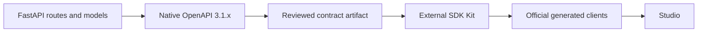

# HTTP contracts and generated clients

Use this guide when adding an API operation or connecting Studio to one. A **contract** tells a client what to send and what responses to expect. [Application structure](application-structure.md) explains who owns the behavior behind that contract.

Alice opens an upload's progress in Studio. The backend defines the progress operation, OpenAPI describes it, and the official generated client sends her request. Each part uses the same definition.

Start with how the contract is generated, then follow a change into Studio. The later sections cover identity, errors, retries, and release checks.

> **Design status:** These are accepted v1 rules. Shared HTTP foundations exist, but feature endpoints, clients, and integrations still need the implementation and verification identified below.

## Contents

| Reader’s question | Start here |
| --- | --- |
| Which source do I edit? | [1. From backend code to a public contract](#contract) |
| How does a change reach Studio? | [2. Publish and consume a change](#workflow) |
| Which requests need authentication? | [3. Separate documentation from product access](#authentication) |
| What must clients be able to handle? | [4. Make failure and retry behavior explicit](#failures) |
| What needs contract evidence? | [5. Maintainer checks](#maintainer-checks) |
| Why these choices, and what remains open? | [6. Decision and reference map](#decision-map) |

## 1. From backend code to a public contract

**OpenAPI** is the machine-readable description of the HTTP API. **Code-first** means that developers define the API in backend code and generate the OpenAPI document from it, rather than authoring the document separately.

Developers describe the API through FastAPI routes, Pydantic request and response models, shared response definitions, and explicit application metadata.

The responsibilities are distinct:

| Part | Responsibility |
| --- | --- |
| **FastAPI source** | The authoring authority: where developers define and change the API. |
| **Generated OpenAPI contract** | The client authority: what each operation means and how requests, responses, authentication, and errors are represented over HTTP. |
| **Committed JSON artifact** | The generated, reviewable contract included with a release. SDK generators and Studio consume it rather than defining parallel public models. |

The v1 generation and publication points are:

| Purpose | Command or location |
| --- | --- |
| Generate the runtime schema | `create_app().openapi()` |
| Store the generated artifact in Git | `contracts/openapi/v1/inframeld-v1.json` |
| Serve the schema from the running API | `/v1/openapi.json` |
| Regenerate the committed artifact | `pnpm openapi` |

Regenerate the JSON contract and clients when their source changes. Editing generated files by hand would hide the real source of the API definition.

Public fields use **lower camel case**. Each operation has a stable `operationId`, which identifies it to clients and generators. Schemas reuse shared components and declare their error responses explicitly.

CI compares the generated schema with the file committed in Git. A difference, called **contract drift**, fails the check. This check belongs to developing Inframeld itself. It does not release a customer's pipeline version.

## 2. Publish and consume a change

The arrows show how definitions become generated files, not runtime calls. Change the backend, regenerate its contract, review the public effect, and check that the files agree. Never patch JSON to disguise a mismatch.

SDK Kit lives outside this repository. Its extraction and suitability must be resolved before Studio implementation starts. Backend use cases and contract tests can proceed while that work remains open.

Studio must not work around this dependency with a handwritten application client. SDK Kit extraction, generator comparisons, replacements, and development need their own authorized work. The [historical SDK Kit report is unavailable](documentation-maintenance.md#missing-sdk-kit-review).

Python, Java, TypeScript, and Rust are intended SDK targets. Each needs contract and runtime tests in the external project before we describe it as supported. The TypeScript client must pass that verification before Studio starts.

Generating and releasing an SDK package is repository-development work. It is unrelated to promoting a customer's PipelineVersion.

### Preserve the user's identity in browser and server requests

Browser requests use the same-origin Kratos session and **CSRF protection**, which guards against cross-site request forgery. The browser client must never contain integration keys, model-provider keys, or infrastructure secrets.

When Next.js calls the backend on Alice's behalf, it forwards only her allowed, verified session context. Client configuration belongs to that request. A shared administrator key cannot stand in for Alice.

Kratos account screens use its maintained client and account-flow contract. Server rendering, caching, and redirects may adapt these requests to Next.js, but must not introduce a second implementation of the application API.

A shared browser client instance must not keep the previous user's session or response data after the user changes.

### MCP invokes the same application behavior

**MCP**, the Model Context Protocol, offers another way to call the existing application operations. It does not generate a second answer engine from OpenAPI.

MCP tool inputs and results are **DTOs**, values that carry data between the tool and application. They map to the same operations, permission checks, and answer receipts as HTTP. V1 tools cover querying and receipts, not release or publication-mode administration.

The detailed contracts are defined in [Using Inframeld through MCP](mcp.md) and [Understanding feedback on answers](answer-feedback.md).

## 3. Separate documentation from product access

Keep `/v1/openapi.json`, `/docs`, `/redoc`, and `/health` public, without tenant data, secrets, or internal operational details. All product operations under `/v1` require authentication. A public “Try it out” page does not make its product operations anonymous.

Kratos identifies humans. Inframeld's opaque application keys identify accounts whose current permissions determine what they may do. Studio and customer queries follow the same permission model. A query-only bot cannot build or release, and routing it to a canary version gives it no additional document access.

SupportBot calls a stable Deployment and supplies a routing-affinity key when required. It cannot choose an arbitrary version to serve its request. Automation needs explicit permissions for supported actions, but no external CI runner is required. Studio uses the official TypeScript SDK rather than a competing handwritten client or public model layer.

## 4. Make failure and retry behavior explicit

Errors use RFC 9457 `application/problem+json`: a stable type and code, a safe explanation, and a `requestId`. Domain and application code raise ordinary Python exceptions. Only reviewed exception mappings become public problems. The [error guide](error-handling.md) explains which exception to use and lists the problems. Its [maintainer reference](error-handling-reference.md) covers handlers, logging, and OpenAPI.

The [pagination reference](pagination.md) defines list parameters, cursor syntax, and response fields. Each feature chooses a stable ordering, checks what its cursor means, and checks current access on every page.

Clients need to distinguish several outcomes. The first successful query returns an answer, while recovery after a lost response returns its receipt. Accepted background work returns `202`, while a duplicate synchronous request still running can return a conflict. An external call whose result is unknown cannot be treated as safe to repeat. **Expected revisions** detect competing edits, while **idempotency keys** identify repeated requests. [Jobs and idempotency](jobs-and-idempotency.md) explains these cases.

MCP uses those same query and receipt outcomes through its [two tools](mcp.md#tools).

## 5. Maintainer checks

Contract tests must cover nullable fields, unions of types, numeric limits, uploads, typed errors, first-answer and retry variants, and asynchronous `202` jobs in native OpenAPI 3.1.x.

These backend checks proceed before Studio and SDK verification. CI also checks that the generated schema matches the committed contract.

### End-to-end product qualification

Before release, run the SupportBot journey inside Inframeld while a separate customer client keeps using its original endpoint. Demonstrate the following behavior:

| Area | What to demonstrate |
| --- | --- |
| **Browser recovery** | Closing and reopening Studio follows existing work without duplicating it. |
| **Immutable inputs** | Later edits do not change the inputs of an admitted build or run. |
| **Evaluation history** | Changed benchmark and evaluator identities are labeled, and partial judge failure is handled. |
| **Permissions** | Permission changes are respected, and a query-only integration cannot invoke release commands. |
| **Canary routing** | Affinity cohorts remain stable under the required integration contract. |
| **Release transitions** | Rejection before promotion and rollback after promotion behave correctly. Unavailable targets are handled. |
| **Concurrent operators** | Two operators racing cannot silently overwrite one another's release decisions. |
| **Evaluation versus release authority** | Passing a metric never triggers a Deployment pointer change. |

| Scenario | Expected outcome |
| --- | --- |
| A route or model changes | Regenerate the contract. Drift checks detect an outdated artifact. |
| A client cannot handle native nullable or union schemas | Resolve client compatibility. Do not relabel the schema as OpenAPI 3.0.3. |
| A public docs request succeeds | It reveals no tenant data, secrets, or internal operational details. |
| Studio makes a server-side request | It preserves the current user's context without a shared administrator key. |
| An answer response is lost | The documented retry returns the original receipt outcome, without another paid query. |

## 6. Decision and reference map

Client generation and runtime support still need verification in the external SDK project. The intended language targets and the Studio dependency above remain unchanged. The [missing SDK review](documentation-maintenance.md#missing-sdk-kit-review) supplies no current test evidence.

The shared error and pagination foundations are implemented. [Error qualification](error-handling-reference.md#qualification-checklist) distinguishes inspected source from developer-reported results. The broader scenarios above are requirements, not claims that all their feature tests exist.

| Decision | Rationale |
| --- | --- |
| [ADR-0003](../adr/ADR-0003-generate-the-authoritative-openapi-contract-from-backend-code.md) | Generate the authoritative OpenAPI contract from backend code. |
| [ADR-0004](../adr/ADR-0004-use-rfc-9457-problem-details-for-http-errors.md) | Use RFC 9457 Problem Details for HTTP errors. |
| [ADR-0005](../adr/ADR-0005-use-bounded-cursor-pagination-for-lists.md) | Use bounded cursor pagination for lists. |
| [ADR-0006](../adr/ADR-0006-use-official-generated-clients-for-application-api-access.md) | Use official generated clients for application API access. |
| [ADR-0007](../adr/ADR-0007-keep-api-documentation-public-and-product-operations-protected.md) | Keep API documentation public and product operations protected. |
| [ADR-0044](../adr/ADR-0044-provide-mcp-through-a-thin-adapter-in-the-existing-api-process.md) | Provide MCP through a thin adapter in the existing API process. |
