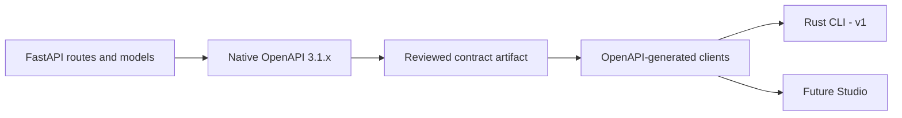

# HTTP contracts and generated clients

Use this guide when adding an API operation or connecting the CLI or future Studio to one. A **contract** tells a client what to send and what responses to expect. [Application structure](application-structure.md) explains who owns the behavior behind that contract.

Alice follows an upload with the CLI. The backend defines the progress operation, OpenAPI describes it, and the generated client sends her request. Each part uses the same definition. Full Studio is deferred; the small Ory browser account UI remains required for v1 human login.

Start with how the contract is generated, then follow a change into clients. The later sections cover identity, errors, retries, and release checks.

> **Design status:** These are accepted v1 rules. Shared HTTP foundations exist, but feature endpoints, clients, and integrations still need the implementation and verification identified below.

## Contents

| Reader’s question | Start here |
| --- | --- |
| Which source do I edit? | [1. From backend code to a public contract](#contract) |
| How does a change reach Studio? | [2. Publish and consume a change](#workflow) |
| Which requests need authentication? | [3. Separate documentation from product access](#authentication) |
| What must clients be able to handle? | [4. Make failure and retry behavior explicit](#failures) |
| Did the command succeed, or did the job finish? | [Automation outcome contract](#cli-automation-outcomes) |
| What needs contract evidence? | [5. Maintainer checks](#maintainer-checks) |
| Why these choices, and what remains open? | [6. Decision and reference map](#decision-map) |

<a id="contract"></a>

## 1. From backend code to a public contract

**OpenAPI** is the machine-readable description of the HTTP API. **Code-first** means that developers define the API in backend code and generate the OpenAPI document from it, rather than authoring the document separately.

Developers describe the API through FastAPI routes, Pydantic request and response models, shared response definitions, and explicit application metadata.

The responsibilities are distinct:

| Part | Responsibility |
| --- | --- |
| **FastAPI source** | The authoring authority: where developers define and change the API. |
| **Generated OpenAPI contract** | The client authority: what each operation means and how requests, responses, authentication, and errors are represented over HTTP. |
| **Committed JSON artifact** | The generated, reviewable contract included with a release. SDK generators and Studio consume it rather than defining parallel public models. |

The v1 generation and publication points are:

| Purpose | Command or location |
| --- | --- |
| Generate the runtime schema | `create_app().openapi()` |
| Store the generated artifact in Git | `contracts/openapi/v1/inframeld-v1.json` |
| Serve the schema from the running API | `/v1/openapi.json` |
| Regenerate the committed artifact | `pnpm openapi` |

Regenerate the JSON contract and clients when their source changes. Editing generated files by hand would hide the real source of the API definition.

Public fields use **lower camel case**. Each operation has a stable `operationId`, which identifies it to clients and generators. Schemas reuse shared components and declare their error responses explicitly.

CI compares the generated schema with the file committed in Git. A difference, called **contract drift**, fails the check. This check belongs to developing Inframeld itself. It does not release a customer's pipeline version.

<a id="workflow"></a>

## 2. Publish and consume a change


```mermaid
flowchart LR
    Backend[FastAPI routes and models] --> Schema[Native OpenAPI 3.1.x]
    Schema --> Artifact[Reviewed contract artifact]
    Artifact --> SDK[OpenAPI-generated clients]
    SDK --> CLI[Rust CLI - v1]
    SDK --> Studio[Future Studio]
```

The arrows show how definitions become generated files, not runtime calls. Change the backend, regenerate its contract, review the public effect, and check that the files agree. Never patch JSON to disguise a mismatch.

Use an OpenAPI generator without selecting its package in the architecture. Begin client qualification against implemented contract foundations, then extend it alongside feature delivery. Late upload/receipt operations do not block initial integration. Backend implementation proceeds independently; neither a separate generator project nor deferred Studio is a v1 prerequisite.

Keep generated transport types at the client boundary and thin application-owned presentation adapters above them. Do not write a competing application HTTP client or weaken native schema meaning to satisfy a generator. [ADR-0055](../adr/ADR-0055-deliver-cli-first-v1-through-openapi-generated-clients.md) owns this delivery choice.

Python, Java, TypeScript and Rust are possible client targets, not automatically supported releases. Qualify the Rust CLI's selected client and future Studio's generated TypeScript client against errors, authentication, nullable/union results, pagination and asynchronous/recovery outcomes before claiming support.

Generating and releasing an SDK package is repository-development work. It is unrelated to promoting a customer's PipelineVersion.

### Preserve the user's identity in browser and server requests

Browser requests use the same-origin Kratos session and **CSRF protection**, which guards against cross-site request forgery. The browser client must never contain integration keys, model-provider keys, or infrastructure secrets.

When Next.js calls the backend on Alice's behalf, it forwards only her allowed, verified session context. Client configuration belongs to that request. A shared administrator key cannot stand in for Alice.

Kratos account screens use its maintained client and account-flow contract. Server rendering, caching, and redirects may adapt these requests to Next.js, but must not introduce a second implementation of the application API.

A shared browser client instance must not keep the previous user's session or response data after the user changes.

### MCP invokes the same application behavior

**MCP**, the Model Context Protocol, offers another way to call the existing application operations. It does not generate a second answer engine from OpenAPI.

MCP tool inputs and results are **DTOs**, values that carry data between the tool and application. They map to the same operations, permission checks, and answer receipts as HTTP. V1 tools cover querying and receipts, not release or publication-mode administration.

The detailed contracts are defined in [Using Inframeld through MCP](mcp.md) and [Understanding feedback on answers](answer-feedback.md).

<a id="authentication"></a>

## 3. Separate documentation from product access

Keep `/v1/openapi.json`, `/docs`, `/redoc`, and `/health` public, without tenant data, secrets, or internal operational details. All product operations under `/v1` require authentication. A public “Try it out” page does not make its product operations anonymous.

Kratos identifies humans through browser sessions. The accepted human CLI path uses opaque Hydra access tokens with private introspection and current Kratos identity eligibility under [ADR-0053](../adr/ADR-0053-use-kratos-and-hydra-for-human-cli-authentication.md). Inframeld's own opaque application keys begin with `ifm_app_` and identify application accounts whose current permissions determine what they may do. Ory token formats stay unchanged. The public prefix selects a credential family, not an authenticated identity: full verification is mandatory, and failure cannot fall back to the human verifier.

A non-prefixed value is not thereby a valid human token. All paths use the same permission model. A query-only bot cannot build or release, and routing it to a canary version gives it no additional document access.

The existing `GET /v1/session` cookie/CSRF path is implemented; human CLI bearer support is accepted design, not an implemented extension inferred from that route. [Access credential dispatch](access-control.md#credential-dispatch) selects exactly one verifier: the Kratos cookie path, `ifm_app_` bearer application-key path or other bearer Hydra human path. Reject competing credentials, duplicate Authorization headers and malformed header syntax before provider I/O. Do not try unknown tokens against several providers, accept ID/refresh tokens at product endpoints or exempt cookie-authenticated writes from CSRF. Product operations needing a human must not accept an application principal instead.

<a id="session-contracts"></a>

### Preserve the human check and add a separate application check

The accepted #116 session contracts are:

| HTTP operation | OpenAPI operation ID | Supported credentials | Successful response |
| --- | --- | --- | --- |
| Existing `GET /v1/session` | Existing `getCurrentSession` | Kratos browser cookie; accepted extension to Hydra human bearer | Existing `principalId` |
| New design: `GET /v1/application-session` | `getCurrentApplicationSession` | Inframeld application-key bearer on its supported HTTP audience/adapter | Only `principalId` and bound `projectId` |

An application key at the human-session operation receives 401 for an unsupported credential family. The application check fully verifies the key, expiry/revocation, bindings and current account/principal/project state. It checks identity without calling a model or returning a permission/status snapshot. Both successful checks return HTTP 200 with `Cache-Control: no-store`, the normal `X-Request-ID` and UUID strings for their listed fields. Accepted configurable defaults are five seconds per provider call, ten seconds for the complete backend authentication check and fifteen seconds for the CLI session-check request. Each provider call is bounded by the remaining total budget. These starting limits are not measured guarantees. The [HTTP draft](access-contracts.md#http-operation-matrix) names the new `CurrentApplicationSessionResponse` and declarations for final review. Deadline implementation still needs qualification. [The session budget contract](access-contracts.md#session-checks) owns the details. The new operation is accepted design, not an implemented route or generated client symbol.

Protected operations use `Authorization: Bearer <credential>` for both incoming bearer families; the scheme is case-insensitive. Credentials are header-only apart from the supported Kratos cookie. Per-route family/audience restrictions remain explicit, and no verification failure falls back. Ordinary product operations authenticate supported credentials then apply principal-kind/action eligibility: a verified application at a human-only operation receives 403. Identity-specific session checks instead return 401 for unsupported families. Invitation activation alone admits a provider-verified, cookie/CSRF-protected recipient before local admission, under [current invitation checks](access-contracts.md#invitations). The concrete invitation preview uses the same verified cookie/CSRF boundary solely to show intended scope; it performs no admission or mutation. Every human bearer request repeats current provider/local checks. [Authentication outcomes](error-handling.md#authentication-contract) own the failure/challenge contract; [Access](access-control.md#application-key-contract) owns full key verification. Native OpenAPI must describe the actual supported paths when implemented, including competing-credential rejection that security alternatives alone cannot enforce.

Keep OpenAPI security declarations, generated clients and runtime enforcement aligned when those adapters are implemented. This documentation update changes no generated contract. Human OAuth tokens must name the API audience and official client/scope; application keys retain their separately defined audience and adapter restrictions. [MCP's preconfigured application-key profile](mcp.md#authentication) does not accept human CLI tokens or advertise OAuth discovery merely because Hydra is installed.

[CLI application-connection journey](https://github.com/matejpalenik/inframeld/issues/161) selects an optional access-first HTTP/MCP connection journey through ordinary account, grant and credential operations. Key issuance is explicit and one-time, and a paid live test is separate. Use the accepted application-session check once specified and implemented; the CLI must not invent additional health/permission endpoints, SDK methods or wire schemas to illustrate the journey.

SupportBot calls a stable Deployment and supplies a routing-affinity key when required. It cannot choose an arbitrary version to serve its request. Automation needs explicit permissions for supported actions, but no external CI runner is required. Studio uses the official TypeScript SDK rather than a competing handwritten client or public model layer.

<a id="failures"></a>

## 4. Make failure and retry behavior explicit

Errors use RFC 9457 `application/problem+json`: a stable type and code, a safe explanation, and a `requestId`. Domain and application code raise ordinary Python exceptions. Only reviewed exception mappings become public problems. The [error guide](error-handling.md) explains which exception to use and lists the problems. Its [maintainer reference](error-handling-reference.md) covers handlers, logging, and OpenAPI.

The [pagination reference](pagination.md) defines list parameters, cursor syntax, and response fields. Each feature chooses a stable ordering, checks what its cursor means, and checks current access on every page.

Clients need to distinguish several outcomes. The first successful query returns an answer, while recovery after a lost response returns its receipt. Accepted background work returns `202`, while a duplicate synchronous request still running can return a conflict. An external call whose result is unknown cannot be treated as safe to repeat. **Expected revisions** detect competing edits, while **idempotency keys** identify repeated requests. [Jobs and idempotency](jobs-and-idempotency.md) explains these cases.

MCP uses those same query and receipt outcomes through its [two tools](mcp.md#tools).

### Expose shared connection administration through one application operation

Provide capabilities to inspect current access/history and permitted usage, review a proposed change, conditionally update it and propose restoration. [Model connections](model-connections.md#shared-current) owns their behavior. CLI flags, future UI and explicit configuration imports must invoke the same backend checks; a client-side confirmation is not authority. Connection management includes shared live impact, while Pipeline Edit and model use do not.

Logical update inputs identify the connection, expected current revisions, complete proposed supported settings and acknowledgment of the reviewed live impact. Destination-changing credentials use protected write-only input. Outputs distinguish unchanged, committed, rejected, stale review and uncertain response/recovered outcome, with safe current/result revision metadata. Incompatible or unproven embedding dependencies reject before mutation. Do not invent new endpoint paths, problem codes, permission IDs, physical tables or vendor-typed request bags in this documentation.

Pipeline/profile/evaluator definitions select stable connection IDs, not executable historical access revisions. Execution results expose actual safe revision observations and interrupted-work attribution through their owning contracts. Snapshot/history inspection must not become a way to dispatch against retired access settings or recover secrets. Specify exact wire mappings and tests when implementing the capabilities; this change generates no contract and adds no MCP tools.

### Keep evaluation contracts application-owned

For example, the CLI accepts one generated case revision, then separately requests an evaluation of a frozen benchmark. These are distinct application operations; accepting a draft must not start paid evaluation. [Evaluation](evaluation.md) defines generation, revision-specific review, benchmark freezing, durable execution, and current-access history inspection for every client, including a future Studio view.

Contracts must expose immutable revision identities, review states, explicit model connection references, per-metric definitions/statuses/denominators, partial outcomes, and recoverable job identity. Evaluation input distinguishes a ready PipelineVersion from a frozen execution-input snapshot, rather than requiring a release build or accepting mutable latest inputs. They must distinguish passage misses from unavailable source mappings and judge failures from low faithfulness. Do not expose Ragas configuration objects, provider credentials, or vendor result types as public application models. Do not reinterpret historical metric definitions.

Exact routes/request schemas and case-audience administration remain implementation design work; the [six exact-Pipeline use identifiers](access-control.md#reviewed-capability-catalogue) are accepted. CLI mockups are not implemented endpoints or permission names. This documentation change generates no contract artifact and adds no MCP tools. Future contract tests must cover these product behaviors through ordinary HTTP/application boundaries, without duplicating evaluation logic in clients.

<a id="expose-preview-and-policy-controlled-build-without-duplicating-execution"></a>

### Expose Pipeline queries and policy-controlled Build without duplicating execution

The [query-to-release lifecycle](pipelines-and-releases.md#working-configuration) requires protected application operations for working configuration read/edit/history/restore, direct-query preparation/execution, working-configuration evaluation and Build admission. A direct Pipeline query API operation is not an additional live Deployment or service. Ordinary live-query routing and the two existing MCP tools stay unchanged; no Pipeline Query access is added to a customer query through an unchecked override.

**Query on a Pipeline** runs its working configuration. **Query on a Deployment** uses that Deployment's ready-version serving path. These are separate permissions on exact resources, not an Execute experiments operation.

Humans and applications may receive either permission. Both still need current source and model access, an active account and sufficient budget. A credential with permission only on a Deployment cannot query the Pipeline directly. An application explicitly granted Pipeline Query can use the supported HTTP or CLI path.

Inspecting query traces requires `inspect-query-traces` on the exact Pipeline or Deployment, separately from `query`. None of these capabilities adds to MCP's two existing tools. The [reviewed Access catalogue](access-control.md#reviewed-capability-catalogue) selects these identifiers/targets; the [Pipeline](https://github.com/matejpalenik/inframeld/issues/128) and [tracing](https://github.com/matejpalenik/inframeld/issues/147) tickets retain their wire-representation work.

Inputs identify the selected Pipeline, expected saved revision, explicit permitted temporary overrides, exact source selection and ordinary operation context. Snapshots/results expose whether execution was a direct Pipeline query, evaluation or Deployment query, with exact effective-input identity, readiness, usage, safe failure and operation/job references. Build accepts the current saved Pipeline configuration and resolved corpus, not a run ID or a hidden copy of temporary overrides. Its public workflow selects a Deployment and captures publication policy/authority, while invoking readiness-only preparation and separate Releases operations internally.

That current-working input rule describes the explicit CLI Build workflow, not the common readiness-only operation. Automatic document-update admission supplies its Deployment-selected saved configuration and exact corpus to that same operation. Its contract must accept the authorized captured input without re-resolving the mutable working pointer. The Build specification gate records both callers and their distinct selection authority.

### Expose policy administration and feedback through their owners

Enforcing a spending limit and changing that limit are different capabilities. Setup, CLI management and configuration import must all use the same guarded application operation for policy changes.

Authorized humans and applications may inspect permitted budget information. Only an active human with explicit project-budget permission may set, raise, lower or remove the project limit. Permission to use a model or import configuration is not enough. Confirmation flags cannot change who is eligible.

For example, SupportBot may import Pipeline settings while preserving the destination limit. If it asks to apply a different limit, reject that request rather than silently skip it. A permitted policy change preserves accounting history and operation limits. Check current authority and the reviewed revision, and save the required audit record. [Budget management](model-connections.md#budget-policy-authority) owns these rules. The [Access catalogue](access-control.md#reviewed-capability-catalogue) selects Project `inspect-budget` and human-only `manage-budget`; [#121](https://github.com/matejpalenik/inframeld/issues/121) retains the accounting/policy wire schemas.

Trace inspection, trace-policy changes and deletion are also separate capabilities:

- Humans and applications may inspect pipeline traces with explicit inspection permission and current source access. Query permission alone is insufficient.
- Only an authorized human may change a project's tracing or retention settings.
- Explicit deletion of past traces needs a separate human deletion permission.

[Trace authority](observability.md#trace-authority) owns these transitions. The [Access](https://github.com/matejpalenik/inframeld/issues/116) and [tracing](https://github.com/matejpalenik/inframeld/issues/147) contracts must represent the three outcomes separately, not invent one all-powerful tracing-admin permission.

An application import can preserve destination policy. If it explicitly requests a change it cannot perform, reject the known-invalid plan before changing resources. Neither import permission nor the worker's service identity supplies the initiating caller's missing permission. Normal expiry and source erasure remain backend cleanup and need no fresh human login per record. These requirements define no new MCP tools, routes, wire identifiers or generated schemas.

[CLI feedback capability](https://github.com/matejpalenik/inframeld/issues/191) adds CLI feedback delivery, not new feedback semantics: use existing own-answer read/write contracts and the authorized reporting projection. Report counts, eligible-receipt coverage and comments with current filtering; keep own-rating authority separate from project-wide inspection. Direct Pipeline querying is not a live receipt. No new MCP tool follows from these CLI capabilities.

Suspension/restoration contracts distinguish the immediate Access block, independent identity-provider cleanup and deliberate restoration. Privileged scoped operator recovery is a separate host-maintenance boundary, not a normal bearer-token API bypass. Concrete action mappings and additional request/result schemas belong to the named specification prerequisites in the [delivery plan](cli-delivery-plan.md). This guide does not invent wire identifiers or claim generated contracts have changed.

Return preparation and publication outcomes separately. A ready-but-unpublished version is not a failed build or successful deployment. An absent/ambiguous/unauthorized target and a changed reviewed revision cannot trigger fallback to another target, fan-out, or a blind retry with newer state. Repeated requests find their original captured inputs and target before resolving current configuration again. No endpoint paths, new HTTP error codes, physical tables or wire types are mandated by these logical capabilities; specify and test those contracts before implementation.

### Keep CLI and portability contracts explicit

[The Access contract reference](access-contracts.md) records accepted identifiers, exact targets/principal eligibility, fixed creator assignments, human-only resource provisioning, invitations and semantic operation inputs/results/revisions. Every protected operation must declare credential families. Preserve existing session route/operation/schema names; eligible application updates use their own context, while creation and other human-only operations reject application principals. The reference also captures [new bounded Access mutations](access-contracts.md#mutation-profile), [grant management](access-contracts.md#grant-management), key replay and private recovery/maintenance inputs. These contracts are accepted design, not implemented DTOs or generated JSON/OpenAPI schemas. The [complete Access HTTP draft](access-contracts.md#http-operation-matrix) now gives the new operation/schema matrix. [Maintenance](access-contracts.md#maintenance-wire) and [private recovery](access-contracts.md#recovery-wire) give the proof/evidence handoff for final written-contract review under #116. Downstream owners retain full domain schemas and runtime qualification.

Every CLI workflow must support automation. Ordinary JSON mode returns one final, versioned result. JSONL streaming must be explicitly selected. Human progress goes to stderr, commands use the documented exit codes, and scripts encounter no surprise prompts.

The command result is distinct from the job or resource state. Preserve the meaning of backend Problem Details, while clearly identifying validation errors that occurred locally in the CLI. Do not create a competing HTTP error wrapper. Secrets and downloadable artifacts use separate channels.

Every command, including reads, supports a descriptive dry-run without performing the requested operation. A dry-run reserves nothing and does not guarantee that execution will still be authorized later.

Use plain wording without hiding information. Show confirmed progress, saved results, counts and denominators. Include a bounded list of cases needing attention, with ordinary inspection for full detail. [Jobs](jobs-and-idempotency.md#progress-presentation) owns cancellation and recovery. [Evaluation](evaluation.md#result-presentation) owns answer, score and case-result details. JSON exposes the same permitted facts through fields, not text scraped from the screen.

Keep these distinctions visible:

- Unknown progress is not zero progress.
- Acknowledging a cancellation request is not confirming cancellation.
- Successfully reading a job does not mean the job succeeded.
- Losing contact with the backend is different from not knowing whether a provider completed a paid call.

Do not reconstruct missing results or repeat model calls to populate a screen. No generic tracking schema is needed. The [job](https://github.com/matejpalenik/inframeld/issues/124), [Evaluation](https://github.com/matejpalenik/inframeld/issues/140) and [automation](https://github.com/matejpalenik/inframeld/issues/156) contracts must define typed outcomes and bounded reads before generated clients consume them. Mock counts and commands do not publish fields or endpoints.

Configuration portability adds offline TOML validation, coherent authorized exports, destination-aware read-only review and durable application-owned imports. [Its guide](configuration-portability.md) defines scope and effects; exact schemas/defaults/equivalence and resource permissions are explicit prerequisites. Evaluation owns optional protected JSONL dataset transfer. No generated client or Rust command may invent missing wire fields, permission identifiers or a client-side bypass of domain guards.

The [delivery plan](cli-delivery-plan.md) separates common client/output contracts, Access dispatch/capabilities, model metadata, direct-query admission, Evaluation proof, tracing and portability specification from implementation. Adapters translate reviewed application contracts, not terminal mockup text. None of these additions broadens the two-tool MCP surface.

<a id="cli-context"></a>

### Resolve target, account and project without changing identity

Alice has local selected, with `admin` selected on local and `alice` selected on dev. Running `pipeline list --target dev` uses dev/Alice and that pair's saved project. It does not send local/Admin credentials to dev, select dev for tomorrow or copy any data. A target is an installation connection, not a Pipeline Deployment.

The CLI stores one global target preference, one account preference per target and one project UUID per target/account pair. Account aliases identify locally saved human bindings, not server directory entries, application accounts, email-based identities or impersonation rights. Credentials live separately in the OS store. Account aliases for the same principal in one target must not create independent rotating-token copies.

| Scope | Explicit input | Environment | Saved fallback |
| --- | --- | --- | --- |
| Target | `--target` | `INFRAMELD_TARGET` | Globally selected registered target |
| Human account | `--account` | `INFRAMELD_ACCOUNT` | Selected account within the effective target |
| Project | Exactly one of `--project` or `--project-id` | Exactly one of `INFRAMELD_PROJECT` or `INFRAMELD_PROJECT_ID` | Project UUID within the effective target/account pair |

These are accepted selector names; precise validation/output schemas remain #156 deliverables. Resolve target, then account, validate its credential binding, then resolve any required project under normal current access. Freeze the resulting installation/principal/project identity for admission, polling and retries. Refresh may replace credentials for that same identity, never substitute another account.

For projects, select a whole precedence level rather than merging name and ID independently. Both explicit forms are a usage error even if they resolve to the same project. With no explicit form, both environment forms are a usage error. Either explicit form ignores **both** environment forms, including an invalid value or conflict between them. Validate an effective blank/invalid selector as an error; do not fall back. Ignored lower-priority invalid values cannot block a valid explicit choice. Only read context variables relevant to the operation.

`INFRAMELD_TARGET` names an already registered target, not a URL or transport exception. `INFRAMELD_ACCOUNT` resolves only within that target. `INFRAMELD_PROJECT` is an exact Name, never a Display name/fuzzy search. IDs retain installation, existence and access checks. Unknown, inaccessible, logged-out or revoked context never selects another resource automatically, even when only one alternative exists. Ordinary commands give actionable errors; interactive setup may ask for explicit selections.

| Proposed command | Persisted effect |
| --- | --- |
| `inframeld target use dev` | Only the global target preference |
| `inframeld account use alice --target dev` | Only dev's selected-account preference |
| `inframeld project use legal-research --target dev --account alice` | Only dev/Alice's selected project UUID, after authorized resolution |
| `inframeld pipeline list --target dev --account alice --project legal-research` | None |
| `inframeld login --target dev --account alice` | Establish/renew that bound login, not context preferences |
| `inframeld logout --target dev --account alice` | Revoke/remove that login's credentials; retain preferences and other logins |

Target/account selection is local preference management: it does not need a reachable backend or credential refresh merely to save a known selection. Selecting a logged-out account is valid but must report login required. Unknown selectors fail without changing preferences. Project selection resolves current access before saving; a failure preserves the old preference. Selection never creates membership, grants or a second local runtime.

An explicit positional value in `use` is the selection being saved; reject competing explicit selectors. Upper scopes still use normal precedence. Saving a preference never edits shell variables/profiles. When an environment variable continues to override a saved choice, say so:

```text
$ inframeld target use local
Saved target: local
This shell still uses dev through INFRAMELD_TARGET.
Unset INFRAMELD_TARGET or pass --target local.
```

This is a proposed, unimplemented screen with mock names. `status` and relevant `diagnose` output expose safe effective context and its source: explicit input, the named supported variable or the scoped saved preference. Sanitize terminal control characters. Do not dump environment/store contents or present cached labels as freshly verified permissions.

Do not read `.env`, search parent directories for context files, install shell hooks or implicitly create a repository configuration file. Changing working directory alone never changes target. These four variables contain no passwords, incoming keys, human tokens or provider secrets; deployment-container environment settings are a different surface. `local start/stop/status/diagnose` always concerns the one managed runtime, regardless of product context. Factory reset has its explicit whole-CLI scope, not an environment-selected remote deletion scope.

When login has no effective account, interactive login may ask for an alias before authentication. New aliases require verified identity/admission and visible confirmation; an existing alias cannot silently be rebound. Ordinary commands do not create aliases. Setup may compose login and remembering context only with visible agreement about each changed preference. A saved login is not proof of current server permission.

Required #159/#187 acceptance cases include every precedence combination, both project-form conflicts, explicit overrides of invalid lower-priority values, blank effective selectors, per-target/per-account defaults, wrong-target aliases rejected before credential disclosure, logged-out selection, failed project resolution preserving the previous ID, environment-overridden saves, no directory discovery, and context changes during admitted work. Use both human and JSON/noninteractive output. These are future tests, not evidence that the client exists.

<a id="target-discovery"></a>

### Register a target from one public server URL

Alice receives `https://api.dev.example.com` from her operator. The proposed command `inframeld target add dev --url https://api.dev.example.com` saves a validated connection, not authentication, a project selection or a working RAG pipeline. `dev` is only a local label. The operator configures API identity, Hydra issuer, official client and API audience; Alice should not reconstruct those settings manually.

1. Validate the explicit canonical public API URL and require verified HTTPS. A Studio page, arbitrary API route, model endpoint or private administrator URL is not the input. The managed local target instead obtains its settings from verified runtime state.
2. Read RFC 9728 resource metadata using the standard path derivation without any saved credentials, cookies, project selections or model/document data. Require the returned `resource` to match the supplied identity under the standard's comparison rules; preserve URL path meaning.
3. Obtain the configured Hydra issuer from validated `authorization_servers`. Reject ambiguous or unsupported metadata rather than selecting an unrelated issuer. The canonical API URL is this profile's token audience; public metadata is not authorization.
4. Validate the issuer's standard metadata with a maintained OAuth/OIDC library and exact issuer matching. Qualify the supported discovery path algorithm instead of mixing OAuth/OIDC variants through ad hoc URL concatenation. Keep the fixed `inframeld-cli`, scope, PKCE and audience contract; discovery cannot enlarge it.
5. Save the non-secret target identity and API/issuer/client/audience binding only after all validation succeeds. Preserve prior targets, credentials and selections. A repeated label cannot overwrite an established identity or borrow old credentials merely because a URL matches.
6. Report registration separately. Interactive continuation may offer browser sign-in and project selection, each with its own completed/partial outcome. Noninteractive `--no-input --json` registers only the target and returns without prompts or browser launch.

Bound time, response size and parsing. Metadata/redirect destinations remain untrusted inputs requiring the specified destination policy. Reject HTTPS downgrade, mismatches and private administration exposure; qualify redirects, DNS/proxy behavior and legitimate private/VPN deployments together. A public-cloud-only shortcut must not exclude supported private installations. Exact URL rules, metadata cache policy and bounds remain #118/#156 contracts, not permission to accept arbitrary network destinations.

Later metadata changes and authentication errors cannot silently replace a saved binding. Explicit reviewed reconfiguration invalidates affected logins and coordinates with pending login/refresh. Ordinary standard signing-key rotation is not a new issuer/audience and does not justify inventing permanent key pinning. No existing credential is sent to discover a proposed replacement.

Missing metadata, unavailable service, invalid certificate, resource/issuer mismatch and unsupported protocol configuration need distinct safe explanations. They are not password errors. Cancellation before saving leaves no target; cancellation after a committed save reports that fact rather than rollback. A later login failure leaves the target; a later project-list failure leaves the saved login. No failure implicitly runs setup, copies data, publishes or calls a model. Project remembering still rechecks current access. Preference-persistence failures report confirmed versus incomplete effects without undoing unrelated concurrent choices.

Qualification covers malformed/oversized metadata, path comparisons, missing metadata on older installations, hostile redirects, public metadata without secrets, private-network operation, concurrent target/login changes, cancellation around persistence and noninteractive refusal to prompt. The discovery profile is first-party CLI only; it does not expand MCP OAuth or third-party client onboarding. Registration's successful validation is not proof that the subsequent OAuth login will succeed.

<a id="cli-automation-outcomes"></a>

### Separate command success from background-work success

CI starts an import without waiting. The backend accepts and saves the work, so that command succeeds. Later, CI reads the job and learns that a Pipeline update failed after two resources were created. The read also succeeded, but the import did not complete. A command waiting for the complete import must report non-success.

The [CLI automation outcome contract](https://github.com/matejpalenik/inframeld/issues/156) must represent these differences using the existing backend status system.

For each invocation, distinguish **what the caller requested**, **the command's outcome**, **confirmed backend state/effects** and **what is safe to do next**. An exit code answers the first two, not every business question inside the result. Inspecting a failed job is useful successful work; waiting for that same failed workflow is not successful completion.

| Requested action and confirmed observation | Ordinary exit result | Facts and safe next action |
| --- | --- | --- |
| Admit work with `--no-wait`; durable admission and required local transfer are confirmed | `0` | Return known original job/operation identity. Admission is not completion, current progress or publication. Read/watch separately if needed. |
| Inspect an existing failed job successfully | `0` | Return its actual failed state and permitted saved/unfinished results. Inspection neither retries nor rewrites that state. |
| Wait for the requested workflow; it fails or only partly completes | `1` | Preserve completed effects, unfinished/failed/uncertain work and owner-supplied reasons. Inspect original work; resume only when the backend establishes eligibility. |
| Submission may have reached the server, but admission cannot be confirmed | `1` | Report uncertainty and only actually known recovery information. Find the original admission before repetition; do not fabricate a job ID or a no-effect claim. |
| Required invocation inputs are missing or incompatible | `2` | Return a safe usage explanation without starting the requested work or prompting under `--no-input`. Generic confirmation cannot supply missing values or authority. |
| A wait expires before completion is known | `1` | Report last confirmed state and original identity. Wait expiry does not request cancellation or prove the backend stopped. |
| A descriptive dry-run completes | `0` | Success of the explanation only; report checks performed, intended effects and unknowns. No execution, readiness, future permission or consent is established. |

These are the ordinary `0`/`1`/`2` meanings. They do not assign signal codes or provide every domain-specific mapping. A valid answer that abstains can succeed. A tracing-only warning does not fail an otherwise successful query, but a separate trace-read command must report when its own request is denied or unavailable. Likewise, a ready build and a failed publication are separate facts. The [automation contract](https://github.com/matejpalenik/inframeld/issues/156) must map every command variant before implementation.

#### Use one predictable machine channel

Ordinary `--json` emits one final versioned object on stdout, including controlled failures. Human diagnostics/progress go to stderr, not into that object stream. Do not emit a preliminary admission object followed by a second final object in the same ordinary invocation. Explicit JSONL streaming has separately specified framing, event order and completion semantics; `watch` alone cannot silently change framing.

Report a lost server response as a controlled uncertain outcome when the process and stdout remain usable. A killed process or broken stdout may leave no complete final object, so automation must handle incomplete output rather than interpret silence as success or no effects.

The following is **illustrative mock JSON, not a published schema**. The command successfully inspected a failed job:

```json
{
  "schemaVersion": 1,
  "outcome": "succeeded",
  "data": {
    "jobId": "job_import_42",
    "state": "failed"
  },
  "error": null
}
```

Scripts consume reviewed machine fields rather than parsing human copy, colors or raw vendor responses. Preserve backend Problem Details meaning and distinguish CLI-local errors without fabricating an HTTP status or server request ID. Keep secrets/show-once delivery and TOML/dataset artifacts out of ordinary result payloads; reject conflicting stdout consumers before execution. Current authorization applies to identifiers, counts, context and detail as well as effects. The final fields, error vocabulary, optionality, schema evolution and platform signal handling remain #156 deliverables, not fields selected by these mockups.

#### Keep automation and dry-run within ordinary authority

No prompts, implicit login or fallback identity may repair missing input/authority in a noninteractive invocation. Every required choice has an explicit supported input, but `--yes` is neither a value nor a grant. Preserve explicit target/account/project precedence and one-shot overrides without changing saved selections. Current domain checks still govern each operation, even when a script or agent invokes it.

Dry-run describes the supplied command without performing its requested operation, including when that operation is a read. It may make only the necessary, bounded metadata reads that the caller is normally allowed to make. Those reads can refresh credentials for the same identity and produce backend request logs. Do not promise zero network activity or infrastructure writes.

Dry-run cannot fetch the requested list pages, run diagnostics, call models, admit or resume jobs, reserve spending, issue credentials, create recovery state for the proposed change or perform local lifecycle changes. Report checks that could not be completed rather than inventing success. Removing the flag still requires the normal inputs, consent, permissions and reviewed-state checks.

[Original-operation recovery](jobs-and-idempotency.md#automation-recovery) preserves the same context, inputs and request identity. A nonzero exit or recoverable error label is not permission to generate a new idempotency key, rerun uncertain paid work or accept a newer revision. The CLI translates ordinary backend capabilities rather than implementing another workflow engine.

The [clig.dev basics](https://clig.dev/#the-basics), [output](https://clig.dev/#output) and [interactivity](https://clig.dev/#interactivity) guidance support structured output, stream separation and explicit noninteractive inputs. Inframeld's envelope, universal descriptive dry-run and exact outcome meanings remain product decisions, not clig.dev certification or tested guarantees. #156 specifies, #158 implements shared behavior, #175 presents durable work and #187 qualifies it with actual exit/output/state/call evidence.

<a id="cli-dry-run"></a>

### Explain an invocation without performing its operation

Every command supports descriptive `--dry-run`, including reads. Help describes a command generally; dry-run describes these supplied inputs and effective context. `pipeline list --dry-run` describes the scope/page without fetching that page. A query plan does not infer; Build explains preparation/publication policy without creating a job/version or release authority; diagnose explains its check set without running the diagnostic suite. Local commands explain rather than change settings or runtime state.

Necessary bounded, normally authorized metadata reads are permitted. They can involve same-identity credential refresh and backend request logging, so do not promise zero network activity or literally zero infrastructure writes. Never start interactive login. Label verified observations, cached information and unknowns separately, and state which metadata checks actually ran.

Dry-run never uploads, performs hosted or local inference, sends synthetic provider tests, creates jobs/reservations, issues credentials, invites users, starts/stops services, backs up/resets data, prepares indexes, builds or publishes. Same-identity refresh is a narrow metadata-access exception, not permission to execute a requested login/issuance command. Inspect local input only within explicit scope and bounds, without an undisclosed filesystem scan or protected-content/secret disclosure.

Explain known destinations, outgoing data categories, charges, effects and unresolved choices. Invalid inputs still fail; inaccessible metadata cannot appear in a plan. Noninteractive missing input is an error, not a guessed selection. JSON carries equivalent safe meaning. Reuse normal parsing/context and backend metadata capabilities rather than duplicating release/access/accounting policy in a second CLI planning engine.

Removing the flag does not approve execution or reserve the reviewed state. Actual admission still needs consent, current authority, budget and revision guards. A later configuration or policy change conflicts normally. #156 specifies response schemas, metadata bounds, secret/stdin handling and coverage; no generic planning service or new public endpoint is selected.

<a id="cli-list-contract"></a>

### Return one bounded page unless traversal is explicit

For example, `pipeline list --search contracts --limit 3` returns up to three visible matching resources, not all results or the first three rows before local filtering. Ordinary lists use the existing pagination contract: default 25, limit 1-100 and an opaque continuation cursor. Human and JSON output use identical filtering/page semantics. Piping output or choosing JSON does not fetch every page.

The backend applies supported filters and current access before pagination. `--search` covers the resource's supported Name/Display name matching, not document-body/semantic search or a model call. Search results do not turn Display names into exact selectors. Each owner specifies matching and stable order with a unique tie-breaker; no generic search engine is introduced.

Show how many items were returned and whether more exist. Show totals only when an authorized authoritative count exists. A continuation example preserves effective context, filters/order and uses safe shell quoting for the actual cursor. The CLI neither decodes nor logs raw cursor values. Cursors contain no secrets, grant no authority and must be validated against endpoint/filter/scope. Changed filters begin a new traversal; malformed/expired/incompatible cursors fail rather than becoming an empty success.

`--all` explicitly follows matching pages within declared resource/time bounds; `--limit` remains per-page size. Freeze context and query inputs for traversal and check current backend authority for every page. This is not a snapshot transaction, bulk mutation or request for hidden/archived data. Concurrent changes can affect later pages under the owning contract.

Permission loss, failed requests or reaching a traversal bound produce an incomplete nonzero outcome, retaining parseable permitted partial/completion information. Never silently truncate while claiming all, treat transport denial as an empty list or concatenate undocumented JSON page objects. Default JSON retains `items`/`nextCursor` meaning with null at the end; exact aggregate/stream schema and bounds remain #156 work. Dry-run describes traversal without fetching requested pages.

Qualification includes empty results, ties, page-boundary filtering, rename/deletion, invalid cursors, changed permissions, interrupted traversal, JSON/human parity, bounded memory/time and no model calls. This acceptance contract does not claim every list endpoint exists.

<a id="cli-change-presentation"></a>

### Present changes as labelled before-and-after values

Alice reviews configuration 17, but the current saved configuration is now 18. A small aligned row, `Configuration  17 -> 18`, is easier to scan than a paragraph. Its heading must say **Reviewed / Now**, because Alice's command did not make that change. The [structured change presentation contract](https://github.com/matejpalenik/inframeld/issues/158) selects this shared CLI presentation for supported change reviews and observed changes; it is not a new diff service or data framework.

Use a field label, the old value, an arrow and the new value. In a capable interactive terminal, render the old value red with strikethrough and the new value green. Green means **new**, not better, approved, safe or successfully applied. Keep unchanged values neutral and identify them as unchanged when their stability matters. A ready version that has not been published cannot appear as a completed live-version delta.

| What the view describes | Column labels | Meaning |
| --- | --- | --- |
| Proposed mutation, including a dry-run | **Current / Proposed** | No change has been applied by this view. |
| Confirmed change | **Before / Now** | The named state actually changed; only claim effects the backend confirmed. |
| Stale decision compared with current state | **Reviewed / Now** | The reviewed state is no longer current; fresh review is required. |

The column labels and field identity carry the meaning without styling. For example, a saved configuration changing from 17 to 18 does not change an already admitted build's captured configuration 17. Show that build input separately and neutrally. [Pipeline change examples](pipelines-and-releases.md#change-review) apply this distinction to edits, Build and publication.

- Use the same visual convention across configuration, model-connection, import, policy and release change views where their owning contracts provide authorized old/new facts. Do not create one-off renderers with competing meanings or add new backend history solely to show a delta.
- Respect `NO_COLOR`, `--no-color`, `TERM=dumb` and non-terminal output. Omit unsupported styling and use a plain `->` with explicit labels when needed. Never depend on color or strikethrough alone. JSON has no presentation ANSI codes or decorative arrows; preserve the same permitted values and proposed/observed meaning under the reviewed machine contract.
- Show the affected resource and change scope. Keep version identity, configuration revision and release mode distinct. Display only actually known values; unavailable old state is not an empty value, zero or evidence that nothing changed.
- Wrap or stack long rows in narrow terminals while keeping labels attached to their values. For long text or many changes, use bounded detail/ordinary inspection rather than silently hiding a material difference. This does not add another editor or a new storage system.
- Exclude secret values from both sides and from JSON, logs and artifacts. Retain current authorization and erasure for other protected content. Render untrusted text safely; input control characters cannot insert styling or impersonate a confirmation. Showing a difference is neither authorization nor consent to apply it.

#156 specifies the exact mappings, terminal fallbacks and machine representation; #158 implements the shared presentation; feature commands consume it and #187 qualifies it. No field names, new API endpoints, physical records, automatic polling subsystem or additional permission is selected here. This pass documents accepted design, not tested terminal compatibility. [clig.dev](https://clig.dev/#output) supplies the output/color guidance; the specific red-strikethrough/green convention is Inframeld's accepted choice.

<a id="maintainer-checks"></a>

## 5. Maintainer checks

Contract tests must cover nullable fields, unions of types, numeric limits, uploads, typed errors, first-answer and retry variants, and asynchronous `202` jobs in native OpenAPI 3.1.x.

These backend checks proceed before Studio and SDK verification. CI also checks that the generated schema matches the committed contract.

### End-to-end product qualification

Before release, run the SupportBot journey inside Inframeld while a separate customer client keeps using its original endpoint. Demonstrate the following behavior:

| Area | What to demonstrate |
| --- | --- |
| **CLI and account recovery** | Closing and reopening the CLI follows existing work without duplication; canceled/expired browser login and recovery remain safe. Studio recovery is deferred with Studio. |
| **Immutable inputs** | Later edits do not change the inputs of an admitted build or run. |
| **Pre-build querying** | Direct Pipeline queries and evaluation execute fixed captured working-configuration inputs with verified dependencies, without creating a release version, production feedback or publication authority. |
| **Policy-controlled Build** | Capture saved configuration and the reviewed target/mode once; distinguish ready output from publication, and reject ambiguous selection or changed consent. |
| **Evaluation history** | Changed benchmark and evaluator identities are labeled, and partial judge failure is handled. |
| **Permissions** | Permission changes are respected. Deployment-only Query cannot invoke a direct Pipeline query; an application with explicit Query on that Pipeline may do so. Neither Query grant implies trace inspection, Build or release authority. |
| **Canary routing** | Affinity cohorts remain stable under the required integration contract. |
| **Release transitions** | Rejection before promotion and rollback after promotion behave correctly. Unavailable targets are handled. |
| **Concurrent operators** | Two operators racing cannot silently overwrite one another's release decisions. |
| **Evaluation versus release authority** | Passing a metric never triggers a Deployment pointer change. |

| Scenario | Expected outcome |
| --- | --- |
| A route or model changes | Regenerate the contract. Drift checks detect an outdated artifact. |
| A client cannot handle native nullable or union schemas | Resolve client compatibility. Do not relabel the schema as OpenAPI 3.0.3. |
| A public docs request succeeds | It reveals no tenant data, secrets, or internal operational details. |
| Studio makes a server-side request | It preserves the current user's context without a shared administrator key. |
| An answer response is lost | The documented retry returns the original receipt outcome, without another paid query. |

<a id="decision-map"></a>

## 6. Decision and reference map

Client generation and runtime support need verification against the current contract. The [delivery plan](cli-delivery-plan.md) assigns incremental generated-client qualification, CLI journeys and the independent Ory account UI; deferred Studio is not a release blocker. Historical tooling reviews supply no current interoperability evidence.

The shared error and pagination foundations are implemented. [Error qualification](error-handling-reference.md#qualification-checklist) distinguishes inspected source from developer-reported results. The broader scenarios above are requirements, not claims that all their feature tests exist.

| Decision | Rationale |
| --- | --- |
| [ADR-0003](../adr/ADR-0003-generate-the-authoritative-openapi-contract-from-backend-code.md) | Generate the authoritative OpenAPI contract from backend code. |
| [ADR-0004](../adr/ADR-0004-use-rfc-9457-problem-details-for-http-errors.md) | Use RFC 9457 Problem Details for HTTP errors. |
| [ADR-0005](../adr/ADR-0005-use-bounded-cursor-pagination-for-lists.md) | Use bounded cursor pagination for lists. |
| [ADR-0006](../adr/ADR-0006-use-official-generated-clients-for-application-api-access.md) | Use official generated clients for application API access. |
| [ADR-0007](../adr/ADR-0007-keep-api-documentation-public-and-product-operations-protected.md) | Keep API documentation public and product operations protected. |
| [ADR-0044](../adr/ADR-0044-provide-mcp-through-a-thin-adapter-in-the-existing-api-process.md) | Provide MCP through a thin adapter in the existing API process. |
