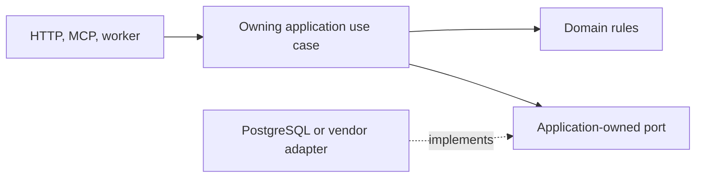

# How the application is organized

Use this guide to find the code that should own a change. Start with [the product overview](../ARCHITECTURE.md), then follow Alice's upload below. The [data model](data-model.md) defines records, and [API contracts](api-contracts.md) defines how clients call the backend.

Alice updates a handbook in Support. Knowledge records the document, Indexing prepares it for search, and a later release may make the new version live. Keeping these responsibilities separate lets us change one part without giving it control over the others.

Sections 1–2 explain the owners and follow a request. Sections 3–5 explain how to save changes safely and review an implementation.

> **Design status:** These are accepted v1 design rules. Feature endpoints, database schemas, integrations, and tests still need implementation and verification where noted.

## Contents

| Reader’s question | Start here |
| --- | --- |
| Where does my change belong? | [1. One backend, several owners](#model) |
| How does work reach its owner? | [2. Follow a command and a query](#operation) |
| Where do transactions start and end? | [3. Keep changes consistent](#coordination) |
| What belongs in HTTP, Studio, or MCP? | [4. Share behavior across entry points](#entry-points) |
| How do I review a change? | [5. Maintainer checks](#maintainer-checks) |
| Why these choices, and what remains open? | [6. Decision and reference map](#decision-map) |

<a id="model"></a>

## 1. One backend, several owners

The backend runs as two separate processes, built from the same backend image:

- **API:** receives application requests.
- **Worker:** carries out background work using the same application operations and business rules.

The Next.js console, **Studio**, handles presentation and browser-session integration - it is not a second implementation of the backend's business logic.

A separate, restricted parser converts uploaded files. Because documents can be malicious, it runs within the [document-processing restrictions](ingestion-security.md) and cannot change application business records.

**Docker Compose is the only supported deployment method.**

### Architecture principles and dependency rules

**Domain-Driven Design (DDD)** organizes code around the product's concepts and rules: documents, indexes, pipelines, evaluations, releases, and access. Each business area has a clear owner.

**Clean Architecture** keeps those business rules independent of the technologies used to expose, store, or execute them. Changing a web framework or storage adapter should not require moving business rules into that technology.

**Lightweight CQRS**, short for _Command Query Responsibility Segregation_, separates operations that change state from operations that read it. It does not require separate databases or a messaging system.

These rules make ownership and dependencies strict. They do not require extra design patterns for their own sake.

### Which code may depend on which

The dependency direction is:

```text
HTTP / browser-session adapters
    -> application commands and queries
        -> domain rules and values

PostgreSQL / Chroma / model / artifact adapters
    -> application-owned ports

Composition root
    -> concrete implementations and configuration
```

These arrows describe code dependencies, not the order of network calls.

The **domain** contains business rules and values. It must not import FastAPI, an object-relational mapper (ORM), Chroma, Docling, LiteLLM, or identity-provider libraries.

The **application layer** carries out requests through **use cases**, the steps for an operation such as accepting an upload. Its inputs and results use values defined by Inframeld, rather than objects from a web framework or vendor library.

A **port** describes a capability the application needs, such as saving a file or calling a model. An **adapter** provides it using a particular technology. For example, an adapter translates a provider's response into the result type the application expects.

Startup code creates and connects these implementations. This is the **composition root**. Passing the required objects into a use case is called **dependency injection**. Domain code receives its dependencies directly rather than looking them up in a service locator or framework container.

### Business areas and state ownership

The six areas below own different records and rules inside one codebase. These are not six separate microservices.

| Area | What it owns |
| --- | --- |
| **Knowledge** | Source identity, document lifecycle and versions, collection revisions and their document memberships. |
| **Indexing** | The settings and state needed to prepare searchable indexes: processing and embedding profiles, processing generations, vectorizations, layouts, materializations, publication, and reconciliation. |
| **Pipelines** | Immutable pipeline configuration and its links to prepared indexes (materialization bindings). Retrieval and generation orchestration. It also owns answer receipts and their current feedback records, as explained below. |
| **Evaluation** | Datasets, evaluation-run evidence, metric results, and comparisons. |
| **Releases** | Deployments, candidate cohorts (groups routed to a trial version), promotion, candidate abort, and rollback. |
| **Access** | Mapping callers to application principals, organization and project scope, permission decisions. |

A **principal** identifies the human or application making a request. An **index materialization** identifies search data prepared for particular documents and processing settings. **Reconciliation** means checking that recorded index state agrees with what is actually stored, then resolving any difference.

Processing and indexes may be separate submodules inside Indexing. However, **only Indexing decides whether a materialization is ready**.

### How modules work together

To request a change owned by another module, use that module's public application operations. Unrelated modules must not update each other's tables directly.

Modules may share IDs and a small value identifying the caller and relevant project. Putting every domain model into a shared package would make the modules depend on one another's internals and obscure who may change them.

Jobs and audit records support the application. They do not become another owner of evaluations, Deployments, or documents.

An evidence screen may combine information from several modules. Its read code can join their records, but it must not become another writer of evaluation or Deployment state. Showing information together does not change who owns it.

<a id="operation"></a>

## 2. Follow a command and a query

A **command** changes state. Alice's upload command checks her current permissions, saves source information, and records the background work to perform. A **query** reads state. Studio's progress request reads the upload's status without starting it again.



Solid arrows show calls. The dashed arrow means the adapter implements the port. These are parts of the code, not separately deployed services. Startup code supplies the adapters to the use cases.

### Lightweight CQRS: different paths for changing and reading state

Promoting a candidate version is a command. It runs through the owning use case and the domain rules for promotion.

Displaying Studio's Deployment table is a query. It needs a useful view of the current records, limited to what the caller may see.

A query returns a **data transfer object (DTO)**, a value containing the fields that screen or client needs. Its database reader selects permitted records from the same PostgreSQL database. Such a purpose-built view is called a **read projection**.

To display one Deployment row, the reader can select the required fields directly. It need not rebuild the full domain object, but it must still check permissions.

Read adapters may join records from different business areas. Each adapter still has an explicit owner, and being able to read across modules gives it no permission to write across them.

Keeping commands and queries separate needs no message bus, mediator, event-sourced history, separate read database, or general workflow engine.

Chroma holds derived search data outside PostgreSQL. Its [indexing protocol](indexing.md) explains how to keep that data consistent. This special case does not require ordinary database reads to wait for a separate copy of their records to catch up.

<a id="coordination"></a>

## 3. Keep changes consistent

A rule that must remain true after a change is an **invariant**. An **aggregate** groups the related state and behavior responsible for protecting such rules. For example, a Deployment must reject a release change based on an outdated revision.

For example, a `Deployment` owns the rules for:

```text
attach_candidate
set_canary
abort_candidate
promote
rollback_promotion
```

Here, a Deployment selects the pipeline version serving requests. It is not a Docker deployment. Both the API and worker use its domain rules instead of implementing their own versions of promotion or rollback.

A PipelineVersion checks that its saved configuration is valid and immutable. Simpler facts can remain plain immutable values. A **source span**, for example, only identifies where an excerpt came from. Neither it nor a recorded metric needs an elaborate class hierarchy.

### An aggregate does not mean loading every related row

An aggregate defines which rules belong together. It does not mean loading every related database row.

For a collection with one million documents, load the small controlling object and its revision reference. Create, verify, and read the membership records in batches or through database operations over sets of rows. This keeps memory use limited.

The aggregate's main object, called its root, protects the rules. Repository operations handle the larger volume of records.

### Keep database transactions short

Application commands define short PostgreSQL transactions. A transaction groups database changes so they commit together or do not commit at all.

Domain code checks the business rules. Database adapters also reject duplicates, references to the wrong organization or project, and updates based on an outdated revision. These checks use uniqueness constraints, foreign keys, and conditional updates.

Both are needed because two requests can overlap. Alice's command may pass a check, then Bob may change the same record before Alice saves. Database checks prevent her save from breaking a rule or silently replacing his change.

**Admission** means saving that the application has accepted an operation. Its work record, job, retry outcome, and required audit event can all be saved together. The retry outcome tells the application what to return if Alice sends the same request again.

When one transaction owns these records, they can succeed or fail together. There is no need to save them separately and repair partial results later.

### Keep external calls outside long SQL transactions

Record acceptance, finish the database transaction, then call storage or a model. Save completion in another short transaction. Waiting for an external service must not keep a long SQL transaction open.

Workers call the same commands as the API, including when a source sync discovers a new document. A retry reuses the operation's identities. It must not create another domain model or a new source identity each time.

<a id="entry-points"></a>

## 4. Share behavior across entry points

**MCP**, the Model Context Protocol, offers another way to call the same application operations. Pipelines still retrieves documents and produces answers. Access still decides permissions.

Studio calls the application HTTP API through the official generated TypeScript **SDK**, a client library for working with the backend.

SDK Kit is the external tooling for generating those client libraries. **It is a blocker for Studio implementation, not backend implementation.** Backend work can proceed while that dependency is resolved.

Repository skills are guidance for developers and agents. They do not run inside the application.

The MCP integration profile is accepted in [Using Inframeld through MCP](mcp.md).

### Keep domain ownership at every entry point

Pipelines owns answers, receipts, and feedback. Evaluation owns offline comparisons, and Releases selects which version serves requests. Studio may display their information together without taking over any of their writes.

Default setup calls normal commands. A build reports that its version is ready, then a separate Releases command may make it live. [Onboarding](onboarding.md) and [publication modes](pipelines-and-releases.md) explain this flow. Retries and workers follow the same separation.

Access checks the verified caller's current permissions. An adapter cannot accept a client's claimed group list as proof. Model calls use ModelGateway, with provider secrets kept behind the [model connection boundary](model-connections.md).

<a id="maintainer-checks"></a>

## 5. Maintainer checks

| Scenario | Expected outcome |
| --- | --- |
| An HTTP route, MCP tool, and worker perform the same operation | They call the owning application behavior with verified context. |
| A read screen joins two domains | A purpose-built read projection may join data. It does not acquire write ownership. |
| A grant changes while work is queued | The operation performs the current checks required by its owner. |
| An external call times out | No long SQL transaction is held. The owning retry protocol decides what is safe. |
| An index becomes ready | Readiness alone never changes Deployment traffic. |
| A million-row corpus is selected | Use bounded queries and batches. Do not load an entire aggregate into memory. |

### Keeping the code understandable and verifying the boundaries

Use names from the domain, keep related behavior together, return explicit errors, and keep interfaces focused on a clear responsibility.

Use small functions where they improve readability, without a fixed line limit. Explain why consistency and security rules exist in comments and ADRs. Add another DTO only when it translates meaningfully between responsibilities.

Tests should demonstrate business behavior, not just that methods were called. Examples include:

| Scenario | Behavior to verify |
| --- | --- |
| A promotion uses an outdated deployment revision. | The stale promotion is rejected. |
| A materialization has not been published. | It is unavailable for serving. |
| An operation references a resource from another project. | The cross-project reference is denied. |
| A process restarts and retries publication. | Publication is not duplicated. |

The developer manually guards forbidden imports, dependency cycles, and repository organization, following the repository's setup-test policy. Do not add architecture/import-boundary tests, dependency-rule fixtures, or composition-root construction tests. Automated tests verify implemented product behavior, API contracts, and integrations.

Tests of database and search behavior must use real PostgreSQL and the Chroma server shipped with the product. Mocks alone cannot show that real constraints, simultaneous changes, and search operations behave correctly.

<a id="decision-map"></a>

## 6. Decision and reference map

Feature endpoints and rules for simultaneous changes still need implementation and integration tests. Repository structure and dependency rules are reviewed manually under the setup-test policy.

| Decision | Rationale |
| --- | --- |
| [ADR-0001](../adr/ADR-0001-use-one-modular-backend-with-clear-domain-boundaries.md) | Use one modular backend with clear domain boundaries. |
| [ADR-0002](../adr/ADR-0002-separate-commands-and-queries-without-a-command-bus-framework.md) | Separate commands and queries without a command-bus framework. |
