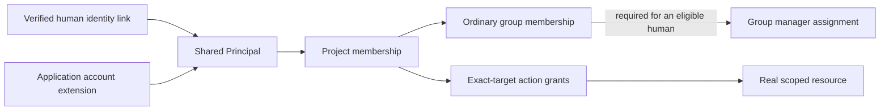
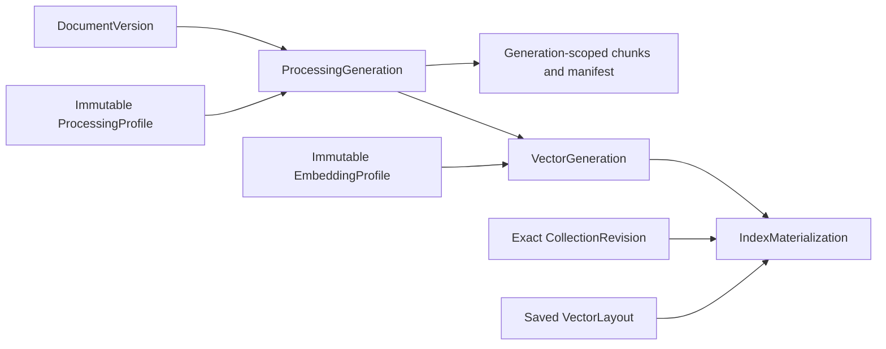

# Data model: identities, relationships, and lifecycle

Use this reference to answer three questions: what does a record represent, which domain owns it, and which relationships must stay valid? Start with the [architecture introduction](../ARCHITECTURE.md) for the product journey. Topic guides explain operations, while this document owns record definitions and constraints.

> **Design status:** The logical model is accepted and may be refined as features are implemented. The 14-table Access foundation is implemented by [the initial migration](../../apps/backend/migrations/versions/0001_initial.py). It includes scoped relationships, principal and resource-kind checks, the one-project application binding, group-manager membership, unique current grants, and use-only application grants. The migration does not implement the Access workflows or enforce the code-owned action catalogue. Audit payload handling, indexes, and some lifecycle rules still need implementation and qualification. Other domains do not prescribe one table per concept, so this is not a complete application schema.

A **primary key (`PK`)** identifies a row. A **foreign key (`FK`)** makes the database check a reference to another row. A **unique constraint** rejects duplicate combinations.

An immutable version keeps its recorded meaning. It can still become unavailable through expiry, erasure, corruption, or lost storage. Keeping an old version does not preserve old permissions.

## Contents

| Question | Records |
| --- | --- |
| Who can act, and in which project? | [Access](#access) |
| Which source bytes belong to a corpus? | [Knowledge](#knowledge) |
| Which prepared data can a build reuse? | [Indexing](#indexing) |
| What produced an answer or rating? | [Pipelines](#pipelines) |
| Which version is selected for traffic? | [Releases](#releases) |
| What did a comparison actually execute? | [Evaluation](#evaluation) |
| How are connections, credentials, and work recorded? | [Supporting records](#supporting-records) |

<a id="access"></a>

## Access: identity, membership, and grants

Alice and SupportBot have separate identities, called **principals**, in the Support project. Joining Support, joining a document group, managing that group, and receiving an action permission are separate relationships. The [Access guide](access-control.md) explains their behavior. This section defines how records preserve those distinctions.



The arrows show references and relationships. They do not automatically grant permissions. An application credential identifies its stable principal and uses that account's current permissions.

Humans and applications share the same model of principals, memberships, and grants. Their authentication records remain separate. [Access](access-control.md) decides which operations each kind of principal may perform.

The first table describes information and relationships, not final SQL names, types, ORM classes, or implemented behavior. A concept does not require its own aggregate, repository, service, or endpoint. Access is part of the [single backend](application-structure.md).

### Records and their relationships

| Logical record | Information it represents | Boundary to preserve |
| --- | --- | --- |
| **Principal** | Stable local identity, human/application kind, and account status used by Access. | Both kinds use the same membership and action-policy model. The shared model does not make applications eligible for human-only administration. Account kind and status are trusted application facts, not caller-supplied claims. |
| **Identity link** | External authority and subject mapped to a local human principal. | An authority identifies the verified identity source. A subject identifies the account within it. The same external identity must not resolve ambiguously to different local humans. Email, display name, or an upstream group is not the identity key. |
| **Organization** | The installation's ownership and installation-action scope. | V1 provisions one installation organization. Recording the boundary does not add multi-organization administration or enterprise federation. |
| **Project** | Stable project identity and its owning organization. | A resource belongs to its recorded project. Project membership and project-scoped authority do not extend to another project or to installation-level actions. |
| **Project membership** | A relationship between a principal and a project. | Membership is a prerequisite for project operations, not an action grant or document-reading grant. Human membership administration and application-account creation/removal follow their separate [Bound administration, grants, and recovery](access-control.md#section-bound-administration-grants-and-recovery) workflows. |
| **Access group** | Stable group identity and its owning project. | It defines a document audience within that project. Documents refer to groups through their stored allowlists. A group is not a bundle of all project operations. |
| **Group membership** | A principal's document access through one project-local group. | It is separate from project membership, group management, and operational action grants. Application group relationships define the application's current document scope, not a per-key copy. |
| **Group manager assignment** | A human's peer-manager authority on one project-local group. | Requires an ordinary membership for the same principal, project, and group. Record both explicitly on appointment. Reads use membership, while administration requires both assignments and current eligibility. Applications cannot be managers. |
| **Action grant** | A principal, one action, its exact scope/target, its grant level, and assignment attribution. | Record grants individually. Human recipients may have can use or can use and grant. Application recipients may have only can use for eligible actions. Neither a valid identity nor general administrator status supplies an absent permission. |

Memberships, grants, and action attribution all refer to the same principal ID. A human's sign-in link or an application's key establishes that ID. Human-specific and application-specific records may differ without creating two permission systems.

An application account belongs to one project. It begins with no document access, action grants, or automatically issued key. It cannot move between projects or inherit its creator's rights. Humans, unlike applications, can be explicitly admitted to several projects.

<a id="group-manager-membership-constraint"></a>

### Every group manager requires ordinary membership

The [25 September 2026 decision](../adr/ADR-0049-require-group-managers-to-be-ordinary-members.md) requires each manager assignment to reference ordinary membership for the same `(project_id, group_id, principal_id)`. Alice therefore has two records when she manages a group. Removing management can leave her an ordinary member. Membership alone does not make someone a manager.

The proposed `group_managers` table has a foreign key from that three-column key to the matching `group_memberships` primary key. Keep its human-only check and scoped project-membership reference too. The database must reject removing membership while the manager row remains.

When an authorized operation removes both, it checks handover and removes management first. Automatic cascading deletion cannot replace those checks or the audit record.

Creating a group, appointing a manager, or recovering a stranded group saves both assignments together. Demotion removes only management. Removing membership also removes management, and rejoining does not restore it. Save each change, scope revision, and audit event in the same protected Access transaction. See the [group workflow](access-control.md#group-managers).

Suspension keeps both records but blocks their use. Foreign keys cannot prove that Alice is active, may make this change, or will leave another eligible manager. Application policy still checks those conditions. These are accepted rules with a proposed database constraint, not an implemented migration or reported test pass.

### Keep identity and credential lifecycles separate

A verified Kratos identity maps through an explicit identity link to the human principal. Kratos owns passwords and sessions, so permission records do not contain them. Verify the identity source and subject before using the link. Matching email addresses alone do not join accounts.

An application key identifies the application principal. The incoming-credential workflow owns its verifier, safe metadata, expiry, revocation, and audience/resource binding. Those records are separate from current grants and group membership. Replacing a key keeps the same principal and permissions. Both usable keys, at most **two per application**, use the account's current authority. Expired and revoked key history is counted separately.

Changing a name or credential does not change the principal. Creating another account with an old display name does not give it the retired account's identity or permissions. Historical attribution follows [retention rules](retention-and-deletion.md) and never authorizes new work.

### What one action grant means

The logical contents of a grant are:

| Information | Meaning |
| --- | --- |
| **Recipient principal** | The human or application receiving authority. |
| **Action** | One supported operation, such as Query or Manage releases. Validate the action against its allowed scope and recipient kind. |
| **Exact target and owning scope** | The installation organization, project, group, or individual resource to which the action applies. A resource grant identifies that resource, not every current/future resource of its kind. |
| **May grant onward** | Whether the recipient has can-use-and-grant authority for this same action and scope. Both grant levels permit use. Can-use-and-grant is not a grant-only third level. |
| **Assignment attribution** | Who assigned the permission and when, with later changes recorded according to the audit/retention design. Attribution does not give the original grantor permanent control. |

For example, Alice's Manage releases grant on Production says nothing about Test, Pipeline Build, reading documents, or a separate View grant. Code must implement only the accepted implications, such as Edit configuration allowing her to view that same configuration. It must not infer extra rights from names or introduce configurable role inheritance.

Keep **one current assignment per recipient, action, and exact target**, enforced by a database unique constraint. If another grantor changes that permission, they update the same assignment through the authorized workflow. Revoking it then cannot leave an unnoticed duplicate grant behind.

Every grant has a required boolean `can_grant`. The row allows use when ordinary eligibility checks pass. `true` also allows granting the same action on the same target. `false` means use-only, not an explicit denial. Applications can hold only `false`. Accepted implications such as Edit including View are evaluated by application policy without extra stored View rows.

Application code owns a fixed action catalogue. Each action defines its target type and eligible recipient kinds. Deny unsupported actions. There is no editable actions table, custom role language, or runtime policy-definition service. New actions need reviewed code and relevant database constraints. Exact identifiers and future actions still belong to their feature decisions.

Store individual memberships and grants as relational records. Do not replace them with one authoritative JSON permissions document per account. A read response can still group permissions for display.

The grantor tells us who assigned a permission, not who must remain present for it to work. If Alice grants Bob Query and later leaves, Bob keeps that grant. Remove Alice's own relationships under the departure rules. Do not revoke Bob's grant merely because Alice originally assigned it.

### Organize grant tables by target type

The accepted 24 September 2026 design uses **separate grant tables for organization, project, group, and each supported resource target type**. Query and Manage releases on Deployments share a Deployment-grants table. It is not one table per action, recipient, or individual Deployment.

Each grant table refers to its real target and owning scope using foreign keys. Add Pipeline and Deployment grant tables with their owning features, alongside the actual resources. Organization grants refer directly to the organization without inventing a project. The Access foundation does not create placeholder domain resources for future permissions.

All these tables use the same permission rules and two grant levels. Separate tables do not require separate evaluators, services, or a repository class for each table. Exact names and columns still need implementation review.

### Separate current grants from permission history

A current-grants table answers “what is assigned now?” Revocation deletes that assignment. A downgrade changes its grant level. Do not leave a revoked row in this table behind an inactive flag.

The audit record answers “who changed what, and when?” It records the affected recipient, action, target, and change. Save it in the **same transaction** as the current-state change, so either both are saved or neither is.

Authorization reads current assignments and checks status, membership, scope, and the operation's other rules. It does not rebuild permissions from history. Granting a removed permission again creates a fresh assignment with fresh attribution, rather than reviving an old historical row.

For example, removing SupportBot's Query row blocks Query even while its key and project membership remain valid. **Suspension works differently:** it keeps assignments but prevents their use. Key revocation and account deletion each have their own lifecycle.

Audit history follows [retention, access, and erasure rules](retention-and-deletion.md). It must not retain credential secrets or authorize actions from historical actor/resource references. Its exact schema, permitted viewers, indexes, and retention implementation still need design with the owning workflows.

### Use database constraints for relationships and application policy for decisions

A foreign key must establish both that a referenced object exists and that it belongs to the right organization or project.

For example, a Support group membership references a group in Support and the principal's Support membership. A Support grant cannot target a Finance Deployment. A Document cannot name another project's group. Add equivalent constraints when each resource is introduced. Do not create placeholder Documents or Deployments before their owning features define them.

Use a foreign key containing both project ID and resource ID to check their relationship. [PostgreSQL supports multi-column foreign keys](https://www.postgresql.org/docs/18/ddl-constraints.html#DDL-CONSTRAINTS-FK). Keep the accepted target-specific grant tables and real references, rather than introducing a generic resource registry.

Unique constraints prevent ambiguous identity links and duplicate membership, manager, or recipient/action/target rows. Revocation removes current rows while history stays separate, so readmission cannot accidentally restore old authority. Review further keys, indexes, delete behavior, and audit details against each lifecycle.

Database constraints and application policy answer different questions. Foreign keys can check Alice's group and project relationships. They cannot establish that she is unsuspended, may grant this permission, or leaves another active grantor. The application must check those conditions while protecting the change against concurrent writes. A row `CHECK` is not suitable for enforcing conditions involving other rows.

This is an illustrative authorized state, not a provisioning template that silently grants rights:

- The installation organization contains **Support**.
- **Alice** is a human principal. **SupportBot** is an application principal owned by Support.
- Both are Support project members.
- Both belong to the **Support documents** group. Alice also has a manager assignment. Her ordinary membership is what passes the group-based reading check.
- **Production** and **Test** are Deployments in Support. Assume neither principal has other grants on Test or membership in an HR-only document group.

| Recipient  | Action          | Target     | Grant level       |
| ---------- | --------------- | ---------- | ----------------- |
| Alice      | Manage releases | Production | Can use and grant |
| Alice      | Query           | Production | Can use and grant |
| SupportBot | Query           | Production | Can use           |

When SupportBot queries Production, key verification identifies its account and checks the key's validity and binding. Access then checks current status, Support membership, Query on **Production**, and document access through SupportBot's groups and the Documents' allowlists. Alice asking through the bot does not give it her permissions.

SupportBot can query Production using permitted evidence but cannot release Production, administer grants, or read an HR-only document. Neither example principal gains release authority on Test from these assignments. Removing SupportBot's Query grant blocks querying Production even though its key and project membership remain valid. Removing its Support-documents membership removes that document access even if Query remains. Replacing its key changes neither relationship.

When Alice creates a Deployment, one transaction records it, its first ready serving version, and her explicit initial grants. Later releases use those ordinary grants. A creator ID cannot override a later removal of her permissions.

<a id="proposed-access-foundation-table-map"></a>

### Access foundation table map

**Status:** The application-account extension and write coordination were accepted on 24 September 2026. The initial migration now implements the 14 foundation tables and their core keys and relationships. The two accepted choices are:

1. Keep `application_accounts` as a small extension of the shared principal. Enforce its one owning project in membership relationships.
2. Protect Access writes with short project-scoped transactions, the [organization/project lock protocol](access-control.md#persistence), and revisions that reject stale administration changes. Finer locks are deferred unless measured contention justifies them.

The map below describes the implemented foundation and its later integration points. Exact action IDs are not yet enforced by database checks. Audit payload limits, retention, and index needs still require implementation review. This is not the complete schema for the application.

There are **14 foundation tables**, mostly small relationship tables. They belong to one Access module in one PostgreSQL database. They do not require 14 services, repositories, or aggregates. Keys, Documents, Pipelines, and Deployments arrive with their own features.

### Column conventions

- Use stable UUIDs, PostgreSQL `timestamptz` for times, and a required boolean `can_grant`. Display names are editable labels, not permission keys. Do not require global name uniqueness or infer membership from names.
- Organization/project ownership is required and immutable on live records. Foreign-key columns for current memberships, targets, and recipients are non-null unless a conditional relationship below explicitly allows null. Add the listed composite unique keys so scoped references have real database keys to target.
- Restrict principal kind to `human` or `application`. If another table repeats that kind for a constraint, a foreign key must verify it against the principal's actual kind. Callers cannot choose the copy, and kind changes are unsupported.
- Principals accept `active`, `suspended`, and `retired`; projects accept `active` and `deleting`. Database checks restrict stored values, while application logic must still enforce valid transitions. Application retirement is terminal, and retaining its row never makes its keys valid.
- Assignments record `assigned_at` and nullable `assigned_by_principal_id`. The latter records attribution, not continuing authority. Reference the stable principal without cascading deletion, and allow null under authorized erasure. Audit operator/bootstrap activity explicitly. Nullable attribution does not permit an ordinary caller to skip verified attribution.
- Organizations and projects have a nonnegative integer `access_revision`. Advance the relevant scope's revision for each committed Access administration change. Administration requests carry the expected revision so stale changes are rejected, including removal followed by regrant. It is not a cached permission snapshot. A project change does not advance every other project's revision. The administration contract owns its request/response representation.

### Identity, ownership, and membership tables

The table conventions use `PK`, `FK`, and `unique` as defined above. Add further timestamps or display fields only when a workflow needs them.

| Table | Core columns and keys | Required relationships and meaning |
| --- | --- | --- |
| `organizations` | `id` PK, `name`, `access_revision`, `created_at`. | One installation organization is provisioned in v1. No multi-organization administration follows from having this table. |
| `principals` | `id` PK, `organization_id`, `kind`, `status`, `display_name`, `created_at`. Unique `(organization_id, id)` and `(organization_id, id, kind)`. | FK to organization. Stable identity shared by human and application authorization. A local admitted human is represented here. An unverified login or pending invitation does not create an active principal. Status is checked whenever authority is evaluated. |
| `human_identity_links` | `(authority, subject)` PK, `organization_id`, `principal_id`, `principal_kind` fixed to `human`, `linked_at`. | FK `(organization_id, principal_id, principal_kind)` to principal. The verified identity pair maps to exactly one local human. The link uses the verified Kratos identity source/ID. No email-based merging. This shape does not enable self-service identity linking. |
| `projects` | `id` PK, `organization_id`, `name`, `status`, `access_revision`, `created_at`. Unique `(organization_id, id)`. | FK to organization. Deletion first marks the project unavailable and starts the accepted cleanup lifecycle. No stored creator or owner field supplies implicit authority. |
| `application_accounts` | `principal_id` PK, `organization_id`, `project_id`, `principal_kind` fixed to `application`. Unique `(project_id, principal_id)`. | FK `(organization_id, principal_id, principal_kind)` to principal and `(organization_id, project_id)` to project. Records the application's one immutable owning project. Its ID is the shared principal ID, not a second identity. Contains no permissions or credential secret. |
| `project_memberships` | `(project_id, principal_id)` PK. `organization_id`, `principal_kind`, nullable `application_principal_id`, assignment attribution. Unique `(project_id, principal_id, principal_kind)`. | FK `(organization_id, project_id)` to project and `(organization_id, principal_id, principal_kind)` to principal. The conditional application FK described below prevents admitting a bot to another project. Membership gives no operational or document permission. |
| `access_groups` | `id` PK, `project_id`, `name`, `created_at`. Unique `(project_id, id)`. | FK to project. A document audience. No nested groups or role bundle. Management is recorded separately. |
| `group_memberships` | `(project_id, group_id, principal_id)` PK, assignment attribution. | FK `(project_id, group_id)` to group and `(project_id, principal_id)` to project membership. This is the principal's group-based document audience, not an operational grant. |
| `group_managers` | `(project_id, group_id, principal_id)` PK, `principal_kind` fixed to `human`, assignment attribution. | FK `(project_id, group_id)` to group and `(project_id, principal_id, principal_kind)` to project membership. Also FK `(project_id, group_id, principal_id)` to `group_memberships`, with restricted parent deletion. Every manager requires matching ordinary membership. Reads use membership rather than a manager bypass. |

**One application, one project:** for a human membership, `application_principal_id` must be null. For an application membership, it must be non-null and equal `principal_id`. Enforce that distinction with a row check, then add FK `(project_id, application_principal_id)` to `application_accounts(project_id, principal_id)`.

The repeated ID lets PostgreSQL check that an application joins only its owning project while humans can join several. It is not a second application identity. A nullable foreign key without the kind/nullability check would let an application evade this check.

Create the principal, application account, project membership, creator administration grants, and audit event together. The account is usable only while its principal, account, project, and membership satisfy current policy.

Keeping the owning-project reference separate from membership lets retirement remove membership while retaining an inactive account reference for history. Historical or incomplete records do not authorize work.

A separate human-profile table is unnecessary until Inframeld needs human-only application data. Kratos owns passwords and sessions.

### Current action-grant tables

Every grant row contains `recipient_principal_id`, `recipient_kind`, `action`, `can_grant`, and assignment attribution. `action` is a stable identifier defined in code. Row checks restrict actions and recipient kinds to the supported catalogue as it is implemented.

An application's `can_grant` must be `false`. The recipient-kind foreign key prevents treating it as human. Application policy also denies unknown or unsupported actions, even if an unexpected value appears in storage.

Use recipient, action, and exact target together as the proposed primary key. A separate grant ID is unnecessary. Scope revisions detect stale changes even when removal and regrant create the same key again. Follow the [request retry rules](jobs-and-idempotency.md#requests) and [Access expected-revision checks](access-control.md#persistence). An unconditional upsert must not overwrite another change silently.

| Table | Primary key / exact assignment | Required foreign keys |
| --- | --- | --- |
| `organization_action_grants` | `(organization_id, recipient_principal_id, action)`. | `(organization_id, recipient_principal_id, recipient_kind)` to principal. Currently accepted installation actions are human-only. Constrain the kind accordingly. No artificial project is needed. |
| `project_action_grants` | `(project_id, recipient_principal_id, action)`. | `(project_id, recipient_principal_id, recipient_kind)` to project membership, plus project target. Enforce the catalogue's human-only administration restrictions. |
| `group_action_grants` | `(project_id, group_id, recipient_principal_id, action)`. | `(project_id, group_id)` to group and `(project_id, recipient_principal_id, recipient_kind)` to project membership. Supports the accepted Add/Update/Delete documents permissions on groups. Ordinary group membership remains a separate fact. |
| `application_action_grants` | `(project_id, application_principal_id, recipient_principal_id, action)`. | `(project_id, application_principal_id)` to application account and `(project_id, recipient_principal_id, recipient_kind)` to project membership. Recipient kind is human. These are Issue keys, Revoke keys, and Delete application account permissions **over the application**, not the permissions the bot uses. |

For example, Alice's permission to issue SupportBot's keys belongs in `application_action_grants`. SupportBot's permission to query Production belongs in the future `deployment_action_grants`. SupportBot's access to the Support-documents audience belongs in `group_memberships`. These three records have different purposes.

### Audit table

The four grant tables plus the nine identity/membership tables and this audit table make the 14-table foundation.

| Table | Core fields | Boundary |
| --- | --- | --- |
| `access_audit_events` | `id` PK, `occurred_at`, `organization_id`, nullable `project_id`, `actor_kind`, nullable `actor_principal_id`, nullable operator/bootstrap `actor_reference`, nullable affected principal, `event_type`, `target_kind`, stable `target_id`, nullable action, JSONB `before_values` and `after_values`, nullable reason and `correlation_id`. | A bounded historical record of an Access change. Write it in the same transaction as the state change. Normal APIs cannot edit history, but authorized retention/erasure still applies. It is never queried to grant access. |

Audit records preserve historical identity and scope. Do not cascade their foreign keys to current grants, memberships, groups, or resources. Otherwise deleting a permission could erase its own evidence or become impossible.

A target kind and ID are suitable in history because they are not used to authorize access. Validate each event and limit its safe before/after payload. Do not copy entire domain objects, permission snapshots, document text, keys, hashes, or session data. Operator/bootstrap events do not need a fake human principal. Their authenticated maintenance path supplies the actor reference and required reason.

This table proposal does not grant anyone audit-reading rights or promise permanent retention. Define permitted viewers, required fields per event, payload bounds, and retention before exposing an audit API. Apply the [retention policy](retention-and-deletion.md) to attribution and surviving events too.

### Tables integrated with later features

The following are integration points, **not records to create before their owning feature exists**. Each feature supplies its real resource, lifecycle, columns, and migration. Access still owns grants and permission policy. A cross-domain foreign key does not transfer ownership of the resource.

| Later table / relationship | Proposed key and references | Delivery boundary |
| --- | --- | --- |
| `pipeline_action_grants` | `(project_id, pipeline_id, recipient_principal_id, action)` PK. Scoped FK to real Pipeline and recipient project membership. The common grant fields/checks. | With the Pipeline feature. Build and its other settled actions use the fixed catalogue. |
| `deployment_action_grants` | `(project_id, deployment_id, recipient_principal_id, action)` PK. Scoped FK to real Deployment and recipient project membership. The common grant fields/checks. | With Deployments/Releases. Query, Manage releases, configuration, and Delete stay separate under [Bound administration, grants, and recovery](access-control.md#section-bound-administration-grants-and-recovery). |
| `application_credentials` | Stable credential ID. `(project_id, application_principal_id)` FK to application account. Stored verifier and safe metadata, expiry/revocation, audience and the required binding. | Owned by the incoming-credential workflow. No per-key permission rows. Enforce the two-usable-key limit transactionally. Credential format, verifier construction, lifetimes, and binding columns need that workflow's design. |
| Document/group allowlist join | `(project_id, document_id, group_id)` unique. Scoped FKs to real Document and access group. | Owned by Knowledge, with document-access checks following [Access policy](access-control.md#documents). The current nonempty allowlist belongs to the logical Document and protects all its versions. No per-version access copy. |
| Project upload-default/group join | `(project_id, group_id)` unique. Scoped FK to project/group, with the owning default configuration and revision. | Default provisioning/configuration under [From a new account to a first useful answer](onboarding.md) and its authorized update workflow. Applies to future admissions. Not an automatic change to existing Documents. |
| Active upload and source-configuration group references | Scoped FKs from their real configuration/intent records to each group they currently reference. | Owning Knowledge workflows. These references must block deletion of an in-use group. Historical snapshots need their separate retention treatment. Source-administration permission details remain an explicit open policy question. |

Invitation and admission, provisioning completion and retry state, idempotency reservations, and cleanup jobs belong to the workflows that need them. They follow the shared job contract. They are not missing permission tables or a reason to duplicate Kratos credentials and sessions.

### Deletion and retention behavior

Live foreign keys should normally **restrict parent deletion**. The authorized use case checks handover, removes the affected current rows in order, and records the audit event. This makes the cleanup explicit instead of hiding an authorization workflow in database cascades. Whole-project cleanup still marks deletion first and resumes through jobs.

| Change | Required persistence effect |
| --- | --- |
| Appoint a manager or create a group | Insert any missing ordinary membership and the manager assignment together. Preserve existing membership, recheck eligibility, advance the scope revision, and audit in the same transaction. |
| Demote a manager | Remove only the manager assignment after required handover checks. Retain ordinary membership, advance the scope revision, and audit together. |
| Remove group membership | After handover checks, remove any manager assignment before the membership in the same transaction, with revision and audit. Readding membership does not restore management. |
| Recover a stranded group | Record the eligible replacement's ordinary membership and management together under scoped operator recovery, with revision and audit. Keep the compromised principal blocked. |
| Suspend a human | Change principal status and preserve both membership and management, plus other grants. Block reading and administration immediately, even for the sole manager. Record the status change and audit together under installation write coordination. |
| Remove a human from a project | After handover checks, remove that recipient's project/group/application/resource grants, manager assignments before group memberships, then project membership. Audit together. Do not delete grants merely because this human assigned them. |
| Revoke or downgrade a grant | Delete the current row or update `can_grant`. Bump the scope revision and audit together. A later regrant is a fresh assignment with fresh attribution. |
| Delete an unused group | Check all current Document, active-upload, default and source references, then remove its manager assignments before memberships, its own grants, and the group. Reference FKs prevent dangling or cross-project relationships. A default group must be replaced through its authorized configuration workflow first. |
| Delete an application | Retire its principal, revoke keys, remove its received grants/group relationships/project membership and human grants targeting the account. Retain only the inert identity/account/credential metadata justified by retention, then purge in dependency order. Do not delete project data it created. |
| Delete a project | First make the project unavailable to new work, stop its applications and revoke their keys, then clean up project data and access records under the accepted deletion lifecycle. No handover is needed for a scope being deleted. Historical audit is handled by retention, not by a blanket project cascade. |

### Implementation boundary

The initial migration creates the shared Access records and their core relational constraints. It does not deliver every administration workflow. Kratos integration handles human sessions. Onboarding provisions private defaults. Access administration handles grants, handovers, and revisions. Knowledge checks document access as it prepares permitted content. The incoming-credential workflow handles application keys. Pipelines and Releases add their own resource tables and grants. These workflows build on the foundation, and describing them here does not mean they are implemented.

The migration stores nonempty action identifiers but does not yet restrict them to the code-owned action catalogue. Application policy must reject unsupported actions, and database checks can be added when stable action IDs are finalized. Status checks limit the values in the database, but application policy still decides which transitions are allowed. Index tuning and event-specific audit rules remain open engineering details.

PostgreSQL integration tests verify that all 14 tables are created and cover selected relational rules, including identity-link uniqueness, human-only assignments, required group-manager membership, cross-project references, and duplicate grants. Authorization tests cover current principal status, project membership, exact action grants, and hidden-versus-denied outcomes. These tests do not qualify administration, handover, or concurrent-write workflows. Document-evidence filtering is also separate and must be verified with its owning feature.

The [Access write protocol](access-control.md#persistence) keeps current checks, any required expected revision, the change, revision increment, and audit event in one short transaction. Ordinary permission reads do not take exclusive administration locks. External calls stay outside these transactions. Code defines the supported actions and eligible human/application recipients.

<a id="knowledge"></a>

## Knowledge: source identities and exact membership

| Logical record | Meaning and constraint |
| --- | --- |
| Document | Stable project-owned source identity and current nonempty group allowlist, protecting all its versions. |
| DocumentVersion | Immutable source content and authoritative hash/reference. Equal content for the same Document can reuse the version. Changed bytes create another. |
| Collection | Stable named corpus, such as Support Knowledge. It does not own private vector copies. |
| CollectionRevision | Exact DocumentVersion membership. Never a mutable “latest” selector. |
| Upload batch / source sync | A bounded admitted selection and progress. Exact physical representations belong to their workflows. No new tables are prescribed here. |

Suppose R1 contains A1, B1, and C1, and B1 describes a 30-day refund period. Alice replaces B with a 14-day policy, producing B2 and R2={A1,B2,C1}. R1 still names B1. [Knowledge lifecycle](knowledge-lifecycle.md) explains replacement, admission, and source disappearance.

For an imported source, the connector and normalized bucket/key identify the logical Document. A provider ETag is not necessarily a content hash. Parsed output belongs to Indexing and does not create another DocumentVersion.

<a id="indexing"></a>

## Indexing: profiles, generations, and materializations

### Distinguish sources, processing results, indexes, and bindings

Knowledge records which source versions belong to a collection revision. Indexing records how those versions were processed and made searchable. Collections can share prepared vectors rather than keep private copies.

A **chunk** is an excerpt produced by processing a document. An **embedding** is a numerical vector representing text for similarity search.

| Concept | Responsibility |
| --- | --- |
| **`ProcessingProfile`** | Immutable parser/chunker behavior: how the source is read and divided into chunks. |
| **`ProcessingGeneration`** | The resulting chunk evidence for a document version processed under that profile. |
| **`EmbeddingProfile`** | Immutable vector-space configuration: semantic gateway routing, model, dimensions, normalization, and distance metric. Dimensions specify the number of values in a vector. Normalization and the metric determine how vectors are prepared and compared. |
| **`VectorGeneration`** | One immutable physical numerical execution for a document processing generation and embedding profile. It owns its record IDs and frozen manifest evidence. A manifest is an inventory of expected records, identities, and verification information. |
| **`VectorIndex`** | The application’s profile-specific search resource. It is not necessarily one physical Chroma collection. |
| **`VectorLayout` / `VectorShard`** | The immutable placement contract and the physical shard references. A shard is a partition of the index. The layout records how records are placed. |
| **`IndexMaterialization`** | A verified binding of one collection revision and profile combination to exact physical generations in one layout. It identifies the searchable data required for that revision. |
| **`PipelineIndexBinding`** | An immutable reference from a pipeline version to a ready materialization. It selects existing verified index data rather than copying it into the pipeline. |

### Profiles describe behavior, not just names

An immutable embedding profile identifies its organization/project, gateway and semantic configuration revision, model alias, dimensions, normalization, and distance metric.

A change that can alter vector meaning creates a new profile. Credential rotation alone does not, provided the semantics remain unchanged.

An immutable processing profile identifies parser/chunker behavior and implementation. Its processing generation identifies the resulting chunks.

### Keep compatibility separate from physical execution

| Identity | Purpose |
| --- | --- |
| **Semantic reuse key** | Organization/project + document version + processing generation + embedding profile. It finds compatible, healthy, ready work without another model call. |
| **Physical vectorization generation** | One immutable numerical execution, or incarnation, for that key. It has a unique, never-reused generation ID, an exact manifest, and frozen write batches. |
| **Physical record ID** | A versioned, deterministic encoding or hash of organization/project + vectorization-generation ID + chunk ID. The generation ID is part of the **record ID**, not only metadata. |

**A fresh model response must never overwrite a retained generation.** Different numerical output requires a new physical generation and therefore different record IDs, even when the semantic reuse key is unchanged.

Logical collection and pipeline IDs are not part of vector identity. Compatible collections and pipelines can therefore share the same physical records.

For each reuse key, PostgreSQL coordinates one decision at a time: use a ready generation, join work already being built, or accept one new attempt. An attempt that loses ownership cannot publish. Unreferenced attempts are cleaned up rather than selected for serving.

Each Chroma record contains explicit embeddings, immutable chunk content or a content reference, and immutable scope/profile/document/generation/chunk metadata. It contains **no mutable revision membership, permission-group list, or serving flag**.

PostgreSQL tracks generation state and manifest references. It does not need a row for every vector. Read large inventories and artifacts in limited-size pages.

### Physical layout and sharding

One application vector index belongs to an organization, project, and embedding profile. Its immutable layout records the placement-algorithm version, fixed shard count, and physical shard references.

The physical namespace includes:

```text
organization_id + project_id + embedding_profile_id + layout_id + shard_id
```

The saved layout and stable record identity determine where a record goes. Placement must not depend on a process-local hash or how many containers happen to be running.

**Changing the layout is a deliberate migration, not an environment-variable edit.** Do not create a Chroma collection for every logical collection, revision, or pipeline.

The same bounded write, verification, and query paths work with one or several shards. Qualification must include at least two.

In the supported installation, S0 and S1 are Chroma collections **inside one server on one host**. They divide the records between them rather than copy them. They share CPU, memory, and the consequences of server or host failure. Two shards do not provide high availability or double the machine's capacity.

Automatic re-sharding, several writer hosts, distributed Chroma, and Kubernetes are deferred. The saved layout and adapter interface leave room for migration work, but do not make switching backends effortless.

### Convert documents into application-owned artifacts and chunks

A **port** is an application-owned interface describing a capability. An **adapter** implements that interface using a particular library or runtime.

| Port | Responsibility |
| --- | --- |
| **`DocumentProcessor`** | Converts an admitted input into a canonical parsed artifact whose structure is defined by Inframeld. Admission means the application has accepted the input for processing. |
| **`Chunker`** | Produces bounded chunk candidates with source spans. A source span identifies where an excerpt came from in the original document. |

A **canonical parsed artifact** is the application’s standard representation of a parsed document. Downstream code uses that representation rather than needing to understand Docling’s internal objects.

The logical data flow is:

```text
Admitted source document
    -> DocumentProcessor
        -> Application-owned parsed artifact
            -> Chunker
                -> Bounded chunk candidates with source spans
```

Docling supplies the built-in PDF, Markdown, and text adapter. Translate its objects into Inframeld's representation at that boundary. **Domain and application contracts must not expose Docling types, and saved artifacts must not rely solely on Docling's own format.**

This keeps the processing result understandable to the application independently of the library that produced it.

### Record processing choices in an immutable profile

A processing profile fixes how source bytes become parsed content and chunks. Changing those settings creates a new profile instead of changing the meaning of an existing one.

The profile records supported formats, tokenizer and chunking behavior, processing limits, and parser/model identity. Supported bounded options include hybrid chunking, chunk-token limits, peer merging, and table-header behavior.

| Option | What it controls |
| --- | --- |
| **Hybrid chunking** | The supported chunking strategy that combines document structure with token-size constraints. |
| **Chunk-token limits** | How much text a chunk may contain, measured using the configured tokenizer. |
| **Peer merging** | Whether compatible peer chunks can be combined within the supported limits. |
| **Table-header behavior** | How table-header information is handled in processing and chunk output. |

These are supported configuration choices, not permission to install an arbitrary chunking implementation.

**Optical character recognition (OCR)** reads text from images, such as scanned pages. It is available only with explicitly supported assets and processing limits. PDF support alone does not promise every OCR configuration.

### A profile change creates new processing results, not another upload requirement

A **processing generation** identifies the result produced from a source under a particular processing profile. Changing the profile creates a new generation. The unchanged source bytes do not need to be uploaded again.

For example, changing a chunk-token limit creates a new processing configuration and generation for the existing source. It must not rewrite the old generation’s meaning.

Start the user experience with a tested preset. The profile editor can expose more supported options later, but a simpler interface must not remove the underlying profile and generation identities.

### Source and numerical identity



The arrows show required inputs and references. Reusing a processing result requires matching source version, implementation, model/tokenizer revisions, and every setting that can affect output. Chunk IDs belong to their ProcessingGeneration. Compatible vectorization inputs can reuse a ready VectorGeneration. A new numerical execution always gets a new physical identity.

### Materialization record and lifecycle

An IndexMaterialization binds `collection_revision_id + processing_profile_revision_id + embedding_profile_id + vector_index_id + layout_id`. Save its exact generation references, expected and verified manifest hashes, counts, and progress per shard. Its lifecycle is `requested → indexing → ready | failed`. Ready data can become stale if a verified dependency becomes invalid or unavailable.

A manifest is a fixed inventory, read in pages when large. Its hash can verify identity but cannot reconstruct missing vector numbers. Indexing owns readiness and current dependency health. Pipelines owns the references to that data.

A health generation changes on loss, corruption, and recovery, but not unrelated candidate insertion. Pins protect active use against ordinary retirement. Once a generation ID is permanently retired, it is never reused.

The [Indexing guide](indexing.md) explains verification, saved-write retries, search filters, pins, and cleanup. PostgreSQL's current state determines the allowed search filter. Clients do not supply that authority, and vectors do not store changing collection membership, permission groups, or serving flags.

<a id="pipelines"></a>

## Pipelines: configuration, answers, and feedback

A **Pipeline** is a stable named configuration. Each immutable **PipelineVersion** saves exact collection revisions, one processing profile, one embedding profile, an optional configured reranker, retrieval limits, prompt, generation settings, and the complete configuration fingerprint. `PipelineIndexBindings` point to compatible ready materializations without copying them.

Missing, stale, failed, retired, or incomplete dependencies block serving. Changing a prompt, retrieval setting, or reranker can reuse compatible vectors. Changing source bytes or model meaning creates new history. Replacing a credential alone does not. The [serving guide](pipelines-and-releases.md#serving) owns live permission and health checks.

### Record the actual serving selection before accepting feedback

An answer receipt records the version that answered and why it was selected. For example, a canary candidate may answer Alice even if it never becomes Production's current version.

| Receipt information | Purpose |
| --- | --- |
| **Server-generated, unpredictable `answerId` and operation identity** | Identify the response and its originating operation. |
| **Organization/project and originating stable principal** | Establish ownership and access scope. A principal is the verified human or application identity recognized by Inframeld. |
| **Pipeline-version identity** | Identify the exact version that produced the response. |
| **Deployment identity and revision** | Record which serving target and state selected that version. |
| **Rollout identity and actual cohort** | Preserve the particular canary assignment. The rollout may be absent when there is no canary. |
| **Creation time, completion outcome, and expiry** | Establish when the response originated, how execution finished, and how long the receipt remains eligible and retained. |
| **Bounded identities of every document/version used in final generation context** | Support current access checks, including for sources that were used but not cited. |

The **final generation context** is the evidence sent to the answer model. Record every source it contains, including uncited ones. A later feedback comment might quote evidence the answer did not cite.

<a id="reserve-the-identity-at-admission-finalize-before-releasing-the-response"></a>

### Reserve the identity at admission and finalize before releasing the response

```text
Admit query and reserve answer identity
    -> Record the selected version and release context
        -> Execute the query
            -> Finalize its safe completion outcome
                -> Release the completed response
```

Only a successfully finalized, eligible serving receipt accepts feedback.

| Execution outcome | Feedback treatment |
| --- | --- |
| **Successfully completed answer** | Eligible while the receipt is retained and currently accessible. |
| **Completed explicit insufficient-evidence response** | Eligible and labelled as insufficient evidence. This is a deliberate completed response, not a provider failure. |
| **Provider failure or uncertain operation** | Not an answer to rate. |
| **Offline evaluation execution** | Does not enter the production feedback denominator. |

### Store one current rating, not a stream of votes

Store one current `Feedback` record for each answer and its originating principal. It contains the rating (`positive` or `negative`), optional plain-text comment, integer revision, creation/update timestamps, and attributable submitting principal.

Feedback refers to the original receipt to establish which version produced the answer. **Never attribute it to the version selected by the Deployment's `current` pointer today.**

Credential rotation preserves the stable principal and therefore its feedback ownership. A credential for a different integration does not inherit another integration’s rights.

Editing replaces the current rating and comment. Keep the normal minimal audit record, without a feedback event stream or indefinite copies of every old comment. Counts use the latest rating, not the number of requests or edits.

A unique answer/originating-principal pair prevents duplicate ratings even after request-deduplication history expires. A receipt proves the response was produced, not that someone saw it. It keeps no full production question, answer, or final-context text. A caller-supplied end-user ID creates neither another principal nor an extra vote.

[Feedback](answer-feedback.md) owns creation/editing, authorization, retention, and denominators. [Jobs](jobs-and-idempotency.md#answers) owns receipt-only recovery after a lost response. Later release changes never reattribute a receipt or its feedback.

<a id="releases"></a>

## Releases: endpoints, pointers, and publication control

### Give each Deployment explicit state and a stable contract

A **pointer** is a stored reference to a pipeline version, not a copy of that version’s configuration.

| Deployment state | Meaning |
| --- | --- |
| **`current`** | The version selected when a request is not assigned to an active candidate. A real Deployment starts with a current version. |
| **`candidate`** | An optional version attached for review or a canary. Attaching it starts at 0% traffic. |
| **`previous`** | The optional, designated immediate rollback target. This is one target, not an unlimited stack of earlier releases. |
| **Canary percentage** | The allocation of routing buckets to the candidate. It does not promise an exact percentage of requests. |
| **Rollout identity** | An immutable identity for the candidate rollout. Changing its percentage keeps this identity. Attaching a replacement candidate creates another. |
| **Deployment revision** | A number that increases as Deployment state changes. Commands use it to detect that someone else changed the state. |
| **Publication mode** | Whether publication follows Automatic updates or Manual releases. |
| **Automatic-update binding** | The selected document/configuration inputs used by automatic updates. |
| **Publication control revision** | The revision used to invalidate publication authority captured before a mode switch. See [publication guards](pipelines-and-releases.md#modes). |

A pointer must target a **complete immutable PipelineVersion in the same project**. That version must satisfy the endpoint's query contract, the request and response behavior its clients expect.

Clients continue using the same endpoint while an engineer changes its selected version through Studio or the API. This stability applies only to versions with compatible query contracts.

Check that the version's required materializations are available when a release transition uses them. A past successful build or an old readiness display cannot prove they are usable now.

### Distinguish resources that exist from resources that are ready

The **project-default binding** stores stable resource IDs and an expected revision for detecting competing changes. It is configuration on the ordinary project, not a second set of domain resources. Editable names are never lookup keys.

Before the default Deployment exists, the binding stores its selected mode and publication control revision. First publication transfers that state into the real Deployment in one transaction. **Only one record may control its mode at a time.**

| Resource | State after authorized provisioning | What makes it usable or ready |
| --- | --- | --- |
| **Organization, project, and private group** | Ordinary records and creator membership. | Verified account/bootstrap authorization and the completed provisioning transaction. |
| **Default Collection** | An empty named collection referenced by project defaults. | An admitted batch produces an exact usable CollectionRevision. An empty collection is not evidence. |
| **Built-in ProcessingProfile** | An immutable conservative text-first preset. | Its pinned parser and assets pass normal readiness checks. No per-user profile editor is required. |
| **Default Pipeline** | A named root with incomplete draft configuration linked to the collection and preset. | Model roles and exact inputs are selected, and a successful build produces a complete PipelineVersion. |
| **Provider connection and credential** | No fictional valid credential or ready connection. | Required credentials are saved, endpoint policy permits the origin, and role-specific validation succeeds. |
| **EmbeddingProfile** | Absent until the model’s semantics and dimensions are established. | Validated embedding selection creates the immutable profile used for document and query embeddings. |
| **Generation configuration** | Incomplete until selected. | Connection revision, model, and settings are validated and frozen into build inputs. |
| **Materialization and PipelineVersion** | Absent. | Parsing, chunking, embedding, and index verification succeed for the frozen corpus and profiles. |
| **Logical default route** | A stable project-scoped address, initially unbound, with Automatic updates selected. | First publication creates and binds a genuinely ready Deployment. |
| **Deployment** | **Absent**, not an idle or fake-ready record. | An authorized creation commits one ready current version, with no candidate or previous target. |
| **Benchmark and judge** | Neither required nor silently configured. | The user later chooses comparison and configures its evaluator inputs. |

The table uses the [Indexing records](#indexing) defined above. “Corpus” means the selected documents. Provisioning records is only the beginning of making that corpus searchable.

### Nondefault Deployments also start with a real ready version

Creating a Deployment needs Create Deployment on the project and a ready, compatible initial PipelineVersion. One authorized transaction saves the Deployment, its initial current version, and the human creator's explicit initial permissions, including can-use-and-grant Manage releases on that Deployment.

If Alice selects Automatic updates, she also selects its update inputs. Any pending corpus/configuration must be displayed explicitly. Starting its update requires the separate Build and input checks.

The ready initial version remains current while that update runs. If the selected inputs already match, report up-to-date without another model call. Creation must never treat an unfinished build as current.

Keep three kinds of change separate. A new complete authorized batch or explicit apply creates a newer update-request identity, replacing older work. A mode or input-binding change advances the publication control revision, invalidating old permission to publish. The job also records its expected serving revision and attempt fence, which identifies the attempt still allowed to finish. [Releases](pipelines-and-releases.md#modes) checks these together before publication.

<a id="evaluation"></a>

## Evaluation: frozen inputs and recorded observations

### Preserve history with a small application-owned model

Alice can edit a test question without losing its history. The stable case ID connects that history. An immutable revision records the exact question and expectations used in a particular evaluation.

| Concept | Minimum responsibility |
| --- | --- |
| **Test case** | A stable ID associated with one pipeline, its active/removed state, and its current case revision. Use this identity to browse history. |
| **Case revision** | The immutable question, expected-source labels, expected-abstention setting where supplied, and optional reference answer/notes. Editing produces a new revision. Old runs retain their original input. |
| **Benchmark revision** | An immutable, ordered snapshot of case IDs and exact case content/revisions. Save it explicitly or freeze it at comparison admission. Both runs use it. |
| **Evaluator revision** | The immutable scoring contract: library/version, prompt/rubric and schema hashes, metric definitions, judge alias/configuration revision, and generation settings. |
| **Evaluation run** | One pipeline version, benchmark revision, evaluator revision, initiating actor and effective authorization scope, durable job status, timestamps, and summary counts. A comparison references two runs. |
| **Case result** | Run and case-revision identities, execution and per-metric statuses, scores/reasons, answer and evidence artifact references, observed pipeline/model identities, durations and usage. Include failed and unattempted cases. |

A **rubric** defines the judge's scoring rules. A **schema** defines its response structure. The initiating actor is the verified human or application requesting the run. Effective scope records the data that actor may use in the evaluation.

Start with stable case IDs and a complete, immutable benchmark snapshot. A case revision can use snapshot content or a hash as its identity without requiring a separate aggregate or table. An evaluator revision can be saved configuration. These concepts need neither a plugin registry nor another execution engine.

### Do not replace earlier observations with later results

A later run must not overwrite earlier observations. Preserve attempt history when retrying under the job rules. A retry cannot quietly replace an unfavorable judgment with a better one.

Removed cases remain identifiable in authorized history until retention expires. Explicit erasure can remove their evidence sooner. Mark that evidence unavailable instead of promising reproducibility after deletion.

Changing a question or expected meaning changes the benchmark input even if its stable case ID is unchanged. Compare both versions against the same newly frozen benchmark, or select an unchanged subset and show how much it covers. Different case revisions are not the same regression test.

Each run keeps bounded final answers, final-context evidence or immutable artifacts from which it can be reconstructed, ordered source/chunk IDs, actual pipeline/model observations, call IDs, and usage. A hash alone cannot replace missing evidence bytes. Both comparison runs use the same frozen benchmark and evaluator revisions. Later edits do not relabel their history.

[Evaluation](evaluation.md) owns running, scoring, comparing, inspecting, and calibrating evaluations. Physical case-revision and comparison tables remain undecided. Do not create a table or repository merely because a concept has a name.

<a id="shared-supporting-records"></a> <a id="supporting-records"></a>

## Supporting records: connections, credentials, and durable work

These records support the existing domains. Their presence does not add services or a generic workflow engine.

### Preserve connection meaning while allowing credential rotation

A **connection** is a project-owned configuration for reaching a model endpoint. It has a stable ID. Its immutable **semantic configuration revisions** record which endpoint and model behavior a pipeline or profile selected.

Pipeline and profile records reference the selected revision. Serving must not look up a mutable “current endpoint” that can silently redirect an existing pipeline.

A replaceable credential allows calls through that connection. It is separate from the model configuration and does not define the model's meaning.

An endpoint's **origin** is its scheme, hostname, and port. Its base path identifies the API path beneath that origin.

| Change | Required behavior |
| --- | --- |
| **Rotate a credential without changing model semantics** | Preserve connection and pipeline lineage. The replacement credential does not inherit the old role-validation status. |
| **Change embedding semantics** | Create a new embedding profile and materialization rather than change the meaning of existing vectors. A materialization is the prepared searchable index for the selected inputs and profiles. |
| **Change the chat model, prompt, or retrieval configuration** | Create a new pipeline version. |
| **Change the endpoint origin** | Create a new connection and require explicit credential entry. Never forward an existing key to the new origin implicitly. |

Embedding profiles record model identity or alias, connection revision, dimensions, normalization, and distance metric. See their [record definition](#profiles-describe-behavior-not-just-names).

### A recorded alias is not proof of an unchanged external model

Record the resolved model revision when the provider exposes it, and pin model revisions where supported.

An external gateway can change what an alias points to. The saved alias proves what Inframeld requested, not that the external model stayed unchanged. Keep that limit on reproducibility visible.

### Preserve progress and distinguish failure from uncertainty

The job lifecycle uses these states:

```text
queued -> running -> succeeded | failed | canceled | recovery_required
```

A **checkpoint** records a completed file, batch, or evaluation case. A safe later attempt can keep that work instead of starting over.

Automatically retry only work known not to have been sent, or work proven safe to repeat. Limit waits between retries, called **backoff**, and allow **at most three application attempts**.

When safe retries run out, record `failed` with the defined exhausted-budget reason so clients can distinguish it. There is no separate `paused` state.

**`failed` and `recovery_required` mean different things.** A failed operation may have exhausted safe retries. If remote work might already have happened and there is no proven safe retry, it needs a recovery decision instead. Another automatic attempt could repeat that work.

### Resume the same job only when the remaining work is safe

An authorized explicit resume can requeue the same job after checking current scope, ownership, retention, and whether the remaining work is safe to repeat. Keep completed checkpoints and attempt history.

Resume must not revive a permanently retired generation, change saved payload bytes, or silently authorize a second model call whose earlier outcome is unknown.

### Cancellation is a request to stop, not a reversal

Cancellation records a request to stop. The worker checks it between limited-size units of work. It cannot undo a completed model call or an already-published release.

### Separate connection meaning from its replaceable credential

The connection revisions described above keep the selected endpoint and model behavior fixed for pipelines and profiles.

The credential slot changes independently. At call time, the gateway uses the selected connection's permitted **current credential**, while the pipeline still refers to its saved semantic revision.

| Change | Required behavior |
| --- | --- |
| **Replace the provider key** | Keep the connection references and pipeline history. Advance the credential revision and invalidate role validation recorded for the old credential. The new value starts unvalidated. |
| **Remove the credential** | Make it unavailable for future required-key calls and invalidate its old validation status. Existing references remain explainable through non-secret identity metadata. |
| **Change the endpoint origin** | Create a new connection and require explicit credential provision. Never forward the saved key to another origin through a semantic revision alone. |

The origin is the scheme, hostname, and port. A similar model name is not permission to send a saved key to a different origin.

### Saving a replacement does not certify that it works

Initial setup checks validation for the **current credential revision** before first publication. A successful probe of the old key cannot validate its replacement.

Published versions may use a deliberately replaced key and report ordinary provider failures if it does not work. Do not silently restore the old secret or switch provider/model. Key rotation changes the ability to call the connection without rewriting historical pipeline configuration.

### Encrypt the value and bind it to the correct resource

The selected encryption uses PyNaCl's `Aead` API with these recorded requirements:

| Encryption component | Selected behavior |
| --- | --- |
| **Algorithm** | XChaCha20-Poly1305 authenticated encryption. |
| **Key** | A separately supplied **32-byte** deployment encryption key. |
| **Nonce** | Let the library automatically generate a random **24-byte** nonce. Never derive it from a credential ID, timestamp, or retried command. |
| **Stored encrypted message** | Store the library's returned message, including its nonce and authentication tag. Do not invent a separate encryption/MAC construction. |

A **nonce** is the per-encryption value the algorithm needs. An **authentication tag** detects changes to the encrypted message. The selected API provides authenticated encryption already, so no separate message authentication code (MAC) construction is needed.

Store the **format version, algorithm identifier, key identifier, and encrypted message**. A key identifier names the separately supplied deployment key. It does not contain that key.

### Bind ciphertext to its organization, project, connection, and revision

**Authenticated associated data (AAD)** ties an encrypted credential to the record where it belongs. Encode these values unambiguously:

```text
fixed purpose and format version
    + organization ID
    + project ID
    + connection ID
    + credential ID
    + credential revision
```

The same values must always produce the same encoding. Reconstruct them from the authorized database record, never from caller-supplied encryption metadata.

If someone copies ciphertext to another project or changes its connection, reference, or revision, verification must fail and block the call. **Inframeld supplies this resource binding. PyNaCl cannot infer it.**

This has a limit: an attacker able to rewrite the entire database record could restore an older ciphertext together with all its matching values. AAD does not detect that complete rollback. Trust in the database and current permission checks remain necessary.

Validation evidence records the semantic connection revision, credential revision, tested role/model, and embedding dimensions when relevant. A successful generation test does not validate embeddings. [Model connections](model-connections.md) owns saving, replacement, removal, probes, and dispatch.

An idempotency reservation identifies the stable principal, organization/project, logical method/route, request key, canonical request fingerprint, operation/job, state, expiry, and safe outcome. Save it together with acceptance of the work and required audit. Fingerprints of secret-bearing requests use a separate protected HMAC key. The exact schema belongs to that feature. [Jobs](jobs-and-idempotency.md) owns replay and retention.

### Maintainer checks

| Change | Constraint to preserve |
| --- | --- |
| SupportBot key rotates | Stable principal and current permissions remain the authority. |
| Alice leaves Support | Her relationships are removed. Grants she made to others remain. |
| A new vector execution uses identical inputs | New physical generation and record IDs. No overwrite. |
| A build is reserved but incomplete | No ready PipelineVersion or fabricated Deployment. |
| A feedback edit arrives after promotion | Original receipt attribution remains unchanged. |
| A test or rubric changes | New immutable evaluation input. Old results remain identifiable. |
| A provider credential is copied to another resource | Authenticated binding rejects dispatch. |

## Decision and reference map

The [ADR index](../adr/README.md) owns rationale and alternatives. Topic guides own behavior: [Access](access-control.md), [Knowledge](knowledge-lifecycle.md), [Indexing](indexing.md), [Pipelines/Releases](pipelines-and-releases.md), [Evaluation](evaluation.md), [model connections](model-connections.md), and [jobs](jobs-and-idempotency.md).

Before migrations, review proposed field types, indexes, exact action IDs, allowed status transitions, and event-specific audit fields. Add Documents, Pipelines, Deployments, and credential records with the features that own their behavior.
