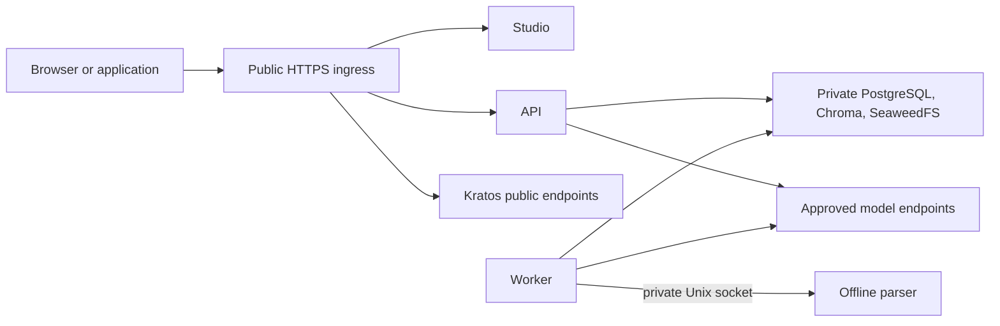

# Running the application on one server

Use this guide to understand what runs in an Inframeld installation and what the operator must protect. Assume one company runs Support on one server. Its Production **Deployment** selects a pipeline version inside the application. Installing or updating the containers is a different task.

[Application structure](application-structure.md) explains logical code owners. [Upgrades and recovery](upgrades-and-recovery.md) owns maintenance and restoration procedures.

**Reading route:** start with the service table, follow the public and private connections, then review storage and operating limits. Use the final checks before claiming a release is production-ready.

> **Design status:** This is the accepted v1 deployment design. The exact Compose configuration, supported hardware, and recovery behavior still need qualification, meaning tests against the versions and workload the release will support.

## Contents

| Reader’s question | Start here |
| --- | --- |
| Which components actually run? | [1. Understand the runtime services](#services) |
| Which connections may cross the boundary? | [2. Trace public and private access](#boundaries) |
| When does an object become application data? | [3. Publish immutable artifacts safely](#artifacts) |
| Which SeaweedFS state must survive? | [4. Configure complete durable storage](#storage) |
| What must the operator observe? | [5. Operate within visible limits](#operations) |
| What machine and workload should be measured? | [6. Separate a trial from qualified capacity](#capacity) |
| What must an installation release demonstrate? | [7. Maintainer checks](#maintainer-checks) |
| Why these choices, and what remains open? | [8. Decision and reference map](#decision-map) |

<a id="services"></a>

## 1. Understand the runtime services

Each release must name its tested Linux and container-runtime versions, dependencies, and image digests. A digest identifies exact container-image content, so a later change to a tag cannot silently change what is installed.

Docker Desktop can run a local trial. That trial does not establish that the Linux production security checks have passed.

The installation needs no AWS, Cognito, Vercel, hosted Chroma, cloud secret manager, or cloud infrastructure account. Its **S3-compatible API** is an interface for storing objects. Using it, or reading sources through an S3 connector, does not require hosting Inframeld on AWS.

Custom OpenAI-compatible model endpoints remain available in **open-source software (OSS)**. All model calls, including evaluation, use the application’s `ModelGateway` boundary.

V1 runs on one server. Kubernetes, Terraform for a hosted platform, multi-host operation, and automatic horizontal scaling are deferred. A future **Enterprise Edition (EE)** could use Chroma Cloud and hosted Kratos or Ory Network while keeping the same domain ownership and identity technology. V1 does not depend on those services.

### Give each runtime component one clear responsibility

In the table below, **ingress** is the entry point for incoming traffic and **TLS** protects HTTPS connections. An **artifact** is stored content, such as an uploaded file or processing result. A **manifest** is a saved inventory. **Vectors** are numbers used to search for relevant document excerpts.

| Component | Responsibility and exposure |
| --- | --- |
| **HTTPS ingress** | The only published application entry point. Terminates TLS, routes web/API requests and Kratos’s public endpoints, and enforces request-size/time bounds. Trust forwarded headers only from configured proxies, not arbitrary callers. |
| **Production-built Next.js web service** | Runs Studio, the browser interface, and its server-side session/proxy integration. Do not use a development server in the production profile. |
| **Python API** | Handles admission, authorization, queries, and release commands. Admission means durably accepting requested work. Database and vector services need no public ports. |
| **Python worker** | Runs the same application release/image as the API through a different command. Executes bounded durable jobs from PostgreSQL. Initially, only one worker is supported. Vector mutation ownership follows [Preparing and searching reliable indexes](indexing.md). |
| **Isolated parser service** | Converts untrusted documents using [Processing untrusted documents safely](ingestion-security.md)’s per-attempt sandbox. Has no network, credentials, general artifact volume, or Docker socket. Its only worker connection is a private IPC socket. IPC means interprocess communication. |
| **PostgreSQL** | Holds authoritative application state, jobs, permissions, and operation records on durable storage. Accessible only privately. Kratos uses a separate database and database role on the same instance, with separately controlled migrations. |
| **Chroma server** | A private HTTP service with its own durable volume. API and worker use its client API, not a shared embedded persistence directory. |
| **SeaweedFS artifact storage** | A private S3-compatible service on durable storage behind the application-owned artifact interface. Its master, volume, filer, and S3 roles fit in one process/container. Their responsibilities are explained below. |
| **Kratos identity service** | Self-hosted human identity and sessions, integrated with Inframeld-owned account screens. Administration remains private. A local trial needs no cloud identity account, and selecting Kratos does not implicitly include Hydra. |

OSS supports optional installation-level **OpenID Connect (OIDC)** sign-in through Kratos. The operator configures an external identity provider when one is wanted. CI jobs and integrations instead use Inframeld's [application credentials](access-control.md), which identify an application account and use its current permissions. They do not require another identity issuer.

### PostgreSQL delivers background jobs

The worker checks PostgreSQL for eligible jobs, claims a limited amount of work, and saves progress so another attempt can recover it. No queue broker is required. V1 also does not need an outbox dispatcher, a process that forwards saved messages to another system, merely to run background jobs.

**A process restart does not prove that an external operation failed.** A provider might have completed a call whose response was lost. [Background jobs, retries, and competing changes](jobs-and-idempotency.md) defines safe retries and how to represent uncertain outcomes.

### Reuse these processes for MCP, evaluation, and generated clients

The additional client and evaluation capabilities do not each need another service:

| Capability | Where it runs |
| --- | --- |
| **First-party MCP** | The Model Context Protocol adapter mounts the official Python SDK inside the existing API process. It reuses application operations and authorization, adding no container, store, or identity issuer. [Using Inframeld through MCP](mcp.md) defines the accepted transport/client profile and its pending qualification. |
| **OpenEvals** | A library inside the worker, with model calls through `ModelGateway` and configurable Luna as the initial judge. A judge is a model used to evaluate an answer. LangSmith, Langfuse, and exporters are deferred. |
| **Studio’s official TypeScript client** | A generated build artifact used by Studio, not another deployed service. An SDK is a software development kit providing client operations. |

These capabilities share the existing API, worker, and Studio processes.

<a id="boundaries"></a>

## 2. Trace public and private access



The arrows show allowed request paths, not every internal dependency. Storage and identity administration stay private. The parser has no external network connection and communicates with the worker only through its local socket.

### Restrict access and resources for the whole installation

| Boundary | Production requirement |
| --- | --- |
| **Public exposure** | Publish only the intended HTTPS ingress. Keep PostgreSQL, Chroma, artifact internals, identity administration, and parser IPC private. |
| **Networks and mounts** | Give services only the network attachments and filesystem mounts they need. The web service does not need data-volume access. |
| **Runtime privileges** | Pin images by release and digest, run application services as non-root, drop unnecessary capabilities, prohibit Docker socket mounts, and use read-only root filesystems where compatible. |
| **Resource use** | Explicitly limit CPU, memory, process count, and temporary disk use. |
| **Readiness** | Verify usable dependencies and required security controls. A health check is not an authorization check and does not replace permission enforcement on requests. |

The operator controls the host, Docker daemon, filesystem permissions, TLS material, outbound networking, and backups. These responsibilities remain even when Compose starts the services together.

Host full-disk encryption and encrypted off-host backups protect stored data when it is offline. They do not hide plaintext from a compromised running service or a host administrator.

### Separate infrastructure secrets from saved provider credentials

The operator supplies installation secrets, while users can save model-provider credentials through the application. These need different storage:

| Secret category | Storage and access |
| --- | --- |
| **Infrastructure/bootstrap material** | Protected operator-supplied files mounted only into the services that need them through service-specific Compose secrets. Bootstrap material supports the installation’s initial trusted setup. |
| **Application-entered model credentials** | Authenticated ciphertext in PostgreSQL using PyNaCl, as selected in [Connecting models and protecting provider credentials](model-connections.md). Authenticated ciphertext combines encryption with integrity checking. Users must be able to save these credentials through the application. |
| **Persistent root encryption key** | Supplied separately and mounted only into the API and worker. It is not a credential that every container receives. |

Compose mounts secret files into selected containers. **It does not encrypt or manage those secrets for the operator.** Provider files mounted by the operator also do not replace the application's ability to save credentials entered during onboarding.

No cloud secret manager or OpenBao service is selected. Never put secret values in tracked Compose files, image layers, job payloads, telemetry, or response replay records. The recorded reference for mount behavior is [Docker Compose secrets](https://docs.docker.com/compose/how-tos/use-secrets/).

The installation must enforce [parser isolation](ingestion-security.md#isolation). If it cannot establish the required sandbox, it must fail readiness rather than run parsing in an ordinary worker subprocess or a privileged container. Studio has no access to the database, artifact volumes, or provider keys.

<a id="artifacts"></a>

## 3. Publish immutable artifacts safely

**SeaweedFS is the supported v1 S3 implementation.** It stores objects on the host's disks. API and worker code reach those objects through Inframeld's `ArtifactStore` interface and its S3 adapter.

`ArtifactStore` defines the operations the application needs. Its adapter translates them into storage calls. Domain objects must not expose buckets, object keys, or storage SDK types. That separation keeps Knowledge and Releases independent of the storage product if a cloud adapter is added later.

Give API and worker credentials only the storage access they need, rather than an administrative root key. Browsers and project integrations use Inframeld's authorized upload and download routes. Direct bucket credentials would let them bypass document-group permissions.

S3 identity integration, public bucket access, user-managed bucket policies, and a separate object-storage administration product are not required.

### Implement only the required storage operations

| Requirement | Expected behavior |
| --- | --- |
| **Streaming** | Stream immutable source, processing, and manifest bytes. Generate opaque keys on the server, never from uploaded paths. An opaque key has no caller-controlled filesystem meaning. |
| **Operation subset** | Support `PutObject`, `GetObject`, `HeadObject`, bounded `ListObjectsV2`, and `DeleteObject`, with verified size/checksum behavior. These write, read, inspect, list, and delete objects. |
| **Multipart uploads** | Enable multipart operations only when the selected artifact bounds require them. If enabled, clean up incomplete uploads. |
| **Publication** | Publish the PostgreSQL artifact reference only after the object upload is complete and verified. A failed upload cannot become a successful document or materialization reference. A materialization is a prepared searchable index. |
| **Checksums** | Never assume an object `ETag` is always a content checksum. Verify the selected server/SDK behavior. |
| **Compatibility** | Pin and test endpoint addressing, TLS/customer certificate-authority trust, request signing, and checksums. “S3-compatible” does not mean every AWS extension exists. |
| **Retention** | Storage lifecycle rules must not expire objects referenced by retained current, candidate, or previous releases. Application retention/deletion owns those decisions. |

### Upload immutable objects, then publish their references

Give each upload attempt a new object key and keep its bytes unchanged. This prevents two attempts from overwriting one another. Verify the completed upload before a PostgreSQL transaction publishes its reference, and publish only if that attempt is still allowed to do so.

```text
Upload under a new attempt-specific object key
    -> Verify the completed object
        -> Conditionally publish its reference in PostgreSQL
```

A successful upload followed by an application crash may leave an unreferenced object for bounded cleanup. Retrying must not replace an already-published artifact with different bytes.

An upload can finish after the application has already tried to clean it up. The result is an **orphan**, an object with no live application reference. While an earlier upload is unresolved, one “not found” check cannot prove final deletion. Keep the attempt record and the **tombstone**, the permanent record that its identity is retired. Test how the storage adapter establishes that old uploads can no longer finish.

These rules govern how the adapter uploads and publishes objects. They do not require building a storage engine. Object versioning or a replica on the same host does not replace an off-host backup.

<a id="storage"></a>

## 4. Configure complete durable storage

Local trials and production use the same proposed arrangement: **one SeaweedFS process with master, volume, local filer metadata, and S3 enabled**.

| SeaweedFS role | What must be accounted for |
| --- | --- |
| **Master** | The master’s state and its explicitly configured durable directory. |
| **Volume** | Stored object chunks and their durable directory. |
| **Filer** | Metadata mapping object names and attributes to stored chunks. This metadata is separate from application PostgreSQL. |
| **S3** | The private object API used by authorized backend clients. |

The command proposed for testing is `weed server -filer -s3`, with explicit durable paths, static backend credentials, and unused listeners disabled. It keeps these roles in one container without a separate metadata database or cluster manager.

**This is a recommendation to test, not an already-qualified production Compose file.**

### Fix paths and disable unnecessary listeners

The recorded review of SeaweedFS 4.47 identified the following settings to test. They are version-specific evidence, not a claim about every later release:

| Example setting | Purpose |
| --- | --- |
| `-dir=/data/volume` | Explicit volume-data location. |
| `-master.dir=/data/master` | Separate master-state location. |
| `-s3.config=/run/secrets/seaweed-s3.json` | Operator-supplied static S3 credential configuration. |
| `-s3.port.iceberg=0` | Disable the Iceberg listener. |
| `-s3.port.lance=0` | Disable the Lance listener. |
| `-s3.iam=false` | Disable the optional S3 identity/access-management subsystem. |

Also disable WebDAV, SFTP, debug, and telemetry functionality. Set replication, volume-size and volume-count limits, and the free-space threshold for accepting work from the tested disk budget. Include these paths in the backup inventory. The table is **not a complete deployable command**. Recorded reference: [SeaweedFS 4.47 server options](https://github.com/seaweedfs/seaweedfs/blob/4.47/weed/command/server.go).

Configure one embedded `[leveldb2]` filer store in `filer.toml`, with `enabled=true` and `dir=/data/filer`. Disable other stores and persist the **whole `/data` tree**. Never let the process’s default working directory decide where persistent metadata goes.

This embedded metadata store does not require another database service, but it does create data that the backup must include. Recorded references: [filer store configuration](https://github.com/seaweedfs/seaweedfs/blob/4.47/weed/command/scaffold/filer.toml) and [LevelDB2 implementation](https://github.com/seaweedfs/seaweedfs/blob/4.47/weed/filer/leveldb2/leveldb2_store.go).

### Do not substitute an unreviewed quick start

`weed mini` also combines the components. However, the recorded 4.47 inspection found that it starts an administration/maintenance-worker subsystem even with `-admin.ui=false`. WebDAV and additional S3 catalog listeners also need attention. It persists `mini.options` and can generate local **server-side encryption (SSE)** key files.

For those reasons, the generic mini quick start is not the secured configuration selected for testing. Do not copy its default ports and command into production or add a second trial arrangement without a need. Recorded reference: [tagged mini startup and persistence](https://github.com/seaweedfs/seaweedfs/blob/4.47/weed/command/mini.go).

### Verify access control and actual durability

Only API/worker clients need the S3 interface. Keep master, volume, and raw filer endpoints off the public ingress and separated from untrusted services.

Before release, configure explicit credentials and test that unauthorized requests are rejected. A running S3 endpoint does not prove that authentication is active.

Pin and test the settings that control when writes reach durable storage. Test recovery after interrupted writes too. A successful HTTP upload alone does not prove that the data survives power loss. [Upgrades and recovery](upgrades-and-recovery.md) owns the complete backup inventory and proposed stop, copy, and restore procedure.

<a id="operations"></a>

## 5. Operate within visible limits

Operators need logs with secrets removed and a retention limit, plus visible job progress, errors, latency, disk use, and dependency health. Stop accepting work before storage or work budgets run out. Show how old the latest usable backup is, whether transfers failed, and the results of restore tests. V1 does not require an external monitoring platform.

Each release supplies Compose and configuration guidance, fixed images, matching API and worker versions, and the required parser/model assets. Check free space, secrets, TLS, identity, and storage before starting normal work. Never ship shared default credentials or an unauthenticated production mode.

Before changing stored state, follow the [maintenance sequence](upgrades-and-recovery.md#upgrades) and create a [coordinated backup](upgrades-and-recovery.md#backup). API and worker startup must not both try to migrate the database. A named volume survives replacing a container, but cannot survive losing the host disk. Keep a matching backup off-host, including identity state and required keys.

If published vectors are lost, restore them or seek operator intervention. Manifests explain how vectors were created but do not contain their numerical values. Temporary saved write batches are not a permanent vector archive.

<a id="capacity"></a>

## 6. Separate a trial from qualified capacity

The proposed trial workload is **100–200 small text-native documents**, around **1,000–2,000 chunks**, one embedding profile, one active query, and one parser job.

The planning machine is a 16 GiB laptop with roughly four CPUs and 8 GiB of memory assigned to Docker, plus 50 GiB of free disk. Models run remotely or through the customer's gateway.

OCR, large tables, local language models, and concurrent evaluations can require substantially more resources.

These trial figures have not been tested. [Indexing qualification](indexing.md#qualification) defines the larger proposed test: 25,000 documents, 500,000 vectors, and two shards. Measure complete updates and queries, including membership checks, verification, and cleanup. No million-document capacity is established. Backend development can begin before this work is complete, but production capacity claims cannot.

<a id="maintainer-checks"></a>

## 7. Maintainer checks

The following are release criteria, not tests completed by this record.

| Area | Required verification |
| --- | --- |
| **Installation and identity** | Install on a fresh machine and complete an authenticated local trial. Pin tested Kratos and SeaweedFS images before release. |
| **Exposure and isolation** | Verify production TLS, private ports, parser isolation, and required security/readiness controls. |
| **Durable execution** | Restart jobs and demonstrate the documented retry and uncertain-outcome behavior. |
| **Storage failures** | Kill storage during upload, fill its disk, restart with acknowledged writes, and corrupt a test artifact. Partial writes must never become published references. Checksum failures must be visible. |
| **Storage authorization** | Prove unauthorized S3 access is denied rather than assuming credentials are enforced because the service starts. |
| **Recovery** | Back up and restore a consistent set, including filer metadata, volume bytes, Chroma, identity/application state, and required keys/configuration. |
| **Upgrades and product behavior** | Exercise controlled migrations and the release-loop smoke test, a short end-to-end check of the essential workflow. |

### Measure this workload rather than borrowing a vendor result

To measure Inframeld's storage behavior, record the hardware, object sizes, concurrency, checksum handling, durability settings, and server/SDK versions. Otherwise the results are difficult to reproduce or compare.

Measure uploads, reads, limited-size manifest operations, repeated small-corpus updates, deletion, memory peaks, and backup/restore time. Also measure **disk amplification**, the storage consumed beyond the logical input, and **p95 latency**, the duration within which 95% of observed requests finish.

A large sequential-transfer result does not predict thousands of small manifest operations. Parsing, embedding, or Chroma may dominate total build time, but that remains an assumption until measured.

<a id="decision-map"></a>

## 8. Decision and reference map

Exact versions and settings, supported hosts, disk limits, durability, and recovery timings still need tests. Multi-host operation, horizontal scaling, and cloud adapters require later decisions. A trial can explicitly use disposable data, but it still requires authentication, permissions, and parser isolation.

| Decision | Rationale |
| --- | --- |
| [ADR-0035](../adr/ADR-0035-deploy-v1-on-one-server-through-docker-compose.md) | Deploy v1 on one server through Docker Compose. |
| [ADR-0036](../adr/ADR-0036-use-seaweedfs-through-the-application-s3-storage-boundary.md) | Use SeaweedFS through the application S3 storage boundary. |
