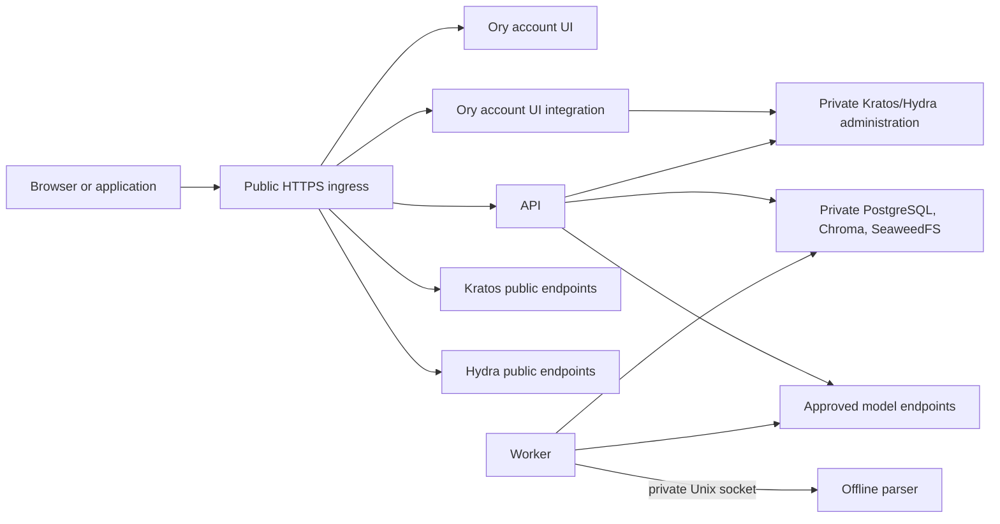

# Running the application on one server

Use this guide to understand what runs in an Inframeld installation and what the operator must protect. Assume one company runs Support on one server. Its Production **Deployment** selects a pipeline version inside the application. Installing or updating the containers is a different task.

[Application structure](application-structure.md) explains logical code owners. [Upgrades and recovery](upgrades-and-recovery.md) owns maintenance and restoration procedures.

**Reading route:** start with the service table, follow the public and private connections, then review storage and operating limits. Use the final checks before claiming a release is production-ready.

> **Design status:** This is the accepted v1 deployment design. The exact Compose configuration, supported hardware, and recovery behavior still need qualification, meaning tests against the versions and workload the release will support.

## Contents

| Reader’s question | Start here |
| --- | --- |
| Which components actually run? | [1. Understand the runtime services](#services) |
| Which connections may cross the boundary? | [2. Trace public and private access](#boundaries) |
| How are human CLI login and local HTTP deployed? | [Identity runtime](#identity-runtime) and [managed local HTTP](#managed-local-http) |
| When does an object become application data? | [3. Publish immutable artifacts safely](#artifacts) |
| Which SeaweedFS state must survive? | [4. Configure complete durable storage](#storage) |
| What must the operator observe? | [5. Operate within visible limits](#operations) |
| What machine and workload should be measured? | [6. Separate a trial from qualified capacity](#capacity) |
| What must an installation release demonstrate? | [7. Maintainer checks](#maintainer-checks) |
| Why these choices, and what remains open? | [8. Decision and reference map](#decision-map) |

<a id="services"></a>

## 1. Understand the runtime services

Each release must name its tested Linux and container-runtime versions, dependencies, and image digests. A digest identifies exact container-image content, so a later change to a tag cannot silently change what is installed.

Docker Desktop can run a local trial. That trial does not establish that the Linux production security checks have passed.

The installation needs no AWS, Cognito, Vercel, hosted Chroma, cloud secret manager, or cloud infrastructure account. Its **S3-compatible API** is an interface for storing objects. Using it, or reading sources through an S3 connector, does not require hosting Inframeld on AWS.

Custom OpenAI-compatible model endpoints remain available in **open-source software (OSS)**. All model calls, including evaluation, use the application’s `ModelGateway` boundary.

V1 runs on one server. Kubernetes, Terraform for a hosted platform, multi-host operation, and automatic horizontal scaling are deferred. A future **Enterprise Edition (EE)** could use Chroma Cloud and hosted Kratos or Ory Network while keeping the same domain ownership and identity technology. V1 does not depend on those services.

### Give each runtime component one clear responsibility

In the table below, **ingress** is the entry point for incoming traffic and **TLS** protects HTTPS connections. An **artifact** is stored content, such as an uploaded file or processing result. A **manifest** is a saved inventory. **Vectors** are numbers used to search for relevant document excerpts.

| Component | Responsibility and exposure |
| --- | --- |
| **HTTPS ingress** | The production/network application entry point. Terminates TLS, routes web/API and Kratos/Hydra public endpoints, and enforces request-size/time bounds. Trust forwarded headers only from configured proxies, not arbitrary callers. The managed-local HTTP exception below does not apply to ordinary network installations. |
| **Ory account UI integration** | Small browser login, consent and recovery experience needed for human CLI login independently of the full Studio. Uses official Ory clients and documented Kratos/Hydra flows. Private server-side administration credentials never reach the browser. Exact image/container arrangement remains release qualification work. |
| **Full Studio (deferred)** | Not required in the v1 runtime or release chain. When delivered, use a production build and the same generated-client/identity contracts. The account UI above is required independently. |
| **Python API** | Handles admission, authorization, queries, and release commands. Admission means durably accepting requested work. Database and vector services need no public ports. |
| **Python worker** | Runs the same application release/image as the API through a different command. Executes bounded durable jobs from PostgreSQL. Initially, only one worker is supported. Vector mutation ownership follows [Preparing and searching reliable indexes](indexing.md). |
| **Isolated parser service** | Converts untrusted documents using [Processing untrusted documents safely](ingestion-security.md)’s per-attempt sandbox. Has no network, credentials, general artifact volume, or Docker socket. Its only worker connection is a private IPC socket. IPC means interprocess communication. |
| **PostgreSQL** | Holds authoritative application state, jobs, permissions, and operation records on durable storage. Accessible only privately. Kratos and Hydra each use their own database and database role, separate from application state, with separately controlled migrations. One PostgreSQL server can host all three. |
| **Chroma server** | A private HTTP service with its own durable volume. API and worker use its client API, not a shared embedded persistence directory. |
| **SeaweedFS artifact storage** | A private S3-compatible service on durable storage behind the application-owned artifact interface. Its master, volume, filer, and S3 roles fit in one process/container. Their responsibilities are explained below. |
| **Kratos identity service** | Self-hosted human identities, sign-in methods and browser sessions, integrated with the account UI. Administration remains private. A local trial needs no cloud identity account. |
| **Hydra OAuth/OIDC service** | Explicitly selected for first-party human CLI login and token lifecycle under ADR-0053. Public protocol endpoints are exposed through the configured ingress; administration and introspection remain private. It is not the owner of Inframeld grants or application/provider keys. |

OSS supports optional installation-level **OpenID Connect (OIDC)** sign-in through Kratos. The operator configures an external identity provider when one is wanted. CI jobs and integrations instead use Inframeld's [application credentials](access-control.md), which identify an application account and use its current permissions. They do not require another identity issuer.

<a id="identity-runtime"></a>

### Qualify Kratos, Hydra and the account UI as one login path

Alice's CLI opens her system browser, Kratos verifies her identity through the account UI, and Hydra returns the standard authorization result to the CLI. The backend privately verifies subsequent opaque access tokens and current Kratos identity eligibility before checking its own Access state. [The Access guide](access-control.md#human-cli-authentication) owns the trust boundary and its detailed registration, credential-lifecycle and qualification requirements.

Provision the official `inframeld-cli` public client using Hydra's private administration interface during installation. Ordinary setup users do not register OAuth clients. Configure the API URL, expected issuer, API audience, redirect rules and account-UI origins explicitly. Expose only necessary public protocol/UI endpoints. Use service-specific secrets, private administration, separate migrations and official Ory APIs rather than shared identity-table reads or a custom token issuer.

The accepted release policy is the latest suitable reviewed OSS Hydra release, with an exact tested version and image digest. The historical v26.2.0 source inspection was dated 2026-09-28, not a claim that it remains newest or qualified. Check advisories and compatible Kratos/UI/client versions before pinning. Device authorization must remain unavailable until its specific release gates pass. Never use a floating `latest` tag, silently change distribution or upgrade identity services during `local start`.

Primary accepted defaults are a five-minute access token, seven-day rolling refresh token, one-minute authorization code and eight-hour Kratos browser session. Use the respective containers' documented environment settings and the [credential-lifecycle configuration inventory](access-control.md#cli-credential-lifecycle). These are deployment settings, not user-project files. Other flow/session settings need qualified keys and explicit effective defaults, not guessed values. Refresh rotation, zero reuse grace and no positive token/identity-eligibility cache remain the selected profile.

Preserve Hydra's identity/protocol state, client registrations, keys and required configuration in the coordinated identity backup/upgrade procedure. A container restart must not create a new issuer, change account mappings or invalidate persisted state accidentally. Restoring older identity state may revive old credentials, so security reconciliation precedes reopening access. Exact migration/restore and cross-product revocation behavior require release tests; this edit neither runs migrations nor qualifies a restore.

**Implemented-state distinction, 2026-09-29:** the inspected development/test Compose files configure Kratos but not Hydra. The backend's existing human dependency is cookie/CSRF-based. The table above records accepted runtime design, not services added by this documentation change.

### PostgreSQL delivers background jobs

The worker checks PostgreSQL for eligible jobs, claims a limited amount of work, and saves progress so another attempt can recover it. No queue broker is required. V1 also does not need an outbox dispatcher, a process that forwards saved messages to another system, merely to run background jobs.

**A process restart does not prove that an external operation failed.** A provider might have completed a call whose response was lost. [Background jobs, retries, and competing changes](jobs-and-idempotency.md) defines safe retries and how to represent uncertain outcomes.

### Reuse these processes for MCP, evaluation, and generated clients

The additional client and evaluation capabilities do not each need another service:

| Capability | Where it runs |
| --- | --- |
| **First-party MCP** | The Model Context Protocol adapter mounts the official Python SDK inside the existing API process. It reuses application operations and authorization, adding no container, store, or identity issuer. [Using Inframeld through MCP](mcp.md) defines the accepted transport/client profile and its pending qualification. |
| **Ragas** | An embedded worker library for starter generation and claim-based faithfulness, with explicit generator/judge bindings through `ModelGateway`. No hosted evaluation account or extra service. External evaluation/trace exporters remain deferred. |
| **CLI's generated application client** | A build artifact inside the Rust CLI, not another backend service. Future Studio uses its generated TypeScript client. Generator selection and runtime compatibility need qualification. |

These capabilities share the existing API and worker processes. The account UI serves identity flows; full Studio is deferred.

For Ragas workers, set `RAGAS_DO_NOT_TRACK=true` before importing or using the library and disable library-owned external callbacks/exporters. Do not provide Ragas with provider credentials or independent clients; the gateway resolves credentials for authorized calls. Keep secrets, prompts, excerpts, and answers out of ordinary library logs. This does not disable Inframeld's independently controlled operational or RAG-workload tracing. Verify actual outbound destinations, default constructors, retry limits, and any required local assets with the locked dependencies before release. [Evaluation](evaluation.md#gateway) records v0.4.3 source-inspected compatibility and the still-unexecuted qualification plan.

<a id="boundaries"></a>

## 2. Trace public and private access


```mermaid
flowchart LR
    Browser[Browser or application] --> HTTPS[Public HTTPS ingress]
    HTTPS --> Web[Ory account UI]
    HTTPS --> AccountUI[Ory account UI integration]
    HTTPS --> API[API]
    HTTPS --> Kratos[Kratos public endpoints]
    HTTPS --> Hydra[Hydra public endpoints]
    AccountUI --> IdentityAdmin[Private Kratos/Hydra administration]
    API --> IdentityAdmin
    API --> Stores[Private PostgreSQL, Chroma, SeaweedFS]
    Worker[Worker] --> Stores
    Worker -->|private Unix socket| Parser[Offline parser]
    API --> Models[Approved model endpoints]
    Worker --> Models
```

The arrows show allowed request paths, not every internal dependency. Storage and identity administration stay private. The parser has no external network connection and communicates with the worker only through its local socket.

### Restrict access and resources for the whole installation

| Boundary | Production requirement |
| --- | --- |
| **Public exposure** | Publish only the intended HTTPS ingress. Keep PostgreSQL, Chroma, artifact internals, identity administration, and parser IPC private. |
| **Networks and mounts** | Give services only the network attachments and filesystem mounts they need. The web service does not need data-volume access. |
| **Runtime privileges** | Pin images by release and digest, run application services as non-root, drop unnecessary capabilities, prohibit Docker socket mounts, and use read-only root filesystems where compatible. |
| **Resource use** | Explicitly limit CPU, memory, process count, and temporary disk use. |
| **Readiness** | Verify usable dependencies and required security controls. A health check is not an authorization check and does not replace permission enforcement on requests. |

The operator controls the host, Docker daemon, filesystem permissions, TLS material, outbound networking, and backups. These responsibilities remain even when Compose starts the services together.

Host full-disk encryption and encrypted off-host backups protect stored data when it is offline. They do not hide plaintext from a compromised running service or a host administrator.

<a id="managed-local-http"></a>

### Use HTTP only for the CLI-managed loopback trial

The developer accepted local HTTP instead of installing a local certificate authority. This exception covers only the same-machine runtime provisioned and controlled by the CLI for the current OS user, with installation identity and endpoint configuration from protected managed state. It is not selected by a target's name, an arbitrary URL, a server claim or a general insecure flag.

- Publish necessary public UI/protocol/API listeners only on literal loopback. Do not expose identity administration, introspection, databases or storage ports, even on loopback. Preserve the private container network and the narrow operator maintenance channel.
- Require the CLI, browser and managed runtime on the same supported machine. Remote Docker contexts, LAN/shared servers, tunnels and port forwarding do not qualify. Use HTTPS for ordinary added/imported targets, including private addresses.
- Keep exact configured origins, host/Origin checks, CSRF, normal authentication, authorization, budgets and rate limits. Use Ory's documented development mode only in this bounded profile. Do not disable TLS certificate verification or use `--insecure` for remote connections or model destinations.
- Persist issuer/installation identity and server state across stop/start. Fail on an occupied configured service port instead of adopting another listener. A deliberate origin change invalidates the affected stored authentication. A destructive reset creates a new installation identity even if its URLs match the old one.
- The temporary CLI callback has its own standard loopback exception for local or remote login. It must not be confused with permission to send production token/API requests over HTTP.

The following requirements apply to the accepted managed-local profile. They are not certification of existing Compose files.

#### What qualifies as managed local

All of these conditions are required together:

1. The runtime was provisioned and is managed by this CLI for the current OS user under the single persistent-instance contract. Its identity and effective endpoint configuration come from the protected local runtime state, not a server response or arbitrary target file.
2. The CLI, browser and runtime are on the same supported development machine. A qualified Docker Desktop VM may be part of that machine. A remote Docker daemon/context, remote workstation, shared server, tunnel or forwarded port is not the managed local exception.
3. Host-published public service listeners bind explicitly to loopback and are not exposed to the LAN, internet or other interfaces. Private services are not published. Runtime configuration must preserve the private container network, not enable direct external routing or host-network exposure.
4. The CLI verifies the intended runtime/configuration and supported isolation prerequisites before starting login or sending saved credentials. Unknown, stale, redirected or conflicting state fails closed with a repair instruction.

A target named `local`, a private RFC1918 address, a hostname resolving to loopback or a successful HTTP health response does not independently establish these conditions. Imported/manually added targets do not acquire the exception. There is no user-settable `allow_http` or `--insecure` escape hatch for arbitrary targets. This verification checks managed state and exposure; it is not TLS-like proof against an attacker who controls the development machine.

#### Allowed connections and published endpoints

| Connection | Transport/exposure rule |
| --- | --- |
| Host CLI/browser to the managed local API, account UI and Ory public endpoints | HTTP permitted only at the runtime's exact configured loopback origins |
| The managed stack's internal service calls | Private same-machine container-network HTTP is permitted where supported; no host publication of admin/storage services |
| Desktop browser to the temporary CLI OAuth callback | HTTP on literal loopback and the registered `/oauth/callback` path; RFC 8252 exception, independently of local/remote target |
| CLI/browser to remote, LAN-accessible or production public endpoints | Certificate-verified HTTPS; private IPs and environment labels do not waive it |
| External model/identity-provider traffic | Preserve verified HTTPS and existing provider policy; local HTTP does not authorize secret-bearing HTTP to a provider |

For the first managed implementation, use literal `127.0.0.1` consistently for browser/host-facing HTTP URLs, with only the runtime's explicitly recorded ports and routes. Do not mix `localhost`, another IP spelling or an arbitrary local domain into the same cookie/issuer configuration. Do not publish a wildcard IPv6 listener alongside an IPv4 loopback listener. Additional address families need their own explicit configuration and qualification, not implicit fallback.

The actual service port numbers/routes are release configuration, not guessed defaults in multiple clients. Record them once in managed runtime state and generate the matching Ory/UI/CLI settings. Preserve origins across restart; if a port is occupied, fail rather than silently changing the issuer or sending credentials to the process using it. A deliberate origin change follows the Access guide's authentication-binding invalidation rule. The temporary OAuth callback port remains ephemeral and is not the issuer's persistent port.

Publish only the needed public entry point(s). Never publish Hydra/Kratos admin, PostgreSQL or storage ports, even on loopback, merely because it is development. The host operator's narrow maintenance channel for initial host-authorized bootstrap remains separate. UI server code may use explicit private service addresses; the browser still uses the configured public loopback origins. Internal routing cannot redefine the issuer, audience or browser redirect destination.

[Docker's port-publishing documentation](https://docs.docker.com/engine/network/port-publishing/) warns that unqualified port mappings publish beyond localhost, and that versions older than 28.0.0 have a localhost/L2 exposure caveat. Do not qualify an affected runtime on the strength of the Compose binding alone. Require a supported fixed runtime and verify actual exposure, including VM/WSL networking where offered.

#### HTTP exception enforcement

Use a target-scoped HTTP client policy derived from verified managed state, not a global TLS disable switch. HTTP API/discovery/token/revocation endpoints must be the expected local endpoints. Validate discovery issuer and endpoint destinations before any credential exchange. Do not follow a discovered URL or redirect that expands the HTTP allowlist. Do not forward Authorization/cookies to another origin. The normal remote client always verifies TLS, including while another concurrent command is working against local.

Disable proxy forwarding for managed loopback CLI requests explicitly; inherited `HTTP_PROXY`/`HTTPS_PROXY` settings must not send local credentials off-machine. The supported browser/runtime configuration must also bypass network proxies for its loopback origins. If this cannot be established in a managed corporate or remote-browser environment, do not claim this local mode is qualified; direct the user to an HTTPS deployment. This is not permission to change their system proxy.

Allow only configured Host/origin values at the public entry points. Keep browser Origin/CSRF checks and restrictive CORS where applicable; no wildcard credentialed origins and no assumption that a request is authorized because it came from loopback. Exact host validation and rejected cross-origin requests are release checks, including requests from hostile websites and DNS-rebinding attempts. Origin checks do not replace authentication or constrain a malicious native process that can fabricate headers.

External company sign-in can redirect through its separately configured HTTPS identity provider using the ordinary Ory integration. That is not permission for an off-machine HTTP hop. Providers or browser authentication methods that require an HTTPS callback/origin must be tested in the HTTPS deployment; do not weaken their policy or promise that every production method works in local HTTP.

#### Preserve authentication; qualify development settings

Use Ory's documented development configuration for HTTP, and inventory the exact security differences in the pinned Kratos/Hydra/UI versions. Kratos documents [HTTP localhost development mode](https://www.ory.com/docs/oss/kratos/debug/csrf); the pinned [Hydra quickstart](https://github.com/ory/hydra/blob/v26.2.0/quickstart.yml) uses `--dev`. These establish development support, not approval to copy the full demo stack: its example admin port exposure and other demo conveniences are not Inframeld's contract.

The local override may enable the supported HTTP/cookie behavior needed by those components. It must not become a generic backend "skip security" mode. Retain real Kratos identities and login, the Access login transaction's PKCE/state/nonce and issuer checks, audience/client/scope validation, private introspection, active-account checks, normal grants, revocation/rotation, CSRF and secure credential storage. Use real per-installation persistent server secrets, not Ory sample secrets or passwords. Do not disable a failing check to make the quickstart work.

Explicitly test cookie attributes, cookie-name separation from unrelated local apps, CSRF, redirect handling, browser login/recovery and CLI refresh/logout. Keep cookies HttpOnly where required by the account integration. Record any HTTP-specific Secure/SameSite behavior rather than claiming production cookie parity. Scope cookies as narrowly as the supported Ory integration permits; ports alone are not a cookie-isolation boundary.

Remote/production deployment configuration must not inherit these development flags or relaxed public-cookie settings. Local and production profiles/configs must be independently reviewable and tested. If a selected library/release cannot support the bounded development mode through documented options, block that release/integration; do not fork the protocol or introduce a custom token bridge.

#### Threat model and non-goals

This mode is for a trusted, personal development machine, not a shared service or a security boundary against hostile local users/processes. Local API calls and identity flows may carry credentials over plaintext HTTP within that host, including credentials submitted to normal provider-connection setup. OS secure storage protects persisted CLI credentials; it does not encrypt the HTTP path. PKCE protects authorization-code redemption, not captured bearer tokens or every message in the browser flow. Docker itself does not provide TLS.

No claim is made that HTTP authenticates the local server cryptographically or resists a compromised host, malicious local process, privileged packet capture or replacement of trusted runtime state. Explicit binding, private services and browser defenses reduce exposure but do not eliminate these residual risks. Use development identities/data and appropriately limited provider credentials. External provider calls still follow the existing ModelGateway HTTPS policy; the accepted credential-free local Ollama exception is unchanged.

Production and network use retain the normal OAuth/TLS security requirements. RFC 8252's loopback callback exception is not an exemption for OAuth token/API endpoints in production. Our additional development-only HTTP allowance is an explicit Inframeld deployment choice using Ory's supported development mode. Keep an HTTPS deployment in the release tests for production cookies, TLS and identity-provider integration; local HTTP success is not production qualification.

#### Startup, setup and fail-closed behavior

`local start` checks the supported local runtime and effective isolation settings, starts/reuses the stack and reports runtime health plus the next setup command. It does not install a CA, change trust stores, authenticate, create a human, claim administration or change the saved target/account/project selections. `setup --target local` rechecks the boundary, explicitly reports local HTTP development mode, then follows normal browser authentication, host-authorized bootstrap and explicit context-selection steps. Existing valid login/setup state is reused safely.

| Condition | Required outcome |
| --- | --- |
| Qualified managed loopback runtime | Continue using its exact HTTP origins; no certificate ceremony |
| Remote Docker context, unverified origin or unsupported isolation | Refuse managed-local startup/login as appropriate; no credential disclosure |
| Wildcard/LAN publishing or exposed private services | Fail preflight; do not declare the stack ready or start authentication |
| Expected port occupied or runtime identity changed | Stop with a conflict/reset explanation; do not reuse credentials against the responder |
| Local runtime stopped/unavailable | Give the explicit `local start` instruction; never fall back to dev/prod |
| Ordinary target configured with HTTP | Reject it before authentication, even if named `local` or pointing at loopback/private IP |
| Remote certificate failure or HTTPS-to-HTTP redirect | Fail TLS/authentication; never apply the local exception |
| Local browser/provider flow incompatible with HTTP | Report the unsupported configuration and HTTPS deployment path; do not bypass the failing control |
| User requests LAN/tunnel/public access | Use the normal HTTPS deployment procedure, not a broadened local bind or inherited dev profile |

Neither `--no-input` nor a general confirmation flag can authorize relaxing these boundaries. An optional production-like HTTPS installation on the same machine is an ordinary HTTPS target, not a required extra v1 local TLS/CA wizard. No existing CA is removed automatically; removing previously installed trust is a separate explicit operator action, not part of this design-document update.

### Separate infrastructure secrets from saved provider credentials

The operator supplies installation secrets, while users can save model-provider credentials through the application. These need different storage:

| Secret category | Storage and access |
| --- | --- |
| **Infrastructure/bootstrap material** | Protected operator-supplied files mounted only into the services that need them through service-specific Compose secrets. Bootstrap material supports the installation’s initial trusted setup. |
| **Application-entered model credentials** | Authenticated ciphertext in PostgreSQL using PyNaCl, as selected in [Connecting models and protecting provider credentials](model-connections.md). Authenticated ciphertext combines encryption with integrity checking. Users must be able to save these credentials through the application. |
| **Persistent root encryption key** | Supplied separately and mounted only into the API and worker. It is not a credential that every container receives. |

Compose mounts secret files into selected containers. **It does not encrypt or manage those secrets for the operator.** Provider files mounted by the operator also do not replace the application's ability to save credentials entered during onboarding.

No cloud secret manager or OpenBao service is selected. Never put secret values in tracked Compose files, image layers, job payloads, telemetry, or response replay records. The recorded reference for mount behavior is [Docker Compose secrets](https://docs.docker.com/compose/how-tos/use-secrets/).

The installation must enforce [parser isolation](ingestion-security.md#isolation). If it cannot establish the required sandbox, it must fail readiness rather than run parsing in an ordinary worker subprocess or a privileged container. Studio has no access to the database, artifact volumes, or provider keys.

<a id="artifacts"></a>

## 3. Publish immutable artifacts safely

**SeaweedFS is the supported v1 S3 implementation.** It stores objects on the host's disks. API and worker code reach those objects through Inframeld's `ArtifactStore` interface and its S3 adapter.

`ArtifactStore` defines the operations the application needs. Its adapter translates them into storage calls. Domain objects must not expose buckets, object keys, or storage SDK types. That separation keeps Knowledge and Releases independent of the storage product if a cloud adapter is added later.

Give API and worker credentials only the storage access they need, rather than an administrative root key. Browsers and project integrations use Inframeld's authorized upload and download routes. Direct bucket credentials would let them bypass document-group permissions.

S3 identity integration, public bucket access, user-managed bucket policies, and a separate object-storage administration product are not required.

### Implement only the required storage operations

| Requirement | Expected behavior |
| --- | --- |
| **Streaming** | Stream immutable source, processing, and manifest bytes. Generate opaque keys on the server, never from uploaded paths. An opaque key has no caller-controlled filesystem meaning. |
| **Operation subset** | Support `PutObject`, `GetObject`, `HeadObject`, bounded `ListObjectsV2`, and `DeleteObject`, with verified size/checksum behavior. These write, read, inspect, list, and delete objects. |
| **Multipart uploads** | Enable multipart operations only when the selected artifact bounds require them. If enabled, clean up incomplete uploads. |
| **Publication** | Publish the PostgreSQL artifact reference only after the object upload is complete and verified. A failed upload cannot become a successful document or materialization reference. A materialization is a prepared searchable index. |
| **Checksums** | Never assume an object `ETag` is always a content checksum. Verify the selected server/SDK behavior. |
| **Compatibility** | Pin and test endpoint addressing, TLS/customer certificate-authority trust, request signing, and checksums. “S3-compatible” does not mean every AWS extension exists. |
| **Retention** | Storage lifecycle rules must not expire objects referenced by retained current, candidate, or previous releases. Application retention/deletion owns those decisions. |

### Upload immutable objects, then publish their references

Give each upload attempt a new object key and keep its bytes unchanged. This prevents two attempts from overwriting one another. Verify the completed upload before a PostgreSQL transaction publishes its reference, and publish only if that attempt is still allowed to do so.

```text
Upload under a new attempt-specific object key
    -> Verify the completed object
        -> Conditionally publish its reference in PostgreSQL
```

A successful upload followed by an application crash may leave an unreferenced object for bounded cleanup. Retrying must not replace an already-published artifact with different bytes.

An upload can finish after the application has already tried to clean it up. The result is an **orphan**, an object with no live application reference. While an earlier upload is unresolved, one “not found” check cannot prove final deletion. Keep the attempt record and the **tombstone**, the permanent record that its identity is retired. Test how the storage adapter establishes that old uploads can no longer finish.

These rules govern how the adapter uploads and publishes objects. They do not require building a storage engine. Object versioning or a replica on the same host does not replace an off-host backup.

<a id="storage"></a>

## 4. Configure complete durable storage

Local trials and production use the same proposed arrangement: **one SeaweedFS process with master, volume, local filer metadata, and S3 enabled**.

| SeaweedFS role | What must be accounted for |
| --- | --- |
| **Master** | The master’s state and its explicitly configured durable directory. |
| **Volume** | Stored object chunks and their durable directory. |
| **Filer** | Metadata mapping object names and attributes to stored chunks. This metadata is separate from application PostgreSQL. |
| **S3** | The private object API used by authorized backend clients. |

The command proposed for testing is `weed server -filer -s3`, with explicit durable paths, static backend credentials, and unused listeners disabled. It keeps these roles in one container without a separate metadata database or cluster manager.

**This is a recommendation to test, not an already-qualified production Compose file.**

### Fix paths and disable unnecessary listeners

The recorded review of SeaweedFS 4.47 identified the following settings to test. They are version-specific evidence, not a claim about every later release:

| Example setting | Purpose |
| --- | --- |
| `-dir=/data/volume` | Explicit volume-data location. |
| `-master.dir=/data/master` | Separate master-state location. |
| `-s3.config=/run/secrets/seaweed-s3.json` | Operator-supplied static S3 credential configuration. |
| `-s3.port.iceberg=0` | Disable the Iceberg listener. |
| `-s3.port.lance=0` | Disable the Lance listener. |
| `-s3.iam=false` | Disable the optional S3 identity/access-management subsystem. |

Also disable WebDAV, SFTP, debug, and telemetry functionality. Set replication, volume-size and volume-count limits, and the free-space threshold for accepting work from the tested disk budget. Include these paths in the backup inventory. The table is **not a complete deployable command**. Recorded reference: [SeaweedFS 4.47 server options](https://github.com/seaweedfs/seaweedfs/blob/4.47/weed/command/server.go).

Configure one embedded `[leveldb2]` filer store in `filer.toml`, with `enabled=true` and `dir=/data/filer`. Disable other stores and persist the **whole `/data` tree**. Never let the process’s default working directory decide where persistent metadata goes.

This embedded metadata store does not require another database service, but it does create data that the backup must include. Recorded references: [filer store configuration](https://github.com/seaweedfs/seaweedfs/blob/4.47/weed/command/scaffold/filer.toml) and [LevelDB2 implementation](https://github.com/seaweedfs/seaweedfs/blob/4.47/weed/filer/leveldb2/leveldb2_store.go).

### Do not substitute an unreviewed quick start

`weed mini` also combines the components. However, the recorded 4.47 inspection found that it starts an administration/maintenance-worker subsystem even with `-admin.ui=false`. WebDAV and additional S3 catalog listeners also need attention. It persists `mini.options` and can generate local **server-side encryption (SSE)** key files.

For those reasons, the generic mini quick start is not the secured configuration selected for testing. Do not copy its default ports and command into production or add a second trial arrangement without a need. Recorded reference: [tagged mini startup and persistence](https://github.com/seaweedfs/seaweedfs/blob/4.47/weed/command/mini.go).

### Verify access control and actual durability

Only API/worker clients need the S3 interface. Keep master, volume, and raw filer endpoints off the public ingress and separated from untrusted services.

Before release, configure explicit credentials and test that unauthorized requests are rejected. A running S3 endpoint does not prove that authentication is active.

Pin and test the settings that control when writes reach durable storage. Test recovery after interrupted writes too. A successful HTTP upload alone does not prove that the data survives power loss. [Upgrades and recovery](upgrades-and-recovery.md) owns the complete backup inventory and proposed stop, copy, and restore procedure.

<a id="operations"></a>

## 5. Operate within visible limits

Operators need logs with secrets removed and a retention limit, plus visible job progress, errors, latency, disk use, and dependency health. Stop accepting work before storage or work budgets run out. Show how old the latest usable backup is, whether transfers failed, and the results of restore tests. V1 does not require an external monitoring platform.

[Observability](observability.md) specifies separate operational and RAG-workload tracing switches, OTel/OpenInference/OTLP, project workload opt-out and configurable 30-day workload retention. The CLI exposes only authorized pipeline diagnostics; operators configure platform tracing. Workload capture cannot depend on the initiating caller's inspection rights, and operational spans cannot bypass disabled workload capture by retaining its text.

Each release supplies Compose and configuration guidance, fixed images, matching API and worker versions, and the required parser/model assets. Check free space, secrets, TLS, identity, and storage before starting normal work. Never ship shared default credentials or an unauthenticated production mode.

Before changing stored state, follow the [maintenance sequence](upgrades-and-recovery.md#upgrades) and create a [coordinated backup](upgrades-and-recovery.md#backup). API and worker startup must not both try to migrate the database. A named volume survives replacing a container, but cannot survive losing the host disk. Keep a matching backup off-host, including identity state and required keys.

If published vectors are lost, restore them or seek operator intervention. Manifests explain how vectors were created but do not contain their numerical values. Temporary saved write batches are not a permanent vector archive.

<a id="capacity"></a>

## 6. Separate a trial from qualified capacity

The proposed trial workload is **100–200 small text-native documents**, around **1,000–2,000 chunks**, one embedding profile, one active query, and one parser job.

The planning machine is a 16 GiB laptop with roughly four CPUs and 8 GiB of memory assigned to Docker, plus 50 GiB of free disk. Models run remotely or through the customer's gateway.

OCR, large tables, local language models, and concurrent evaluations can require substantially more resources.

These trial figures have not been tested. [Indexing qualification](indexing.md#qualification) defines the larger proposed test: 25,000 documents, 500,000 vectors, and two shards. Measure complete updates and queries, including membership checks, verification, and cleanup. No million-document capacity is established. Backend development can begin before this work is complete, but production capacity claims cannot.

<a id="maintainer-checks"></a>

## 7. Maintainer checks

The following are release criteria, not tests completed by this record.

| Area | Required verification |
| --- | --- |
| **Installation and identity** | Install on a fresh machine and complete an authenticated local trial. Pin tested Kratos, Hydra, account-UI and SeaweedFS images and client libraries. Verify subject mapping, private introspection, current identity eligibility, refresh/revocation behavior and the [authentication qualification requirements](access-control.md#cli-authentication-qualification). |
| **Exposure and isolation** | Verify production TLS, private ports, parser isolation, and required security/readiness controls. |
| **Managed-local exception** | Prove the [managed-local HTTP contract](#managed-local-http), including rejected remote/tunnel targets, exact origins, restart/reset identity and no identity-admin exposure. Do not infer production TLS readiness from local success. |
| **Durable execution** | Restart jobs and demonstrate the documented retry and uncertain-outcome behavior. |
| **Storage failures** | Kill storage during upload, fill its disk, restart with acknowledged writes, and corrupt a test artifact. Partial writes must never become published references. Checksum failures must be visible. |
| **Storage authorization** | Prove unauthorized S3 access is denied rather than assuming credentials are enforced because the service starts. |
| **Recovery** | Back up and restore a consistent set, including filer metadata, volume bytes, Chroma, identity/application state, and required keys/configuration. |
| **Upgrades and product behavior** | Exercise controlled migrations and the release-loop smoke test, a short end-to-end check of the essential workflow. |

### Measure this workload rather than borrowing a vendor result

To measure Inframeld's storage behavior, record the hardware, object sizes, concurrency, checksum handling, durability settings, and server/SDK versions. Otherwise the results are difficult to reproduce or compare.

Measure uploads, reads, limited-size manifest operations, repeated small-corpus updates, deletion, memory peaks, and backup/restore time. Also measure **disk amplification**, the storage consumed beyond the logical input, and **p95 latency**, the duration within which 95% of observed requests finish.

A large sequential-transfer result does not predict thousands of small manifest operations. Parsing, embedding, or Chroma may dominate total build time, but that remains an assumption until measured.

<a id="decision-map"></a>

## 8. Decision and reference map

Exact versions and settings, supported hosts, disk limits, durability, and recovery timings still need tests. Multi-host operation, horizontal scaling, and cloud adapters require later decisions. A trial can explicitly use disposable data, but it still requires authentication, permissions, and parser isolation.

| Decision | Rationale |
| --- | --- |
| [ADR-0035](../adr/ADR-0035-deploy-v1-on-one-server-through-docker-compose.md) | Deploy v1 on one server through Docker Compose. |
| [ADR-0053](../adr/ADR-0053-use-kratos-and-hydra-for-human-cli-authentication.md) | Kratos plus Hydra for human CLI login, with private administration and a bounded managed-local HTTP exception. |
| [ADR-0036](../adr/ADR-0036-use-seaweedfs-through-the-application-s3-storage-boundary.md) | Use SeaweedFS through the application S3 storage boundary. |
