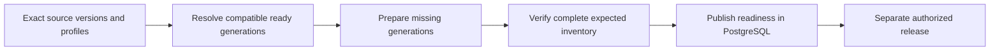

# Preparing and searching reliable indexes

Use this guide to understand how documents become searchable, why unchanged work can be reused, and what happens when a build stops halfway through. [Knowledge](knowledge-lifecycle.md) chooses the source versions. Indexing prepares and checks their search data. The [data model](data-model.md#indexing) defines the records and their exact constraints.

Assume Alice builds Support from three documents under one processing profile and one embedding profile. Changing one document should reuse the other two without changing what an older version searches.

**Reading route:** follow Alice's three-document example first. Then use the sections on retries, search, and deletion when working on those operations.

> **Design status:** This is the accepted v1 design. It does not mean the schema, integrations, or tests are complete. Capacity estimates and backend behavior still requiring tests are labelled below.

## Contents

| Reader’s question | Start here |
| --- | --- |
| What can an unchanged document reuse? | [1. Understand what is shared](#model) |
| When is the whole corpus ready? | [2. Prepare and verify a materialization](#build) |
| What if Chroma times out? | [3. Recover a vector write](#retries) |
| How are search results scoped? | [4. Search only the permitted corpus](#retrieval) |
| When is physical cleanup complete? | [5. Retire data without restoring access](#retirement) |
| What scale has actually been established? | [6. Measure the supported workload](#qualification) |
| Which invariants must a change preserve? | [7. Maintainer checks](#maintainer-checks) |
| Why these choices, and what remains open? | [8. Decision and reference map](#decision-map) |

<a id="model"></a>

## 1. Understand what is shared

| Component | Responsibility |
| --- | --- |
| **PostgreSQL** | Owns document identities and versions, exact collection revisions, authorization, vector-generation references, materialization readiness, jobs, release pointers, retention, and deletion state. |
| **Chroma** | Stores immutable derived vector records and searches the scope selected by the application. It does not own logical membership or permissions. |
| **SeaweedFS through `ArtifactStore`** | Provides private S3-compatible artifact storage, including referenced manifests and temporary exact retry payloads. PostgreSQL owns their identity and publication. |
| **`ModelGateway`** | Supplies every document and query embedding. Chroma receives explicit embeddings and must not invoke its own provider embedding function. |

In production Docker Compose, Chroma runs as a **private HTTP server**. Clients must not open a shared embedded persistence directory.

Domain code uses `ArtifactStore` and `VectorIndex`, interfaces defined by Inframeld. Storage adapters translate those calls into SeaweedFS or Chroma operations. This keeps vendor-specific details out of the domain.

**Indexing** owns processing results, vectors, shard layouts, and the decision that prepared data is ready. **Pipelines** records which prepared data a pipeline version uses. Application operations coordinate the two. Other modules must ask Indexing about readiness rather than keep their own competing flag.

A status screen can read a summary from PostgreSQL without loading every document. This is the practical purpose of separating queries from commands, also called lightweight CQRS.

### Worked example: one changed document and two retained revisions

All documents in this example belong to organization O1/project P1. They use processing profile PP1, embedding profile E1, index I, and LAYOUT1. Each document version produces exactly two chunks.

The short labels stand in for real opaque IDs. The illustrated shard assignments are outputs of the recorded placement rule, not a requirement to put one chunk from every document in each shard.

### Authoritative application state

Collection L initially has revision R1. Document B changes from B1 to B2, creating revision R2.

The tables describe the information the application needs, not a finalized SQL schema. A large inventory of records can live in an immutable SeaweedFS manifest, meaning a saved list that cannot change. PostgreSQL records its identity and whether it has been published.

| Application record or manifest | R1 | R2 after verification |
| --- | --- | --- |
| **Logical collection** | L | The same L. |
| **Exact membership** | A1, B1, C1. | New membership A1, B2, C1. R1 is unchanged. |
| **Selected physical generations** | M1 maps A1 → GA, B1 → GB1, C1 → GC. | M2 maps A1 → GA, B2 → GB2, C1 → GC. |
| **Profiles and layout** | PP1 / E1 / I / LAYOUT1. | The same PP1 / E1 / I / LAYOUT1. |
| **Expected chunks** | GA: a1.1, a1.2<br>GB1: b1.1, b1.2<br>GC: c1.1, c1.2. | Reuse GA and GC. Use GB2: b2.1, b2.2 instead of GB1 **in M2's inventory only**. |
| **Readiness evidence** | M1 is ready after its six expected records are verified. | M2 becomes ready only after its six expected records are verified. |
| **Pipeline binding** | P-V1 binds M1. | P-V2 binds M2. This does not promote P-V2. |

### Physical storage

S0 and S1 already exist. R2 inserts two records into them. It does not create an R2 Chroma collection. The final column explains the timeline and is not stored as mutable Chroma metadata.

| Record | Immutable generation | Source chunk | Shard | Why it is present |
| --- | --- | --- | --- | --- |
| a1.1 | GA | A1, chunk 1 | S0 | Inserted for R1, unchanged for R2. |
| a1.2 | GA | A1, chunk 2 | S1 | Inserted for R1, unchanged for R2. |
| b1.1 | GB1 | B1, chunk 1 | S1 | Retained while R1 is needed. |
| b1.2 | GB1 | B1, chunk 2 | S0 | Retained while R1 is needed. |
| c1.1 | GC | C1, chunk 1 | S0 | Inserted for R1, unchanged for R2. |
| c1.2 | GC | C1, chunk 2 | S1 | Inserted for R1, unchanged for R2. |
| b2.1 | GB2 | B2, chunk 1 | S0 | Newly inserted for R2. |
| b2.2 | GB2 | B2, chunk 2 | S1 | Newly inserted for R2. |

There are **six records before the change, eight while both revisions are retained, and six after GB1 can safely be removed**.

GA and GC keep the same IDs, values, metadata, and shard locations. R1 searches GA, GB1, and GC. R2 searches GA, GB2, and GC. Changing the search filter lets the two revisions share unchanged records without adding a changing collection-membership field to Chroma.

<a id="build"></a>

## 2. Prepare and verify a materialization



The arrows show the order of work. Indexing prepares and checks the data. Releases decides whether a ready version receives traffic. Both are parts of the same backend.

### Separate the build and release steps

| Phase | Application / PostgreSQL work | Processing, model, or Chroma work |
| --- | --- | --- |
| **Admit B2 and R2** | Store the source version and exact R2 membership. Request M2 as unready. | No existing vectors change. |
| **Prepare missing work** | Resolve reuse keys, select GA/GC, admit GB2, and record bounded progress and frozen payload references. | Parse/chunk B2 in the isolated processor. Obtain two embeddings through `ModelGateway`. Insert b2.1/b2.2 into their recorded shards. |
| **Verify M2** | Read the expected six-record inventory and check dependencies. | Verify the new numerical records. Check expected IDs, immutable metadata, and placement for all six records, including GA/GC. |
| **Publish readiness** | Conditionally mark M2 ready after every required check passes. | No membership metadata update. |
| **Evaluate and release** | Evaluate P-V2. Authorized commands attach it, enable a canary, or promote its Deployment pointer. | Queries use the selected version's filter. Promotion itself writes no vectors. |
| **Retire R1 ordinarily** | Wait for deployment, build, rollback, and query references to end. Revoke unused GB1's reuse and tombstone it. | Delete b1.1/b1.2 when safe. Do not write to GA/GC. |

A **tombstone** permanently marks a physical identity as retired so it cannot be reused or made live again. The full retirement protocol appears below.

A build saves the exact configuration, collection revisions, and profiles it will use. If Alice changes “latest” while it runs, the build continues with its saved choices. Finishing that build and sending traffic to it are separate actions.

The application may reserve a PipelineVersion ID when a build starts. It publishes the complete version, including its fixed references to prepared data, only after every required materialization is ready. A **materialization** is the verified search data for an exact collection revision and set of profiles.

A prompt-only pipeline version can reuse M1 without another physical collection or vectorization. Retaining R1 does not preserve old access rights: current permissions can exclude B from either revision.

### Verify the materialization, not the shard's global count

M2 expects six records even though its shared shards contain eight while R1 is retained. A total count of eight proves neither that M2 is wrong nor that all six required records exist. Check M2's exact inventory using the [verification rules below](#record-and-verify-the-exact-expected-data). Missing records, incompatible profiles, wrong placement, or fingerprint conflicts block publication.

### Bounded memory does not mean constant total work

Reusing vectors saves model calls and writes. It does not remove the work of assembling and checking the collection.

If a revision contains **D** document-version memberships and **N** chunks, assembling its manifest can read or copy D memberships. Verification can read N records even when Alice changed only one document. These are the O(D) and O(N) costs used in the estimates below. Preparing an authorized search filter also grows with the number of permitted generations.

Reading a limited-size page at a time keeps memory use under control. It does not reduce the total number of records to check. **Only changed chunks need new Chroma inserts, but a release still does work across the larger collection.**

### Admit sources once and prepare additional profiles on demand

Alice uploads a document once. She does not choose an embedding profile for every file. Later builds can process that same source under different supported parsing/chunking settings and model profiles.

The project or build selects those profiles. The application records the document version, reuses a compatible processing result when one exists, and requests new embeddings only where needed. Producing those numerical embeddings is called **vectorization**.

Creating a profile first saves it in PostgreSQL and queues its setup. The worker prepares the required configuration and storage afterward. The database transaction does not wait for Chroma setup, and creating a profile does not immediately re-embed the entire project.

| Change | Required behavior |
| --- | --- |
| **Create an additional profile** | Record and provision it asynchronously. Index data under it on demand, rather than silently multiplying model cost and memory use. |
| **Change the embedding model, dimensions, normalization, distance metric, or semantic gateway behavior** | Create a new immutable embedding profile. Semantic behavior means what vectors the configured connection/model produces, not merely which credential permits the call. |
| **Rotate a credential without changing semantics** | Do not create a new embedding profile solely because the secret changed. |
| **Change the processing profile** | Produce new chunks and embeddings where required, reusing the original unchanged source bytes rather than requiring another upload. |
| **Change only the prompt with the same collection revision and profiles** | Reuse the ready materialization. |

Show progress for each step separately: accepting the source, processing it, setting up a profile, producing vectors, creating the logical revision, and verifying its materialization. A single “ready” flag would hide which work is complete.

V1 offers supported processing profiles. Arbitrary parser or chunker plugins are deferred. The application-owned processing interfaces leave room for them without requiring a plugin system now.

### Verify a materialization before publishing its readiness

The [materialization record](data-model.md#materialization-record-and-lifecycle) identifies the exact collection revision, profiles, index, and saved shard layout. Complete verification makes it ready. Losing a required dependency later can make it stale.

A half-finished materialization cannot serve as a partially ready one. When automatic retries run out, keep the same job ID and show that the retry budget was exhausted. An explicit safe resume follows the [job recovery rules](jobs-and-idempotency.md).

### Record and verify the exact expected data

Save the selected generation IDs, expected and verified immutable manifest hashes, record counts, progress for each shard, and publication state. These records explain what was checked and what remains.

Verification has two related responsibilities:

| What is being verified? | Required evidence |
| --- | --- |
| **A new physical vector generation** | Check the actual numerical records against their frozen payload. An expected hash copied into record metadata is not proof that the stored vector matches. |
| **A new materialization** | Initially read all expected IDs, immutable metadata, and placement in bounded pages. Reuse already-verified numerical-generation evidence and perform targeted checks of actual bytes. |

For a membership-only change, reuse the earlier numerical-verification evidence without downloading every coordinate again. Targeted checks still inspect actual bytes. Read the required inventory in limited-size pages so verification does not load it all into memory.

After checking the data, make one short PostgreSQL transaction confirm that this attempt still owns the job and that its dependencies and lifecycle still allow publication. Mark it ready only if all those checks pass together.

Adding or retiring a revision does not change shared ready vectors. PostgreSQL records membership. The [saved-write procedure](#retries) governs changes to physical records.

### Full verification still has a cost

Measure the [membership and verification reads](#bounded-memory-does-not-mean-constant-total-work) as well as saved writes. A one-document update can still require checks across the whole collection.

<a id="retries"></a>

## 3. Recover a vector write

One component in the **single worker process** creates, inserts, and deletes Chroma data. API handlers and administrative tools must send work through it. They must not write to Chroma independently.

The worker holds one exclusive operating-system file lock for as long as it runs. Every worker uses the same deployment-wide file in the same local Docker volume, so a second worker refuses to start. **Never delete or replace that file to force a takeover.** This arrangement supports one host with local storage.

A timeout means the worker stopped waiting. Chroma may still be processing the request. A PostgreSQL job lease can prevent an old worker from publishing success, but cannot cancel that remote work. Therefore, record each attempt before sending it and limit the size and duration of requests.

### Step 1: admit the generation and save the exact write batches

Create the generation and its job in PostgreSQL. Keep the generation unavailable to queries while it is being prepared.

Get embeddings through `ModelGateway`. Before writing to Chroma, save the exact IDs, vector numbers, immutable metadata, and any stored text in limited-size batches in private SeaweedFS storage. Give each batch a checksum and save its reference durably. These saved bytes are what a retry will send.

Specify how the numbers are represented and compared, including **float32**, a 32-bit floating-point format. Test those representation rules, called the canonicalization contract, against the selected backend.

If the worker crashes before saving the model's answer, those exact vector bytes are unavailable. Follow the [uncertain model-call rules](jobs-and-idempotency.md) instead. Calling the paid model again is a new model call, not a repeat of a saved Chroma write.

### Step 2: record dispatch, then insert

Record that the attempt is about to be sent. Then call Chroma `add` with the saved batch, unique record IDs, and explicit embeddings.

The recorded [Chroma `add` documentation](https://docs.trychroma.com/docs/collections/add-data) says existing IDs are ignored. A duplicate acknowledgement is not proof that the stored values match. Always verify them.

No ordinary path updates a live vector record.

### Step 3: retry only the saved IDs and bytes

After a timeout, lost response, or worker restart, the default is a bounded automatic retry of the **same IDs and exact payload**. Alternatively, read and verify the expected IDs, then insert the missing ones from that payload.

The retry must not call the embedding model again or send different values under the old IDs.

Set limits on retry delays, attempt count, unresolved requests, and temporary batch storage. That temporary storage is the **retry spool**. An unresolved request is one that might still complete even though the worker has no answer.

When those limits are reached, show the candidate job as failed because its retry budget is exhausted. Routine failures do not require restarting the installation. An explicit [safe resume](jobs-and-idempotency.md) keeps the same job ID and saved payload.

### Step 4: read back and verify

Read back the expected records. Check their IDs, count, immutable fields, shard locations, and numerical values using the tested comparison rules. Save which batches passed.

A conflicting existing value is an **integrity failure**, not permission to overwrite it.

Keep a definite failure separate from a request whose outcome is unknown. Even if a retry succeeds, the original request might still be running.

### Step 5: publish readiness conditionally

When every required shard and generation passes, recheck the attempt's ownership, lifecycle, dependencies, and deletion/retention state in one short database transaction. Only then mark the generation or materialization ready.

An old attempt cannot publish after another attempt has replaced it. Each build refers to shared ready generations rather than changing those generations' membership.

### Example: one shard succeeds and the other times out

Suppose inserting b2.1 into S0 succeeds, but the request for b2.2 in S1 times out. M2 stays unready: success on one shard is insufficient.

The worker retries or verifies b2.2 using its saved IDs and numerical bytes, without embedding B2 again. M2 can become ready once both new records and its complete expected scope verify.

If the original S1 request later completes while that record is still present, it encounters the same b2.2 ID rather than replacing it with another value. R1 continues using GA, GB1, GC and does not depend on this candidate's completion.

This behavior must be tested against the pinned backend. Do not assume an entire HTTP batch becomes atomically readable when acknowledged.

### Keep the retry spool temporary

Keep a saved batch as long as its generation may need that batch replayed. Delete it only after publication or progress is durably recorded and replay is no longer allowed. To abandon a generation, first retire its identity permanently and disable its retries.

Keep unresolved-attempt identifiers and cleanup evidence even after reclaiming payload bytes.

If a batch disappears or becomes corrupt before verification, show that intervention or explicit abandonment is required. Do not generate new numbers under its old IDs. If published vectors are lost, use [backup/restore or operator intervention](upgrades-and-recovery.md). Rebuilding a lost published index from product records remains deferred. Temporary retry batches are not a complete reconstruction archive.

### An uncertain candidate is not a global outage

A candidate's unresolved insert does not make an older, healthy version unusable or stop unrelated writes. A storage outage, missing published records, or proven corruption does make the affected dependency unavailable. The health checks below distinguish these cases.

Creating or deleting a physical Chroma collection needs its own recovery handling. Give each layout a unique namespace. After an uncertain creation, inspect that exact identity. Never recreate or delete a namespace while live data still refers to it.

<a id="retrieval"></a>

## 4. Search only the permitted corpus

For each query, the application follows this sequence:

1. **Identify the caller and version.** Authenticate the human through Kratos or the integration through its application identity. Check project and action permissions, then resolve the Deployment and exact PipelineVersion.
2. **Keep the required data available.** In PostgreSQL, check that the profiles, layout, and materializations are healthy and ready. Register a time-limited operation pin, a record that prevents ordinary cleanup while this query uses them.
3. **Choose permitted generations.** Start with compatible generations from the version's exact collection revisions. Keep only those allowed by current document groups and deletion state, then remove duplicates.
4. **Embed the question.** Request one query embedding for the selected profile through `ModelGateway`.
5. **Build the search filter.** The server includes `vectorization_generation_id: {"$in": [...]}` and the required immutable scope/profile restrictions.
6. **Search every required shard.** Limit simultaneous calls, use a shared deadline, and merge results using the same distance metric. Break ties by stable record ID and remove duplicates.
7. **Check before using the text.** Verify returned IDs and content references, current document permissions, and dependency health before sending text to a reranker, evaluator, model, or client. Check again before returning the result.

### The worked example's searchable sets

“Eligible records” means records Chroma may consider. A nearest-neighbor query still returns only its bounded requested candidates, not every eligible record.

| Revision and current permissions | Generation filter | Eligible in S0 | Eligible in S1 |
| --- | --- | --- | --- |
| R1, A, B, C permitted | GA, GB1, GC | a1.1, b1.2, c1.1 | a1.2, b1.1, c1.2 |
| R2, A, B, C permitted | GA, GB2, GC | a1.1, b2.1, c1.1 | a1.2, b2.2, c1.2 |
| R2, B forbidden | GA, GC | a1.1, c1.1 | a1.2, c1.2 |
| R2, nothing permitted | Empty | No query | No query |

For the fully authorized R2 query, the adapter can construct this internal Chroma filter:

```json
{
  "$and": [
    { "organization_id": { "$eq": "O1" } },
    { "project_id": { "$eq": "P1" } },
    { "embedding_profile_id": { "$eq": "E1" } },
    { "processing_profile_id": { "$eq": "PP1" } },
    { "vectorization_generation_id": { "$in": ["GA", "GB2", "GC"] } }
  ]
}
```

**The caller does not submit this authoritative filter.** The server builds it from verified application state.

Send the same query embedding and permitted scope to **both S0 and S1** in LAYOUT1. One generation's chunks may occupy several shards. Naming a generation does not place all its records in one shard.

If B is forbidden, the server changes the `$in` list to GA, GC. No Chroma metadata write is needed. GB1 is excluded from R2 even for an authorized B reader because it is not part of R2's generation set.

### Merge comparable candidates, then verify them

Suppose the query needs two final candidates without reranking. Ask each shard for up to two candidates within the exact filter. Using the same cosine-distance metric, the illustrative results are:

| Shard | Candidates, smaller distance first |
| ----- | ---------------------------------- |
| S0    | b2.1: 0.08, a1.1: 0.15             |
| S1    | c1.2: 0.06, b2.2: 0.20             |

Merge, deduplicate record IDs, and use stable ID ordering for ties. The final two are **c1.2 and b2.1**. Verify their authoritative identities and current permissions before using the text.

The distances above are invented examples. Chroma's single-node HNSW index uses approximate nearest-neighbor search, which trades exhaustive comparison for faster retrieval. The filter defines exactly which records are allowed, but the search can still miss the closest ones. Tests must measure **recall**, how many of the exact nearest results it finds.

**If S1 fails, the query is unavailable.** Do not present S0's results as though the entire required corpus was searched.

### Empty or invalid filters must never become unrestricted searches

An empty allowed set returns an authorized no-evidence outcome without querying Chroma.

An empty or failed filter must never turn into an unrestricted search. Searching all records and discarding forbidden ones afterward is insufficient: forbidden or obsolete records may have crowded out the permitted candidates before they were returned.

Checking returned results provides another safeguard. It does not replace filtering the search itself.

### Permissions remain current

Group membership and document allowlists stay in PostgreSQL. Fixed integration access uses the service principal's assigned groups. A supplied `userId` or canary affinity key cannot expand that authority. Authentication does not make Chroma metadata the permissions authority.

Unchanging manifests can be cached. A saved list of authorized generations can be reused only after checking that the relevant permission and group revisions are still current. Old collection revisions still use today's permissions. [Access](access-control.md) owns these rules, so the vector adapter must not implement a second permission policy.

Check permissions again after any queue or budget wait, immediately before handing content to an external client or the code sending the response.

If revocation finishes before that check, block the send. If it finishes just after the check, the already-approved send may still happen and cannot be recalled. Later checks must stop further sends or results once they see the revocation. A database permission check and a network send cannot happen as one indivisible operation.

### Bound the combined query scope

Limit the generation count, encoded filter size, number of conditions, shards searched, candidates returned, and total time. When a pipeline selects several collections, their combined scope must fit those limits.

If the scope is too large, return an explicit failure. Do not send a million IDs or keep splitting searches without a bound. A future design that splits filters would need to prove complete coverage, enough candidates from each part, and acceptable recall after merging. That work is deferred.

The MVP permits one processing profile and one embedding profile per pipeline. Combining scores from mixed profiles is deferred.

<a id="retirement"></a>

## 5. Retire data without restoring access

A query must claim the data it needs before cleanup can remove it. Resolve the target and register its pin in one short PostgreSQL transaction. Cleanup uses the same lock or conditional revision check. This shared check, called the **retention gate**, prevents a query from starting between cleanup's last reference check and deletion.

Once a binding is retiring, a new query cannot pin it. While an existing pin is active, ordinary garbage collection cannot delete it. Count Deployments, candidates, builds, retained rollback versions, and queries. Promoting a new version does not move a query already using the old one.

Release pins when operations finish. For an abandoned operation, expiry is safe only when an enforced deadline stops further reads and outbound content and discards late results.

If the system cannot establish that the old operation has stopped, keep its pin or stop and drain the old query runtime before cleanup. A database timeout alone is insufficient if that operation can still read or send content.

Explicit erasure or revocation overrides ordinary retention and makes affected operations fail safely.

### Recheck dependency health during the operation

A dependency's **health generation** is a revision number that changes when it becomes unavailable, is found corrupt, or recovers. Writing an unrelated candidate does not change it.

Save that number when the query starts. Compare it after retrieval, before sending content to a provider, and before returning the answer. If it changed, discard the results.

These checks do not make remote calls atomic with SQL, and already-sent text cannot be recalled.

### Retire physical identities before deleting their records

Before ordinary deletion, use the shared retention check to confirm that no references remain. In that same transaction, disable reuse and permanently mark the physical identity as retired. A later build or retry must never make that identity live again.

Delete using explicit record/generation IDs from the manifest. Broad deletion based on mutable scope is forbidden.

Tombstones and job state prevent new application retries. They do **not** cancel an external request already accepted by Chroma.

In the example, promoting P-V2 does not immediately delete GB1. R1 may still be the rollback target, another pipeline may bind M1, or a query may still be using it. After all ordinary references end, GB1 can be tombstoned and its two records removed. GA and GC stay because M2 still needs them.

Removing one user's B access changes that user's filter at the documented authorization boundary. It does not require deleting shared vectors that other authorized users still need.

**Explicit erasure of B is different:** first invalidate all affected serving dependencies, then remove B's owned generations under the deletion protocol rather than preserving them solely for rollback.

### Logical revocation is not proof of physical cleanup

A delayed old `add` can finish **after deletion** and recreate an unreachable record. Exact PostgreSQL-selected generation filters keep that tombstoned generation out of every query.

A successful delete followed by one “not found” check is insufficient while an earlier write may still finish. Show the two outcomes separately:

> Logical access revoked / physical cleanup pending.

Keep the attempt records, retry cleanup within its limits, and alert when backlog or disk limits are reached. A successful duplicate insertion does not prove erasure complete and is not a reason to discard the evidence.

For example, b2.2's first request times out, its retry succeeds, and R2 eventually becomes unused. GC retires and deletes GB2. If the original S1 request then finishes, it may insert b2.2 again because the ID is absent.

GB2 remains tombstoned and cannot enter a query filter or new build. User access is not restored, but physical deletion is not yet proven. This cleanup problem does not invalidate the earlier exact-payload retry while GB2 was live.

Delayed artifact or spool uploads need the same honest cleanup status under [Keeping and deleting data deliberately](retention-and-deletion.md). A PostgreSQL tombstone does not cancel an in-flight SeaweedFS `PUT` either.

### Exceptional cleanup needs a tested completion barrier

To finish cleanup, establish that all earlier writes have finished or can no longer run. This is called **quiescence**. Tested backend conditions that provide the same guarantee are another option.

On the supported single server, exceptional maintenance may stop the old writer and confirm it exited, then stop and restart Chroma. Establish that Chroma has finished recovering and processing earlier accepted log work. Only then delete the retired IDs, verify their absence, and mark cleanup complete.

A failure test against the pinned server must prove that earlier work cannot run after this cleanup. Restarting only the client cannot prove that. A future cloud adapter needs its own supported equivalent because the local procedure does not control a managed service's queues.

This is exceptional final cleanup, not the response to every lost build response.

Persistent storage failure, identity/hash conflicts, missing published data, corrupt unfinished spool, or cleanup backlog reaching its bound also require intervention. Automatic retries handle routine transient failures, not every possible fault without an operator.

<a id="qualification"></a>

## 6. Measure the supported workload

These estimates do not establish production capacity. Test the exact single-node Chroma image digest and matching SDK that the release will ship. Do not use floating `latest` versions, apply cloud quotas to the local server, or rely on cloud-only forks or experimental search features.

The design uses explicit embeddings and metadata generation filters. It does not depend on Chroma conditional transactions. Large `$in` filters, canonical float32 read-back, late writes, and cleanup barriers require tests against the pinned server. Historical vendor observations are not current qualification evidence.

### A million documents is not the qualified capacity

One million documents averaging 20 chunks produce 20 million vectors. At 1,536 float32 dimensions, their coordinates alone occupy **122.88 GB decimal, approximately 114.4 GiB, per profile**. Metadata, index overhead, and the other services require additional space and memory.

The proposed 64 GiB test host below is not a promise to support a million documents. More hardware may help, but constructing authorized generation lists and sending large filters can still require a different adapter strategy. Shards and application interfaces protect domain boundaries without making that future migration easy.

### Provisional qualification environment and workload

**Everything in this section is a planning assumption, not measured capacity, a supported limit, or a service-level agreement.**

Use one Linux server with **16 vCPUs, 64 GiB RAM, and 1 TB usable local SSD/NVMe storage**, plus off-host backups. Run one Chroma server with two fixed shards. Model inference runs remotely or through the customer's gateway. Local language-model memory is excluded.

### Proposed memory allocation

| Component                             | Planning budget |
| ------------------------------------- | --------------- |
| Chroma                                | 32 GiB          |
| PostgreSQL                            | 6 GiB           |
| Parser, one attempt                   | 8 GiB           |
| SeaweedFS                             | 4 GiB           |
| API, worker, console, and ingress     | 4 GiB           |
| Kratos                                | 1 GiB           |
| Operating system, cache, and headroom | 9 GiB           |
| **Total**                             | **64 GiB**      |

### Proposed workload

| Dimension | Initial target and stress variants |
| --- | --- |
| **Corpus** | 25,000 current documents averaging 20 chunks: 500,000 current vectors. Test stages at 1,000, 10,000, then 25,000 documents. Run a deliberate 50,000-document stress experiment. |
| **Sources and text** | Average source size 0.5 MiB. Average chunk text 2 KiB. Test unusually large inputs with explicit per-source limits. |
| **Profiles** | One active 1,536-dimensional float32 profile. A second profile is a separate stress experiment. |
| **Retention and change** | Three retained collection revisions. Daily changes to 1% of documents at stable document count. Additional pins/builds consume admission budget. |
| **Permissions** | 20 groups. A typical user belongs to two. Test permitted fractions of 100%, 50%, 1%, and 0%, including permission changes during queries. |
| **Filters and metadata** | Measure against a metadata target of at most 1 KiB per record. A list of 25,000 UUID-style generation IDs is roughly 1 MB of JSON per shard, not a verified backend allowance. |
| **Work** | Initial ingestion target of one document per second. One build and one evaluation at a time, sharing resource limits with serving. |
| **Queries** | Five concurrent end-to-end requests. Also test concurrency of 1 and 10, plus controlled arrival rates that expose queueing. |

### Storage and time calculations are not total-resource predictions

With equal-sized, distinct 1% changes between three retained revisions, their union is approximately **510,000 vectors**, not three complete copies. Their coordinates occupy **3.13344 GB decimal / approximately 2.92 GiB**. Three full physical snapshots would require approximately **9.216 GB** of coordinates.

Extra profiles, larger changed documents, retained pins, and failed-attempt cleanup increase storage. At the assumed source size, current sources occupy about **12.2 GiB before old versions**. One copy of 510,000 chunks at 2 KiB is about **1 GiB**.

Parsed artifacts, PostgreSQL's write-ahead log (WAL), indexes, duplicate text, retry spool, scratch space, and backups are additional. These calculations do not predict total consumption.

At one document per second, 25,000 documents take at least approximately **6.9 hours**, before slower phases or queues. A 1% change adds about **250 documents / 5,000 chunks** to process, but full manifest/verification reads and query authorization still involve the larger corpus.

### Qualification tests and stopping rules

Run these tests against pinned images and a recorded host, corpus, and workload. They are requirements before making production claims, **not tests completed by writing this section**.

### Backend contract

Prove duplicate `add` behavior, partial completion, read visibility, restart durability, and float32 read-back verification with explicit embeddings.

Drop responses before and after the backend applies a request. Replay frozen batches in different orders and terminate workers between every durable step.

Pass only if published bytes never change, partial materializations never become available for serving, and healthy old releases continue without routine Chroma restarts.

**If the assumed backend contract fails, stop and reconsider the adapter/protocol. Do not hide the failure inside a larger retry loop.**

### End-to-end lifecycle

Ingest, verify, publish, and back up R1. While serving queries, change one document at corpus sizes of 1,000, 10,000, and 25,000, then test random and localized 1% changes.

Build, verify, and evaluate R2. Try canary traffic, promotion, and rollback. After R1's pins end, retire it and measure cleanup, including compaction, the storage work that reclaims deleted space.

Count all PostgreSQL, artifact-store, and Chroma reads and writes. **Membership-only changes must issue zero writes to surviving vector records.** Record the full verification and snapshot costs that remain.

### Security and failures

Test forged scope/group input, zero permitted generations, revocation during queries, failed shards, stale SQL publication, query-pin-versus-GC races, and delayed insertion after deletion.

Pass only if every content send or response follows its final scope check, a failed shard produces an explicit failure, and retired generations never become live again. Keep evidence of pending cleanup until the tested completion procedure proves it finished.

Test revocation before the send check, just after it, and before the response check. The first blocks the send. The second has the already-approved-send limitation described above. The third suppresses the response. A successful retry must never be treated as proof of physical erasure.

### Resources and performance

Record phase duration, resident-memory and container-memory peaks, CPU use, disk/WAL/spool growth, queue age, provider usage, serialized filter size, and PostgreSQL authorization work.

Measure filtered approximate-nearest-neighbor latency at **p50, p95, and p99** and **recall@k** against an exact, correctly scoped reference on a representative fixture. Percentiles describe the latency distribution. Recall@k measures how many of the exact reference's top-k neighbors the approximate search recovers.

Report model/judge time separately. Include warm and cold queries and a build running under query load.

Resource budgets must reject admission visibly **before** out-of-memory failure, sustained swapping, or an unbounded backlog.

### Provisional go/no-go goals

| Measurement | Proposed goal |
| --- | --- |
| **Database retrieval, including authorization and filter construction** | p95 at most 1 second at five concurrent requests during a small build. |
| **Retrieval quality** | recall@10 of at least 0.95 on the declared fixture. |
| **One-document release platform overhead** | At most 2 minutes. |
| **1% change platform overhead** | At most 15 minutes. |

Report parser/model time and complete end-to-end time separately. These goals remain proposals for qualification, not accepted capacity claims.

If the 25,000-generation filter or its payload limit fails, or measured latency misses the goal, lower the qualified workload or reconsider the adapter before advertising support. Do not silently remove scope predicates, expand bounds indefinitely, or add segment/compaction infrastructure merely to preserve an unproven target.

<a id="maintainer-checks"></a>

## 7. Maintainer checks

| Scenario | Expected outcome |
| --- | --- |
| Only the prompt changes | Reuse a compatible ready materialization. |
| B1 becomes B2 | Reuse A/C, create B2's generation, and verify the new revision's complete inventory. |
| One shard times out | Keep the candidate unready. Retry exact saved IDs and bytes within bounds. |
| No generations are permitted | Return the authorized no-evidence result without an unfiltered search. |
| A required shard fails during a query | Fail explicitly. Do not present partial corpus results as complete. |
| A pin times out in SQL while its process still runs | Establish termination or retain protection before cleanup. |
| An old write completes after deletion | The tombstone blocks reuse. Physical cleanup remains pending until proven. |

### Separate historical readiness, current health, and candidate retries

A ready materialization passed its build checks. It can still become unavailable later, so queries must check current dependency health.

| Situation | Required behavior |
| --- | --- |
| **Backend outage, missing published records, or integrity conflict** | Make the affected dependencies unavailable. Historical readiness does not authorize serving from damaged or missing data. |
| **An unrelated candidate’s immutable insert has an uncertain outcome** | Keep healthy existing generations available. Do not mark the entire healthy index unavailable or force a Chroma restart. |
| **Safe candidate-write retry** | Retry the same frozen IDs and bytes within the configured budget. Current release A can continue while candidate B retries. |
| **Retry budget exhausted** | Fail B’s job visibly, retaining its identity and exhausted-budget reason. An explicit safe resume follows [Background jobs, retries, and competing changes](jobs-and-idempotency.md). |
| **Published numerical data is missing** | Use backup/restore or intervention. Do not silently reconstruct the index by calling the embedding model again. |

Use the [saved-write retry procedure](#retries) for unknown outcomes. Its job-ownership checks prevent an old attempt from publishing, but cannot cancel a request already sent to Chroma.

### Recheck health while a query executes

Follow the [pin and health checks](#retirement) before sending content or returning results. Earlier readiness cannot authorize use after a selected dependency fails.

Keep temporary saved batches for the required retry period, and keep unresolved-attempt evidence for cleanup. Neither makes a complete archive of published vectors. Product-level index reconstruction remains deferred.

Default onboarding uses this same build process. Creating default records does not make them ready. A real EmbeddingProfile still needs configured model settings. Changing publication mode may leave a ready build unpublished, which does not change Indexing's responsibility.

<a id="decision-map"></a>

## 8. Decision and reference map

Automatic re-sharding, multiple writer hosts, distributed management, segment compaction, and a different strategy for very large collections remain deferred. V1 uses one processing and one embedding profile per pipeline. Mixing profiles would need separate embeddings, a defined way to combine scores, readiness checks, and failure rules.

Verify the supported paths with both one and two shards and limited-size inventories. The application interfaces preserve ownership boundaries but do not make future migrations trivial. [Deployment](deployment.md) describes the separate, untested local-trial proposal. [Recovery](upgrades-and-recovery.md) explains what to do when published data is lost.

| Decision | Rationale |
| --- | --- |
| [ADR-0009](../adr/ADR-0009-keep-application-authority-in-postgresql-and-derived-vectors-in-chroma.md) | Keep application authority in PostgreSQL and derived vectors in Chroma. |
| [ADR-0010](../adr/ADR-0010-save-deterministic-layouts-for-vector-shards.md) | Save deterministic layouts for vector shards. |
| [ADR-0011](../adr/ADR-0011-retry-frozen-vector-identities-and-payloads.md) | Retry frozen vector identities and payloads. |
| [ADR-0040](../adr/ADR-0040-bind-pipeline-versions-to-verified-profile-specific-materializations.md) | Bind pipeline versions to verified profile-specific materializations. |
