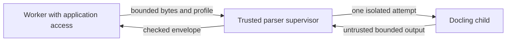

# Processing untrusted documents safely

Alice may be authorized to upload a Support PDF, but that does not make the file safe. Its bytes, extracted text, and parser output remain untrusted. This guide explains how the application processes it without giving it access to the rest of the installation.

[Knowledge](knowledge-lifecycle.md#admission) owns accepted documents and versions. Indexing owns processing settings and saved outputs. This guide explains the restricted environment in which conversion runs.

Follow one file from upload checks to its isolated parser, then back to validated output. The later sections explain resource limits, retries, and the tests required on a supported host.

> **Design status:** The boundaries below are accepted v1 design. The exact assembled parser, host setup, and security tests still need verification. Selecting a library does not establish that these safeguards work.

## Contents

| Reader’s question | Start here |
| --- | --- |
| What may the upload contain? | [1. Validate before admission](#admission) |
| Which process handles the document? | [2. Separate coordination from conversion](#architecture) |
| What can a compromised parser reach? | [3. Restrict the container and each attempt](#isolation) |
| What if parsing hangs or returns bad data? | [4. Bound work and validate output](#limits) |
| What changes when processing settings change? | [5. Preserve identity and pinned processing meaning](#records) |
| What must the assembled runtime prove? | [6. Maintainer checks](#maintainer-checks) |
| Why these choices, and what remains open? | [7. Decision and reference map](#decision-map) |

## 1. Validate before admission

Accept **one PDF, Markdown, or plain-text file per upload request**, with a maximum size of **25 MiB**.

Stream bytes into private temporary storage, where queries cannot see them. Count the actual bytes received. Reject files exceeding the limit before saving that the application has accepted the upload, a step called **admission**.

The backend may need to write some temporary bytes before discovering an oversized file. It must remove its own rejected staging file and never expose it to queries. The promise is limited, private handling and cleanup, not that no byte reaches disk.

Check the extension, the one-file request shape, parser support, and a limited inspection of file signatures or text encoding. A signature helps identify the actual format from bytes. An extension alone cannot prove that a file is a supported PDF or text document.

Unsupported, ambiguous, or invalid uploads fail before document processing or model calls.

The server chooses storage keys. Original filenames are display text, never paths to open. Normal application commands and content hashes establish DocumentVersion identity. The parser cannot create a separate identity scheme.

## 2. Separate coordination from conversion

These components have different responsibilities:

| Component | Responsibility and access |
| --- | --- |
| **Worker** | Uses the application’s database, artifact storage, and model access. Sends the document for processing, validates the result, and stores accepted immutable artifacts. An artifact is a stored output such as extracted text or a chunk manifest. |
| **Parser supervisor** | A small trusted process in the dedicated `parser` container. Receives bounded requests, creates each sandbox, supervises its execution, and returns a checked output envelope. It does not own business state. |
| **Docling child** | Processes one file inside a fresh sandbox, using only the approved runtime/assets and its attempt-specific input, scratch space, and output channels. Its output remains untrusted. |

The processing flow is:

Arrows show data transfer. Worker and parser run as separate Compose services. The parser contains a trusted supervisor and a short-lived child process for each attempt. Initially it processes one file at a time. The worker checks returned content again before making it application data.

### Coordinate processing in the worker, but isolate conversion

The worker has database and model credentials, so it must not convert the document itself. It asks the parser to run Docling in a fresh, offline environment for that attempt.

This restricted environment is a **sandbox**. The parser-isolation decision defines its safeguards. Using Docling does not replace or relax them.

Pin the exact Docling, model, tokenizer, and output-affecting settings. A **tokenizer** splits text into units used by models and token limits. Changing it can change chunk boundaries even when the file is unchanged.

Put required assets in the approved image or prepare them during controlled setup before jobs run. A document must never choose a URL from which the parser downloads assets.

**A configured `ModelGateway` connection does not give the parser network access.** Model-call configuration and parser permissions are separate boundaries.

### Preserve internal extension contracts without implementing a plugin platform

Keep the existing typed internal contracts:

| Contract | Responsibility and v1 scope |
| --- | --- |
| **`DocumentProcessor`** | Document conversion, with a built-in adapter. |
| **`Chunker`** | Bounded chunk production, with a built-in adapter. |
| **`Reranker`** | Candidate scoring/ordering, with the built-in cross-encoder and explicit `none` choices. |
| **`PipelineHook`** | A synchronous, blocking stage contract with explicit timeout, egress, and failure behavior. It is not a privileged arbitrary-code runtime. |
| **`WebhookDispatcher`** | An asynchronous notification contract. Subscriptions and delivery remain deferred. |

A **synchronous, blocking hook** makes the pipeline wait for that stage to finish. Its timeout, outgoing-data rules, and failure behavior must be explicit. The internal interface does not permit remote hooks or user-supplied privileged code.

An **asynchronous webhook** would send a notification separately, without controlling the running pipeline. V1's in-app release workflow has no selected need for callbacks. The dispatcher interface therefore adds neither a delivery service nor a requirement for external CI.

Do not implement custom chunker registration, a plugin marketplace, arbitrary pipeline graphs, or remote hook execution. Custom evaluators also remain deferred under [Comparing pipeline versions with useful evidence](evaluation.md).

Evolve internal interfaces when a real feature needs them. If a public extension feature is selected later, version its contract then. These interfaces do not promise a plugin platform or require every future payload now.

## 3. Restrict the container and each attempt

The parser container is the first isolation layer. Convenience is not a reason to copy the worker's credentials, environment, or filesystem access into it.

| Boundary | Required configuration |
| --- | --- |
| **Networking** | Set `network_mode: none` and publish no ports. The container has no external network route. |
| **Credentials and application data** | Supply no provider or database credentials, and mount no application artifact volume. |
| **Host control and visibility** | Mount no Docker socket and share neither the host’s PID nor IPC namespace. PID concerns process identifiers/visibility. IPC concerns interprocess communication. |
| **Filesystem** | Keep the root filesystem and model assets read-only. Give scratch space an explicit size limit. |
| **Service resources** | Apply CPU, memory, and PID limits to the whole service, including the supervisor and its children. |
| **Privileges** | Run as an unprivileged user with dropped Linux capabilities and `no-new-privileges`. Do not use `privileged` mode or grant host `SYS_ADMIN`. |

Linux **capabilities** grant specific process privileges. Drop them as required below and use `no-new-privileges` so executing another program cannot gain extra privilege through normal executable mechanisms.

### Use the shared volume only for the Unix socket

A **Unix socket** is a local communication endpoint accessed through a filesystem path. It does not require a published TCP port or external network connection.

The shared volume contains only a permission-restricted Unix socket for the worker and supervisor. It is not a mailbox for arbitrary files and exposes none of the worker's filesystem.

The request carries file bytes and validated processing configuration. It must not carry caller-selected host paths, shell commands, or arbitrary model URLs.

The supervisor runs a fixed application-selected entrypoint. Messages have size limits, attempt IDs, and timeouts. These keep communication bounded and let the supervisor match each result to the attempt that requested it.

Turning off container networking does not disable a mounted Unix socket. The supervisor needs that socket, but the untrusted Docling child must not inherit it.

### Give every attempt its own sandbox and process lifetime

Use **bubblewrap**, the selected Linux isolation tool, to create new user, mount, PID, IPC, and network namespaces for every attempt.

A **namespace** gives the child a separate view of operating-system resources. These namespaces isolate users, filesystem mounts, processes, communication, and networking. Explicit mount choices and resource limits are still needed. Namespaces alone are not a complete security policy.

### Expose only what this document needs

Expose only the pinned read-only runtime and model assets, that attempt's input, a minimal private `/proc` and device view, and size-limited scratch and output space.

`/proc` exposes process and runtime information. The child receives a minimal private view, not the supervisor’s or host’s process view.

Do **not** bind the supervisor’s socket, earlier attempt directories, application storage, host directories, or secret mounts into the child.

Start a new process session and close inherited socket and control **file descriptors**, the handles for open files or connections. Pass only the limited input/output channels needed by the child. Hiding a socket's filename is insufficient if an open connection was inherited.

The child must not be able to inspect the supervisor’s processes or reconnect to its Unix control socket.

### End the whole attempt, not just its main process

When processing completes, times out, or loses its supervisor, kill and **reap the whole process tree**. Reaping collects exited children. Sending a signal without confirming cleanup is insufficient.

Use parent-death handling and namespace teardown so descendants cannot outlive the supervisor or remain as background daemons for the next file.

Remove temporary files before starting the next attempt. Each retry gets fresh scratch space while keeping the same document and operation identity.

A compromised parser handling Alice's upload must not survive to inspect Bob's next upload. Processing files one at a time is not enough. The old processes and temporary environment must be gone.

### Qualify the host and security policies together

Apply a parser-specific **seccomp** policy to restrict system calls, plus the supported host's **Linux Security Module (LSM)** policy, such as AppArmor, for additional access restrictions.

Allow the unprivileged namespace setup required by the pinned bubblewrap build, then restrict the child's system calls. Do not disable seccomp or AppArmor globally to make startup work.

An installation self-test must confirm that the Linux host supports the required namespaces and restrictions. If it does not, parsing stays unavailable with a clear setup error.

**There is no fallback to running Docling in the worker or to a privileged parser container.** Docker Desktop development uses its Linux virtual machine and must pass the same checks.

### Pin and test one deployment artifact

Pin and test the whole runtime together: image digest, distribution packages, bubblewrap build, seccomp/LSM policies, Docling, and model assets. Secure components selected separately do not prove a secure combination.

An **image digest** identifies exact container contents. The supporting packages, policies, and host also matter because all participate in the boundary.

The source observed upstream bubblewrap **0.12.0** on its research date. That observation does not select a tested command line or prove a sandbox configuration safe.

## 4. Bound work and validate output

**A 25 MiB upload limit is not a processing-resource limit.** Extracted output can exceed input size, and a bounded file can still cause excessive processing work.

| Limit | Enforcement responsibility |
| --- | --- |
| **Elapsed time** | The supervisor enforces a wall-clock timeout and kills the complete attempt when it expires. Wall-clock time is actual elapsed time, not just CPU execution time. |
| **CPU, memory, and process count** | Container cgroups enforce the whole service’s bounds. Cgroups are Linux controls for grouping and limiting resource use. |
| **Processing and output size** | Attempt limits bound page count, extracted-text bytes, chunk count, token count, and output streams. Tokens are the text units counted by the configured processing/tokenization behavior. |
| **Temporary storage** | Explicit limits bound service scratch space and the attempt-specific scratch/output locations. |

A timeout or exhausted limit returns a defined failure the application can recognize. No chunks from that failed attempt become available for serving.

Only the 25 MiB upload cap is fixed here. The supported deployment must choose and test explicit values for the other limits.

### Prepare assets before processing begins

Prepackage model and **optical character recognition (OCR)** assets, or obtain them during controlled operator setup. OCR extracts text from images, such as scanned pages.

Disable Docling’s remote-service and external-resource features. During document processing, permit no runtime downloads, URL fetching, embedded-script execution, or user-installed plugins.

The parser uses only assets placed inside its sandbox. A future remote processor would need a separate security decision explaining what data may leave the installation.

### Validate output before making it application data

**A successful parser exit does not make its output trusted.** The worker validates the result even after the supervisor accepts its envelope.

| Check | What the worker verifies |
| --- | --- |
| **Attempt and document identity** | The result belongs to the expected attempt and document hash. |
| **Schema** | The returned data follows the required structure and types. |
| **Source spans** | Reported locations refer to the expected source. A source span identifies where an extracted excerpt came from. |
| **Counts and text limits** | Returned content stays within the required counts and size bounds. |
| **Manifest hashes** | The recorded inventory and hashes of processing outputs match the expected validation contract. |

Reject **symlinks**, which redirect one filesystem location to another, and **path traversal**, which tries to escape an intended directory. Ignore storage paths claimed by parser output. The worker chooses where validated data is saved.

Stream output into temporary storage owned by the worker. Accept the immutable output only after all validation passes. Incomplete or unchecked results must never appear as published chunks.

Keep failed output out of serving. A retry uses fresh scratch space with the same domain identity. It cannot treat failed output as accepted data or create a new logical document merely because it is another attempt.

### Keep operating-system isolation separate from content safety

The selected boundary must satisfy these behaviors on a qualified host:

| Attempted behavior | Required protection |
| --- | --- |
| **A PDF tries to fetch a URL.** | The parser has no external network route, and remote-resource features are disabled. |
| **The parser tries to read a provider key.** | Its sandbox exposes neither secret mounts nor the worker’s processes. |
| **The parser tries to inspect the next user’s document.** | It sees only its own input. Its process tree and temporary environment are removed before the next attempt. |
| **The parser never finishes or exhausts resources.** | The configured timeout and resource limits terminate or fail the attempt without publishing its chunks. |

These are requirements, not passed security tests. The trusted supervisor and supported host/kernel remain part of the protection. A container does not prove safety against kernel vulnerabilities.

### Extracted text is still untrusted input to a model or browser

Isolation controls what the parser can access and execute. It does not prove that the extracted text is true or that its instructions are safe to follow.

Treat extracted text and model output as untrusted. Clearly mark evidence in prompts and tell the model not to follow commands inside documents. Allow no tools or external actions. Citations use source IDs selected by the backend, not invented by the model. Escape text in the browser rather than execute it as content.

These measures reduce risk without proving that an answer is supported by its evidence (**groundedness**) or immune to **prompt injection**, where document text tries to redirect the model.

## 5. Preserve identity and pinned processing meaning

A retry keeps the same DocumentVersion and accepted operation but gets a fresh sandbox. Changing processing settings creates new processing generations. It does not require uploading unchanged source bytes again.

Before publishing output, the worker checks the attempt, source, source locations, counts, and hashes. The [Indexing records](data-model.md#indexing) define profiles, generations, and chunks. Parsing successfully still does not prove the search index ready.

### Record the exact components and their licenses

Release evidence must name exact library, model, checkpoint, and sandbox-helper versions with their license notices. Helpers are the programs that enforce isolation.

**Inframeld’s Apache-2.0 license does not relicense model weights, OCR engines, parser dependencies, or external sandbox tools.** Record the relevant notices for those components separately.

A library's license does not establish the license of the model weights it loads. Check the model checkpoint separately.

The pinned runtime still needs testing. This documentation change installs no dependency.

## 6. Maintainer checks

Test on the real supported host with the pinned deployment artifact. Report the host and versions used, rather than treating the presence of a sandbox configuration as proof.

| Area | Required tests and outcome |
| --- | --- |
| **Upload admission** | Exercise the one-file, supported-format, and 25 MiB limits. Rejected staging is cleaned up and never becomes queryable. |
| **Network and control-channel access** | Attempt outbound IPv4, IPv6, DNS, and private Unix-socket access from the child. The child must not reach external services or the supervisor’s control socket. DNS resolves hostnames to addresses. |
| **Filesystem and process visibility** | Attempt to read secret mounts, host paths, and other-attempt paths, and inspect parent processes. The forbidden resources must not be visible or accessible. |
| **Process survival** | Try to leave descendant processes alive after the attempt. Confirm the complete process tree is removed before the next attempt. |
| **Resource exhaustion** | Emit excessive text, repeatedly create child processes, allocate excessive memory, and hang. Limits must produce a bounded failure, not published chunks. |
| **Malformed output** | Return invalid envelopes/content, identities, spans, counts, hashes, and unsafe path representations. Unvalidated output must not become serving artifacts. |
| **Restart behavior** | Restart the supervisor or container mid-attempt. Confirm the failed attempt leaves no artifacts that can serve queries and the next attempt starts cleanly. |
| **Host compatibility and normal behavior** | Exercise the installation self-test and restrictions. Confirm normal supported PDFs still parse under the same isolation and limits. |

These are release criteria. They have not been performed by this documentation change.

Also verify source locations and stable identities for fixed inputs, missing assets, changed profiles, and the text-first default without OCR or a judge. The [reranker guide](pipelines-and-releases.md#reranking) covers its score checks, local limits, and example fixture. A selected cross-encoder must never silently fall back to `none`.

## 7. Decision and reference map

The image, Docling, models, tokenizer, bubblewrap, policies, and host must be tested together. Numeric time, page, text, chunk, token, and scratch limits remain open. Only the 25 MiB upload bound is fixed. Host-kernel compromise remains outside what container isolation can guarantee, and the internal interfaces do not establish a public plugin system.

| Decision | Rationale |
| --- | --- |
| [ADR-0034](../adr/ADR-0034-process-untrusted-documents-inside-a-restricted-execution-boundary.md) | Process untrusted documents inside a restricted execution boundary. |
| [ADR-0041](../adr/ADR-0041-use-docling-for-document-conversion.md) | Use Docling for document conversion. |
| [ADR-0042](../adr/ADR-0042-rerank-selected-evidence-through-a-local-cross-encoder-boundary.md) | Rerank selected evidence through a local cross-encoder boundary. |
