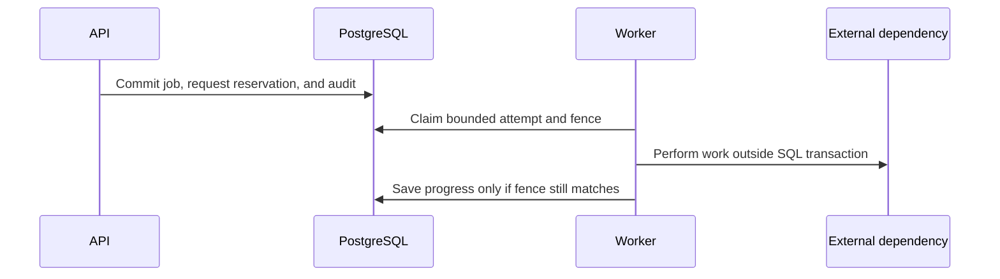

# Background jobs, retries, and competing changes

Alice starts a Support build, but the response never reaches her browser. Sending the same request again should find that build, not start another. This guide explains how saved work survives interruptions and how the application tells a retry from a new decision.

[Application structure](application-structure.md) explains which module owns the work. The [supporting records](data-model.md#supporting-records) define jobs, attempts, request reservations, and their IDs.

Start with the worker's normal flow, then compare a lost model response with a safe storage retry. Later sections cover keys, receipts, competing edits, and restoration.

> **Design status:** These are accepted v1 rules. Job workflows, endpoints, persistence, and integration tests still need implementation and verification where noted.

## Contents

| Reader’s question | Start here |
| --- | --- |
| What survives an interrupted worker? | [1. Admit work and claim an attempt](#admission) |
| May a timed-out operation run again? | [2. Separate safe retries from uncertain work](#uncertain) |
| What does the idempotency key mean? | [3. Identify the same request](#requests) |
| Can a lost key-creation response reveal the key? | [4. Recover secret operations safely](#secrets) |
| Why does a retry contain no answer text? | [5. Recover an answer through its receipt](#answers) |
| How is a new change different from a retry? | [6. Protect competing edits and retained history](#revisions) |
| Can a late job regain release authority? | [7. Reuse these rules for automatic publication](#automatic) |
| Which interruption points need testing? | [8. Maintainer checks](#maintainer-checks) |
| Why these choices, and what remains open? | [9. Decision and reference map](#decision-map) |

<a id="admission"></a>

## 1. Admit work and claim an attempt

When the API accepts work, it saves that decision before reporting success. This is **admission**. One database transaction saves the job, the record used to recognize retries, any already-known business IDs, and required audit information. Either all are saved or none are, so accepted work cannot lose its job or duplicate check.

Some IDs are discovered later. A source-sync job can find a document, create its records through the normal application command, then do the associated external work. The original HTTP request need not discover a million S3 objects before starting the sync.

### One worker owns the supported queue

One worker polls PostgreSQL for eligible jobs. For each claim, it:

1. **Claim one eligible job.** In a short transaction, lock the job and save the attempt, worker, expiry, and ownership token. Then finish the transaction.
2. **Do the work.** Process files and call external services without keeping that SQL transaction open.
3. **Save progress or completion only while still the owner.** Each save must present the current ownership token.

The time-limited claim is a **lease**. Its ownership token is a **fence**. If a replacement attempt takes over, PostgreSQL rejects writes carrying the old token. A late result from the old worker cannot become the application's current result.

An attempt that loses ownership is **stale**. Finishing its computation does not give it permission to publish database state.

### Keep queue infrastructure proportionate to one server

PostgreSQL is also the queue for the single-server deployment. Index the status and next-attempt fields used to find jobs. Limit the queue size and simultaneous work, and monitor how long the oldest job has waited.

V1 needs no SQS, Kafka, Redis, dead-letter queue, or workflow engine. Webhooks are deferred. A future delivery queue or **outbox**, a record of notifications waiting to be sent, can be added when delivery requires it. Having a `WebhookDispatcher` interface is not a reason to add unused infrastructure.



The arrows show calls. The fence protects database progress and publication. It cannot cancel a request that an external service has already accepted.

### Checkpoints, cancellation, and safe resume

Save progress between limited-size files, batches, or evaluation cases. Retry automatically only when work was definitely not sent or repeating it is known to be safe. Wait between retries with bounded backoff and allow **at most three application attempts**. Once the budget is exhausted, record `failed` with that reason. There is no `paused` job state.

An authorized person may resume the same job only after checking its current project or resource scope, ownership, retained data, and remaining work. Keep its checkpoints and attempt history. Resuming cannot revive a generation marked for permanent deletion, replace its fixed payload, or repeat an uncertain paid call. Cancellation is checked between units of work and cannot undo an already completed call or release.

<a id="uncertain"></a>

## 2. Separate safe retries from uncertain work

A PostgreSQL lease controls database ownership. It does not control whether an external service continues executing a request.

### A lost model response is not permission to call the model again

Suppose the worker sends a model request and loses its connection. The provider may have completed and charged for the request, but Inframeld cannot determine that from the missing response.

Mark the operation `recovery_required`. **Do not automatically send another paid request**, even if a new attempt has taken over the database lease.

After reviewing the uncertainty, an operator may explicitly authorize a **new operation**. This is a new decision, not continuation of the old one.

Keep Inframeld's operation ID whether or not the provider returned its own reference. Save a provider reference only when one was actually returned.

### A captured vector payload has a different retry path

A vector generation contains embeddings the model has already produced. Before sending them to Chroma, [Indexing](indexing.md) saves their exact record IDs and payload, meaning all the values to be written.

If Chroma's response is lost, the worker can send **those same IDs and saved values** again, verify the stored records, and mark them ready only while it still owns the job. It does not call the embedding model again.

This is a safe repeat within the existing job. It creates neither a new public operation nor a new provider request, so it does not contradict the rule for uncertain model calls.

| Situation | Required handling |
| --- | --- |
| **Model response lost. Provider outcome unknown** | Record `recovery_required`. Do not automatically redispatch the chargeable call. |
| **Chroma insert response lost. Exact immutable IDs and payload retained** | Retry or verify through [Preparing and searching reliable indexes](indexing.md)’s bounded protocol, then publish only while the job still owns its fence. |
| **Retry payload missing/corrupt, stored records mismatched, or failure persistent** | Use the explicit recovery path rather than invent replacement data or continue ordinary retries. |

A delayed write of identical data does not change an immutable generation. It still matters during cleanup, because an old external write might finish after the application has begun deleting that generation.

**A lost response while inserting candidate data must not disable an otherwise healthy index.** The fence controls which attempt may publish readiness, not when Chroma finishes a request. This retry design still needs the [Indexing tests](indexing.md) before its behavior is verified.

<a id="requests"></a>

## 3. Identify the same request

Every state-changing command requires an opaque **`Idempotency-Key`**, at most **128 characters**. Queries that call a provider need it too, because repeating them can repeat paid work. GET requests do not require this header.

The caller chooses the key to identify this requested operation. It carries no permissions and has no business meaning.

The application recognizes the key together with:

```text
stable authenticated human/application principal
    + organization/project
    + HTTP method and route
    + Idempotency-Key
```

A **principal** is the stable identity of a human or application. Credential IDs are recorded for audit, but changing a key does not create a new principal or make an old request look new.

**Check current identity and permissions before returning a previous outcome.** Remembering the request key cannot bypass a revoked credential or lost document access.

### Reserve the key alongside admission

Save the key reservation together with the accepted command. It records the request fingerprint, stable operation or job ID, state, expiry, and safe outcome.

A **canonical request fingerprint** is a consistent summary of the meaningful input. Equivalent requests produce the same fingerprint. Reusing a key with different input produces a conflict.

For uploads, use the validated file bytes and fields that affect meaning. Ignore multipart boundaries, which only format the HTTP upload and can differ between equivalent requests.

Hold uploads in private temporary storage with resource limits before accepting them. Delete an unaccepted upload only when its ownership is positively known. Looking unused is not enough.

### Fingerprint secret-bearing requests without exposing the secret

Requests containing secrets need a **keyed HMAC fingerprint**. This is a hash calculated with a separately protected deployment key. **Domain separation** labels its purpose so the same fingerprint cannot be confused with another use of HMAC.

Do not save raw request bodies or ordinary, unkeyed hashes of easily guessed secrets in retry records. An attacker could guess a weak secret and compare hashes. Use the selected keyed fingerprint instead.

Keep the fingerprint key stable for the whole retention period and include it in protected recovery of the installation.

Changing a submitted credential must produce a conflicting fingerprint even when every non-secret field remains identical.

### Return the documented outcome instead of starting duplicate work

After checking current authentication and authorization, apply the following response contract:

| Retry condition | Response |
| --- | --- |
| **Same key and equivalent request. Safe result complete** | Replay the documented safe outcome without another mutation. An accepted asynchronous command follows the dedicated `202` rule below. |
| **Same key, different request** | `409 idempotency_key_reused`. |
| **Same key for an unfinished synchronous command or query** | `409 idempotency_in_progress`, the operation identity, and a useful `Retry-After` header. |
| **External outcome uncertain, with no proven safe replay** | The operation’s stable `recovery_required` status. No automatic redispatch. |
| **Same accepted asynchronous command** | The same `202 Accepted`, job identity, and `Location` header. |

A **synchronous** operation returns its result in that request. An **asynchronous** operation returns a job to follow while work continues. `Location` identifies the job, and `Retry-After` says when to check again.

Once an asynchronous command is accepted, its retries return the original **`202`**, even if the job is now complete, failed, or uncertain. A running background job does not turn that retry into `409 idempotency_in_progress`.

Read the job resource for current progress and outcome. Safe vector-write retries remain attempts inside that same job.

Client libraries must reuse the original key and honor `Retry-After`. ModelGateway also controls provider-library retries, so a library cannot silently repeat a paid call underneath the application's own retry policy.

<a id="secrets"></a>

## 4. Recover secret operations safely

Creating an Inframeld key and saving a customer's provider key have different recovery paths. The first creates a secret the user must receive. The second receives a secret the user already has.

### Inframeld-issued API and service keys are shown once

Generate incoming API and service keys from at least **32 cryptographically random bytes**. Store only their hash, safe prefix, permitted scope, owner, expiry and revocation state, and safe metadata.

Return plaintext once on successful creation. **Never store it in an idempotency response cache.**

For example, an administrator creates a CI credential using idempotency key `create-ci-7`. Inframeld creates credential K, but the connection drops before the administrator receives K’s plaintext.

Retrying `create-ci-7` returns K’s identifier and **`secretAvailable: false`**. It neither creates another credential nor recovers the original secret.

The administrator revokes K, then requests a new key with a new idempotency key. The retry deliberately returns a safe description of the first creation, not a copy of its secret-bearing response.

### Submitted provider credentials are never echoed

A provider-credential submission never returns the submitted secret, so its safe status can be replayed.

The [PostgreSQL credential adapter](model-connections.md) saves the encrypted secret, its credential revision, and the safe retry outcome in one transaction. **Ciphertext** is the encrypted value. Keeping these together avoids a separate vault write that could succeed while the database write fails, or vice versa.

The request uses the same keyed fingerprint described above. The API never returns the saved provider key.

<a id="answers"></a>

## 5. Recover an answer through its receipt

An **answer receipt** is a saved, size-limited record of which version answered a query and how it finished. It does not store the full response body.

| Receipt information | Purpose |
| --- | --- |
| **Selected pipeline version, deployment revision, rollout, and actual cohort** | Identify the configuration and routing selection actually used, not whichever version is current later. A cohort is the request’s rollout group. |
| **Originating stable principal** | Identify the human or application that requested the answer. |
| **Citations and every document/version used in final generation context** | Support current access checks, including for sources the model used but did not cite. |
| **Safe outcome and timing** | Report the recorded result of the operation without storing the full answer or snippets. |

Reserve the answer ID when accepting the query. Complete the safe receipt **before returning the finished response**.

Source IDs let the backend check current document access later, even if a feedback comment quotes a source the answer did not cite. These IDs do not store the source text itself.

### First responses and completed retries are deliberately different

| Request outcome | Returned content |
| --- | --- |
| **First successful query response** | The answer, `answerId`, and operation identity. |
| **Completed retry with the same key** | The receipt/status with **`responseAvailable: false`**. No new model call and no claimed replay of the original answer. |
| **Deliberately new query with a new key** | A new requested operation, which may incur another provider call. |

A client that needs the full answer must retain its successful response.

Suppose question Q was sent, but the caller lost the response. Repeating the same key reports work still running, the known receipt, or an uncertain outcome. It does not silently call the model again to reconstruct Q’s answer.

A short-lived full-response replay cache could be considered later through a separate retention decision. It is not implied by idempotency and is not part of this design.

### Make the difference visible to clients and feedback

OpenAPI must describe the first answer and receipt-only retry as different response variants. SDKs must report which one arrived, rather than display a receipt as an empty answer.

[Answer feedback](answer-feedback.md) refers to this receipt instead of creating another response log. Receiving only a receipt must not generate feedback about an answer the caller never received.

<a id="revisions"></a>

## 6. Protect competing edits and retained history

Idempotency prevents duplicate execution of one requested action. It does not resolve two different actions that compete to change the same state.

Alice and Bob both try to promote Deployment revision **12**, using different idempotency keys. These are two competing decisions:

| Command | Result |
| --- | --- |
| **First conditional update against revision 12** | Succeeds and advances the Deployment to revision **13**. |
| **Second conditional update against revision 12** | Updates zero rows because revision 12 is no longer current. Returns **`409 stale_revision`**. |

Each protection answers a different question: the idempotency key identifies a repeated request, the revision detects another person's intervening change, and the fence proves which worker attempt may save the result.

### Limit guarantees to retained, authoritative history

Keep completed duplicate-detection records for **at least 24 hours** and for as long as their work remains active. Publish their expiry time. After expiry, the server no longer promises to recognize that old request.

A new idempotency key always identifies a new requested operation, even when its input equals a previous request. Clients must not generate new keys merely because the original response was lost.

### Disaster restore requires reconciliation before replay

A backup contains records only up to its capture time. Restoration can therefore lose later accepted work and completion records. The declared **recovery-point window** describes how much recent history may be missing.

For example, a job may be `queued` in the backup and have made a paid provider call before the failure. Restoring that backup makes the old queued state visible again. **It does not prove that the later call never happened.**

Before restarting provider-capable jobs or replaying builds, evaluations, or releases, follow [recovery reconciliation](upgrades-and-recovery.md). This means using the evidence that remains to decide what can safely run despite the missing history.

Do not promise deduplication or exactly-once external effects for history absent from the restored backup.

<a id="automatic"></a>

## 7. Reuse these rules for automatic publication

Automatic updates use these same jobs and keep stable IDs for their child operations. Building and publishing are separate commands. Only one update runs per Deployment at a time. A newer authorized update removes an older one's permission to publish, without changing the older build's fixed inputs.

The [publication-mode guide](pipelines-and-releases.md#modes) defines the full checks. A worker cannot substitute a newer revision to make an outdated request valid. After a crash, it finds the recorded release change instead of publishing twice. Canceling pending work does not reverse a release already saved.

### Deduplicate default-route requests before resolving a new target

The **recommended project-default serving alias** is a stable logical route that can point to an actual Deployment. Its target can change over time.

For a default-route request, first look for the original request using that logical route, project, and principal. Only a genuinely new request resolves the current Deployment. Save the first accepted target choice.

For example, the default route points to Production when SupportBot asks a question, then is changed to Test. Retrying the same key finds Production's original receipt or outcome and checks current access to it. It must not pay for a new query against Test. A promotion inside Production also leaves retries attached to their original operation.

HTTP and MCP apply this same rule for identifying a route. Explicitly requesting a different route gives the request a different scope.

<a id="maintainer-checks"></a>

## 8. Maintainer checks

The following acceptance cases verify the behavior above. They are implementation requirements, not completed qualification.

| Area | Required verification |
| --- | --- |
| **Duplicate admission** | Simultaneous equivalent requests with the same key create one job. Different payloads conflict, including changed submitted credentials. |
| **Replay authorization** | Current permissions are rechecked. A remembered key does not bypass revocation or lost document access. |
| **Credential responses** | Plaintext secrets never enter logs or SQL response caches. A lost issued-key response follows the documented revoke-and-reissue path without creating a duplicate credential. |
| **Query retries** | Retrying does not repeat a model call. First-answer, receipt-only, in-progress, and uncertain outcomes remain distinguishable. |
| **Worker ownership** | Stale fences cannot record authoritative progress or publish results. |
| **External uncertainty** | Crashes between external dispatch and result persistence use the correct recovery path: exact captured vector writes differ from ambiguous model calls. |
| **Retry lifecycle** | Bounded attempts, exhausted-budget failure, safe authorized resume, preserved checkpoints/history, and cancellation follow the recorded rules. |
| **Competing release changes** | Independent commands cannot both update the same expected Deployment revision. |
| **Automatic updates and aliases** | Superseded work cannot publish, lost publication acknowledgements do not repeat transitions, and alias changes do not turn retries into new queries. |
| **Restore** | Restored queue state does not automatically authorize replay when later provider activity may be missing from the backup. |

<a id="decision-map"></a>

## 9. Decision and reference map

External work is not guaranteed to happen exactly once. [Recovery](upgrades-and-recovery.md) handles missing backup history, and [Indexing](indexing.md#retries) defines the specific safe retry for saved vector payloads. Queue limits, safe resume, cancellation, and cases needing human intervention must remain explicit. A `failed` label alone cannot tell us whether repeating work is safe.

| Decision | Rationale |
| --- | --- |
| [ADR-0026](../adr/ADR-0026-persist-background-work-through-controlled-durable-attempts.md) | Persist background work through controlled durable attempts. |
| [ADR-0027](../adr/ADR-0027-identify-repeated-requests-by-caller-and-request-meaning.md) | Identify repeated requests by caller and request meaning. |
| [ADR-0028](../adr/ADR-0028-recover-answer-requests-through-receipts-without-a-full-answer-replay-cache.md) | Recover answer requests through receipts without a full-answer replay cache. |
| [ADR-0029](../adr/ADR-0029-use-expected-revisions-to-protect-competing-changes.md) | Use expected revisions to protect competing changes. |
