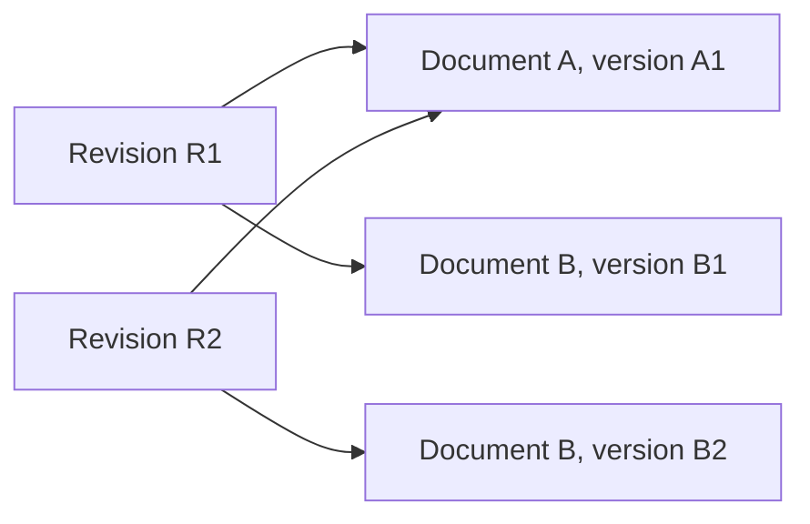

# Documents, versions, collections, and uploads

Follow a document from upload to a fixed selection that a pipeline can use. [Access control](access-control.md#documents) explains who may upload, replace, or delete it. [Ingestion security](ingestion-security.md) explains how the application handles untrusted files.

Assume Alice has the required permissions in Support, which contains documents A and B. She replaces B's contents. The new version should be available for a future release while older releases keep referring to their original inputs.

Start with the four identities below, then follow an upload, a build selection, and a source sync. Later sections explain sharing and deletion.

> **Design status:** This is the accepted v1 lifecycle. The feature endpoints, database implementation, integrations, and tests still need verification where noted.

## Contents

| Reader’s question | Start here |
| --- | --- |
| What changes when content is replaced? | [1. Stable documents and exact versions](#model) |
| When does an upload become accepted knowledge? | [2. Admit and replace content](#admission) |
| Does uploading change the live answer? | [3. Freeze a corpus and prepare it](#corpus) |
| How do repeated S3 imports behave? | [4. Synchronize a source safely](#source-sync) |
| What remains true after later changes? | [5. Change sharing, defaults, or availability](#changes) |
| Which lifecycle mistakes should I catch? | [6. Maintainer checks](#maintainer-checks) |
| Why these choices, and what remains open? | [7. Decision and reference map](#decision-map) |

## 1. Stable documents and exact versions

A **Document** identifies the same logical source over time, such as the refund handbook. Each **DocumentVersion** contains one fixed version of its content. A **Collection** names a group of documents, also called a **corpus**. A **CollectionRevision** saves exactly which versions that selection contains.

The arrows show membership. After Alice changes B, R2 contains A1 and B2. R1 still contains A1 and B1. Its saved references never follow the newest bytes automatically. The [Knowledge records](data-model.md#knowledge) define these relationships.

### Define reproducibility without promising identical execution

The record of where a result came from is its **lineage**. It tells us which inputs, settings, and stored outputs were used. It does not promise that running them again will produce the same answer.

A hosted language model may produce different text or change behind the same model alias. Rebuilding an approximate similarity-search index may change result ordering too. These are limits on repeatability even when the input history is known.

**IDs and hashes alone cannot reconstruct numerical embeddings.** Knowing which inputs were used is not the same as retaining the actual numerical output.

| Capability | Meaning and limit |
| --- | --- |
| **Lineage records** | Preserve the identities and relationships needed to explain an execution. |
| **Normal immutable-write recovery** | Accepted for qualification under [Preparing and searching reliable indexes](indexing.md). This is distinct from reconstructing lost product state. |
| **Tested backup and restore** | Remain the recovery baseline under [Upgrading and recovering an installation](upgrades-and-recovery.md). |
| **Product-level reconstruction** | Deferred. Lineage is not a promise that Inframeld can rebuild every lost artifact. |
| **Permanent numerical archives** | Deferred. Immutable physical generations do not imply permanent retention of every vector payload. |

The fixed physical generations, PostgreSQL membership records, and group-based application permissions are accepted choices. The implementation still needs tests, including measurements of the cost of finding exactly which search generations a caller may use.

### Examples of the resulting behavior

| Change or event | Expected behavior |
| --- | --- |
| **Release prompt B against the same corpus and profiles.** | Reuse the compatible ready materialization. The prompt change does not require new embeddings. |
| **Change the embedding model.** | Create lineage for the new vector space rather than overwrite the old numerical generations. |
| **Revoke Alice's document access.** | Deny her historical source reads too, even though the historical hashes remain recorded. |
| **Delete source data needed by an older release.** | The rollback target may become unavailable. Report that fact rather than fabricate reproducibility. |

These relationships describe responsibilities within the application. They need neither separate services nor a database-backed domain object for every item in a manifest, which is an inventory of saved outputs.

## 2. Admit and replace content

Alice uploads a supported PDF, Markdown, or text file.

The API streams the file into private temporary storage, checks its size and format, and gives it server-generated storage IDs. An application command then saves the accepted upload.

Saving acceptance is called **admission**. After that point, the application can track the work even if Alice closes Studio.

A filename is a display label, never a filesystem path. Each upload is limited to **25 MiB** under the [upload rules](ingestion-security.md#admission). Parsing also needs time and output limits because a small compressed file can expand into much larger content.

Knowledge owns the Document and its versions. The application hashes the content to recognize it. Observing the same content again may reuse the version, while changed bytes create a new version.

SeaweedFS stores the original bytes through the application's `ArtifactStore` interface. PostgreSQL records which stored object belongs to the accepted document. Merely placing an object in storage does not make it application knowledge.

### Step 2: parse the document and create chunks

The restricted parser converts the accepted source into text excerpts called **chunks**. The worker validates these outputs. Follow the [processing explanation](ingestion-security.md#architecture) for the isolation rules. Successful parsing does not yet mean the index or pipeline is ready.

Before accepting content, verify that all bytes are complete and durably stored under server-generated keys. A partial upload or guessed filename is insufficient. Reusing identical content still requires authorization and must not reveal another document's existence.

Creating a Document needs Add documents on every selected initial group. That permission does not include reading, replacing, deleting, sharing, or releasing it. Replacement needs Update documents on every group in the saved current audience, checked when saving the change. It preserves the Document's identity and audience. [Access](access-control.md#documents) defines the complete permission rules.

## 3. Freeze a corpus and prepare it

A build uses exact DocumentVersions selected for that request. It cannot switch to whatever happens to be newest when the worker starts.

Alice can select versions in the collection editor. The first-use working design obtains the selection from one fixed upload batch.

PostgreSQL saves the CollectionRevision's complete membership. A separate immutable **manifest**, an inventory of those version IDs, can support verification.

Uploading alone does not change live answers. Accepting the document, selecting a collection revision, preparing search data, and releasing a pipeline are separate steps.

### Step 4: freeze and run the build

A pipeline describes a limited **retrieval-augmented generation (RAG)** flow: find relevant document excerpts, then ask a model to answer from them. Its configuration selects the corpus, one processing profile, one embedding profile, retrieval limits, reranking, prompt, and generation settings.

V1 does not support arbitrary pipeline graphs or user-supplied Python execution.

When Alice selects Build candidate, the server saves the exact request and a background job. Later Studio edits cannot alter that job's inputs. A name such as P13 can be reserved immediately, but a pending build is not a ready PipelineVersion.

The worker reuses compatible existing results and creates only what is missing:

| Change | Expected work |
| --- | --- |
| Change the prompt or retrieval `top-k`, the number of results requested | Usually reuse the existing searchable data. |
| Replace the refund document B1 with B2 | Process and embed B2. Reuse compatible results for unchanged documents. |
| Change the embedding model or profile | Potentially embed the entire selected corpus again. |

Show Alice which work is needed. An incremental build reuses what it can, but changing an embedding model may still be expensive.

### Step 5: verify readiness

An **IndexMaterialization** records the generations that make the selected corpus searchable and where their vectors live. Indexing marks it ready only after checking the required records, identities, and compatibility.

Collection membership stays in PostgreSQL, rather than in mutable `collection_revision_ids` lists attached to shared vectors. Indexing decides search readiness. Knowledge cannot declare a build ready or switch Deployment traffic.

A successful build does not attach a candidate or change live traffic. A separately authorized publication command does that. Automatic updates call the normal build and request publication only if the update is still eligible. In Manual releases, an engineer decides when to publish. Both use the same build behavior.

## 4. Synchronize a source safely

V1 also supports a manually started, read-only source sync with explicit limits. It uses the **S3 object-storage API**, which does not require running Inframeld on AWS.

An operator approves a bucket and key prefix and supplies a credential limited to the access needed. The connector lists only that location, saves progress checkpoints, and submits changed files through the normal upload-acceptance path.

The connector and normalized bucket/key identify the source across syncs. An S3 ETag is not always a content hash. If the provider's metadata cannot establish content identity, use the downloaded bytes.

Unchanged content may reuse a DocumentVersion. A missing source object may be omitted from a new collection revision, but does not rewrite a revision already used by a Deployment.

Imported documents receive an explicit list of Inframeld access groups. The source system's access-control lists, or ACLs, are not copied automatically.

## 5. Change sharing, defaults, or availability

Every document keeps at least one allowed group. Changing that list requires a human who manages every old and new group. The current list also protects historical versions and citations. A group cannot be deleted while active configuration refers to it, and source-system permissions do not replace Inframeld permissions.

Private defaults are ordinary project resources. Changing them needs Manage upload defaults and management of every old and new default group. Only future uploads are affected. Each upload still needs Add documents on every selected group, with no fallback to a less restricted audience.

A complete, authorized upload batch can request an update for the **whole selected corpus**, including unchanged documents. A partial batch, saved draft, or upload-only permission cannot publish. The newest eligible request replaces older publication requests. [Onboarding](onboarding.md) and [Releases](pipelines-and-releases.md) define that workflow.

Leaving a document out of a new revision, changing its audience, and deleting it do different things. Deletion covers all versions and needs Delete documents on every current group. Access is blocked first, then cleanup can resume in stages. A late job cannot restore it. See [retention and deletion](retention-and-deletion.md).

## 6. Maintainer checks

| Scenario | Expected outcome |
| --- | --- |
| Alice replaces B1 with B2 | New revision uses B2. Older revisions retain B1. |
| The same upload is retried | Existing accepted identity may be reused without bypassing permission checks. |
| S3 lists an unchanged ETag | Treat it as a provider marker, not necessarily a content hash. |
| A source disappears | A new corpus may omit it. Old revision membership is unchanged. |
| Parsing succeeds but indexing fails | Source admission remains distinct from readiness and publication. |
| Deletion races a build | The tombstone prevents late publication or disclosure. |
| An upload default is changed | Existing document audiences do not change. |

## 7. Decision and reference map

Knowing a result's origin does not guarantee identical model answers, permanent vector archives, or reconstruction of missing bytes. Recovery depends on [coordinated backups](upgrades-and-recovery.md). The full lifecycle and the cost of checking permitted membership still need testing.

| Decision | Rationale |
| --- | --- |
| [ADR-0008](../adr/ADR-0008-preserve-immutable-versions-and-their-provenance.md) | Preserve immutable versions and their provenance. |
| [ADR-0015](../adr/ADR-0015-keep-document-group-access-separate-from-operational-permissions.md) | Keep document-group access separate from operational permissions. |
| [ADR-0036](../adr/ADR-0036-use-seaweedfs-through-the-application-s3-storage-boundary.md) | Use SeaweedFS through the application S3 storage boundary. |
| [ADR-0039](../adr/ADR-0039-block-access-before-resumable-physical-deletion.md) | Block access before resumable physical deletion. |
