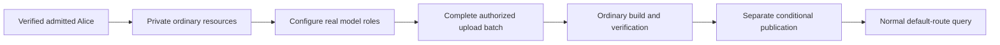

# From a new account to a first useful answer

Alice wants to upload two Support documents and ask her first useful question without first learning every internal resource. Assume she has been admitted to Inframeld and has an approved model endpoint and key. This guide follows the default setup through its first answer and later updates.

[Access](access-control.md) explains permissions, [model connections](model-connections.md) explains provider credentials, and [Releases](pipelines-and-releases.md#modes) explains when a prepared version becomes live.

Start with what private setup creates, then follow model configuration and publication. Section 6 walks through a complete example. Section 7 explains what a meaningful first-use timing test includes.

> **Design status:** Private defaults and the publication workflow are accepted v1 design. Proposed route shapes and test assumptions remain labelled below. This guide does not claim the UI, endpoints, or integration tests are complete.

## Contents

| Reader’s question | Start here |
| --- | --- |
| What does setup create? | [1. Private defaults are ordinary resources](#model) |
| Do defaults bypass upload or sharing checks? | [2. Keep starter content private](#access) |
| What is required before the first answer? | [3. Configure and validate real models](#models) |
| What happens before first publication? | [4. Resolve the default through normal serving](#default-route) |
| Does every upload publish? | [5. Apply a complete authorized selection](#updates) |
| How do failures and mode changes look? | [6. Follow the first answer and a later change](#journey) |
| What does the timing goal include? | [7. Measure the full first-use journey](#qualification) |
| Which setup and publication races matter? | [8. Maintainer checks](#maintainer-checks) |
| Why these choices, and what remains open? | [9. Decision and reference map](#decision-map) |

<a id="model"></a>

## 1. Private defaults are ordinary resources

The server operator controls a one-time claim that establishes the installation and the first verified human's explicit permissions. The first arbitrary public signup never becomes an administrator. This claim gives neither unrestricted UI authority nor host access. Kratos verifies identity, while Access separately controls admission, suspension, restoration, and project creation.

Each admitted human gets a private starter project, group, collection, processing preset, and Pipeline. The person is explicitly both member and manager of the group and receives the required setup and administration permissions, including Delete project. This setup neither requires nor grants Create projects. Other people's starters are separate, and installation administrators have no document-reading bypass.

Permissions name individual Pipelines and Deployments. Before the first Deployment exists, Alice needs Create Deployment, Build, permission for the underlying change, and access to its inputs. Creation saves the ready initial version and creator grants together, including Manage releases. Later releases need Manage releases on that Deployment. No placeholder Deployment or separate first-release permission is needed.



The arrows show successive steps within the application. Each step uses its existing domain and ordinary permission checks.

### Make provisioning safe to repeat

After Kratos verifies Alice, save her starter setup in one short PostgreSQL transaction. This includes both group membership and management, the other setup records, the access change number, and audit. Either all are saved or none are. Follow the [member-plus-manager rule](access-control.md#group-managers). A unique ownership-and-purpose key can be:

```text
(organization, verified human principal, starter)
```

A **principal** is the stable local identity of a human or application. This key lets a retry find Alice's existing starter project. Saved default bindings identify its group, collection, preset, and Pipeline by ID. The installation's one-time administrator claim has its own uniqueness check.

Do not keep the transaction open while calling Kratos or a model. If saving fails, a later request can complete the same setup. If saving succeeds but the response is lost, return the existing IDs.

Record both completed setup and deliberate removal. Otherwise a restart could mistake deleted defaults for unfinished setup and recreate them. Database transactions and uniqueness rules are enough, without a distributed setup coordinator.

<a id="access"></a>

## 2. Keep starter content private

Every Document lists at least one allowed group from its project. Uploads need Add documents on every group, even when the server chose the defaults. That permission includes no reading, replacement, deletion, sharing, or release rights. Imports also select Inframeld groups rather than copy the source system's permissions.

Changing defaults needs Manage upload defaults and management of every old and new group. It affects only future uploads. A missing or unauthorized group blocks the upload instead of making it public. [Access document rules](access-control.md#documents) give the full permission list.

Setup issues no application key automatically. An authorized human must pass Access's key-administration and grant-authority checks. The application's access must be safe for everyone using it. Applications cannot administer permissions or incoming keys in v1. A person leaving follows ordinary handover or deletion rules.

<a id="models"></a>

## 3. Configure and validate real models

Saving a provider key does not prove it works. Testing text generation also does not prove that the same connection can create embeddings for search.

The simplest form accepts one connection and key, then separate embedding and generation model IDs. Share the connection when both use the same origin and authentication. An **origin** is the scheme, host, and port. Otherwise configure separate connections without copying a saved secret to another origin.

Test generation and embedding separately through ModelGateway. Record the connection and credential revisions tested, plus the actual embedding dimensions.

Replacing or removing a key invalidates the old test result. First publication requires validation of the **current credential revision**. Changing the endpoint origin requires a new connection and explicit credential entry.

These capability probes are limited model calls authorized by the configuration action. They test the selected roles, without adding an offline benchmark or a general certification process.

Save application-entered credentials using the accepted [PostgreSQL/PyNaCl mechanism](model-connections.md). Missing setup cannot be bypassed with a fabricated valid connection.

### Keep optional work out of the initial path

Start with the explicit `none` reranker and a tested text-first processing preset with limits. A reranker reorders search results, so `none` deliberately skips that optional step. Text-first processing handles existing text without requiring OCR to read scanned pages.

Do not quietly add model or profile downloads, a local language model, OCR, reranking, or a judge. Users can select richer settings later through normal versioned configuration. A different embedding model requires a new profile and materialization, not relabelling old vectors.

<a id="default-route"></a>

## 4. Resolve the default through normal serving

The recommended HTTP route is:

```text
POST /v1/projects/{projectId}/deployments/default/query
```

`default` is a reserved selector handled by the same resolver as an ordinary Deployment ID. Before first publication it is unbound. It does not pretend that a ready Deployment or version already exists.

An authorized defaults read shows the normal resource IDs, current binding, safe progress and readiness, and the next action. Check project membership and Query permission before showing setup information. The usual response for inaccessible projects must reveal neither existence nor setup details.

### Before first publication, reject the query before admission

An unbound or not-ready alias returns **`409 deployment_not_ready`**, with a safe reason such as models required, documents required, preparing, failed, or explicit release required.

This rejection happens before accepting a query. It generates no answer, creates no job or resources, and makes no model call. Any temporary idempotency reservation rolls back. The caller can inspect permitted setup status and try again after readiness. A GET or query never supplies a canned answer or bypasses retrieval to complete setup.

If dependencies fail after publication, report normal unavailability. Do not silently unbind the route or act as if setup never happened.

### Identify what actually served, not the convenience alias

When accepting a query, choose its actual Deployment revision and PipelineVersion and protect them with the normal retention and simultaneous-change rules. A temporary **pin** keeps the selected artifacts from ordinary cleanup during that query.

The response and AnswerReceipt name the actual Deployment, revision, version, and routing group, or **cohort**. The default alias replaces none of these facts and grants no extra permissions.

### Deduplicate the requested route before selecting a fresh target

An **idempotency key** identifies one requested operation. After authentication, find or reserve it using the requested logical route, project, and principal **before choosing a fresh serving target**. The first accepted request saves its actual target and version.

After promotion or rebinding the alias to another Deployment, a retry still returns the original operation or receipt, subject to current access. It cannot reinterpret the old key as a new paid query against the new target.

HTTP and MCP identify the route in the same way. A request through the alias and one using an explicit Deployment ID are different routes. Recognizing duplicates across them is not promised.

### Keep HTTP, generated clients, and MCP aligned

Represent the alias in the authoritative OpenAPI contract and consume it through the externally generated SDK, the client library used by Studio.

MCP retains its two tools. The recommended default selector is `deploymentId: "default"` with `projectId` required. Ordinary Deployment IDs keep their meaning. HTTP and MCP call the same resolver and query, with the same receipt and affinity rules. Affinity keeps related requests on the same canary version and is not proof of human identity.

`get_answer_receipt` stays unchanged. Setup needs no third tool, mode-administration tool, or separate retriever. The onboarding behavior and two-tool scope are accepted. The exact HTTP and MCP selector shapes remain recommendations.

<a id="updates"></a>

## 5. Apply a complete authorized selection

Automatic mode starts a workflow, but grants no permissions. For an existing Deployment, enabling it requires Build on the selected Pipeline, Manage releases on that Deployment, and access to the inputs. Applying a source or configuration change also requires permission for that change. Before the first default Deployment exists, the initiating human instead needs Create Deployment, with the same Build, change, and input checks.

Manage releases covers publication, rollback, canaries, mode switches, and automatic-input selection on one Deployment. Edit configuration covers only non-serving details. The [Access rules](access-control.md#section-bound-administration-grants-and-recovery) define that separation.

Save who requested the update and the authority under which it was accepted. Check current project or resource scope and permissions again before sending work and before publishing. A job cannot publish using permission its requester has since lost.

The starter creator receives explicit permissions for the starter project and resources, including Build on the selected Pipeline. Before the first Deployment exists, publication also requires Create Deployment. Creating it assigns Manage releases on that new Deployment; later updates require current Manage releases on that exact Deployment. The installation-level Create projects permission is separate. Starter setup neither needs nor grants it. Someone with upload-only permission may save source changes, but Studio must explain that applying them needs an authorized person. Upload or Query never includes release permission.

When several automatic Deployments use one collection, the operation names each target it may update. Each has its own request and outcome. There is no all-Deployment transaction or use of another person's release permissions.

### Treat a completed batch as one complete selection

Use ordinary completed upload batches, not a continuous file watcher. Later files form another batch.

A partially failed batch may keep successfully accepted files, but must not quietly publish a smaller corpus. Alice can retry safe work or deliberately change the selection. Save exact source versions and settings when accepting the update, so the worker cannot substitute whatever is newest later.

The first batch may reserve document IDs through normal saved acceptance steps before building. If any admission fails, publication is blocked.

A manually requested S3 sync follows the same rule after establishing a complete revision. An authorized Apply action starts the update for the automatic Deployment. V1 adds no scheduled polling or publication after each incomplete listing page.

Removing a document from a collection changes a future selection. Revoking access or explicitly erasing it is different: [retention rules](retention-and-deletion.md) apply immediately and may make the current version unavailable in either mode. Old versions are not entitled to keep serving erased content.

### Apply only the configuration the user selected

Save and apply freezes the model or Pipeline configuration shown to Alice for that target. Explain when changing the embedding profile may require processing the whole corpus again.

Editing a field, saving an unrelated draft, or testing a model role does not start an update. Replacing a provider credential changes current access to the service, but neither creates a pipeline version nor silently releases one or selects another model.

### Make defaults discoverable, editable, and deliberately repairable

Studio marks ordinary default resources with a **Default** badge and shows publication mode, current version, selected configuration, and pending update status.

Renaming a default changes its label, not its ID, binding, mode, or settings. Another Deployment starts in Manual releases unless Automatic updates and its input binding are explicitly chosen.

Changing which inputs an automatic Deployment follows needs Build, Manage releases, input access, the expected revision, and a fresh Apply decision.

Changing the default route changes what serves requests, not just a label. It cannot override an attached candidate silently. It invalidates pending work for the old binding and uses the selected Deployment's own mode. An existing manual Deployment must not inherit the old default's automatic setting.

After deliberate deletion, keep setup and removal markers so restart does not recreate defaults. Repair requires an authorized choice of resources and mode. Deletion cancels pending publication, and an old default-route job cannot bring the removed Deployment back.

A missing default group blocks uploads. Repair follows normal lifecycle and permission rules, without a special one-time reset bypass.

<a id="journey"></a>

## 6. Follow the first answer and a later change

Alice completes account setup, saves a provider connection, and selects embedding model **E** and generation model **G**. Her private default starts in Automatic updates.

She completes one batch containing `installation.md` **A1** and `refunds.md` **B1**. The worker builds **P1** against **R1 = {A1, B1}**, then the separate publication command creates the first Deployment and binds the route.

Studio shows preparation progress, then **Ready to ask**. Her answer has normal citations and **AnswerReceipt A77**. No judge or release screen is required.

### Successful replacement

Alice uploads **B2**. The update freezes **R2 = {A1, B2}** with the selected configuration. P1 continues serving during the build. After verification and eligible publication, **P2 becomes current and P1 becomes previous**.

Feedback submitted later for A77 still belongs to P1.

### Failure and overlapping updates

The next batch requests P3, but the build fails. Healthy P2 keeps serving. If a newer authorized batch replaces P3's request while it retries, P3 cannot publish later. The newest complete selection is handled next.

Show failure of the newest update. Do not silently publish an incomplete corpus or fall back to an older request that was replaced.

### Manual review

Alice switches to Manual releases, which removes pending automatic jobs' permission to publish. She builds P4, explicitly compares it with P2, attaches a canary, then promotes or rejects it.

Enabling automation while that candidate remains attached is rejected. A later rollback leaves Manual releases selected.

### Automatic again

After resolving the candidate, Alice selects Enable automatic updates and apply pending changes. She reviews the selected corpus and settings and authorizes fresh work. Current keeps serving while it builds. Previously disabled jobs remain unable to publish.

The route, permissions, data, and historical evaluations remain the same ordinary resources throughout.

<a id="qualification"></a>

## 7. Measure the full first-use journey

The first-answer goal measures usability. Two minutes is an aspiration, and roughly ten minutes is acceptable too. Neither is a hard gate or promised support limit. A timer is no reason to weaken correctness or add infrastructure.

### Use a small, explicit fixture and prepared environment

A **fixture** is a defined set of test inputs used to repeat the scenario.

| Part of the scenario | Assumption or bound |
| --- | --- |
| **Documents** | Two UTF-8 Markdown/plain-text files, each at most **25 KiB**, about **10 chunks combined**, with a hard test cap of **20 chunks**. UTF-8 is the text encoding used by the files. |
| **Retrieval evidence** | Include facts absent from the question, such as a fictional product’s exact refund period and installation port. Success must depend on retrieving them. |
| **Excluded document work** | PDFs remain supported elsewhere, but scanned PDFs/OCR, tables, and larger documents are outside this timing scenario. |
| **Proposed host** | A laptop with **16 GiB RAM**, roughly **four CPUs and 8 GiB available to Docker**, local SSD, and the existing small-trial disk allowance. These are proposed test assumptions, not measured minimum requirements. |
| **Concurrency** | One user and one parser job, with no concurrent builds/evaluations and no local language-model or cross-encoder loading. |
| **Prepared installation** | Product images and pinned parser text assets are already downloaded. Application volumes are empty, so migrations, account setup, and default provisioning still happen. |
| **Protected configuration** | The operator supplies persistent encryption/bootstrap secret files through normal one-time installation preparation. This is a stated prerequisite, not a substitute for saving provider credentials in the application. |
| **Model endpoint** | An available, pre-approved endpoint, with valid credentials at hand. Configure embedding and generation separately, sharing a connection where appropriate. No judge is needed. |

This scenario assumes the endpoint origin and certificate authority are already approved. A private gateway needing extra certificates or network setup has a separate cost to measure. It cannot be promised the same setup time.

Measure role probes, embedding, and generation, noting throttling and provider cold starts. Do not prescribe mandatory seconds per stage before measuring an implementation.

### Report three different journeys rather than substituting the easiest one

| Journey | What its clock includes |
| --- | --- |
| **Prepared installation launch → first answer** | Start when the user launches the already-installed product, before services are healthy. Include startup/migrations, account/private-resource setup, model/credential entry and probes, upload, parsing/chunking, embeddings, index verification, authorized publication, and question generation. Include human interaction time. |
| **Clean installation → first answer** | Also include obtaining Docker if absent, image/model downloads, generating initial protected configuration, and host/network setup. Report these real first-run costs rather than moving them outside both clocks. |
| **Restart with existing accounts/configuration → answer** | A separate, easier case. It must not replace the empty-application-state journey. |

Image downloads alone can exceed two minutes, so do not claim that timing from a fresh machine. Report automated phases separately. A test that supplies configuration instantly does not measure a human completing onboarding.

Investigate slow service startup or migrations, credential entry, parser startup, and provider cold starts or rate limits. Prepare assets, limit text processing, explain model roles, and share credentials where appropriate. Keep optional OCR, reranker, and judge setup out of the initial path.

Authentication, parser isolation, index verification, and real supporting evidence remain required. Use measured delays to improve confusing or slow steps. A longer run alone is not a reason to redesign the architecture.

### Lightweight end-to-end acceptance scenario

1. **Start with prepared images and empty application state.** Start the full journey clock. Complete real account setup and save actual role configurations and a credential through the API-backed flow.
2. **Upload the complete two-file batch with Automatic updates selected.** Its admission authorizes the ordinary build and first publication without a separate Prepare and ask command. Record source versions, collection revision, job/build, ready PipelineVersion, and the actual first Deployment. Verify that no Deployment existed before readiness.
3. **Ask for a fixture-specific fact.** The answer must match permitted retrieved content, contain valid source citations and an answer identity, and use the real `ModelGateway` and Chroma paths. A canned answer or ungrounded fallback does not pass.
4. **Report the full journey, not only the fastest run.** Repeat a few clean-application-state runs. Record total and phase times, available provider model/revision, chunk counts, hardware, and image versions. Check whether a new user completes the path without learning internal resource setup. Neither two minutes nor roughly ten minutes is a hard gate or promised support limit.
5. **Check the essential behavior separately.** Verify that restart preserves credentials and default IDs, another user cannot read starter data, and retries do not duplicate setup. Failed batches must never publish. Cancellation or a control change must prevent an old build from publishing. A failed later update must leave healthy P1 serving. Check API/MCP default resolution and feedback attribution against the actual version. Retry an alias query after promotion or rebinding and confirm it returns the original operation/receipt without another model call.

During backend-first work, authenticated integration tests and a test client can check behavior and server timings. Measuring a real person's discovery and setup journey waits for Studio and its tested external TypeScript SDK.

SDK Kit suitability blocks Studio, not backend work. This is a focused acceptance exercise rather than a new certification or operations program.

<a id="maintainer-checks"></a>

## 8. Maintainer checks

Use real PostgreSQL tests for simultaneous changes and the existing adapter-verification tests. They are required checks, not results already established by this guide.

| Area | Required verification |
| --- | --- |
| **Provisioning and creation** | The private group records its creator as both member and manager in the same transaction. Retries create no duplicates or manager-only state. Defaults start automatic without a fake-ready Deployment. Explicit creation defaults manual and honors an explicit automatic choice. A failed or incomplete first batch never serves. |
| **Successful and failed replacements** | Automatic publication uses complete ready bindings, records previous/history, and preserves answer/feedback attribution. Failed replacement preserves healthy current serving. Erasure and unavailability retain their separate rules. |
| **Mode-switch races** | Exercise publication versus switching to manual in both commit orders, and automatic → manual → automatic while an old build runs. Only still-authorized work may publish. |
| **Overlapping batches** | Supersede both queued and running work. Verify complete corpus membership, no stale overwrite, and no fallback to an older result when the newest request fails. |
| **Crashes and retries** | Restart between build completion, publication, and acknowledgment. Retry mode/update commands with the same and different keys. Prevent duplicate admission, duplicate pointer transitions, and implicit repetition of uncertain paid calls. |
| **Candidate and rollback rules** | Reject enabling automation with a candidate at 0% or nonzero traffic. Reject manual canary/release commands in automatic mode. Rollback stays manual. Re-enabling clearly authorizes the selected pending update. |
| **Current access and lifecycle** | Test revoked grants, upload-only/query-only actors, differing target permissions, erased inputs, default deletion/rebinding, and unavailable rollback targets. Neither mode nor an old job bypasses current policy. |
| **Client parity** | Verify HTTP/Studio/SDK status and MCP query/receipt behavior through mode changes. Add no administrative MCP tools. A comparison neither pauses publication nor promotes its preferred version. |

Client **parity** means that HTTP, Studio, SDKs, and MCP observe the same application behavior and state. They do not implement separate versions of the workflow.

<a id="decision-map"></a>

## 9. Decision and reference map

Private defaults and reversible modes are settled. Selector fields, timing assumptions, and detailed verification remain as labelled. [Supporting records](data-model.md#supporting-records) defines bindings and markers, and [release coordination](pipelines-and-releases.md#modes) defines the checks that stop outdated publication. Backend work can proceed while Studio waits for SDK suitability.

| Decision | Rationale |
| --- | --- |
| [ADR-0046](../adr/ADR-0046-provision-creator-private-defaults-through-ordinary-resources.md) | Provision creator-private defaults through ordinary resources. |
| [ADR-0049](../adr/ADR-0049-require-group-managers-to-be-ordinary-members.md) | Record the creator as both member and manager of the private group. |
| [ADR-0047](../adr/ADR-0047-support-reversible-publication-modes-per-deployment.md) | Support reversible publication modes per Deployment. |
