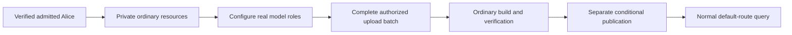

# From a new account to a first useful answer

Alice wants to upload two Support documents and ask her first useful question without first learning every internal resource. Assume she has been admitted to Inframeld and has an approved model endpoint and key. This guide follows the default setup through its first answer and later updates.

[Access](access-control.md) explains permissions, [model connections](model-connections.md) explains provider credentials, and [Releases](pipelines-and-releases.md#modes) explains when a prepared version becomes live.

Start with what private setup creates, then follow model configuration and publication. Section 6 walks through a complete example. Section 7 explains what a meaningful first-use timing test includes.

> **Design status:** Private defaults and the publication workflow are accepted v1 design. Proposed route shapes and test assumptions remain labelled below. This guide does not claim the UI, endpoints, or integration tests are complete.

## Contents

| Reader’s question | Start here |
| --- | --- |
| What does setup create? | [1. Private defaults are ordinary resources](#model) |
| How does CLI setup establish human identity? | [Human login before provisioning](#human-login) |
| Do defaults bypass upload or sharing checks? | [2. Keep starter content private](#access) |
| Must I test models before using them? | [3. Configure models with optional preflight](#models) |
| What happens before first publication? | [4. Resolve the default through normal serving](#default-route) |
| Does every upload publish? | [5. Apply a complete authorized selection](#updates) |
| How do failures and mode changes look? | [6. Follow the first answer and a later change](#journey) |
| What does the timing goal include? | [7. Measure the full first-use journey](#qualification) |
| Which setup and publication races matter? | [8. Maintainer checks](#maintainer-checks) |
| Why these choices, and what remains open? | [9. Decision and reference map](#decision-map) |

<a id="model"></a>

## 1. Private defaults are ordinary resources

The server operator controls a one-time claim that establishes the installation and the first verified human's explicit permissions. The first arbitrary public signup never becomes an administrator. This claim gives neither unrestricted UI authority nor host access. Kratos verifies identity, while Access separately controls admission, suspension, restoration, and project creation.

Each admitted human gets a private starter project, group, collection, processing preset, and Pipeline. The person is explicitly both member and manager of the group and receives the required setup and administration permissions, including Delete project. This setup neither requires nor grants Create projects. Other people's starters are separate, and installation administrators have no document-reading bypass.

Permissions name individual Pipelines and Deployments. Before the first Deployment exists, Alice needs Create Deployment, Build, permission for the underlying change, and access to its inputs. Creation saves the ready initial version and creator grants together, including Manage releases. Later releases need Manage releases on that Deployment. No placeholder Deployment or separate first-release permission is needed.


```mermaid
flowchart LR
    Human[Verified admitted Alice] --> Defaults[Private ordinary resources]
    Defaults --> Models[Configure real model roles]
    Models --> Batch[Complete authorized upload batch]
    Batch --> Build[Ordinary build and verification]
    Build --> Release[Separate conditional publication]
    Release --> Query[Normal default-route query]
```

The arrows show successive steps within the application. Each step uses its existing domain and ordinary permission checks.

<a id="human-login"></a>

### Sign in before provisioning, without requiring Studio

For the CLI, `local start` starts/reuses the managed runtime and returns with an explicit `setup --target local` next step. It does not sign in or claim administration. Guided setup or explicit login opens the system browser through the accepted Kratos-plus-Hydra flow. The small Ory account UI authenticates Alice through Kratos and handles the documented Hydra login/consent integration independently of the full Studio. [Access](access-control.md#human-cli-authentication) owns token verification and local-principal resolution; [ADR-0053](../adr/ADR-0053-use-kratos-and-hydra-for-human-cli-authentication.md) records this selected architecture.

Successful identity-provider login alone is insufficient. The first administrator must complete the separately authorized operator claim, and every human must pass current admission/account checks before private provisioning or product access. Local setup may use its narrowly bound host maintenance channel; remote setup requires the remote operator's authorized action, not an implied SSH privilege. [Deployment](deployment.md#managed-local-http) specifies the managed same-machine HTTP exception. All other installations require HTTPS.

Reuse an existing valid login for the selected target/account. A changed issuer, a different verified person for an existing account alias, unavailable verification or incomplete admission must not silently create another identity or default project. Reopening setup follows the same saved state. Human CLI tokens stay in the qualified local credential store, not in a project file or an application integration. [Authentication qualification](access-control.md#cli-authentication-qualification) remains pending; the existing cookie adapter alone does not establish this flow.

<a id="host-bootstrap"></a>

### Confirm the first administrator through host authority

Local setup first obtains a verified Ory identity, keeping issued tokens transient until admission and secure saving succeed. Show that verified account and installation, and ask the host operator to confirm the initial explicit administrative grants. A typed email is not proof of identity; OAuth consent alone is not the bootstrap permission.

Invoke a narrow maintenance operation inside the verified managed backend using existing host/container authority. Bind it to the installation, not a target named `local` or whichever Docker context happens to be selected. Send any credential through protected stdin/IPC, never argv, environment or logs. The operation independently verifies the identity evidence through trusted Ory integration, then atomically saves the identity link, scoped grants and audit event. Repeating the completed claim for the same identity is harmless; a competing different identity fails.

No public claim endpoint, shared claim password, browser host authority or Docker socket mounted in the backend is introduced. Remote first setup requires the equivalent operator action on the server; ordinary remote login supplies no SSH or maintenance authority. Exact maintenance command/IPC, expected-state and retry contracts remain #116/#27 deliverables. After the claim, normal admission must still succeed before the CLI reports a usable saved login.

<a id="guided-setup-entry"></a>

### Start setup explicitly and resume only unfinished work

Setup guides an unconfigured or partly configured project to its first functioning pipeline. It is not ongoing administration and does not equate an existing project record with readiness. `local start` reports runtime health and the next `setup --target local` command, then returns without entering or prompting for onboarding. Starting local also preserves an existing remote selection. No mandatory `init` or project configuration file is required.

An explicit or saved unfinished project resumes its missing steps using current backend state and normal operation recovery. A ready project reports readiness and ordinary next commands without recreating a Pipeline, replaying a configuration wizard or making another paid demonstration query. An unavailable/inaccessible project fails without substituting a starter or treating denial as incomplete setup.

For a first-time user without a project selection, offer **Your starter project** as the recommended choice and **A new project** as the advanced choice. Do not add a generic existing-project picker or an experience-level question. Existing unfinished work remains reachable through explicit/saved context. Selecting the starter reuses it; creating another project requires ordinary Create projects authority and leaves the starter untouched. Remembering context requires visible agreement and obeys [selection rules](api-contracts.md#cli-context).

The New project choice calls [ordinary project creation](https://github.com/matejpalenik/inframeld/issues/28), not the [private-starter provisioner](https://github.com/matejpalenik/inframeld/issues/27). Creation saves the project, creator membership and seven explicit initial project-action grants together. It does not provision a Pipeline or start model work. Setup then continues as separate steps. A naming conflict or denied permission saves no partial project; a lost response is reconciled before retry. If Alice stops after successful creation, her new project remains and later setup resumes it without duplication. [CLI project management](https://github.com/matejpalenik/inframeld/issues/178) exposes the same operation outside setup.

Offer the starter's saved Display name once. Enter keeps it and its Name; a new label does not change stable IDs, bindings or publication mode. Any suggested Name change is a separate explicit review. Do not ask for collection, Pipeline or access-group names in that step. Resume preserves subsequent renames without asking again. Naming is optional and does not imply an extra registration field.

The starter is ordinary, not undeletable or permanently automatic. Creating/selecting another project and stop/start leave it intact. Deliberate mode changes remain unchanged on later setup. Authorized deliberate deletion records absence; setup explains it and requires explicit repair/creation rather than resurrecting it. Destructive review identifies the target/project and consequences; `--no-input` alone is not confirmation.

Every guided choice has a noninteractive input path. Missing required input fails before that operation without prompts/browser/editor or blanket approval of later model calls. Completed earlier steps remain saved. A connection created separately during an abandoned setup remains a real resource, not a promise of cross-resource rollback. Precise command options, readiness reporting and recovery projections remain specification work; ordinary backend workflows own their effects.

<a id="starter-naming"></a>

### Generate a readable starter name once

For example, the backend provisions `Quiet Orbit` with Name `quiet-orbit`. Use the selected Python `coolname` package behind an infrastructure adapter, with a reviewed bundled Inframeld vocabulary and a preferred two-word pattern. The upstream function `generate_slug(2)` is a library identifier, not Inframeld's resource terminology. No model call, network naming service, personal information or credential participates in generation.

Save the generated Display name and Name in the same all-or-nothing, principal/purpose-idempotent starter provisioning operation as the project. Database uniqueness, not randomness, prevents collisions. Retry generated candidates only within a specified bound; exhaustion fails provisioning honestly. A lost response or repeated setup returns the existing project and values, not another random name or partial starter.

The optional naming prompt starts from the persisted Display name. Keeping it is a complete choice. Editing that label may suggest a corresponding Name, but changing the existing Name needs a separate explicit reviewed choice. This is not a Kratos registration field or a reason to delay or duplicate provisioning. Resume preserves subsequent edits; do not mass-rename existing projects or recreate deliberately deleted starters.

`coolname` was selected as a BSD-2-Clause dependency, not installed or qualified by this documentation. Retain copyright, conditions, disclaimer and applicable word-list notices in source and binary distribution materials. This selection does not change Apache-2.0 OSS scope or choose a future enterprise license. Package version, approved vocabulary, retry bounds, migrations and release licensing review remain delivery work. [Resource naming](data-model.md#resource-naming) owns name uniqueness, explicit rename and retirement.

### Make provisioning safe to repeat

After Kratos verifies Alice, save her starter setup in one short PostgreSQL transaction. This includes both group membership and management, the other setup records, the access change number, and audit. Either all are saved or none are. Follow the [member-plus-manager rule](access-control.md#group-managers). A unique ownership-and-purpose key can be:

```text
(organization, verified human principal, starter)
```

A **principal** is the stable local identity of a human or application. This key lets a retry find Alice's existing starter project. Saved default bindings identify its group, collection, preset, and Pipeline by ID. The installation's one-time administrator claim has its own uniqueness check.

Do not keep the transaction open while calling Kratos, Hydra or a model. If saving fails, a later request can complete the same setup. If saving succeeds but the response is lost, return the existing IDs.

Record both completed setup and deliberate removal. Otherwise a restart could mistake deleted defaults for unfinished setup and recreate them. Database transactions and uniqueness rules are enough, without a distributed setup coordinator.

<a id="access"></a>

## 2. Keep starter content private

Every Document lists at least one allowed group from its project. Uploads need Add documents on every group, even when the server chose the defaults. That permission includes no reading, replacement, deletion, sharing, or release rights. Imports also select Inframeld groups rather than copy the source system's permissions.

Changing defaults needs Manage upload defaults and management of every old and new group. It affects only future uploads. A missing or unauthorized group blocks the upload instead of making it public. [Access document rules](access-control.md#documents) give the full permission list.

Setup issues no application key automatically. An authorized human must pass Access's key-administration and grant-authority checks. The application's access must be safe for everyone using it. Applications cannot administer permissions or incoming keys in v1. A person leaving follows ordinary handover or deletion rules.

After setup or publication, **Finish** remains the default. The optional [CLI application-connection journey](https://github.com/matejpalenik/inframeld/issues/161) can guide account selection/creation, an explicit access review, separate show-once credential issuance and HTTP or MCP instructions. It uses ordinary Access operations and preserves partial-completion identities. An optional live test authenticates as the application, not Alice, and needs its own cost/data-transfer approval. Neither choosing MCP nor accepting this optional flow changes publication policy or exports Alice's Hydra credentials.

<a id="models"></a>

## 3. Configure models with optional preflight

Saving a provider key does not prove it works. Testing text generation also does not prove that the same connection can create embeddings for search.

The simplest form accepts one connection and key, then separate embedding and generation model IDs. Share the connection when both use the same origin and authentication. An **origin** is the scheme, host, and port. Otherwise configure separate connections without copying a saved secret to another origin.

Use the same role, model and connection screens for generation, embeddings and hosted reranking. [Metadata suggestions](model-connections.md#model-metadata) may prefill supported settings from either an identified versioned local catalogue entry or a qualified metadata read from the selected approved server. Show where the suggestion came from, let the user edit it and save the reviewed values.

For a private model alias with no reliable metadata, leave unknown settings unknown until the user supplies the necessary supported configuration. If model listing fails, still allow manual model input. Do not run an inference probe to fill the gap.

For example, Alice changes a suggested context of 131,072 tokens to her gateway's configured 32,768, reuses `company-gateway`'s saved key and skips testing. Resuming setup retains those saved choices even after a catalog update; it does not re-prompt for the key or mark the role Validated. Model settings belong to the Pipeline/profile, not a new connection variant. A refresh requires a reviewed ordinary edit. Human and noninteractive paths expose the same values, provenance and unresolved requirements; scripts do not silently choose a newer suggestion.

[Provider authentication](model-connections.md#provider-authentication) is separate from login: users provide a raw provider key once through the protected connection workflow, and the backend supplies the supported authentication header when calling that destination. Incoming Hydra tokens and Inframeld application keys never travel upstream. A credential-free approved local Ollama connection skips irrelevant key entry. Authentication-method support, safe metadata discovery and exact field contracts still require qualification.

Offer a small synthetic test of the selected roles, but let Alice continue without it. This **preflight** can catch configuration problems before larger processing costs occur. It is not a prerequisite for ordinary model use or first publication. A user may instead save configuration and exit. Separate paid probes require explicit approval, and skipping them never silently schedules one later.

Before a selected role/model has been tried, show it as **Not tested**, not invalid or ready merely because a key was saved. When a real call completes and passes all required response checks, automatically mark its actual configuration **Validated**, recording real use as the evidence source. Report a failed or uncertain attempt explicitly rather than calling it untested or validated. Generation success validates only generation; a successful embedding call validates only that embedding configuration and its actual dimensions. Neither makes an incomplete build ready or certifies answer quality.

For example, Alice skips both tests. Her real document-embedding work establishes embedding validation, and the complete verified index can become ready for authorized publication while generation remains Not tested. Her first real answer then establishes generation validation if its response passes the required checks. If generation fails, report the ordinary query failure without changing provider, fabricating an answer or erasing completed embedding work.

Configuration and runtime checks remain mandatory even when Alice skips the probe. Establish embedding meaning and dimensions before freezing the profile, using supported metadata, explicit validated configuration or an optional probe. Resolve missing dimensions rather than guess them.

Every real call goes through ModelGateway's permission, credential, destination, transport and response checks. First publication still needs complete valid configuration, a ready version with verified materializations, all required local dependencies and normal release permission.

Local credential checks establish only that a required key is present, permitted and decryptable. They do not prove that the provider accepts it. **Absence of prior model-validation evidence is not itself a readiness or publication blocker.**

Replacing a key makes the new credential revision untested. A late success using the old key cannot validate the replacement. Removing a required key still blocks dispatch. After setup, connection management can change shared current access settings through [guarded review](model-connections.md#shared-current), including explicit credential provision for a changed origin. Incompatible or unproven existing embedding dependencies reject the update. Another connection and ordinary preparation/query/Build support isolated migration. Setup does not silently edit a reused connection. Validation status is historical evidence, not an availability guarantee; show later failures without hiding them behind an earlier successful check.

[Model connections](model-connections.md#roles) owns these runtime and evidence rules, and [ADR-0050](../adr/ADR-0050-make-model-preflight-optional-and-record-runtime-validation.md) supersedes the former separate-probe prerequisite. Neither optional preflight nor runtime evidence adds an offline benchmark, judge or certification process.

Save application-entered credentials using the accepted [PostgreSQL/PyNaCl mechanism](model-connections.md). Missing setup cannot be bypassed with a fabricated valid connection.

### Offer reranking without adding mandatory work

Use a qualified text-first Docling hybrid processing preset with explicit limits. Offer reranking through the shared model-role screens: recommend the qualified built-in Ettin 32M option for English workloads, preserve explicit `none`, and allow a supported hosted connection/model. A highlighted recommendation does not silently save or run it. Text-first processing handles existing text without requiring OCR to read scanned pages.

Do not quietly add model/profile downloads, a local generation model, OCR, reranking or a judge. Built-in reranking runs on the selected backend using packaged assets, not in the CLI. Hosted selection reuses connection/credential screens and optional testing, with cost review before any model call. A different embedding model requires a new profile and materialization, not relabelling old vectors.

<a id="default-route"></a>

## 4. Resolve the default through normal serving

The recommended HTTP route is:

```text
POST /v1/projects/{projectId}/deployments/default/query
```

`default` is a reserved selector handled by the same resolver as an ordinary Deployment ID. Before first publication it is unbound. It does not pretend that a ready Deployment or version already exists.

An authorized defaults read shows the normal resource IDs, current binding, safe progress and readiness, and the next action. Check project membership and Query permission before showing setup information. The usual response for inaccessible projects must reveal neither existence nor setup details.

### Before first publication, reject the query before admission

An unbound or not-ready alias returns **`409 deployment_not_ready`**, with a safe reason such as models required, documents required, preparing, failed, or explicit release required.

This rejection happens before accepting a query. It generates no answer, creates no job or resources, and makes no model call. Any temporary idempotency reservation rolls back. The caller can inspect permitted setup status and try again after readiness. A GET or query never supplies a canned answer or bypasses retrieval to complete setup.

If dependencies fail after publication, report normal unavailability. Do not silently unbind the route or act as if setup never happened.

### Identify what actually served, not the convenience alias

When accepting a query, choose its actual Deployment revision and PipelineVersion and protect them with the normal retention and simultaneous-change rules. A temporary **pin** keeps the selected artifacts from ordinary cleanup during that query.

The response and AnswerReceipt name the actual Deployment, revision, version, and routing group, or **cohort**. The default alias replaces none of these facts and grants no extra permissions.

### Deduplicate the requested route before selecting a fresh target

An **idempotency key** identifies one requested operation. After authentication, find or reserve it using the requested logical route, project, and principal **before choosing a fresh serving target**. The first accepted request saves its actual target and version.

After promotion or rebinding the alias to another Deployment, a retry still returns the original operation or receipt, subject to current access. It cannot reinterpret the old key as a new paid query against the new target.

HTTP and MCP identify the route in the same way. A request through the alias and one using an explicit Deployment ID are different routes. Recognizing duplicates across them is not promised.

### Keep HTTP, generated clients, and MCP aligned

Represent the alias in the authoritative OpenAPI contract and consume it through the externally generated SDK, the client library used by Studio.

MCP retains its two tools. The recommended default selector is `deploymentId: "default"` with `projectId` required. Ordinary Deployment IDs keep their meaning. HTTP and MCP call the same resolver and query, with the same receipt and affinity rules. Affinity keeps related requests on the same canary version and is not proof of human identity.

`get_answer_receipt` stays unchanged. Setup needs no third tool, mode-administration tool, or separate retriever. The onboarding behavior and two-tool scope are accepted. The exact HTTP and MCP selector shapes remain recommendations.

<a id="updates"></a>

## 5. Apply a complete authorized selection

Automatic mode starts a workflow, but grants no permissions. For an existing Deployment, enabling it requires Build on the selected Pipeline, Manage releases on that Deployment, and access to the inputs. Applying a source or configuration change also requires permission for that change. Before the first default Deployment exists, the initiating human instead needs Create Deployment, with the same Build, change, and input checks.

Manage releases covers publication, rollback, canaries, mode switches, and automatic-input selection on one Deployment. Edit configuration covers only non-serving details. The [Access rules](access-control.md#section-bound-administration-grants-and-recovery) define that separation.

Save who requested the update and the authority under which it was accepted. Check current project or resource scope and permissions again before sending work and before publishing. A job cannot publish using permission its requester has since lost.

The starter creator receives explicit permissions for the starter project and resources, including Build on the selected Pipeline. Before the first Deployment exists, publication also requires Create Deployment. Creating it assigns Manage releases on that new Deployment; later updates require current Manage releases on that exact Deployment. The installation-level Create projects permission is separate. Starter setup neither needs nor grants it. Someone with upload-only permission may save source changes, but the CLI must explain that publishing them needs an authorized person. Future Studio follows the same rule. Upload or Query never includes release permission.

When several automatic Deployments use one collection, the operation names each target it may update. Each has its own request and outcome. There is no all-Deployment transaction or use of another person's release permissions.

### Treat a completed batch as one complete selection

Use ordinary completed upload batches, not a continuous file watcher. Later files form another batch.

A partially failed batch may keep successfully accepted files, but must not quietly publish a smaller corpus. Alice can retry safe work or deliberately change the selection. Save exact source versions and settings when accepting the update, so the worker cannot substitute whatever is newest later.

The first batch may reserve document IDs through normal saved acceptance steps before building. If any admission fails, publication is blocked.

A manually requested S3 sync follows the same rule after establishing a complete revision. Its explicitly authorized live-input update starts preparation and conditional publication for the selected Automatic Deployment. It uses the Deployment's selected configuration, not an unrelated working edit. V1 adds no scheduled polling or publication after each incomplete listing page.

Removing a document from a collection changes a future selection. Revoking access or explicitly erasing it is different: [retention rules](retention-and-deletion.md) apply immediately and may make the current version unavailable in either mode. Old versions are not entitled to keep serving erased content.

### Build only the saved configuration the user selected

After setup, Alice can edit the Pipeline's revisioned working configuration, query the protected direct Pipeline query API and evaluate it before creating a release version. [Pipelines and Releases](pipelines-and-releases.md#working-configuration) owns this loop. `inframeld build` captures the current saved configuration and corpus shown to Alice, not a run ID or unsaved per-request overrides. It follows the selected live Deployment's mode, with no separate CLI apply command. Explain when changed embedding/chunking requires preparation of the whole corpus and when earlier evaluation does not match these inputs.

Editing/saving/restoring working settings, preparing direct-query dependencies, evaluating, or testing a model role does not start publication. Automatic document updates keep the Deployment's explicitly selected configuration. Development-only uploads must not silently modify its watched collections. Replacing a provider credential changes current access to the service, but neither creates a pipeline version nor silently releases one or selects another model.

This later development loop is not a new setup prerequisite. Initial private provisioning, authorized automatic first publication and optional Finish remain unchanged. An ordinary Build with no live Deployment creates an unpublished version; it does not impersonate setup's separately authorized create-and-bind operation. A direct query can execute without a Deployment once its own inputs and dependencies are ready, but it must never be labelled a live/default answer.

### Take an imported Pipeline live explicitly

Bob imports his colleague's configuration into an existing project. The import creates supported resource definitions, not documents, vectors, a release version or a Deployment. If he needs a new project, he creates it through the ordinary operation above before returning to a fresh import review.

1. Supply credentials and documents through their existing authorized workflows. Import does not perform these steps or send model requests implicitly.
2. Explicitly Build the saved Pipeline configuration and selected corpus. Review preparation, outgoing data and cost. With no Deployment, successful Build returns a ready **unpublished** version.
3. Use [CLI Deployment management](https://github.com/matejpalenik/inframeld/issues/174) to create a Deployment from that exact ready, compatible version. [Backend creation](https://github.com/matejpalenik/inframeld/issues/59) checks current Create Deployment authority and readiness. Explicit creation defaults to **Manual**; **Automatic** and its input binding require an explicit choice.
4. Show the endpoint and initial serving version only after creation is confirmed. A lost response requires original-operation recovery, not a second creation or a substituted version.
5. Offer Finish. Creation alone does not change the project-default binding, issue an application key or send a paid test query. Those are separate choices with their own checks.

This journey must be available in CLI v1 without Studio or handwritten API requests. The exact commands and human/JSON/noninteractive/dry-run contracts belong to [CLI contract work](https://github.com/matejpalenik/inframeld/issues/156); the sequence here does not invent final flags or claim the CLI is implemented. The initial starter's separately authorized Automatic create-and-bind flow remains unchanged.

### Make defaults discoverable, editable, and deliberately repairable

The CLI identifies ordinary default resources and shows publication mode, current version, selected configuration and pending update status. Future Studio presents the same facts, including a **Default** badge; it is not required to inspect or change them in v1.

Renaming a default changes its label, not its ID, binding, mode, or settings. Another Deployment starts in Manual releases unless Automatic updates and its input binding are explicitly chosen.

Changing which inputs an automatic Deployment follows needs Build, Manage releases, input access, the expected revision, and a fresh explicit update decision. Configuration selection is captured by the policy-controlled Build workflow; saving a working revision alone cannot change the binding. Mode switching retains its separately reviewed update selection under [the publication rules](pipelines-and-releases.md#modes).

Changing the default route changes what serves requests, not just a label. It cannot override an attached candidate silently. It invalidates pending work for the old binding and uses the selected Deployment's own mode. An existing manual Deployment must not inherit the old default's automatic setting.

After deliberate deletion, keep setup and removal markers so restart does not recreate defaults. Repair requires an authorized choice of resources and mode. Deletion cancels pending publication, and an old default-route job cannot bring the removed Deployment back.

A missing default group blocks uploads. Repair follows normal lifecycle and permission rules, without a special one-time reset bypass.

[CLI Deployment management](https://github.com/matejpalenik/inframeld/issues/174) owns the complete mode and default-route journey. It calls [publication-mode changes](https://github.com/matejpalenik/inframeld/issues/62) and [default-binding operations](https://github.com/matejpalenik/inframeld/issues/60), rather than writing release state itself. Switching Automatic to Manual invalidates pending publication authority. Re-enabling Automatic initially reviews the currently serving version's configuration; using different saved settings requires deliberate selection and fresh admission. An attached candidate, even at zero allocation, blocks enabling Automatic.

For example, Bob deliberately deletes the old default and later selects a ready Manual Deployment as its replacement. Review the route change, current authority and candidate restrictions before saving the new binding. Preserve that Deployment's Manual mode and invalidate authority tied to the old binding. If state changes during review, stop and review again; do not silently accept newer state or recreate the deleted resource. Repairing a missing upload-default group belongs to [ordinary Access administration](https://github.com/matejpalenik/inframeld/issues/28), presented by [CLI access management](https://github.com/matejpalenik/inframeld/issues/178), not the release operation.

<a id="journey"></a>

## 6. Follow the first answer and a later change

Alice completes account setup, saves a provider connection, and selects embedding model **E** and generation model **G**. Her private default starts in Automatic updates.

She completes one batch containing `installation.md` **A1** and `refunds.md` **B1**. The worker builds **P1** against **R1 = {A1, B1}**, then the separate publication command creates the first Deployment and binds the route.

The client shows preparation progress, then **Ready to ask**. Her answer has normal citations and **AnswerReceipt A77**. No judge or release screen is required.

### Finish setup before optional evaluation

In the [CLI starter-evaluation journey](https://github.com/matejpalenik/inframeld/issues/179), **Finish** is the default action after the first answer. Asking another question, inspecting the execution, or generating starter evaluation cases are optional. Choosing Finish leaves a fully usable pipeline; it creates no evaluation job or judge configuration.

If Alice chooses starter generation, she selects an existing generator connection, reviews the permitted source sample, outgoing data, estimated cost and budget, then admits a separate durable job. The default request is 20 single-passage cases. They are unreviewed proposals, with exact source excerpts and proposed answers, not automatically trusted tests. Review can be deferred or resumed without running a judge.

Only a later explicit evaluation action selects a judge and freezes accepted case revisions into the default regression benchmark. Neither action modifies the pipeline's generation model or publication mode. Rejected drafts, partial generation, budget exhaustion, and changed permissions follow [Evaluation](evaluation.md), the canonical lifecycle specification. The Ragas integration and these CLI commands remain accepted design pending implementation and qualification.

### Successful replacement

Alice uploads **B2**. The update freezes **R2 = {A1, B2}** with the selected configuration. P1 continues serving during the build. After verification and eligible publication, **P2 becomes current and P1 becomes previous**.

Feedback submitted later for A77 still belongs to P1.

### Failure and overlapping updates

The next batch requests P3, but the build fails. Healthy P2 keeps serving. If a newer authorized batch replaces P3's request while it retries, P3 cannot publish later. The newest complete selection is handled next.

Show failure of the newest update. Do not silently publish an incomplete corpus or fall back to an older request that was replaced.

### Manual review

Alice can query and evaluate a changed working configuration while Production remains automatic; those operations do not publish. If she also wants to stop independently authorized live updates during review, she switches to Manual releases, removing pending automatic jobs' permission to publish. She compares her captured working settings freshly against P2, explicitly saves the settings she wants, then builds P4 from the current saved configuration. Build discloses any mismatch with evaluated inputs. She may compare the ready P4 again, then attach a candidate and promote or reject it, with optional canary traffic.

Enabling automation while that candidate remains attached is rejected. A later rollback leaves Manual releases selected.

### Automatic again

After resolving the candidate, Alice selects Enable automatic updates and apply pending changes. She reviews the selected corpus and settings and authorizes fresh work. Current keeps serving while it builds. Previously disabled jobs remain unable to publish.

The route, permissions, data, and historical evaluations remain the same ordinary resources throughout.

<a id="qualification"></a>

## 7. Measure the full first-use journey

The first-answer goal measures usability. Two minutes is an aspiration, and roughly ten minutes is acceptable too. Neither is a hard gate or promised support limit. A timer is no reason to weaken correctness or add infrastructure.

### Use a small, explicit fixture and prepared environment

A **fixture** is a defined set of test inputs used to repeat the scenario.

| Part of the scenario | Assumption or bound |
| --- | --- |
| **Documents** | Two UTF-8 Markdown/plain-text files, each at most **25 KiB**, about **10 chunks combined**, with a hard test cap of **20 chunks**. UTF-8 is the text encoding used by the files. |
| **Retrieval evidence** | Include facts absent from the question, such as a fictional product’s exact refund period and installation port. Success must depend on retrieving them. |
| **Excluded document work** | PDFs remain supported elsewhere, but scanned PDFs/OCR, tables, and larger documents are outside this timing scenario. |
| **Proposed host** | A laptop with **16 GiB RAM**, roughly **four CPUs and 8 GiB available to Docker**, local SSD, and the existing small-trial disk allowance. These are proposed test assumptions, not measured minimum requirements. |
| **Concurrency** | One user and one parser job, with no concurrent builds/evaluations and no local language-model or cross-encoder loading. |
| **Prepared installation** | Product images and pinned parser text assets are already downloaded. Application volumes are empty, so migrations, account setup, and default provisioning still happen. |
| **Protected configuration** | The operator supplies persistent encryption/bootstrap secret files through normal one-time installation preparation. This is a stated prerequisite, not a substitute for saving provider credentials in the application. |
| **Model endpoint** | An available, pre-approved endpoint, with valid credentials at hand. Configure embedding and generation separately, sharing a connection where appropriate. No judge is needed. |

This scenario assumes the endpoint origin and certificate authority are already approved. A private gateway needing extra certificates or network setup has a separate cost to measure. It cannot be promised the same setup time.

Measure optional role probes when selected, embedding, and generation, noting throttling and provider cold starts. Record whether preflight was chosen or skipped. Do not prescribe mandatory seconds per stage before measuring an implementation.

### Report three different journeys rather than substituting the easiest one

| Journey | What its clock includes |
| --- | --- |
| **Prepared installation launch → first answer** | Start when the user launches the already-installed product, before services are healthy. Include startup/migrations, account/private-resource setup, model/credential entry and any selected probes, upload, parsing/chunking, embeddings, index verification, authorized publication, and question generation. Include human interaction time. |
| **Clean installation → first answer** | Also include obtaining Docker if absent, image/model downloads, generating initial protected configuration, and host/network setup. Report these real first-run costs rather than moving them outside both clocks. |
| **Restart with existing accounts/configuration → answer** | A separate, easier case. It must not replace the empty-application-state journey. |

Image downloads alone can exceed two minutes, so do not claim that timing from a fresh machine. Report automated phases separately. A test that supplies configuration instantly does not measure a human completing onboarding.

Investigate slow service startup or migrations, credential entry, parser startup, and provider cold starts or rate limits. Prepare assets, limit text processing, explain model roles, and reuse connections where authorized. Offer the optional reranking choice through the same role/model/connection screens; built-in or none needs no new key. Keep optional OCR and post-setup generator/judge configuration outside the required first-answer path.

Authentication, parser isolation, index verification, and real supporting evidence remain required. Use measured delays to improve confusing or slow steps. A longer run alone is not a reason to redesign the architecture.

### Lightweight end-to-end acceptance scenario

1. **Start with prepared images and empty application state.** Start the full journey clock. Complete real account setup and save actual role configurations and a credential through the API-backed flow. Exercise the path with preflight skipped and record that choice. Unknown profile settings must still be supplied before the build.
2. **Upload the complete two-file batch with Automatic updates selected.** Its admission authorizes the ordinary build and first publication without a separate Prepare and ask command. Record source versions, collection revision, job/build, ready PipelineVersion, and the actual first Deployment. Verify that no Deployment existed before readiness.
3. **Ask for a fixture-specific fact.** The answer must match permitted retrieved content, contain valid source citations and an answer identity, and use the real `ModelGateway` and Chroma paths. Verify separate validation evidence from actual embedding and generation calls without extra synthetic requests. A canned answer or ungrounded fallback does not pass.
4. **Report the full journey, not only the fastest run.** Repeat a few clean-application-state runs. Record total and phase times, available provider model/revision, chunk counts, hardware, and image versions. Check whether a new user completes the path without learning internal resource setup. Neither two minutes nor roughly ten minutes is a hard gate or promised support limit.
5. **Check the essential behavior separately.** Verify that restart preserves credentials and default IDs, another user cannot read starter data, and retries do not duplicate setup. Failed batches must never publish. Cancellation or a control change must prevent an old build from publishing. A failed later update must leave healthy P1 serving. Check API/MCP default resolution and feedback attribution against the actual version. Retry an alias query after promotion or rebinding and confirm it returns the original operation/receipt without another model call.

During backend-first work, authenticated integration tests and a test client can check behavior and server timings. Measuring a real person's discovery and setup journey requires the CLI and its small Ory browser account UI. Both can be qualified independently of full Studio; future Studio has its own generated-client and browser gates.

V1 qualifies the CLI journey and its independent Ory account UI without requiring full Studio. Generated-client compatibility follows the delivered contract incrementally. This is a focused acceptance exercise rather than a new certification or operations program; see [the delivery plan](cli-delivery-plan.md).

<a id="maintainer-checks"></a>

## 8. Maintainer checks

Use real PostgreSQL tests for simultaneous changes and the existing adapter-verification tests. They are required checks, not results already established by this guide.

| Area | Required verification |
| --- | --- |
| **Provisioning and creation** | The private group records its creator as both member and manager in the same transaction. Retries create no duplicates or manager-only state. Defaults start automatic without a fake-ready Deployment. Explicit creation defaults manual and honors an explicit automatic choice. A failed or incomplete first batch never serves. |
| **Optional model preflight** | Permit skipping synthetic tests without blocking an otherwise ready first publication. Real calls validate only their exact role/model/revisions after response checks. Missing credentials/configuration and invalid embeddings still fail. Late old-key results cannot validate a replacement. |
| **Successful and failed replacements** | Automatic publication uses complete ready bindings, records previous/history, and preserves answer/feedback attribution. Failed replacement preserves healthy current serving. Erasure and unavailability retain their separate rules. |
| **Mode-switch races** | Exercise publication versus switching to manual in both commit orders, and automatic → manual → automatic while an old build runs. Only still-authorized work may publish. |
| **Overlapping batches** | Supersede both queued and running work. Verify complete corpus membership, no stale overwrite, and no fallback to an older result when the newest request fails. |
| **Crashes and retries** | Restart between build completion, publication, and acknowledgment. Retry mode/update commands with the same and different keys. Prevent duplicate admission, duplicate pointer transitions, and implicit repetition of uncertain paid calls. |
| **Candidate and rollback rules** | Reject enabling automation with a candidate at 0% or nonzero traffic. Reject manual canary/release commands in automatic mode. Rollback stays manual. Re-enabling clearly authorizes the selected pending update. |
| **Current access and lifecycle** | Test revoked grants, upload-only/query-only actors, differing target permissions, erased inputs, default deletion/rebinding, and unavailable rollback targets. Neither mode nor an old job bypasses current policy. |
| **Client parity** | Verify HTTP/Studio/SDK status and MCP query/receipt behavior through mode changes. Add no administrative MCP tools. A comparison neither pauses publication nor promotes its preferred version. |

Client **parity** means that HTTP, Studio, SDKs, and MCP observe the same application behavior and state. They do not implement separate versions of the workflow.

<a id="decision-map"></a>

## 9. Decision and reference map

Private defaults and reversible modes are settled. Selector fields, timing assumptions, and detailed verification remain as labelled. [Supporting records](data-model.md#supporting-records) defines bindings and markers, and [release coordination](pipelines-and-releases.md#modes) defines the checks that stop outdated publication. Backend work can proceed while Studio waits for SDK suitability.

| Decision | Rationale |
| --- | --- |
| [ADR-0046](../adr/ADR-0046-provision-creator-private-defaults-through-ordinary-resources.md) | Provision creator-private defaults through ordinary resources. |
| [ADR-0049](../adr/ADR-0049-require-group-managers-to-be-ordinary-members.md) | Record the creator as both member and manager of the private group. |
| [ADR-0047](../adr/ADR-0047-support-reversible-publication-modes-per-deployment.md) | Support reversible publication modes per Deployment. |
| [ADR-0050](../adr/ADR-0050-make-model-preflight-optional-and-record-runtime-validation.md) | Allow optional model preflight and validation through successful real use. |
