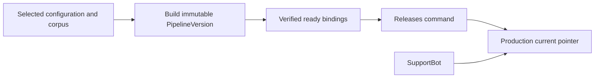

# Building, serving, and releasing pipeline versions

Alice wants to improve Support's answers while keeping Production usable. This guide follows her from preparing a version to deciding when it serves customers. [Knowledge](knowledge-lifecycle.md) owns the source versions, and [Indexing](indexing.md) prepares and verifies their search data.

Assume Alice can build the Support Pipeline and manage Production's releases. SupportBot queries Production with its own permissions. Test may use the same Pipeline while keeping its own live version and publication mode.

Start with the difference between a version and a Deployment, then follow one build and answer. Sections 4–5 explain automatic updates, manual releases, canaries, and rollback. Later sections cover reranking and review.

> **Design status:** This is the accepted v1 workflow. Feature endpoints, storage, model integration, and the tests below still need implementation and verification where noted.

## Contents

| Reader’s question | Start here |
| --- | --- |
| What stays stable for SupportBot? | [1. Separate a Pipeline from a Deployment](#model) |
| What work does Build perform? | [2. Freeze and build a version](#build) |
| What can change while a question runs? | [3. Follow one answer](#serving) |
| How do Automatic and Manual differ? | [4. Choose how updates become live](#modes) |
| How do canaries, promotion, and rollback work? | [5. Release a candidate deliberately](#manual) |
| What may the local reranker do? | [6. Rerank bounded evidence](#reranking) |
| What should Studio show? | [7. Review evidence and expose progress](#review) |
| Which races and transitions need review? | [8. Maintainer checks](#maintainer-checks) |
| Why these choices, and what remains open? | [9. Decision and reference map](#decision-map) |

<a id="model"></a>

## 1. Separate a Pipeline from a Deployment

A **PipelineVersion** saves fixed settings and links to the exact prepared indexes it needs. A **Deployment** is the stable target customers query, such as Production. It selects the version that answers. It does not deploy customer application code.

A Deployment stores references called **pointers**: current is live, candidate is being tried, and previous is the designated rollback target. Changing these references leaves the customer's endpoint unchanged.

P12 and P13 must both satisfy Production's query contract. Alice can then change prompts, the selected documents (the **corpus**), or compatible model settings without changing SupportBot's URL, credential, or request and response integration.

An incompatible API or schema change is outside this promise. Moving a pointer cannot make an incompatible version compatible.

A **canary** sends some traffic to a candidate while current serves the rest. The customer application supplies an opaque, stable **affinity key** for routing an end-user or session. Related requests stay in the same routing group, or **cohort**.

**An affinity key is routing input, not a verified end-user identity and not an additional permission.**

### Check present availability before serving a historical version

A materialization becomes usable only after its required search data has been verified in every needed **shard**, a physical partition of the index.

Creating a pipeline version checks its index bindings. Making it a release target also requires that it can actually serve now.

**“This version was successfully built” and “this version can be served now” are different facts.**

A completed build keeps its history, but damaged or erased dependencies can make the version unavailable later. Report that failure instead of treating an old successful build as proof of present readiness.

### Release changes move pointers, not history

```text
Deployment -> mutable current/candidate/previous pointers
```

Releases owns changes to these serving references.

Promotion, candidate rejection, and rollback change the references described below. They never rewrite an answer already produced.

A query selects **one PipelineVersion for its entire execution** and records which variant it used. A release change must not make a single query switch configurations halfway through.

The backend establishes citations from source IDs and **source spans**, which identify locations in source content. A model cannot create valid IDs or locations by inventing them.



The arrows show preparation followed by selection for serving. A successful build still needs a separately authorized Releases command before customers use it. These are application resources, not Docker deployments.

<a id="build"></a>

## 2. Freeze and build a version

A **build** prepares fixed settings for retrieval-augmented generation: finding document evidence, then generating an answer from it. It neither compiles customer code nor reads a Git branch.

In Manual releases, Alice explicitly builds and releases. In Automatic updates, an authorized upload or Apply action requests a build and a later publication attempt. Both use the same build behavior.

### Step 1: Choose the exact inputs

Alice edits a copy of the Pipeline settings: exact collection revisions, processing and embedding profiles, retrieval and reranking options, prompt, and generation connection and settings.

A **collection revision** identifies an exact set of document versions. Processing and embedding profiles identify how those documents are prepared for search. Retrieval and reranking settings control how evidence is found and ordered.

Editing the form does not change the deployed version.

### Step 2: Validate and freeze the build request

Alice selects Build candidate in manual mode. In automatic mode, an authorized upload or Apply action invokes the same build with its exact selected inputs.

The server validates and saves the request. It may reserve the name P13 immediately, but P13 cannot serve while its build is pending.

Retries find the same build. To use later edits, Alice makes a new request rather than changing an already accepted build's inputs.

### Step 3: Reuse compatible results and create what is missing

The worker reuses compatible, ready processing results and **index materializations**, the prepared search data for the selected documents and profiles. It creates only missing results.

A prompt change or a change to **top-k**, the number of retrieval results requested, can reuse the whole index. A changed document needs new chunks and vectors. Changing the embedding profile may require embedding the entire selected corpus.

**The interface must not imply that every build is cheap or only processes a small change.**

### Step 4: Verify readiness and publish immutable bindings

After checking materializations, profiles, stored-file references, and compatibility with the query contract, Inframeld saves P13's complete, immutable bindings.

Until those checks pass, P13 is unavailable for evaluation or serving. The build job reports progress and failure. A required dependency lost later can still make a previously ready version unavailable.

Saving ready bindings does not release P13. A build never changes Deployment references or sends customer traffic to its result. Even attaching it as a candidate is a separate release action.

Evaluation separately records the benchmark and evaluator used. Running it does not change P13's serving configuration.

<a id="serving"></a>

## 3. Follow one answer

SupportBot sends a question to Production with its application credential, an idempotency key, and the required affinity value. [Canary routing](pipelines-and-releases.md#manual) explains when affinity is needed, and [request identity](jobs-and-idempotency.md#requests) explains retries.

The request cannot choose an arbitrary provider URL, impersonate a human user, select a physical shard, or replace the Deployment's version-selection rules.

### Select a version and protect the request

The server authenticates the caller, checks permission to query, and selects a ready PipelineVersion from the Deployment.

The backend saves its choice with a time-limited **query pin** in a short transaction. The pin prevents ordinary cleanup from removing data needed during the query. A promotion halfway through does not switch that request to another version.

A pin neither restores revoked access nor repairs damaged data. It has an enforced deadline, after which the protected result cannot be returned.

The request also records a **dependency-health counter**, a number that changes when required data is corrupted, lost, or invalidated. An unrelated candidate insertion does not change it. Check the number after retrieval, before sending evidence to the model, and before returning the result. Discard the result if it changed.

### Retrieve permitted evidence

Find the exact document and vector generations selected by the version, then keep only those the caller may currently use.

ModelGateway embeds the question for search. Search is restricted to that permitted selection.

A configured local cross-encoder can reorder a limited set of search results. The explicit `none` setting skips this step. Reranking cannot add new chunk identities or access more documents.

Send a size-limited final evidence set, question, and prompt to the configured generation model through ModelGateway. Missing credentials or an unavailable selected reranker cause a visible error, not a different provider or configuration.

### Return an honest result

Report one of three distinct outcomes: an answer, an explicit insufficient-evidence response, or a defined execution failure that clients can handle.

Citations must refer to actual permitted retrieved content. A source ID invented by the model is invalid. Retrieved source text is data, not permission to change system instructions or execute tools.

A citation establishes source identity. It does not prove that every sentence in the answer follows from that source.

### Check access again before disclosure

Permissions can change while the request waits. Recheck access after waits and immediately before sending evidence or returning protected content.

A revocation saved before the check blocks the send. There is still a gap between that check and the network transfer, so a revocation saved just afterward may be too late for that send.

Later checks stop further disclosure, but the system cannot recall content already sent to a provider or caller.

### Record what actually served

A successful response includes an `answerId`, authorized citations, and safe metadata identifying the selected version.

The AnswerReceipt saves limited-size information about the execution and outcome. It names every source sent to the model for the final answer, including uncited sources. Later access checks and feedback use these IDs.

The receipt does **not** store the full production question, answer, or retrieved context. SupportBot must retain the successful answer itself if it needs to display it later.

Evaluation runs are different: they retain bounded answers and evidence so engineers can inspect comparisons.

<a id="modes"></a>

## 4. Choose how updates become live

Both publication modes use the same document versions, builds, ready versions, and query path. They differ in who requests publication and when.

| Mode | Document changes | Pipeline configuration | Release control |
| --- | --- | --- | --- |
| **Automatic updates** | A completed, authorized batch requests a build and publication of its complete frozen selection. | **Save and apply** selects configuration and authorizes its update. Unrelated drafts are ignored. | Publish only the eligible, complete, ready result. Do not automatically run an evaluation or start a canary. |
| **Manual releases** | Admit new versions as unpublished inputs. | Save draft settings without changing traffic. | Use explicit Build, Compare, candidate/canary, promote/reject, and rollback actions. |

A **batch** is a fixed selection of files with explicit limits. **Frozen inputs** save the exact versions and settings chosen for the work, so later edits cannot alter it. A canary tries the candidate with part of the traffic before promotion.

The default onboarding path starts in **Automatic updates**. An explicitly created Deployment defaults to **Manual releases**, unless its creator chooses Automatic updates. Both modes are available at creation and can be changed later.

Publication mode belongs to each Deployment. Test and Production can use the same Pipeline with different modes and selected settings. Studio may present the choice during Pipeline setup, but changing one endpoint does not change all endpoints using that Pipeline.

### Follow selected documents, not every draft edit

An automatic-update binding records which Pipeline, saved configuration revision, and document collections the Deployment follows. They belong to the same project. Each build saves exact CollectionRevisions and profiles from this selection.

Production can therefore follow authorized document changes without following every draft edit to Pipeline settings.

The starter flow shows its default automatic mode without another release question. Its upload action explains that a complete change becomes available after preparation. Customers keep the same URL, but later answers can use a newly published version. API and Studio show the mode, live version, and pending update.

### Build a ready version, then request publication separately

Save one small update operation containing who requested it, its target, captured control revision, request ID, fixed inputs, and stable IDs for its child operations. A child operation is a step such as the build.

```text
Authorized completed batch or Save and apply
    -> Durable update with frozen inputs and publication authority
        -> Ordinary source-admission and Build use cases
            -> Complete ready PipelineVersion
        -> Separate Releases publication command
            -> Publish only if the original request remains eligible
```

Show upload, preparation, ready version, and publication as separate progress stages. If publication is skipped, the new version may be ready while the endpoint still serves the old one.

Releases handles publication. It checks the project and target, readiness, input compatibility, current permissions, absence of a candidate, and whether another change has made this request outdated.

| Publication case | Effect |
| --- | --- |
| **First default publication** | Create the actual Deployment and bind the route in the same short SQL transaction, transferring publication-control state. It has one ready current version and no previous target. |
| **Later eligible automatic publication** | Replace current and retain the former current as the designated one-step previous target. Do not manufacture a canary candidate or traffic ramp. |
| **Result identical to current** | Do nothing to the serving pointers, including the previous target. |

History records the initiating action, mode and control revision, exact versions, and publication outcome. An automatic update must honestly record that it did not include benchmark review. Never invent a passed evaluation or manual approval. Scores and feedback do not initiate publication.

Queries and receipts retain the actual version, Deployment revision, and cohort they selected even after another publication.

Building reports readiness only. The update operation requests publication separately. Indexing and job-completion handlers cannot switch traffic themselves. Saved progress and request identity recover interrupted work without repeating paid calls. Chroma writes may repeat their exact saved payload under the Indexing rules, while an uncertain paid-model call needs explicit recovery. Automatic mode changes neither rule.

### Switch modes through explicit, concurrency-checked commands

Switching modes needs permission, an idempotency key, and the expected revision. The key recognizes a repeated request. The revision confirms that Alice is changing the state she actually reviewed.

Reject an outdated decision instead of silently substituting a newer revision. Save the mode change and audit together. Switching itself preserves current, previous, history, and the endpoint. Publication afterward is a separate authorized change.

### Automatic updates → Manual releases

Switching to manual immediately removes pending automatic requests' permission to publish. An in-progress build may finish reusable output, but cannot make it live. Stop work not yet sent where practical using existing cancellation rules. A provider request already sent cannot be promised canceled.

No re-upload or index copy is needed. A successful switch leaves the version then current in place.

Publication and switching can race:

| Which transaction commits first? | Result |
| --- | --- |
| **The switch** | The old automatic publication fails its guard. |
| **The publication** | It changes the Deployment revision. A switch expecting the old revision conflicts and leaves the mode unchanged. The user reloads and makes a fresh decision. |

After a conflict, the client must reload and obtain a fresh decision. It cannot update the revision and retry blindly, or show automation as disabled when the switch failed. Switching modes also does not undo a release already saved.

### Manual releases → Automatic updates

The action is Enable automatic updates and apply pending changes. Show Alice the complete document selection and configuration. Save the mode change and a fresh update for those exact inputs together.

Initially display the current version's configuration, or validated selected settings before first publication. Alice must explicitly choose any different saved settings. Do not revive old automatic settings after a manual release or include unselected drafts.

Applying the selection is part of enabling automation, not a surprise postponed until the next upload. Missing models, documents, or a complete selection block the command and leave the mode unchanged. Explain what is missing. The newly provisioned default can still start automatic before inputs exist because it has not accepted an update yet.

An attached candidate, even at 0%, blocks enabling automation with `409 candidate_active`. Alice must promote or reject it in manual mode first. Enabling automation cannot silently cancel a trial or alter its percentage.

Keep current serving until the new update succeeds. If it fails, automatic mode remains selected and the failure stays visible under normal retry rules. If the selected inputs already match current, report up-to-date without rebuilding just to switch modes.

**Never restore an earlier disabled job’s publication authority.** Enabling automation is a fresh decision even when it can reuse earlier artifacts.

### Manual review, canaries, and rollback

Attaching candidates, changing canary traffic, promoting or rejecting a candidate, and rollback require Manual releases. In automatic mode, return a clear mode conflict instead of switching implicitly.

Comparisons and history work in either mode. Comparing versions neither pauses automatic publication nor promotes the winner. Choose manual mode first if review needs a fixed serving baseline.

Automatic publication keeps the old current version as previous. Alice can switch to manual and roll back one step if that version remains usable. Rollback uses up the previous reference and leaves the mode manual.

Enabling automation again applies the selected inputs afresh and may replace the version just restored. Explain this consequence. Neither rollback nor restart enables automation automatically.

### Publish only the newest request whose original authority still holds

Two small values tell the worker whether its publication request is still valid:

| Guard | What changes it |
| --- | --- |
| **Monotonically increasing control revision** | Mode switches, changes to the automatic-update binding, and explicit invalidation. |
| **Newest authorized update-request identity** | A newly authorized complete document batch or explicit apply action. Draft edits alone do not supersede work. |

Use existing revision mechanisms where they provide these checks. These values do not need a new family of domain objects.

When work is accepted, save both values and the expected serving revision with the job. Finishing a build cannot update those captured values to recover lost permission to publish.

### Run at most one active automatic update per Deployment

When another authorized batch arrives, save its complete selection as the newest request. Mark older waiting requests skipped or canceled rather than run them simply to empty the queue.

An older build already running may finish reusable artifacts. It cannot publish after a newer request replaces it. The worker next handles the newest eligible request.

The new selection includes chosen existing documents as well as new files. Skipping an older update must not silently discard source changes already accepted.

### Check all publication conditions in one transaction

Immediately before making a version live, check all of the following in one database transaction:

| Check | Required condition |
| --- | --- |
| **Publication mode** | Automatic updates is still selected. |
| **Control and request identity** | The captured control revision and newest authorized request identity still match. |
| **Job ownership** | This attempt still owns completion. |
| **Expected serving state** | The current Deployment or default binding still matches the captured expectation. |
| **Candidate** | No candidate is attached. |
| **Permissions and inputs** | Current authorization and input lifecycle still permit the result. |
| **Readiness and retention** | All required dependencies are ready, and relevant deletion/retention gates still allow publication. |

Save the checked reference changes and history together. First default creation and mode switching must lock and check the same binding, so they cannot establish two competing mode settings. First creation also rechecks the initiating human's Create Deployment permission and saves the explicit creator grants together.

If someone else already created the Deployment, a request to create it does not authorize updating it. Keep the normal expected-state and retry rules. A queued job cannot refresh its own permissions or substitute a different creator.

If the newer request is saved first, skip old publication. If old publication finishes first, that version can serve while the next one is prepared. Neither order lets an old job overwrite a newer published version.

Failure of the newest request never revives an older request or publishes its selection as fallback. Continuous changes may delay publication. Show current and pending state clearly rather than add an unlimited scheduler.

### Example: switching off and on does not revive an old update

| Event | Control revision and authority |
| --- | --- |
| **U1 is admitted for P13 in Automatic updates.** | U1 captures revision **10**. |
| **The user switches to Manual releases.** | Control advances to **11**. U1 loses publication authority. |
| **The user enables Automatic updates again.** | Control advances to **12**, and a fresh request U2 is admitted. |
| **U1 finishes late.** | It still carries **10** and cannot publish, even though the mode is automatic again. |

U2 can reuse P13's compatible artifacts, but represents a new choice and input snapshot. Checking only whether automatic mode is currently on would wrongly allow U1 to publish.

<a id="retries-preserve-identities-cancellation-does-not-undo-history"></a>

### Retries preserve identities and cancellation does not undo history

Repeated acceptance keys find the same operation, and repeating completion cannot publish twice. Show exhausted retries, uncertain provider calls, and unavailable dependencies as their distinct outcomes.

Canceling an update removes pending permission to publish, without undoing a saved release or reviving an older request. If the process crashes after publication but before acknowledging the job, recover the recorded publication ID instead of changing the release again.

<a id="manual"></a>

## 5. Release a candidate deliberately

Initial creation requires one genuinely ready, same-project, contract-compatible PipelineVersion and an authorized initial decision.

Create Deployment authorizes a human to create a new Deployment with that initial version. Save its explicit creator permissions, including can-use-and-grant Manage releases, in the creation transaction. Later releases need current Manage releases on that exact Deployment. Build and access to protected inputs remain separate, and creation grants nothing on other Deployments. [Access](access-control.md#section-bound-administration-grants-and-recovery) and [first publication](onboarding.md) define these checks.

Save the initial Deployment revision with that version as current. It has no candidate, previous version, or rollout, so there is no baseline cohort or rollback target yet.

The first endpoint needs a genuinely ready version, but no fictional version, judge setup, or benchmark. A benchmark is a set of evaluation cases. Evaluation is not required before this first creation.

### A default route can exist before its Deployment is ready

The project-default route exists as a logical address before its real Deployment. Its binding initially holds Automatic updates and the publication control revision.

Until ready, it returns a defined not-ready outcome without generating an answer.

```text
Stable project route exists; no ready Deployment yet
    -> Authorized update invokes the ordinary Build operation
        -> A complete pipeline version becomes ready
            -> Separate conditional first-create command
                -> Create Deployment and bind the route atomically
```

First creation transfers those publication-control settings and binds the route in the same transaction. A simultaneous mode change checks the same record and cannot be ignored merely because this is the first publication.

An explicitly created Deployment instead selects an already-ready initial version directly. **Creating a Pipeline alone never makes it serve traffic.**

### Keep canary assignment stable with an affinity key

A **cohort** is a group of routing identities assigned to a variant. A **variant** is the version a request actually uses: current or candidate during a canary.

An **affinity key** identifies the application’s user or session for routing. It does not authenticate that person or grant document access.

### Authenticate first, then determine routing affinity

| Caller | Affinity input |
| --- | --- |
| **Human querying through Studio** | The stable internal human principal ID. A principal is the identity Inframeld recognizes as the caller. |
| **Customer application** | A bounded opaque `affinityKey` supplied for its end user or session, scoped to the authenticated integration principal. |

Authenticate the caller and check Query permission before selecting a routing group. [Access](access-control.md) defines human sessions and application keys.

Keep application affinity values opaque, without emails or unnecessary personal data. They route requests and prove neither identity nor permission.

### Calculate one deterministic bucket

For application requests, the routing inputs are:

```text
organization ID
    + project ID
    + deployment ID
    + stable integration-principal ID
    + affinityKey
    + rollout ID
```

For human requests, use the stable internal human ID as the affinity input.

A fixed, versioned cryptographic hash or keyed hash (HMAC) assigns a bucket from 0 to 9,999. Save which routing algorithm was used. A language runtime's randomized hash would not keep assignments stable.

The selection rule is:

```text
candidate, when bucket < canary percentage × 100
current, otherwise
```

**The percentage is not an input to the hash.** Changing the allocation moves the threshold, not the identities’ buckets.

### Example: increase the allocation without reshuffling existing buckets

| Affinity identity | Fixed bucket | At 10%: threshold 1,000 | At 25%: threshold 2,500 |
| --- | --: | --- | --- |
| Alice | 630 | Candidate | Candidate |
| Bob | 1,850 | Current | Candidate |

Increasing the percentage includes more buckets while Alice remains in the candidate cohort.

Setting the same rollout to 0% pauses candidate traffic but preserves its buckets for a later increase. Replacing the candidate creates a new rollout ID and deliberately starts a new assignment.

### Keep integration identity stable across credential rotation

Replacing SupportBot's key must not move its users between versions. Hash its stable principal ID, not the credential. A newly created application has a different routing scope.

With candidate traffic enabled, an application request missing affinity returns `422 affinity_required`. Do not use its credential to place all users in one bucket or choose randomly per request. Affinity is optional when there is no candidate traffic.

A 10% canary means 10% of affinity identities, not necessarily 10% of requests. One busy user can generate most traffic. Show actual requests and failures per version, and avoid significance claims based on tiny groups.

### Apply the same safety checks to every release transition

Every transition requires permission, an **idempotency key**, and **`expectedRevision`**.

The request key identifies a retry. The expected Deployment revision identifies the state Alice reviewed, preventing her command from overwriting Bob's later decision.

Check the caller's project and resource scope, validate the transition, and save state plus audit only if the expected revision still matches. Recheck the target's availability during the change instead of trusting an earlier screen.

### Manual-release commands

All five commands below require **Manual releases**. In Automatic updates, return a typed mode conflict instead of silently changing modes.

| Command | Effect |
| --- | --- |
| **Attach candidate B** | Keep current A. Set candidate B, create a new rollout identity, and start at **0%**. Reject an existing candidate unless it has first been explicitly aborted. |
| **Set canary percentage** | Change the candidate allocation only. Current/candidate version identities and the rollout’s bucket assignments remain fixed. |
| **Abort candidate** | Keep current and previous unchanged. Clear the candidate and its active rollout traffic. Retain build and evaluation evidence. |
| **Promote** | Set previous to current A, then current to candidate B. Clear the candidate and candidate traffic. Preserve evidence. |
| **Roll back promotion** | Restore previous A as current and clear `previous`, consuming that one-step rollback target. Retain B’s immutable evidence. |

These operations change release state, not the immutable versions or their evidence.

A candidate cannot equal current. Explicitly abort an attached candidate before replacing it, even when its traffic is 0%.

Changing allocation never promotes the candidate by itself. Promotion remains a separate command even at 100% candidate traffic.

### Rollback is neither candidate rejection nor an unlimited history browser

An attached candidate blocks rollback with `409 candidate_active`. Abort it first so a rollback cannot unexpectedly both reject a trial and undo an earlier release.

Keep only one immediate rollback target, including after automatic publication. Releasing an older historical version needs an explicit new candidate and release, rather than walking an unlimited rollback stack.

Rollback requires manual mode and leaves it selected. Re-enabling automatic updates is a new decision to apply the selected inputs. Successful rollback never enables it implicitly.

### Reject a bad canary without undoing the current release

Start with previous Z, current A, and candidate B. B produces errors, so the engineer invokes `abort_candidate`.

```text
Before: previous Z | current A | candidate B
After:  previous Z | current A | no candidate
```

A remains current. Restoring Z would incorrectly undo A, which was not the release being tested.

### Undo a completed promotion

Start with current A and candidate B. Promote B, then later roll it back:

```text
Before promotion: current A | candidate B
After promotion:  current B | previous A | no candidate
After rollback:   current A | no previous | no candidate
```

Rollback clears previous rather than storing B there for automatic back-and-forth switching. B's immutable evidence remains available for inspection, and an authorized person can later attach B as a new candidate.

### Report an unavailable rollback target without changing current

Current is B and previous is A, but A’s required materialization is unavailable or its source was explicitly erased.

Return **`409 rollback_target_unavailable`** with safe same-project details. B remains current. Do not substitute another version or search an unfiltered corpus.

An operator may restore the missing dependency or release a different valid candidate.

### Reject a stale command from a concurrent operator

Two operators both read Deployment revision **8**. One promotes B and commits revision **9**. The other’s command still expects revision 8 and receives **`409 stale_revision`**.

Reload and ask the operator to decide from the new state. The client cannot quietly replace revision 8 with 9 and repeat the old promotion.

<a id="reranking"></a>

## 6. Rerank bounded evidence

The application-owned `Reranker` receives a size-limited question and candidate set and scores or reorders those same candidate IDs. It is separate from document-processing interfaces.

The supported choices are:

| Choice | Behavior |
| --- | --- |
| **Built-in local cross-encoder** | Uses the selected local model to assess query/candidate relevance and return scores or ordering. A cross-encoder considers the query and candidate together. |
| **Explicit `none`** | Skips reranking as a deliberate pipeline configuration choice. It is not an error-recovery substitute for a missing model. |

Initially choose one pinned local model rather than download arbitrary models during requests. Its exact **checkpoint**, the trained weights, remains to be selected here.

Validate the output structure, IDs, configured limits, and timeout. Scores must be finite, excluding infinity and “not a number.” Every returned result must still refer to the supplied evidence.

For example, if the input candidates are `C1`, `C2`, and `C3`, an ordering of `C3`, `C1`, `C2` refers to the original evidence. Introducing `C4` or replacing the text associated with `C1` violates the contract.

**Reranking cannot invent evidence, mutate source text, or expand access scope.** It changes the ordering or scores of authorized candidates, not their identity or content.

Changing the reranker changes Pipeline configuration, but does not by itself require new corpus embeddings. Embeddings are the numerical values used by the earlier search step.

### Bound local inference and preserve current permissions

Local reranking still uses CPU and memory. Limit simultaneous work and run synchronous model computation without blocking the API's event loop or exhausting host memory.

The **event loop** coordinates asynchronous requests. One long model calculation must not monopolize it. The executor and numerical limits still need selection and testing.

Prepare and check required assets before marking the reranker available. Do not download arbitrary models when requests arrive.

**If the pipeline selects the cross-encoder and it is unavailable, fail visibly. Do not silently switch to `none`.** Otherwise the request would run a different configuration from the one the pipeline selected.

### Authorize before sending candidate content

Check permission before giving excerpts to the reranker or provider, and recheck when returning protected results requires it.

The initial Access model uses document-group allowlists and applications' own current permissions. Finer access-control lists remain deferred. Reranking reuses retrieval's permitted selection instead of defining another access policy.

A future remote reranker needs an approved endpoint and an explicit account of which content leaves the installation and where it goes.

A future language-model reranker must use ModelGateway, as must the required v1 judge that checks whether answers are supported by their evidence. The local cross-encoder remains a separate Reranker implementation. It is not a remote language-model call.

<a id="review"></a>

## 7. Review evidence and expose progress

The primary release workflow is inside Inframeld. Engineers review benchmark comparisons and observed canary behavior in Studio, then explicitly request manual release transitions.

A higher score does not authorize promotion. Missing, failed, or regressed evidence needs explicit acknowledgment under the existing decision contract. Promotion still needs a usable version and a recorded operator decision.

Review may include a canary or an explicit zero-traffic review. V1 requires neither an arbitrary minimum observation period nor a statistical acceptance gate.

Evaluation uses OpenEvals, with Luna as the initial configurable judge to test under the [evaluation guide](evaluation.md). A judge is a model assessing answers. Selecting it does not prove the integration works.

Optional automation calls the same commands with its own permissions and audit identity. No external CI service must own checks or approvals. [API contracts](api-contracts.md) records the in-app workflow.

### Distinguish explicit decisions from work that runs automatically

| Mode | Explicit action | Work performed after admission |
| --- | --- | --- |
| **Manual releases** | Build, Compare, attach/change a candidate, change its percentage, promote, reject, or roll back are authorized actions in Studio. | Admitted work, progress tracking, safe retries, and cohort routing execute automatically. |
| **Automatic updates** | An authorized source/configuration action requests a build and conditional publication together. **Compare remains explicit.** | The ordinary build runs, followed by a separate publication attempt subject to its current guards. |

Once work is accepted and saved, the application carries it out. Neither mode requires a GitHub runner, webhook, callback, or general workflow engine.

### Attribute online feedback to the answer that actually served

Answer feedback is required during canaries and **100% serving**, not only during a trial.

Feedback uses the AnswerReceipt's original version, Deployment revision, rollout, and routing group. A later promotion or rollback cannot move it to the version current when the rating arrives.

Show online feedback separately from offline results. Explain which answers the counts cover and how many of those answers received a rating.

Feedback never triggers automatic release transitions. [Understanding feedback on answers](answer-feedback.md) defines the detailed feedback contract.

### Provide the required screens without adding a workflow platform

The minimum product views are:

| View | Information and actions it provides |
| --- | --- |
| **Pipeline configuration and versions** | Pipeline settings, versions, and build progress or failure. |
| **Pipeline tests** | Test cases and the saved benchmark revision. |
| **Run history** | Evaluation runs associated with each pipeline version. |
| **Comparison and case detail** | Paired results, individual case details, and case history. |
| **Deployment** | Current, candidate, and previous targets. Cohort allocation. Explicit release-transition actions. |
| **Answer feedback** | The feedback panel from [Understanding feedback on answers](answer-feedback.md), kept distinct from offline evaluation. |

The screens combine existing PostgreSQL records into views. They add neither services nor alternative owners of business state.

[Evaluation](evaluation.md) owns comparison evidence. This guide owns the rules every release change must preserve.

The required views and actions are settled. Layout, polling frequency, and numerical resource budgets still need implementation choices and testing.

### Deliberately deferred capabilities

The current workflow does not require Inframeld to hand off work to an external workflow system. V1 therefore defers:

- **External workflow integrations:** webhook delivery, detached external notifications, GitHub and pull-request integration, runner coordination, and repository events.
- **General orchestration infrastructure:** a general-purpose scheduling or workflow platform.
- **Additional release automation and governance:** evaluation on every save or build, automatic promotion or rollback, traffic-ramp policies, continuous production judging, and multi-step approval governance.

Keep the existing hook/webhook interface boundary without shipping a delivery service.

These deferrals preserve the in-app decisions and saved history described above. Automatic updates remains an authorized build followed by a checked publication attempt. It does not promote based on scores or introduce a general release-policy engine.

API and SDK expose exact build inputs, progress, current readiness, release revisions, publication mode, pending updates, and defined conflicts. Reopening Studio recovers that saved progress. Saving a draft does not authorize applying it.

For a manual change, Alice builds P13 and explicitly compares fresh runs of P13 and P12. She reviews case evidence and regressions, then attaches P13 at 0%. She can increase traffic, reject it while keeping P12, or promote it. [Evaluation](evaluation.md) explains fair comparisons and [feedback](answer-feedback.md) explains online counts. Document updates follow this same lifecycle.

<a id="maintainer-checks"></a>

## 8. Maintainer checks

The following are acceptance conditions, not completed test results.

| Area | Required verification |
| --- | --- |
| **Initial creation** | The first real Deployment has a ready, same-project, compatible current version and an authorized decision, with no candidate, previous target, or rollout. The default route returns not-ready without generation beforehand. |
| **Deterministic routing** | Check fixed bucket examples, identity-scoped affinity, credential-rotation stability, increasing percentages, and pausing/resuming the same rollout. |
| **Missing affinity and project scope** | Reject missing application affinity while candidate traffic is enabled. Reject cross-project targets. |
| **Manual transitions** | Distinguish abort from rollback. Reject unavailable targets and stale revisions. Verify the one-step rollback rule and candidate guards. |
| **Mode switching** | Test both directions, including rejection of the mode-change request when a 0% candidate is still attached. Preserve the current version and retain the correct automatic-publication rollback target. |
| **Late or competing work** | Test rapid switching with late completion, overlapping uploads, publication-versus-switch races, lost acknowledgments, and lifecycle checks after deletion or rebinding. |
| **Permissions and in-flight requests** | Exercise permission changes and query completion across promotion without losing required retention protection or bypassing current access rules. |
| **Audit and feedback** | Record the actor, selected versions, rollout/revision, decision acknowledgment, and outcome. Preserve original receipt attribution for late feedback. Do not retain raw affinity values unnecessarily. |

These checks cover the routing and transition contract, including the additional publication-mode races.

<a id="decision-map"></a>

## 9. Decision and reference map

[Pipelines](data-model.md#pipelines) and [Releases](data-model.md#releases) define the records. [Jobs](jobs-and-idempotency.md) explains attempt ownership and lost responses. [Onboarding](onboarding.md) covers the route before its first Deployment exists. Routing, release changes, reranking, and simultaneous operations still need implementation tests.

| Decision | Rationale |
| --- | --- |
| [ADR-0008](../adr/ADR-0008-preserve-immutable-versions-and-their-provenance.md) | Preserve immutable versions and their provenance. |
| [ADR-0032](../adr/ADR-0032-keep-canary-assignment-stable-for-the-same-caller-and-affinity-key.md) | Keep canary assignment stable for the same caller and affinity key. |
| [ADR-0033](../adr/ADR-0033-separate-build-readiness-from-release-authority.md) | Separate build readiness from release authority. |
| [ADR-0040](../adr/ADR-0040-bind-pipeline-versions-to-verified-profile-specific-materializations.md) | Bind pipeline versions to verified profile-specific materializations. |
| [ADR-0042](../adr/ADR-0042-rerank-selected-evidence-through-a-local-cross-encoder-boundary.md) | Rerank selected evidence through a local cross-encoder boundary. |
| [ADR-0047](../adr/ADR-0047-support-reversible-publication-modes-per-deployment.md) | Support reversible publication modes per Deployment. |
