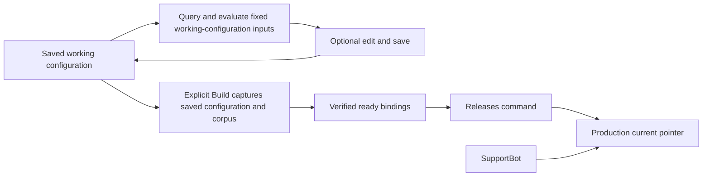

# Building, serving, and releasing pipeline versions

Alice wants to try a different reranker while SupportBot keeps using Production. She edits Support's working configuration, queries the protected direct Pipeline query endpoint and evaluates the change. Only when satisfied does she build the saved configuration into a release-ready version. [Knowledge](knowledge-lifecycle.md) owns source versions, and [Indexing](indexing.md) prepares and verifies their search data.

Assume Alice can build the Support Pipeline and manage Production's releases. SupportBot queries Production with its own permissions. Test may use the same Pipeline while keeping its own live version and publication mode.

Start with working configuration, execution-input snapshots, release versions and Deployments. Then follow one direct query, build and live answer. Sections 4–5 explain automatic updates, manual releases, canaries, and rollback. Later sections cover reranking and review.

> **Design status:** This is the accepted v1 workflow. Feature endpoints, storage, model integration, and the tests below still need implementation and verification where noted.

## Contents

| Reader’s question | Start here |
| --- | --- |
| What stays stable for SupportBot? | [1. Separate a Pipeline from a Deployment](#model) |
| Can shared model access change without a release? | [Shared connection administration](#shared-connectivity) |
| Can I query before building a release version? | [Working configuration and direct queries](#working-configuration) |
| What does a direct query capture and prepare? | [Execute captured working-configuration inputs](#preview) |
| What work does Build perform? | [2. Freeze and build a version](#build) |
| What can change while a question runs? | [3. Follow one answer](#serving) |
| How do Automatic and Manual differ? | [4. Choose how updates become live](#modes) |
| How do canaries, promotion, and rollback work? | [5. Release a candidate deliberately](#manual) |
| What may the local reranker do? | [6. Rerank bounded evidence](#reranking) |
| What should the CLI or future Studio show? | [7. Review evidence and expose progress](#review) |
| Which races and transitions need review? | [8. Maintainer checks](#maintainer-checks) |
| Why these choices, and what remains open? | [9. Decision and reference map](#decision-map) |

<a id="model"></a>

## 1. Separate a Pipeline from a Deployment

A **Pipeline** has one saved **working configuration**, the settings Alice is editing. Each save has an immutable revision. A direct query executes those current settings, with any explicit supported per-request overrides. The request records its exact effective configuration and corpus as **captured execution inputs** so later edits cannot change admitted work. This execution provenance is not an Experiment resource or a release version.

A **PipelineVersion** is the result of a successful release build: fixed settings with complete, verified bindings to the exact prepared indexes it needs. A **Deployment** is the stable target customers query, such as Production. It selects a ready PipelineVersion, never the working configuration or an execution-input snapshot. It does not deploy customer application code.

A Deployment stores references called **pointers**: current is live, candidate is being tried, and previous is the designated rollback target. Changing these references leaves the customer's endpoint unchanged.

<a id="shared-connectivity"></a>

### Keep shared connection administration separate from Pipeline release

Suppose P12 selects `company-gateway`. A connection manager can update that connection's current access settings through [the guarded shared-update workflow](model-connections.md#shared-current). P12 still selects the same ID and model settings, but subsequent calls use current connectivity. This creates no Pipeline version or publication and does not require Manage releases on every affected Deployment. Pipeline Edit alone cannot authorize it. Manual mode is not protection against shared infrastructure changes.

Keep each version's Pipeline/model settings and verified data bindings immutable, with current access observations recorded separately on executions. Rolling back from P13 to P12 does not restore historical connection settings or credentials. Historical execution evidence remains attributable to what actually ran, not relabelled with the current connection revision.

For isolation, create another connection, select it on the Pipeline's working configuration, query the Pipeline directly, evaluate if desired, then save, Build and release. This can change the selected connection without changing the current release until publication. An embedding-model migration additionally needs [compatible preparation](indexing.md#embedding-compatibility). A shared update that would invalidate retained/in-progress embedding data, or whose compatibility is unknown, is rejected before activation instead.

P12 and P13 must both satisfy Production's query contract. Alice can then change prompts, the selected documents (the **corpus**), or compatible model settings without changing SupportBot's URL, credential, or request and response integration.

An incompatible API or schema change is outside this promise. Moving a pointer cannot make an incompatible version compatible.

A **canary** sends some traffic to a candidate while current serves the rest. The customer application supplies an opaque, stable **affinity key** for routing an end-user or session. Related requests stay in the same routing group, or **cohort**.

**An affinity key is routing input, not a verified end-user identity and not an additional permission.**

### Check present availability before serving a historical version

A materialization becomes usable only after its required search data has been verified in every needed **shard**, a physical partition of the index.

Creating a pipeline version checks its index bindings. Making it a release target also requires that it can actually serve now.

**“This version was successfully built” and “this version can be served now” are different facts.**

A completed build keeps its history, but damaged or erased dependencies can make the version unavailable later. Report that failure instead of treating an old successful build as proof of present readiness.

### Release changes move pointers, not history

```text
Deployment -> mutable current/candidate/previous pointers
```

Releases owns changes to these serving references.

Promotion, candidate rejection, and rollback change the references described below. They never rewrite an answer already produced.

A live query selects **one PipelineVersion for its entire execution** and records which variant it used. Direct Pipeline queries and evaluation likewise use one fixed set of captured working-configuration inputs or a selected version. Neither a configuration edit nor a release change may switch one execution's inputs halfway through.

Here, fixed inputs mean Pipeline/model choices, corpus and prepared bindings, not an executable historical connection configuration. Observe current access revisions at admission and enforce [dispatch freshness](model-connections.md#dispatch-freshness). A relevant shared access change blocks subsequent model calls in admitted work; an already-sent call may finish with its actual attribution. A retained snapshot cannot opt back into old access settings.

The backend establishes citations from source IDs and **source spans**, which identify locations in source content. A model cannot create valid IDs or locations by inventing them.


```mermaid
flowchart LR
    Draft[Saved working configuration] --> DirectQuery[Query and evaluate fixed working-configuration inputs]
    DirectQuery --> Edit[Optional edit and save]
    Edit --> Draft
    Draft --> Build[Explicit Build captures saved configuration and corpus]
    Build --> Ready[Verified ready bindings]
    Ready --> Publish[Releases command]
    Publish --> Deployment[Production current pointer]
    Bot[SupportBot] --> Deployment
```

The direct-query loop never reaches a serving pointer. The explicit Build workflow creates a version, then follows the selected Deployment's publication policy. Its underlying preparation and Releases commands remain separate. These are application resources in one backend, not Docker deployments.

<a id="working-configuration"></a>

### Edit one working configuration without changing traffic

Alice starts with revision 17 using reranker A. Saving reranker B creates revision 18 and makes it the working configuration. Revision 17 stays identifiable within retention. Restoring revision 17 creates a new current revision with those settings; it does not rewrite revision 18 or roll back Production.

Use expected revisions when saving or restoring. If Bob saved another change after Alice reviewed the settings, return a conflict and let her inspect it. Do not overwrite Bob's work or silently retry against a newer revision. Configuration history restores settings and exact references where retained, not erased documents, expired artifacts or revoked permissions. Unsupported old settings may be inspected but cannot execute until their ordinary requirements are satisfied.

Temporary direct-query/evaluation overrides do not save a configuration revision. If Alice likes a tested override, she explicitly saves those settings through the ordinary edit operation before Build. There is no named-experiment or branching subsystem in v1, and no build-from-run shortcut. A run is evidence of an execution, not the authoritative source of the next build.

Saving, restoring, viewing settings or inspecting a configuration diff performs no model call, preparation or publication. This is different from an explicitly admitted evaluation comparison, which executes questions. Saved incomplete settings may support unfinished setup, but direct querying and Build must reject missing required inputs before execution. The protected direct Pipeline query API is separate from the live query API, not a second Deployment or a client-side RAG implementation.

<a id="preview"></a>

<a id="direct-query"></a>

### Query the Pipeline directly

Suppose Pipeline `contracts` currently has revision 18. Alice runs `inframeld query --pipeline contracts` with retrieval top-k temporarily set to 12. Require Query on that Pipeline, then identify revision 18 and the effective override in the result. A Query grant on Deployment `contracts-production` is not sufficient. This request creates no Experiment, PipelineVersion or Deployment and cannot change production pointers, regardless of publication mode. Independently authorized live updates can still proceed.

1. Resolve the Pipeline and current working revision, apply only explicit permitted overrides, and resolve exact corpus revisions. Display the effective configuration, source scope, model destinations, required preparation, estimated cost and limits before admitting chargeable work. Model selections reference authorized connections, not arbitrary provider URLs or plaintext keys.
2. Save fixed effective settings and source/profile identities with an operation identity. Bind admission to the reviewed revisions. A changed configuration or corpus selection requires a fresh review, not a hidden substitution of latest values. Current permissions are checked, not frozen as an entitlement.
3. Ask Indexing to reuse compatible materializations or prepare missing ones through its ordinary jobs. Freeze the chosen complete prepared bindings before questions execute. An incomplete execution-input snapshot can record preparation progress, but cannot execute retrieval against unverified or mismatched indexes.
4. Execute through the same pipeline behavior used for live queries: gateway query embedding, permission-filtered retrieval, configured reranking, bounded context assembly and gateway generation. Preserve the [serving checks](#serving) for current access, dependency health and temporary artifact pins without manufacturing a Deployment or PipelineVersion.
5. Return the answer with citations, usage and explicit direct-query attribution. Retain bounded execution provenance; full diagnostic content is governed separately by tracing policy and inspection authority. [Evaluation](evaluation.md#comparison) owns explicitly requested benchmark results, not a hidden evaluation after every question.

Changing a prompt, generation model, reranker or retrieval limit usually reuses compatible existing indexes. Changing source selection, chunking or embedding meaning can require substantial preparation and paid calls. Show that work honestly. A direct query is not necessarily cheap, and local execution still consumes resources. A failed required shard, model or preparation step fails the query without switching models, searching an incompatible index or changing live traffic.

Each evaluation fixes its inputs for all cases. Revision 19 saved during a revision-18 evaluation affects only future operations. Comparisons may execute two execution-input snapshots, two ready versions, or one of each, freshly under Evaluation's frozen benchmark/evaluator rules. Historical scores are not fresh runs. Concurrent automatic source updates may still change Production independently; direct querying does not pause those updates.

Query and trace inspection are independently scoped to the exact Pipeline or Deployment. A Pipeline Query grant permits its request and answer, not inspection of retained diagnostics. Pipeline trace inspection can include other callers' direct queries with current source access, but not production queries through that Pipeline's Deployments. [Access](access-control.md#pipeline-query-authority) owns the accepted scopes and remaining machine mappings. Humans and applications may receive explicit grants. Direct Pipeline queries and evaluation do not enter production feedback counts.

Working configuration history, snapshots, evaluation evidence and diagnostic traces are different records, not unlimited archives. Active work receives bounded retention protection, not a permanent pin for every past query. Missing or erased dependencies produce explicit unavailability. A snapshot cannot recreate an opted-out trace or restore access to protected data.

The [trace lifecycle](observability.md#trace-lifecycle) applies to direct Pipeline queries and live Deployment queries. If only diagnostic capture, storage or export fails, keep an otherwise successful query successful. Preserve confirmed permitted evidence and report partial or unknown diagnostics separately. Required authorization, budgets, receipts, audit and business persistence must still succeed.

Opting out stops further recording and queued diagnostic writes or delivery. It does not by itself cancel the query. Re-enabling tracing allows new eligible executions to record, but does not restart capture for this query. Explicitly deleting past traces is a separate operation: it blocks the affected reads before physical cleanup and does not change future recording.

None of these actions reruns a model, reconstructs a missing answer, expands receipt replay or grants trace inspection.

<a id="build"></a>

## 2. Freeze and build a version

A **build** prepares fixed settings for retrieval-augmented generation: finding document evidence, then generating an answer from it. It neither compiles customer code nor reads a Git branch.

The user-facing `inframeld build` workflow captures the saved configuration and follows the selected Deployment's policy. In Manual releases it leaves a ready version for explicit release. In Automatic updates its authorized admission requests preparation and a later conditional publication attempt. The underlying build operation only establishes readiness in both cases. An authorized completed document update may also invoke that operation using its Deployment's explicitly selected configuration, never the latest working copy.

For example, Production follows saved cfg_17 while Alice experiments with working cfg_18. A watched-document update supplies cfg_17 plus its exact admitted corpus to the underlying build. An explicit CLI Build reviews and captures current saved cfg_18 instead. The underlying operation validates the caller's frozen selection; it must not look up the working pointer and replace cfg_17. Both paths preserve current authorization, shared-current connection checks, verified preparation and separate release authority.

### Step 1: Choose the exact inputs

Alice reviews the Pipeline's current saved configuration: processing and embedding profiles, retrieval and reranking options, prompt, generation connection and settings, and the exact collection revisions resolved from its corpus selection. Build does not accept an evaluation run as its configuration source. Unsaved editor changes and temporary per-request overrides are excluded.

A **collection revision** identifies an exact set of document versions. Processing and embedding profiles identify how those documents are prepared for search. Retrieval and reranking settings control how evidence is found and ordered.

Editing the configuration does not change the deployed version. If earlier evaluation used different settings, prepared-data bindings or corpus, show that difference. A sample-only evaluation does not validate a full-corpus build. Lack of a matching evaluation is a warning, not a required judge call or automatic rejection. Even matching inputs do not guarantee identical external model behavior.

Include admitted/observed connection access revisions in that comparison. The same Pipeline settings with changed connectivity are not evidence of the same evaluated environment. A changed reviewed access revision during preparation or before a pending conditional publication requires new admission/review, not silent approval of newer settings. A separately committed connection update can already affect an existing live version; it does not authorize an unrelated pending publication. Readiness-only storage recovery of previously captured payloads remains distinct from publication authority.

### Select the publication target deliberately

The CLI target selects an installation; a Deployment selects a live serving endpoint inside the selected project. A direct Pipeline query endpoint is not a Deployment and is never a publication target.

| Deployments associated with this Pipeline | Build behavior |
| --- | --- |
| **Exactly one** | Resolve that Deployment and show its mode, current version and expected revision before admission. |
| **Several** | Require a choice. An interactive client may offer authorized choices; a script supplies the explicit Deployment. Never fan out implicitly or choose the first result. |
| **None** | Build an unpublished ready version. Do not create a live endpoint or invent release authority. |

An explicitly supplied Deployment must refer to this Pipeline in the same project and satisfy current Access checks. Unavailable or unauthorized selection fails without falling back to another target. Visibility filtering must not convert an ambiguous selection into silent publication elsewhere. The existing first-default-publication workflow is a separately authorized exception to the no-creation rule, as described in [Onboarding](onboarding.md#default-route).

Direct Pipeline querying needs no release authority. A manual build needs its ordinary Build and input rights; a policy-controlled automatic build also needs Manage releases on the selected Deployment. Missing publication authority fails that requested workflow instead of silently downgrading it to an unpublished build. Show the selected mode and consequence in both human and machine output. There is no separate CLI apply command.

### Step 2: Validate and freeze the build request

Alice selects Build after reviewing the saved inputs and selected target's policy. The server captures those inputs, expected configuration/corpus and Deployment/control revisions, caller, request identity and any automatic-publication authority together. For automatic document updates, the source operation supplies its separately reviewed exact selection.

The server validates and saves the request. It may reserve the name P13 immediately, but P13 cannot serve while its build is pending.

Retries find the same build and target. To use later edits, Alice makes a new request rather than changing an already accepted build's inputs. If the reviewed configuration or publication policy changed before admission, reject the stale decision. Never refresh revisions and retry consent automatically.

### Step 3: Reuse compatible results and create what is missing

The worker reuses compatible, ready processing results and **index materializations**, the prepared search data for the selected documents and profiles. It creates only missing results.

A prompt change or a change to **top-k**, the number of retrieval results requested, can reuse the whole index. A changed document needs new chunks and vectors. Changing the embedding profile may require embedding the entire selected corpus.

**The interface must not imply that every build is cheap or only processes a small change.**

### Step 4: Verify readiness and publish immutable bindings

After checking materializations, profiles, stored-file references, and compatibility with the query contract, Inframeld saves P13's complete, immutable bindings.

Until those checks pass, P13 is unavailable for version-based evaluation or live serving. This does not prohibit independent direct-query/evaluation with a complete execution-input snapshot and verified bindings. The build job reports progress and failure. A required dependency lost later can still make either a ready version or an execution-input snapshot unavailable.

Saving ready bindings does not release P13. The underlying build never changes Deployment references or sends customer traffic to its result. A user-facing Automatic Build workflow next requests a separate conditional Releases transition using its captured authority. A manual build stops ready and unpublished. Even attaching a ready version as a candidate is a separate release action.

Evaluation separately records the benchmark and evaluator used. Running it does not change P13's serving configuration.

<a id="serving"></a>

## 3. Follow one answer

SupportBot sends a question to Production with its application credential, an idempotency key, and the required affinity value. [Canary routing](pipelines-and-releases.md#manual) explains when affinity is needed, and [request identity](jobs-and-idempotency.md#requests) explains retries.

The request cannot choose an arbitrary provider URL, impersonate a human user, select a physical shard, or replace the Deployment's version-selection rules.

### Select a version and protect the request

The server authenticates the caller, checks permission to query, and selects a ready PipelineVersion from the Deployment.

The backend saves its choice with a time-limited **query pin** in a short transaction. The pin prevents ordinary cleanup from removing data needed during the query. A promotion halfway through does not switch that request to another version.

A pin neither restores revoked access nor repairs damaged data. It has an enforced deadline, after which the protected result cannot be returned.

The request also records a **dependency-health counter**, a number that changes when required data is corrupted, lost, or invalidated. An unrelated candidate insertion does not change it. Check the number after retrieval, before sending evidence to the model, and before returning the result. Discard the result if it changed.

### Retrieve permitted evidence

Find the exact document and vector generations selected by the version, then keep only those the caller may currently use.

ModelGateway embeds the question for search. Search is restricted to that permitted selection.

A configured local cross-encoder can reorder a limited set of search results. The explicit `none` setting skips this step. Reranking cannot add new chunk identities or access more documents.

Send a size-limited final evidence set, question, and prompt to the configured generation model through ModelGateway. Missing credentials or an unavailable selected reranker cause a visible error, not a different provider or configuration.

### Return an honest result

Report one of three distinct outcomes: an answer, an explicit insufficient-evidence response, or a defined execution failure that clients can handle.

Citations must refer to actual permitted retrieved content. A source ID invented by the model is invalid. Retrieved source text is data, not permission to change system instructions or execute tools.

A citation establishes source identity. It does not prove that every sentence in the answer follows from that source.

### Check access again before disclosure

Permissions can change while the request waits. Recheck access after waits and immediately before sending evidence or returning protected content.

A revocation saved before the check blocks the send. There is still a gap between that check and the network transfer, so a revocation saved just afterward may be too late for that send.

Later checks stop further disclosure, but the system cannot recall content already sent to a provider or caller.

### Record what actually served

A successful response includes an `answerId`, authorized citations, and safe metadata identifying the selected version.

The AnswerReceipt saves limited-size information about the execution and outcome. It names every source sent to the model for the final answer, including uncited sources. Later access checks and feedback use these IDs.

The receipt does **not** store the full production question, answer, or retrieved context. SupportBot must retain the successful answer itself if it needs to display it later.

Evaluation runs are different: they retain bounded answers and evidence so engineers can inspect comparisons.

<a id="modes"></a>

## 4. Choose how updates become live

Both publication modes use the same document versions, builds, ready versions, and query path. They differ in who requests publication and when.

| Mode | Document changes | Pipeline configuration | Release control |
| --- | --- | --- | --- |
| **Automatic updates** | A completed, authorized live-input batch requests a build and publication of its complete frozen selection. | Explicit user-facing **Build** captures saved configuration and authorizes its update for the selected Deployment. Working edits, direct Pipeline queries and evaluation are ignored by publication. | Publish only the eligible, complete, ready result. Do not automatically run an evaluation or start a canary. |
| **Manual releases** | Admit new versions as unpublished inputs. | Edit, query and evaluate without changing traffic. Build creates a ready version. | Use explicit candidate/canary, promote/reject, and rollback actions. Comparison remains available before or after Build. |

A **batch** is a fixed selection of files with explicit limits. **Frozen inputs** save the exact versions and settings chosen for the work, so later edits cannot alter it. A canary tries the candidate with part of the traffic before promotion.

The default onboarding path starts in **Automatic updates**. An explicitly created Deployment defaults to **Manual releases**, unless its creator chooses Automatic updates. Both modes are available at creation and can be changed later.

Publication mode belongs to each Deployment. Test and Production can use the same Pipeline with different modes and selected settings. A client may present the choice during setup, but changing one endpoint does not change all endpoints using that Pipeline. Neither is the protected direct Pipeline query API, which has no publication policy or serving pointer.

### Follow selected documents, not every draft edit

An automatic-update binding records which Pipeline, saved configuration revision, and document collections the Deployment follows. They belong to the same project. Each build saves exact CollectionRevisions and profiles from this selection.

Production can therefore follow authorized document changes without following every working edit to Pipeline settings. The automatic binding is separate from the working-configuration pointer. An explicit authorized Build/update selection changes that binding through the existing control-revision rules; a save or restore does not. Once selected, document-driven work uses that recorded configuration even while Alice experiments with another one.

Direct-query corpus selection fixes exact collection revisions without changing the live binding. To upload development-only documents, use an ordinary collection outside the live-watched selection, with normal source/group permissions. Do not silently create another collection, copy the corpus, or suppress automatic updates on a watched collection. Updating a live-watched collection is a live-input operation and must disclose its publication consequences. Direct querying itself never writes source membership.

The starter flow shows its default automatic mode without another release question. Its upload action explains that a complete change becomes available after preparation. Customers keep the same URL, but later answers can use a newly published version. API, CLI and future Studio show the mode, live version, working revision and pending update separately.

### Build a ready version, then request publication separately

Save one small update operation containing who requested it, its target, captured control revision, request ID, fixed inputs, and stable IDs for its child operations. A child operation is a step such as the build.

```text
Authorized completed live-input batch or explicit policy-controlled Build
    -> Durable update with frozen inputs and publication authority
        -> Ordinary source-admission and Build use cases
            -> Complete ready PipelineVersion
        -> Separate Releases publication command
            -> Publish only if the original request remains eligible
```

Show upload, preparation, ready version, and publication as separate progress stages. If publication is skipped, the new version may be ready while the endpoint still serves the old one.

Releases handles publication. It checks the project and target, readiness, input compatibility, current permissions, absence of a candidate, and whether another change has made this request outdated.

| Publication case | Effect |
| --- | --- |
| **First default publication** | Create the actual Deployment and bind the route in the same short SQL transaction, transferring publication-control state. It has one ready current version and no previous target. |
| **Later eligible automatic publication** | Replace current and retain the former current as the designated one-step previous target. Do not manufacture a canary candidate or traffic ramp. |
| **Result identical to current** | Do nothing to the serving pointers, including the previous target. |

History records the initiating action, mode and control revision, exact versions, and publication outcome. An automatic update must honestly record that it did not include benchmark review. Never invent a passed evaluation or manual approval. Scores and feedback do not initiate publication.

Queries and receipts retain the actual version, Deployment revision, and cohort they selected even after another publication.

Building reports readiness only. The update operation requests publication separately. Indexing and job-completion handlers cannot switch traffic themselves. Saved progress and request identity recover interrupted work without repeating paid calls. Chroma writes may repeat their exact saved payload under the Indexing rules, while an uncertain paid-model call needs explicit recovery. Automatic mode changes neither rule.

### Switch modes through explicit, concurrency-checked commands

Switching modes needs permission, an idempotency key, and the expected revision. The key recognizes a repeated request. The revision confirms that Alice is changing the state she actually reviewed.

Reject an outdated decision instead of silently substituting a newer revision. Save the mode change and audit together. Switching itself preserves current, previous, history, and the endpoint. Publication afterward is a separate authorized change.

### Automatic updates → Manual releases

Switching to manual immediately removes pending automatic requests' permission to publish. An in-progress build may finish reusable output, but cannot make it live. Stop work not yet sent where practical using existing cancellation rules. A provider request already sent cannot be promised canceled.

No re-upload or index copy is needed. A successful switch leaves the version then current in place.

Publication and switching can race:

| Which transaction commits first? | Result |
| --- | --- |
| **The switch** | The old automatic publication fails its guard. |
| **The publication** | It changes the Deployment revision. A switch expecting the old revision conflicts and leaves the mode unchanged. The user reloads and makes a fresh decision. |

After a conflict, the client must reload and obtain a fresh decision. It cannot update the revision and retry blindly, or show automation as disabled when the switch failed. Switching modes also does not undo a release already saved.

### Manual releases → Automatic updates

The action is Enable automatic updates and apply pending changes. Show Alice the complete document selection and configuration. Save the mode change and a fresh update for those exact inputs together.

Initially display the current version's configuration, or validated selected settings before first publication. Alice must explicitly choose any different saved settings. Do not revive old automatic settings after a manual release or include unselected drafts.

Applying the selection is part of enabling automation, not a surprise postponed until the next upload. Missing models, documents, or a complete selection block the command and leave the mode unchanged. Explain what is missing. The newly provisioned default can still start automatic before inputs exist because it has not accepted an update yet.

An attached candidate, even at 0%, blocks enabling automation with `409 candidate_active`. Alice must promote or reject it in manual mode first. Enabling automation cannot silently cancel a trial or alter its percentage.

Keep current serving until the new update succeeds. If it fails, automatic mode remains selected and the failure stays visible under normal retry rules. If the selected inputs already match current, report up-to-date without rebuilding just to switch modes.

**Never restore an earlier disabled job’s publication authority.** Enabling automation is a fresh decision even when it can reuse earlier artifacts.

### Manual review, canaries, and rollback

Attaching candidates, changing canary traffic, promoting or rejecting a candidate, and rollback require Manual releases. In automatic mode, return a clear mode conflict instead of switching implicitly.

Comparisons and history work in either mode. Comparing versions neither pauses automatic publication nor promotes the winner. Choose manual mode first if review needs a fixed serving baseline.

Automatic publication keeps the old current version as previous. Alice can switch to manual and roll back one step if that version remains usable. Rollback uses up the previous reference and leaves the mode manual.

Enabling automation again applies the selected inputs afresh and may replace the version just restored. Explain this consequence. Neither rollback nor restart enables automation automatically.

### Publish only the newest request whose original authority still holds

Two small values tell the worker whether its publication request is still valid:

| Guard | What changes it |
| --- | --- |
| **Monotonically increasing control revision** | Mode switches, changes to the automatic-update binding, and explicit invalidation. |
| **Newest authorized update-request identity** | A newly authorized complete live-input batch or policy-controlled automatic Build. Working edits, direct Pipeline queries and evaluation do not supersede publication work. |

Use existing revision mechanisms where they provide these checks. These values do not need a new family of domain objects.

When work is accepted, save both values and the expected serving revision with the job. Finishing a build cannot update those captured values to recover lost permission to publish.

### Run at most one active automatic update per Deployment

When another authorized batch arrives, save its complete selection as the newest request. Mark older waiting requests skipped or canceled rather than run them simply to empty the queue.

An older build already running may finish reusable artifacts. It cannot publish after a newer request replaces it. The worker next handles the newest eligible request.

The new selection includes chosen existing documents as well as new files. Skipping an older update must not silently discard source changes already accepted.

### Check all publication conditions in one transaction

Immediately before making a version live, check all of the following in one database transaction:

| Check | Required condition |
| --- | --- |
| **Publication mode** | Automatic updates is still selected. |
| **Control and request identity** | The captured control revision and newest authorized request identity still match. |
| **Job ownership** | This attempt still owns completion. |
| **Expected serving state** | The current Deployment or default binding still matches the captured expectation. |
| **Candidate** | No candidate is attached. |
| **Permissions and inputs** | Current authorization and input lifecycle still permit the result. |
| **Readiness and retention** | All required dependencies are ready, and relevant deletion/retention gates still allow publication. |

Save the checked reference changes and history together. First default creation and mode switching must lock and check the same binding, so they cannot establish two competing mode settings. First creation also rechecks the initiating human's Create Deployment permission and saves the explicit creator grants together.

If someone else already created the Deployment, a request to create it does not authorize updating it. Keep the normal expected-state and retry rules. A queued job cannot refresh its own permissions or substitute a different creator.

If the newer request is saved first, skip old publication. If old publication finishes first, that version can serve while the next one is prepared. Neither order lets an old job overwrite a newer published version.

Failure of the newest request never revives an older request or publishes its selection as fallback. Continuous changes may delay publication. Show current and pending state clearly rather than add an unlimited scheduler.

### Example: switching off and on does not revive an old update

| Event | Control revision and authority |
| --- | --- |
| **U1 is admitted for P13 in Automatic updates.** | U1 captures revision **10**. |
| **The user switches to Manual releases.** | Control advances to **11**. U1 loses publication authority. |
| **The user enables Automatic updates again.** | Control advances to **12**, and a fresh request U2 is admitted. |
| **U1 finishes late.** | It still carries **10** and cannot publish, even though the mode is automatic again. |

U2 can reuse P13's compatible artifacts, but represents a new choice and input snapshot. Checking only whether automatic mode is currently on would wrongly allow U1 to publish.

<a id="retries-preserve-identities-cancellation-does-not-undo-history"></a>

### Retries preserve identities and cancellation does not undo history

Repeated acceptance keys find the same operation, and repeating completion cannot publish twice. Show exhausted retries, uncertain provider calls, and unavailable dependencies as their distinct outcomes.

Canceling an update removes pending permission to publish, without undoing a saved release or reviving an older request. If the process crashes after publication but before acknowledging the job, recover the recorded publication ID instead of changing the release again.

<a id="manual"></a>

## 5. Release a candidate deliberately

Initial creation requires one genuinely ready, same-project, contract-compatible PipelineVersion and an authorized initial decision.

Create Deployment authorizes a human to create a new Deployment with that initial version. Save its explicit creator permissions, including can-use-and-grant Manage releases, in the creation transaction. Later releases need current Manage releases on that exact Deployment. Build and access to protected inputs remain separate, and creation grants nothing on other Deployments. [Access](access-control.md#section-bound-administration-grants-and-recovery) and [first publication](onboarding.md) define these checks.

Save the initial Deployment revision with that version as current. It has no candidate, previous version, or rollout, so there is no baseline cohort or rollback target yet.

The first endpoint needs a genuinely ready version, but no fictional version, judge setup, or benchmark. A benchmark is a set of evaluation cases. Evaluation is not required before this first creation.

### A default route can exist before its Deployment is ready

The project-default route exists as a logical address before its real Deployment. Its binding initially holds Automatic updates and the publication control revision.

Until ready, it returns a defined not-ready outcome without generating an answer.

```text
Stable project route exists; no ready Deployment yet
    -> Authorized update invokes the ordinary Build operation
        -> A complete pipeline version becomes ready
            -> Separate conditional first-create command
                -> Create Deployment and bind the route atomically
```

First creation transfers those publication-control settings and binds the route in the same transaction. A simultaneous mode change checks the same record and cannot be ignored merely because this is the first publication.

An explicitly created Deployment instead selects an already-ready initial version directly. **Creating a Pipeline alone never makes it serve traffic.**

### Keep canary assignment stable with an affinity key

A **cohort** is a group of routing identities assigned to a variant. A **variant** is the version a request actually uses: current or candidate during a canary.

An **affinity key** identifies the application’s user or session for routing. It does not authenticate that person or grant document access.

### Authenticate first, then determine routing affinity

| Caller | Affinity input |
| --- | --- |
| **Human querying through CLI or future Studio** | The stable internal human principal ID. A principal is the identity Inframeld recognizes as the caller. |
| **Customer application** | A bounded opaque `affinityKey` supplied for its end user or session, scoped to the authenticated integration principal. |

Authenticate the caller and check Query permission before selecting a routing group. [Access](access-control.md) defines human sessions and application keys.

Keep application affinity values opaque, without emails or unnecessary personal data. They route requests and prove neither identity nor permission.

### Calculate one deterministic bucket

For application requests, the routing inputs are:

```text
organization ID
    + project ID
    + deployment ID
    + stable integration-principal ID
    + affinityKey
    + rollout ID
```

For human requests, use the stable internal human ID as the affinity input.

A fixed, versioned cryptographic hash or keyed hash (HMAC) assigns a bucket from 0 to 9,999. Save which routing algorithm was used. A language runtime's randomized hash would not keep assignments stable.

The selection rule is:

```text
candidate, when bucket < canary percentage × 100
current, otherwise
```

**The percentage is not an input to the hash.** Changing the allocation moves the threshold, not the identities’ buckets.

### Example: increase the allocation without reshuffling existing buckets

| Affinity identity | Fixed bucket | At 10%: threshold 1,000 | At 25%: threshold 2,500 |
| --- | --: | --- | --- |
| Alice | 630 | Candidate | Candidate |
| Bob | 1,850 | Current | Candidate |

Increasing the percentage includes more buckets while Alice remains in the candidate cohort.

Setting the same rollout to 0% pauses candidate traffic but preserves its buckets for a later increase. Replacing the candidate creates a new rollout ID and deliberately starts a new assignment.

### Keep integration identity stable across credential rotation

Replacing SupportBot's key must not move its users between versions. Hash its stable principal ID, not the credential. A newly created application has a different routing scope.

With candidate traffic enabled, an application request missing affinity returns `422 affinity_required`. Do not use its credential to place all users in one bucket or choose randomly per request. Affinity is optional when there is no candidate traffic.

A 10% canary means 10% of affinity identities, not necessarily 10% of requests. One busy user can generate most traffic. Show actual requests and failures per version, and avoid significance claims based on tiny groups.

### Apply the same safety checks to every release transition

Every transition requires permission, an **idempotency key**, and **`expectedRevision`**.

The request key identifies a retry. The expected Deployment revision identifies the state Alice reviewed, preventing her command from overwriting Bob's later decision.

Check the caller's project and resource scope, validate the transition, and save state plus audit only if the expected revision still matches. Recheck the target's availability during the change instead of trusting an earlier screen.

### Manual-release commands

All five commands below require **Manual releases**. In Automatic updates, return a typed mode conflict instead of silently changing modes.

| Command | Effect |
| --- | --- |
| **Attach candidate B** | Keep current A. Set candidate B, create a new rollout identity, and start at **0%**. Reject an existing candidate unless it has first been explicitly aborted. |
| **Set canary percentage** | Change the candidate allocation only. Current/candidate version identities and the rollout’s bucket assignments remain fixed. |
| **Abort candidate** | Keep current and previous unchanged. Clear the candidate and its active rollout traffic. Retain build and evaluation evidence. |
| **Promote** | Set previous to current A, then current to candidate B. Clear the candidate and candidate traffic. Preserve evidence. |
| **Roll back promotion** | Restore previous A as current and clear `previous`, consuming that one-step rollback target. Retain B’s immutable evidence. |

These operations change release state, not the immutable versions or their evidence.

A candidate cannot equal current. Explicitly abort an attached candidate before replacing it, even when its traffic is 0%.

Changing allocation never promotes the candidate by itself. Promotion remains a separate command even at 100% candidate traffic.

### Rollback is neither candidate rejection nor an unlimited history browser

An attached candidate blocks rollback with `409 candidate_active`. Abort it first so a rollback cannot unexpectedly both reject a trial and undo an earlier release.

Keep only one immediate rollback target, including after automatic publication. Releasing an older historical version needs an explicit new candidate and release, rather than walking an unlimited rollback stack.

Rollback requires manual mode and leaves it selected. Re-enabling automatic updates is a new decision to apply the selected inputs. Successful rollback never enables it implicitly.

### Reject a bad canary without undoing the current release

Start with previous Z, current A, and candidate B. B produces errors, so the engineer invokes `abort_candidate`.

```text
Before: previous Z | current A | candidate B
After:  previous Z | current A | no candidate
```

A remains current. Restoring Z would incorrectly undo A, which was not the release being tested.

### Undo a completed promotion

Start with current A and candidate B. Promote B, then later roll it back:

```text
Before promotion: current A | candidate B
After promotion:  current B | previous A | no candidate
After rollback:   current A | no previous | no candidate
```

Rollback clears previous rather than storing B there for automatic back-and-forth switching. B's immutable evidence remains available for inspection, and an authorized person can later attach B as a new candidate.

### Report an unavailable rollback target without changing current

Current is B and previous is A, but A’s required materialization is unavailable or its source was explicitly erased.

Return **`409 rollback_target_unavailable`** with safe same-project details. B remains current. Do not substitute another version or search an unfiltered corpus.

An operator may restore the missing dependency or release a different valid candidate.

### Reject a stale command from a concurrent operator

Two operators both read Deployment revision **8**. One promotes B and commits revision **9**. The other’s command still expects revision 8 and receives **`409 stale_revision`**.

Reload and ask the operator to decide from the new state. The client cannot quietly replace revision 8 with 9 and repeat the old promotion.

<a id="reranking"></a>

## 6. Rerank bounded evidence

The application-owned `Reranker` receives a size-limited question and candidate set and scores or reorders those same candidate IDs. It is separate from document-processing interfaces.

The supported choices are:

| Choice | Behavior |
| --- | --- |
| **Built-in local cross-encoder** | Uses the selected Ettin 32M bundle to assess query/candidate relevance and return scores or ordering. A cross-encoder considers the query and candidate together. Exact assets and runtime limits still need qualification. |
| **Hosted connection** | Uses an explicitly selected supported reranking model through ModelGateway and embedded LiteLLM, with ordinary current connection, credential, egress and budget checks. |
| **Explicit `none`** | Skips reranking as a deliberate pipeline configuration choice. It is not an error-recovery substitute for a missing model. |

Use one pinned Ettin 32M bundle rather than download arbitrary models during requests. [ADR-0056](../adr/ADR-0056-support-explicit-local-hosted-or-disabled-reranking.md) records the accepted local/hosted/none choices. Exact checkpoint/tokenizer pins, packaging/license notices, supported language/input behavior and resource/quality measurements remain qualification work. Mode is explicit; unsupported hosted reranking fails without fallback.

Validate the output structure, IDs, configured limits, and timeout. Scores must be finite, excluding infinity and “not a number.” Every returned result must still refer to the supplied evidence.

For example, if the input candidates are `C1`, `C2`, and `C3`, an ordering of `C3`, `C1`, `C2` refers to the original evidence. Introducing `C4` or replacing the text associated with `C1` violates the contract.

**Reranking cannot invent evidence, mutate source text, or expand access scope.** It changes the ordering or scores of authorized candidates, not their identity or content.

Changing the reranker changes Pipeline configuration, but does not by itself require new corpus embeddings. Embeddings are the numerical values used by the earlier search step.

### Bound local inference and preserve current permissions

Local reranking still uses CPU and memory. Limit simultaneous work and run synchronous model computation without blocking the API's event loop or exhausting host memory.

The **event loop** coordinates asynchronous requests. One long model calculation must not monopolize it. The executor and numerical limits still need selection and testing.

Prepare and check required assets before marking the reranker available. Do not download arbitrary models when requests arrive.

**If the pipeline selects the cross-encoder and it is unavailable, fail visibly. Do not silently switch to `none`.** Otherwise the request would run a different configuration from the one the pipeline selected.

### Authorize before sending candidate content

Check permission before giving excerpts to the reranker or provider, and recheck when returning protected results requires it.

The initial Access model uses document-group allowlists and applications' own current permissions. Finer access-control lists remain deferred. Reranking reuses retrieval's permitted selection instead of defining another access policy.

Hosted reranking is accepted for v1 and needs an approved endpoint and an explicit account of which permitted candidate text leaves the installation. It uses ModelGateway, as does an explicitly selected evaluation judge. Evaluation remains optional; no judge is required for first setup. The local cross-encoder remains a separate bounded Reranker implementation, not a remote language-model call.

<a id="generation-context-contract"></a>

### Fit final context without silently changing evidence

The Pipeline has two separate limits: retrieve up to **20 candidate passages** initially, then include **at most 5 passages** in generation context. Both are configurable positive integers. The context limit cannot exceed the candidate limit. Apply both limits with or without reranking. Actual returned counts may be smaller.

Reserve the model's fixed input and saved effective `max_output_tokens`, using qualified model/token metadata. Append whole passages in ranked order until the next passage would exceed the remaining input allowance, then stop. Do not truncate, summarize, skip ahead, switch models or silently reduce output to make it fit. Distinguish oversized fixed inputs/first passage from ordinary no-evidence outcomes. Generation has a small supported configuration, including optional model-aware temperature, not arbitrary provider parameters. Exact ranges, presets and billing/reasoning semantics remain contract/adapter qualification.

For example, Alice retrieves up to 20 permitted passages, reranks that pool and permits at most 5 passages in generation. If only ranks 1-3 fit, rank 4 and everything after it are excluded, even when rank 5 is smaller. With reranking disabled, retain retrieval order and the same context cap; do not send all 20 passages. These are counts of retrieved chunks, not documents or Evaluation's expected source passages.

The retrieval cap applies across the selected corpus after merging comparable, authorized results and deduplicating record identities, not independently per collection. It is not a physical shard-read limit. Establish permitted search scope before retrieval and retain bounded fanout/deadlines; unrestricted global top-k followed by filtering is not equivalent. Fewer authorized results are normal. Missing required shards, exceeded safety bounds or a failed enabled reranker are failures, not ordinary short results. Never widen access or duplicate evidence to fill a cap.

Validate positive integer counts and `max_passages <= top_k` without silently adjusting them. Resource ceilings remain applicable. Changing a future setup preset does not rewrite existing saved values. These settings belong to working history and captured direct-query/evaluation/build inputs. Saving or importing them neither prepares data nor executes or publishes.

Fit against the qualified separate input, output and combined-window rules of the selected model. Reserve the complete fixed prompt, question, message/citation formatting and configured maximum output, including applicable reasoning categories. Do not use average answer length or assume separately tokenized strings sum exactly. Validate the final model-facing payload after observable adapter transformations; source spans must describe the actual supplied text. Recheck cancellation, current access, shared connectivity and spending before dispatch.

| Condition | Required outcome |
| --- | --- |
| Fixed input and output reserve cannot fit | Configuration/context-size error before generation, with explicit input/configuration repair guidance |
| Evidence exists but rank 1 cannot fit | Context-size error; no empty-context answer or lower-ranked substitution |
| Nonempty prefix fits | Generate from that complete prefix; authorized diagnostics show the cutoff |
| No permitted evidence was retrieved | Ordinary no-evidence behavior, not a fabricated token-fit failure |
| Unknown model/tokenizer limit semantics | Unsupported contract error until qualified metadata/counting is configured; no unrelated tokenizer treated as exact |
| Provider rejects size despite local validation | Visible execution failure; no silent shrink-and-retry or model switch |

Earlier query embedding or reranking can already have incurred cost when generation fitting fails. Spending failure does not authorize dropping evidence or shrinking output to make a call affordable. Generation fitting does not silently rechunk or rebuild data, and reranker-specific truncation rules do not authorize truncating generation evidence. Evaluation judges only final supplied context. Under recording/access policy, diagnostics distinguish configured limits from actual retrieved, submitted-to-reranker, returned-ranked and final-context counts; never claim to have captured a full ranking when the provider returned only a subset.

<a id="generation-parameters"></a>

### Preserve an explicit output allowance and optional temperature

Alice changes the generation model while retaining her saved temperature and output allowance. If the new model cannot honor them, identify the incompatible fields before saving; she must deliberately revise them. Neither a library's parameter-dropping option nor a provider error authorizes silently changing the requested behavior.

Every effective saved generation configuration has an explicit positive integer `max_output_tokens`. Guided setup proposes a qualified model-appropriate value for review. Export preserves the saved value and import does not replace it with the destination's current preset. A sample value such as 4096 is not a universal default. Missing input without a documented valid resolution fails rather than permitting an unlimited call.

This is an enforceable generation allowance, not a visible answer-length promise. Its provider mapping includes applicable generated-token categories, including reasoning where counted within the allowance. Different provider semantics need an explicitly qualified mapping, not just a renamed parameter. An unsupported mapping blocks dispatch. Budget admission separately bounds all applicable billable usage; this field alone is not a cost calculation. Provider output-limit exhaustion does not authorize an automatic continuation or another paid request.

Leave temperature unset unless deliberately selected. Unset means **Provider default**, not zero or an invented numeric default. Validate explicit temperature against the exact model/provider/protocol and preserve unset versus explicit values through save/export/import. Do not invent TOML nulls or an undocumented sentinel; #151 owns the portable representation. Partial edits retain unchanged settings; complete file replacement reviews any resets. Provider defaults can change externally, and even supported temperature zero does not guarantee reproducibility.

Pipelines owns the selected connection ID, separate model identifier, prompt and supported generation parameters. The connection owns access configuration and separate credentials. Files cannot introduce keys, endpoint overrides, extra headers, retry controls, parameter-dropping switches or an unrestricted provider-options dictionary. Validate known constraints before save and current applicable constraints again at dispatch. Static validation makes no model request and proves no provider health; synthetic tests remain optional. A provider rejection is a failure, not permission to remove parameters and retry.

ModelGateway infrastructure maps application-owned settings into qualified provider inputs. Pipeline edits do not change shared connection settings or publish a Deployment, and evaluation generator/judge choices remain separate. Human editing, TOML and noninteractive inputs share these rules. Errors identify invalid fields without leaking credentials or unnecessary prompt content.

Qualification must cover exact-fit/one-token-over boundaries, oversized first passages, deliberate lower-rank exclusion, disabled reranking, non-ASCII input, reasoning/output mappings, private/unknown models, provider size rejection, forbidden raw parameters, unset/explicit round trips, incompatible model changes, current-access loss, cancellation and uncertain paid calls. Numerical presets, supported ceilings, precise schemas and response/finish-reason fields remain engineering deliverables, not runtime evidence supplied by this guide.

Use `query --deployment <name>` for live execution and `query --pipeline <name>` to query saved working settings directly. The earlier `--preview` flag is no longer needed. This syntax change does not change Pipeline Query permissions or the requirement to capture fixed working-configuration inputs. See [delivery ownership](cli-delivery-plan.md).

<a id="review"></a>

## 7. Review evidence and expose progress

The primary release workflow is inside Inframeld. Engineers review benchmark comparisons through the CLI or a future Studio view, and review observed canary behavior before explicitly requesting manual release transitions. These clients invoke the same application operations; evaluation does not require a Studio-only workflow.

A higher score does not authorize promotion. Missing, failed, or regressed evidence needs explicit acknowledgment under the existing decision contract. Promotion still needs a usable version and a recorded operator decision.

Review may include a canary or an explicit zero-traffic review. V1 requires neither an arbitrary minimum observation period nor a statistical acceptance gate.

Evaluation uses embedded Ragas for optional starter generation and claim-based faithfulness under [ADR-0051](../adr/ADR-0051-use-ragas-for-generated-tests-and-faithfulness-evaluation.md). Generator and judge connections are selected explicitly; neither changes the pipeline's generation model. A judge assesses claim support, not release eligibility. Accepted case revisions form the default regression benchmark; comparisons execute both fixed inputs afresh, whether execution-input snapshots or ready versions. [Evaluation](evaluation.md) owns review, frozen inputs, passage coverage, scoring, and runtime qualification still required.

Optional automation calls the same commands with its own permissions and audit identity. No external CI service must own checks or approvals. [API contracts](api-contracts.md) records the in-app workflow.

### Distinguish explicit decisions from work that runs automatically

| Mode | Explicit action | Work performed after admission |
| --- | --- | --- |
| **Manual releases** | Query, Evaluate, Build, Compare, attach/change a candidate, change its percentage, promote, reject, or roll back are explicit authorized operations. | Admitted work, progress tracking, safe retries, and cohort routing execute automatically. |
| **Automatic updates** | An authorized live-input source action or explicit Build requests preparation and conditional publication together. **Direct Pipeline queries and evaluation remain separate and explicit.** | The underlying build runs, followed by a separate publication attempt subject to its current guards. |

Once work is accepted and saved, the application carries it out. Neither mode requires a GitHub runner, webhook, callback, or general workflow engine.

### Attribute online feedback to the answer that actually served

Answer feedback is required during canaries and **100% serving**, not only during a trial.

[CLI feedback capability](https://github.com/matejpalenik/inframeld/issues/191) delivers authorized reporting and own-answer rating/correction through CLI v1. Deferred Studio consumes the same backend operations. Separate reporting authority never permits editing another originating principal's rating, and the CLI does not prompt for a rating after every query by default.

Feedback uses the AnswerReceipt's original version, Deployment revision, rollout, and routing group. A later promotion or rollback cannot move it to the version current when the rating arrives.

Show online feedback separately from offline results. Explain which answers the counts cover and how many of those answers received a rating.

Feedback never triggers automatic release transitions. [Understanding feedback on answers](answer-feedback.md) defines the detailed feedback contract.

### Provide the required screens without adding a workflow platform

The minimum product views are:

| View | Information and actions it provides |
| --- | --- |
| **Pipeline configuration and versions** | Working settings/revision/history, explicit save or restore, live version, and build progress or failure. |
| **Direct Pipeline query** | Effective saved settings and temporary overrides, exact inputs, preparation, answer/evidence/usage and protected execution attribution. No release controls are invoked by execution. |
| **Pipeline tests** | Test cases and the saved benchmark revision. |
| **Run history** | Evaluation runs associated with their execution-input snapshot or ready version, with current-access inspection and unavailable-content outcomes. |
| **Comparison and case detail** | Paired results, individual case details, and case history. |
| **Deployment** | Current, candidate, and previous targets. Cohort allocation. Explicit release-transition actions. |
| **Answer feedback** | CLI v1 counts, coverage, permitted comments and explicit own-answer rating/correction from [Understanding feedback on answers](answer-feedback.md), kept distinct from offline evaluation. A future Studio panel uses the same contract. |

The screens combine existing PostgreSQL records into views. They add neither services nor alternative owners of business state.

[Evaluation](evaluation.md) owns comparison evidence. This guide owns the rules every release change must preserve.

The required views, actions and old/new change presentation below are accepted. Remaining layout details, polling frequency and numerical resource budgets still need implementation choices and testing.

<a id="change-review"></a>

### Make the changed state visually explicit

Alice's working configuration is revision 17. She proposes enabling Ettin 32M and increasing retrieval from 20 to 30 passages. Review the relevant fields in aligned **Current / Proposed** rows before saving. The proposed side is not already saved, does not reserve a revision number, and does not change production. Only a confirmed save creates a new current configuration revision. Normal authority, supported settings and expected-revision checks still apply.

Use [the shared delta contract](api-contracts.md#cli-change-presentation): red struck-through old values, an arrow, green new values and neutral unchanged information, with explicit headings and a plain-text fallback. The examples in [structured change presentation](https://github.com/matejpalenik/inframeld/issues/158) are illustrative, not implemented interfaces.

| Situation | What the user sees | What the operation does |
| --- | --- | --- |
| Settings changed after review but before Build admission | **Reviewed / Now**: configuration `17 -> 18`, followed by "Build not started: settings changed." | Reject the stale decision. Obtain fresh review instead of silently updating revisions or accepting newer inputs. |
| Working settings changed after Build was admitted | **Before / Now**: saved configuration `17 -> 18`; separately, **This build: 17 (unchanged)**. | Keep admitted configuration/corpus inputs fixed. Ordinary current authority, dependency and shared-connection checks still apply. |
| Automatic changed to Manual before conditional publication | **Before / Now**: release mode `Automatic -> Manual`; if preparation succeeds, "Version v4 is ready. Not released." Show **Live version: v3 (unchanged)** only when that is confirmed. | The old publication authority is invalid. Keep useful ready output without publishing or reviving the request after an off/on switch. |
| Pipeline settings are being edited | **Current / Proposed** rows for the selected supported fields; "Not saved. The live deployment is unchanged." | Save only after the ordinary explicit decision and current checks. No implicit query, evaluation, Build or release follows. |

These examples assume the separately named facts are available to the caller. If current state is unavailable, report that limitation instead of displaying a guessed "Now" value. A lost acknowledgment does not justify a green completed-change row; recover the original operation first. Likewise, comparing a ready v4 with live v3 is not evidence that traffic moved from v3 to v4. Label a proposed release as proposed until Releases confirms it.

Use existing authorized observations and normal bounded status/inspection, not a new subscription or change-history platform. #172 owns editing, #174 Build/release presentation and #175 watching/recovery, using #156/#158's common contract. #128 remains the exact backend admission/revision specification gate. Publication and Build rules above are unchanged; #187 must qualify display semantics and terminal fallbacks.

### Deliberately deferred capabilities

The current workflow does not require Inframeld to hand off work to an external workflow system. V1 therefore defers:

- **External workflow integrations:** webhook delivery, detached external notifications, GitHub and pull-request integration, runner coordination, and repository events.
- **General orchestration infrastructure:** a general-purpose scheduling or workflow platform.
- **Additional release automation and governance:** evaluation on every save or build, automatic promotion or rollback, traffic-ramp policies, continuous production judging, and multi-step approval governance.

Preserve the planned interface-only `PipelineHook` and `WebhookDispatcher` boundary in issue #53 without shipping executable hooks, subscriptions or a delivery service. These are accepted planned interfaces, not a claim that the current application implements them.

These deferrals preserve the in-app decisions and saved history described above. Automatic updates remains an authorized build followed by a checked publication attempt. It does not promote based on scores or introduce a general release-policy engine.

API and clients expose exact working-configuration/build inputs, progress, current readiness, release revisions, publication mode, pending updates, and defined conflicts. Reopening the CLI watcher or future Studio recovers that saved progress. Saving working settings does not authorize building or publishing them. [CLI development loop](https://github.com/matejpalenik/inframeld/issues/172) illustrates the full loop.

For a manual change, Alice first compares the working configuration against P12. She saves any successful overrides, then builds P13 from the current saved settings. If P13 differs from the evaluated inputs, report that fact; she may explicitly compare P13 and P12 again. She can attach P13 at 0%, increase traffic, reject it while keeping P12, or promote it. [Evaluation](evaluation.md) explains fair comparisons and [feedback](answer-feedback.md) explains online counts. A direct Pipeline query is not the zero-traffic candidate: that candidate is already a release-ready version attached through Releases.

<a id="maintainer-checks"></a>

## 8. Maintainer checks

The following are acceptance conditions, not completed test results.

| Area | Required verification |
| --- | --- |
| **Working history and overrides** | Save/restore creates a new revision with expected-revision checks. Overrides change only the admitted query. Build never sources configuration from a run or unsaved editor state. |
| **Direct Pipeline queries and evaluation isolation** | Both work before any PipelineVersion exists when complete prepared inputs are available. No preparation/evaluation completion, save or restore changes live bindings or publication authority. |
| **Captured inputs** | Concurrent edits and source changes do not alter an admitted query or any evaluation case. Missing required preparation fails without incompatible-index or model fallback. |
| **Build selection and consent** | One Deployment resolves visibly, several require selection, none produces an unpublished version. Revisions or policy changing after review conflict; no fan-out or silent permission downgrade. |
| **Evaluation mismatch** | Report changed settings, corpus/sample or prepared bindings without requiring evaluation, silently reusing scores or asserting quality approval. |
| **Query retention and access** | Current access protects snapshots/results. Erasure defeats retention pins, trace opt-out is respected, and direct querying never enters production feedback counts. |
| **Initial creation** | The first real Deployment has a ready, same-project, compatible current version and an authorized decision, with no candidate, previous target, or rollout. The default route returns not-ready without generation beforehand. |
| **Deterministic routing** | Check fixed bucket examples, identity-scoped affinity, credential-rotation stability, increasing percentages, and pausing/resuming the same rollout. |
| **Missing affinity and project scope** | Reject missing application affinity while candidate traffic is enabled. Reject cross-project targets. |
| **Manual transitions** | Distinguish abort from rollback. Reject unavailable targets and stale revisions. Verify the one-step rollback rule and candidate guards. |
| **Mode switching** | Test both directions, including rejection of the mode-change request when a 0% candidate is still attached. Preserve the current version and retain the correct automatic-publication rollback target. |
| **Late or competing work** | Test rapid switching with late completion, overlapping uploads, publication-versus-switch races, lost acknowledgments, and lifecycle checks after deletion or rebinding. |
| **Permissions and in-flight requests** | Exercise permission changes and query completion across promotion without losing required retention protection or bypassing current access rules. |
| **Audit and feedback** | Record the actor, selected versions, rollout/revision, decision acknowledgment, and outcome. Preserve original receipt attribution for late feedback. Do not retain raw affinity values unnecessarily. |

These checks cover the routing and transition contract, including the additional publication-mode races.

<a id="decision-map"></a>

## 9. Decision and reference map

[Pipelines](data-model.md#pipelines) and [Releases](data-model.md#releases) define the records. [Jobs](jobs-and-idempotency.md) explains attempt ownership and lost responses. [Onboarding](onboarding.md) covers the route before its first Deployment exists. Routing, release changes, reranking, and simultaneous operations still need implementation tests.

| Decision | Rationale |
| --- | --- |
| [ADR-0052](../adr/ADR-0052-separate-experimental-execution-from-release-ready-pipeline-builds.md) | Query and evaluate fixed captured working-configuration inputs before an explicit policy-controlled build of saved configuration. |
| [ADR-0008](../adr/ADR-0008-preserve-immutable-versions-and-their-provenance.md) | Preserve immutable versions and their provenance. |
| [ADR-0032](../adr/ADR-0032-keep-canary-assignment-stable-for-the-same-caller-and-affinity-key.md) | Keep canary assignment stable for the same caller and affinity key. |
| [ADR-0033](../adr/ADR-0033-separate-build-readiness-from-release-authority.md) | Separate build readiness from release authority. |
| [ADR-0040](../adr/ADR-0040-bind-pipeline-versions-to-verified-profile-specific-materializations.md) | Bind pipeline versions to verified profile-specific materializations. |
| [ADR-0042](../adr/ADR-0042-rerank-selected-evidence-through-a-local-cross-encoder-boundary.md) | Rerank selected evidence through a local cross-encoder boundary. |
| [ADR-0047](../adr/ADR-0047-support-reversible-publication-modes-per-deployment.md) | Support reversible publication modes per Deployment. |
